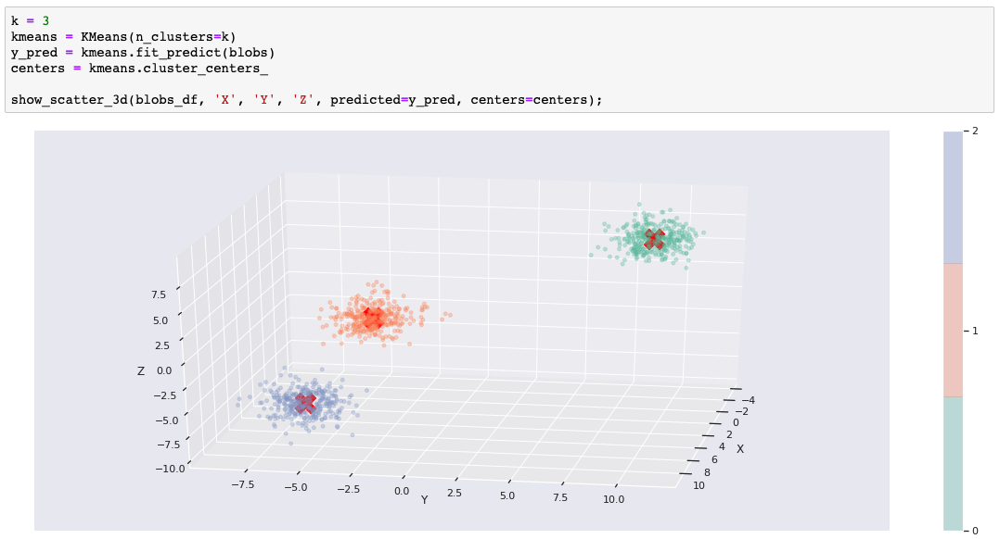
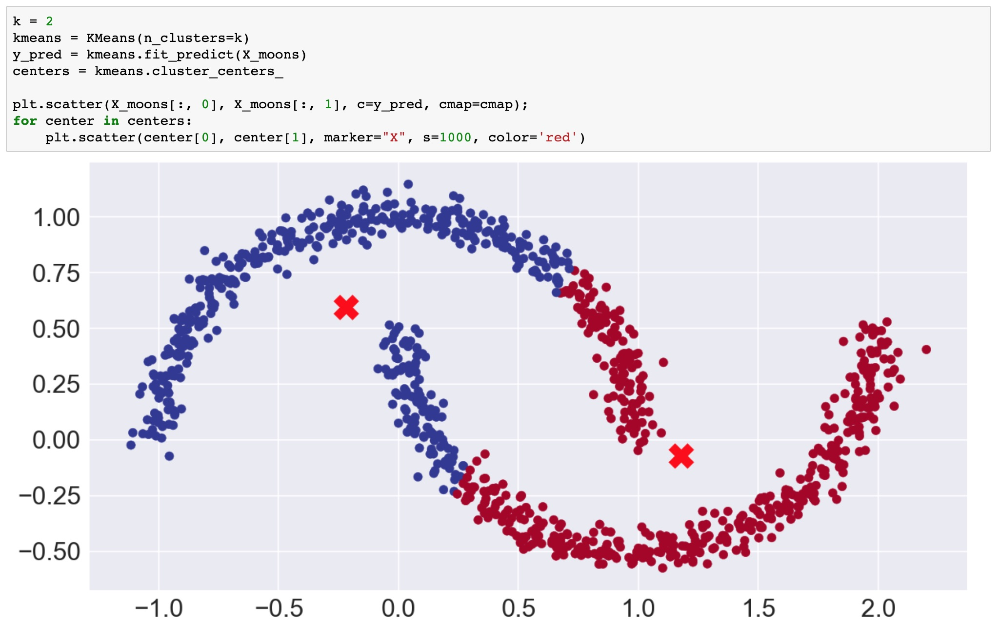
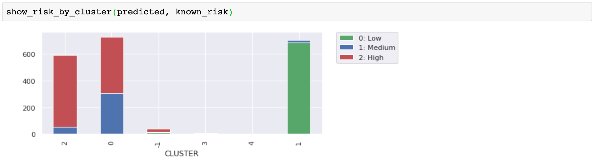

このチュートリアルでは、教師なし学習を使って、データのグループ化や異常を発見します。教師なし学習とは、期待される結果を示す「グランド・トゥルース」やラベル付きのデータセットがない場合です。その代わりに、生のデータを用いて、さまざまなアルゴリズムを用いてデータのクラスターを発見します。教師なし学習の理論や考え方を知りたい方は、[Unsupervised learning for data classification](/articles/cc-unsupervised-learning-data-classification/)をお読みください。

クラスターが明らかになってくると（例えば、3Dチャートで）、クラスターにラベルを適用したくなるかもしれません。これは、教師なし学習を使ってデータの隠れた特徴を発見した例です。もし、クラスターには興味がなく、外れ値についてもっと知りたいのであれば、それは「異常検知」です。

ここで注意したいのは、データを可視化しようとすると、最も簡単にプロットできる2次元や3次元のデータを使いがちだということです。しかし、ここで紹介する手法は、多次元や超次元のデータにも適用できます。視覚化するのは難しいですが、クラスター内のデータの数学的な分布を測定したり、発見されたグループ化や外れ値をほぼ同じように使用することができます。

## Let's get started

このチュートリアルは、一般的な読者と実践的な開発者の両方にとって有益なものになるようにデザインされています。自分でコードを実行した方がより多くのことを得られますが、時間がない方（またはコーディングが苦手な方）は、十分な例を挙げていますので、いずれにしてもアイデアを得ることができるでしょう。このチュートリアルには、Pythonで書かれたJupyter Notebookが含まれています。このノートブックは、Watson Studio を使用して IBM Cloud 上で実行できます。

1. サインアップまたはログインしてください。

    * [Try IBM Watson](https://dataplatform.cloud.ibm.com/registration/stepone?cm_sp=ibmdev-_-developer-tutorials-_-cloudreg)ページから IBM Cloud アカウントにログインして、Watson Studio を起動します。
    * [https://dataplatform.cloud.ibm.com](https://dataplatform.cloud.ibm.com?cm_sp=ibmdev-_-developer-tutorials-_-cloudreg)でログインして、Watson Studio にアクセスします。

1. 空のプロジェクトを作成します。

    * **Create a project** または **New project** のいずれかをクリックします。
    * 「空のプロジェクトを作成する」を選択します。
    * プロジェクトに名前を付けます。
    * 既存のObject Storageサービス・インスタンスを選択するか、新しいインスタンスを作成します。
    * **Create**をクリックします。

1. Notebookを追加します。

   * **+Add to project** をクリックします。
   * **Notebook**をクリックします。
   * **From URL** をクリックします。
   * **名前** を入力します。
   * **Select runtime** で **Default Python 3.6 Free** を選択します。
   * **Notebook URL** に `https://raw.githubusercontent.com/IBM/ml-learning-path-assets/master/notebooks/clustering_with_scikit-learn.ipynb` と入力します。
   * 「ノートブックを作成する」をクリックします。

1. ノートブックを実行します。

   開いたノートブックで、**実行**をクリックして、セルを1つずつ実行します。このチュートリアルの残りの部分は、ノートブックの順序に従います。

### ビジュアル化ツール

予測されたクラスターを示すために、データセットの2つまたは3つの特徴を、常に色を使ってプロットします。ほとんどのグラフでは、matplotlibライブラリとseabornデータ可視化ライブラリをスタイルに合わせて使用しています。また、場合によってはPlotlyのインタラクティブなチャートを追加しています。Plotlyのチャートは、チャートを回転させて3Dクラスターを様々な角度から見たい場合に特に便利です。

### scikit-learn

様々なクラスタリングアルゴリズムのscikit-learnの実装を使って、その違い、長所、短所を学びます。

### データセット

scikit-learn はクラスタリングアルゴリズムの違いを説明するのに役立つデータセットを提供しています。必要に応じてこれらを使用しますが、明らかな形ではなく現実的なデータでクラスタリングを視覚化するために、お客様のデータセットも使用します。

私たちの例でノートブックを実行した後は、自分のデータを使って、このチュートリアルで学んだことを試してみてください。

## クラスタリング・アルゴリズムのカテゴリー

私たちが使うアルゴリズムは、3つの異なるカテゴリーに分類されます。

* セントロイドベースのクラスタリング
* 密度ベースのクラスタリング
* 階層型クラスタリング

ノートブックで使用されているアルゴリズムは以下の通りです。

| --- | --- | --- |
| Centroid-based｜k-means｜あらかじめ決められた数（k）の中心点を見つけ、中心からの距離に基づいてk個のクラスターを作成する。|
| Centroid-based｜mean shift｜密度の高い領域を探してクラスターの中心を決める。|
| 密度ベース｜DBSCAN｜ノイズ（疎な領域の点）を分離し、密な領域のデータをグループ化する。|
| Hierarchical｜Agglomerative clustering｜各点を独自のクラスターとして開始し、ゴールに到達するまで最も近いクラスターをマージしていく。|

### k-means クラスタリング

k-meansクラスタリングについて説明します。k-meansはクラスタリングアルゴリズムの「Hello World」としてよく使われます。k "はクラスタ（またはクラスタセンター）の数を表しています。k-meansを使用するには、"k "を設定する必要があります。これがk-meansの大きな弱点の一つです。もちろん、ループを書いてkの設定を変えて評価することもできますが、そんなことをさせないアルゴリズムもあるでしょう。

最初の例では、scikit-learnの`make_blobs()`関数で生成されたデータセットを使用します。k=3のときにk-meansが予測しやすいように、3つの離散的なblobを作成しました。実際には、10次元の超球を作成しました。しかし、k-meansは余分な次元を問題にしません。  3次元のmatplotlib（＋seaborn）チャートでblobを表示するときに3次元を選択します。

次のコードは、k-meansモデルを学習し、データセットで予測を実行します。チャートでは、予測されたクラスター・メンバーシップを色で示し、クラスターの中心を赤いXで示しています。

このように、データに適したクラスタリングアルゴリズムを使えば、簡単にクラスタリングができます。ノートブックを実行している場合は、kを変更してセルを再実行し、kが3に等しくない場合にblobをどのように分割または結合しなければならないかを自由に確認してください。

#### k-meansはどのように機能するのでしょうか？

k-meansは、超空間にk個（3個）のクラスタセントロイドの種を割り当てることから始まります。ランダムな点から始めることもできますが、scikit-learnのデフォルトではもう少し賢くなっています。点と点の間にある程度の距離を置き、局所的な最小値に収束してしまう罠にランダムに陥らないようにします。もうひとつのscikit-learnのデフォルト(`n_init=10`)は、異なる種で10回実行することを示しており、"悪い種 "で運が悪くならないようにしています。

次に、各点と各クラスタのセントロイドとの距離を計算し、各点を最も近いセントロイドに割り当てます。点が割り当てられると、点の各クラスタの平均値が計算されます。これらの平均値は、次の反復でセントロイドとして使用されます。この割り当てと再センタリングのプロセスは、大幅な再センタリングが必要なくなるまで繰り返されます。

#### k-means クラスタリングの制限事項

先に「k」（クラスタ数）を指定する必要があると述べました。blobの例で3以外の数を使おうとした場合、blobを分割または結合する必要があります。

2つ目の大きな制限は、k-meansがポイントを球形（または超次元の超球）に分離することです。これを説明するために、ノートブックの次の例では、scikit-learnの`make_moons()`関数を使って、2つの三日月形、つまり笑顔としかめ面のような2次元データセットを作成しています。

視覚的には、データポイントが2つの形状を形成していることは明らかで、k=2の場合、予測されたクラスターが笑顔としかめ面を分けているのを見たいと思うでしょう。残念ながら、球形クラスターではその分離はできません。

#### k-means カスタマークラスター

ここでは、顧客の人口統計、口座活動、株式取引の利益を含む顧客データセットの一部を使用しています。ここでも3つ以上の次元がありますが、視覚化のために重要な3つの次元を選択しました。次の図は，k=3の場合の結果です．これを使って、他のアルゴリズムの比較をしてみましょう。コツをつかんだら、自分のデータで試してみてください。

いくつかのユースケースでは、クラスターの形状が役に立ちます。例えば、クラスタリングは、形状を認識することを目的とした画像認識の一部であることがよくあります。しかし、今回のお客様の例では、クラスターの分離と密度を示すのに形状が役立ちますが、本当の目的は、お客様のグループを識別して、そのグループをビジネスに利用することです。今回の例では、トレーニングと予測のためのデータセットに含まれていない解約リスクのラベルがありました。ここでは、予測されたクラスターと既知の解約リスクを比較して、興味深い顧客グループが見つかったかどうかを確認します。顧客グループに隠れた特徴や共通の特性を発見できたでしょうか？

この3つのクラスターは、リスクの低い顧客を分離するのに適していることがわかりました。高リスクのクラスターは役に立ちそうですが、中・高リスクのクラスターが役に立つかどうかは、もっと情報が必要です。他のクラスタリングアルゴリズムを試す際には、この外部評価と散布図を使って違いを説明していきます。

### 平均シフト

Mean shiftもセントロイドベースのアルゴリズムです。k-meansと似ているところもありますが、大きな違いもあります。平均値シフトの違いは以下の通りです。

* あらかじめ決められた数のクラスターは必要ない。
* クラスターの中心には密度の高い領域を求める
* 疎な領域をノイズや外れ値として扱う

#### ミーンシフトカスタマークラスタ

Mean shiftで予測された顧客のクラスターを見てみましょう。まず、クラスター数を指定する必要がなく、アルゴリズムが5つのクラスターを選択したことに注目してください。あらかじめ決めておく必要がないというのは素晴らしいですね。データを強制的にkクラスターにするのではなく、データに合わせてクラスター数を選択したのです。

次に、デフォルトではない「cluster_all=False」というパラメータ設定を使っていることに注目してください。これにより、アルゴリズムは疎な領域にあるデータポイントを取り出し、孤児（クラスタ-1）とラベル付けすることができました。このグラフでは、左と右の緑の疎な点が孤児でした。matplotlibのアニメーションチャートでは、孤児を分離することで、残りのクラスターがどのように明確になり、また異常と考えられるデータポイントがどのように特定されるかを示しています。

リスクラベルと比較すると、これらのグループ化が元の3つのグループ（k-meansから）よりも有意に有用であるかどうかは明らかではありませんが、孤児やエッジ上のミニクラスタが、より密にクラスタ化された顧客と一致する可能性が低いことは納得できるでしょう。これらを分離することで、グループ分けを明確にすることができます。

#### ミーンシフトムーン

mean shiftは少なくとも密度を考慮しているので、k-meansよりも月のデータセットをうまく処理できると思うかもしれませんが、実際には、2つのクラスタを認識するまでに、パラメータをかなりカスタマイズしなければなりませんでした。それでも、セントロイドベースのアプローチでは、笑顔としかめっ面を分けるのにはうまくいかないことがわかります。`cluster_all=False`の設定で得られた、孤児の長い尾に注目してください。

幸いなことに、このような問題に取り組むための密度ベースのアルゴリズムがあります。

### DBSCAN

DBSCANとは、"density-based spatial clustering of applications with noise "の略です。これは長い名前ですが、頭文字をとった名前に感謝します。明らかに、DBSCANは密度ベースのアルゴリズムです。

#### DBSCANの月

さっそく、セントロイドベースのアルゴリズムができなかったことを、DBSCANができることにしましょう。次の画像は、DBSCANが笑顔としかめ面を分離し、さらに外れ値としてラベルを貼るべき3つのポイントを見つけたことを示しています。

この結果は、まさに私たちが望んでいたものでしたしかし、この結果を得るためには、`eps`パラメータをカスタマイズする必要があったことに注意してください。DBSCANは密度を使って自動的にクラスターを決定しますが、`eps`は "密度が高い "と判断するために使われます。

#### DBSCANの仕組みは？

DBSCANは密度でつながった点の最大集合をクラスタと定義することで動作します。考慮されるパラメータには、`eps`（ε）と`minimum_samples`の2つがあります。epsilonは近傍の最大半径であり、minimum samplesはクラスタを定義するためのepsilon近傍の点の最小数である。

点はコア、ボーダー、アウトライヤーの3つに分類されます。コア点は，自分自身を含むイプシロン近傍に少なくとも最小のサンプルを持つ点です．これらの点は、クラスターの内部に位置しています。border点は、イプシロン近傍に最小のサンプル数以下の点を持ちますが、クラスタに到達できる点です。つまり、コアポイントの近傍にある点です。最後に、外れ値（ノイズポイント）は、クラスターによって到達できないポイントです。

#### DBSCANの利点

DBSCANの利点は以下の通りです。

* クラスタの数を自動的に決定する
* 外れ値(ノイズ)を特定できる
* 球形クラスターに限らない

#### DBSCAN カスタマークラスター ノイズなし

ノートブックでは、DBSCANを使ってノイズを除去し、顧客データセットの異なるクラスタリングを得ることもできました。

### 階層型クラスタリング

階層型クラスタリングには2つの方向性、2つのアプローチがあります。1つはボトムアップ型、もう1つはトップダウン型です。ボトムアップの場合、各点は個々のクラスタとしてスタートします。次に、最も近い2つのクラスターを結合して2点のクラスターを形成します。このプロセスは、すべてのポイントを含む1つのクラスターができるまで、最も近いクラスターの結合を続けます。トップダウン方式は、その逆です。すべての点を含む単一のクラスターから始まり、各クラスターが個々の点になるまで分割します。

いずれにしても、階層型クラスタリングでは、*n*個のデータポイントについて、クラスタの可能性を示すツリーが作成されます。ツリーができたら、クラスターを得るためのレベルを選びます。

#### 凝集型クラスタリング

ノートブックでは、scikit-learnによる凝集型クラスタリングの実装を使用しています。凝集型クラスタリングはボトムアップ式の階層型クラスタリングアルゴリズムです。「答え」となるレベルを選ぶには、`n_clusters`または`distance_threshold`パラメータを使用します。私たちは`n_clusters`を選ばないようにしたかったのですが（k-meansではそれが嫌だったので）、気に入ったクラスタ数になるまで`distance_threshold`を調整しなければなりませんでした。パラメータを調整することで、結果を大きく変えることができます。

凝集型クラスタリングの面白いところは、異なるクラスタサイズが得られることです。凝集型クラスタリングを使った顧客データのデモでは、さまざまな形や大きさの14個のクラスタができあがったことが興味深いです。

もう一度言いますが、低リスクのお客様と高リスクのお客様を分けるのに、この方法がうまく機能していることがわかります。クラスタの数を増やす必要はないように見えますが、顧客グループをより細かく分けるのに役立ちます。最小のクラスターはあまり意味がないように見えますが、他の顧客グループを明確にするのに役立ちます。

## 使用例
このセクションでは、教師なし学習の使用例をご紹介します。

### レコメンダー

クラスタリングを利用して、以下のようなレコメンダーを構築することができます。

* 顧客が喜びそうなクーポンを提供する。
* 顧客が好きそうな映画を勧める
* リスクの高い顧客を特定する

### 隠された機能の発見

クラスターを分析して、特定の行動を示すことがわかったら、そのクラスターを使って、あたかも別の属性や特徴があるかのようにデータにラベルを付けることができます。今回は解約リスクのラベルが付いたデータがありましたが、最適なアルゴリズムを選んだ後は、すべての顧客を「低リスク」「高リスク」「中/高リスク」にラベル付けすることができます。

もう一つの良い例は、「映画好き」のクラスターを利用して、ある人を「ラブコメ好き」とラベル付けすることができます。

隠れた特徴とは、グループの行動を理解した後に、個人について推論する新しい属性を持つということです。観察された属性ではなく、予測または推測された属性です。これらの属性は、これまでと同じように使用することができますが（つまり、教師付き学習に組み込むことができます）、ある程度の確率で正確に使用することができます。

ここでは、人にラベルを付ける話をしているのではないことに注意してください。私たちはデータポイントを分析しています。それがたまたま人に関するものだったりするのです。次の例はもっと良い。

### 異常検知

ノイズを取り除くことでクラスタを明確にすることができるため、異常値を特定することの利点を指摘しようとしましたが、異常値検出は素晴らしいユースケースです

ここで示したように、クラスタリングを使って外れ値や異常値を特定することができます。この戦略は、次のような、さらに調査すべき異常な行動を特定するために使用できます。

* 異常な購入（クレジットカードの不正使用）
* 異常なネットワークトラフィック（サービス妨害攻撃）

### コンピュータビジョン

クラスタリングアルゴリズムは、画像のセグメンテーション、オブジェクトトラッキング、画像分類などに用いられます。クラスタリングアルゴリズムは、ピクセルの属性をデータポイントとして、形状やテクスチャを識別し、画像をコンピュータビジョンで認識可能なオブジェクトに変換します。

## 概要

儲かっている顧客よりも、損をしている顧客の方が離れていく可能性が高い。確かに、誰もがすでに知っていることです。それは単なる例に過ぎませんでした。では、実際に何を学んだのでしょうか？願わくば、コードを試してみて、実際に経験を積んでいただきたいと思います。

* Watson Studio
* Jupyter Notebooks（ジュピターノートブック
* パイソン
* SCIKIT-LARN クラスタリング
* SCIKIT-LARN データセット
* Plotly インタラクティブチャート
* matplotlibとseaborn
* アニメーション化されたmatplotlib
* パンダスのデータフレーム

クラスタリングについては、3つの異なるアプローチについて学びました。

1. セントロイドベースのクラスタリング
1. 密度ベースのクラスタリング
1. 階層型クラスタリング（Hierarchical clustering