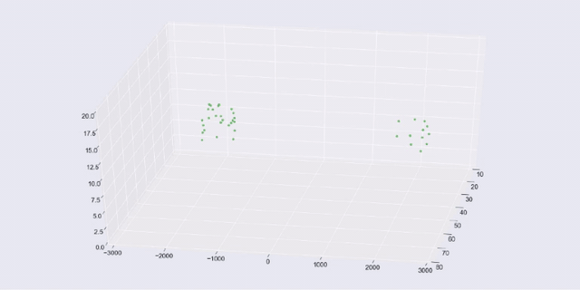
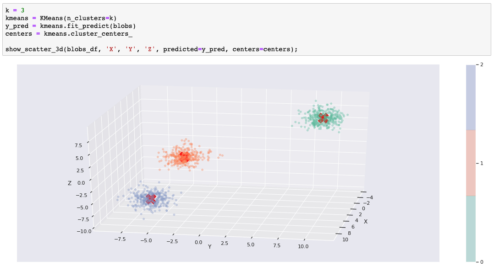
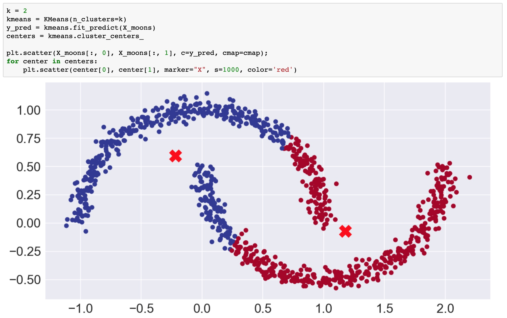
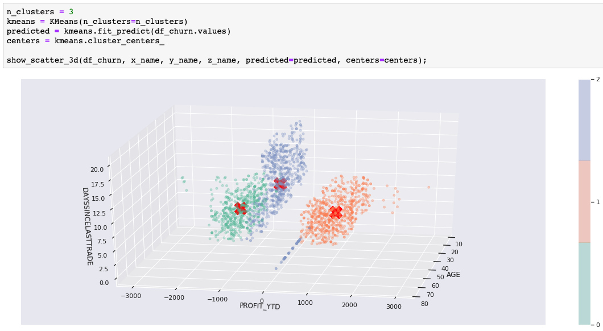
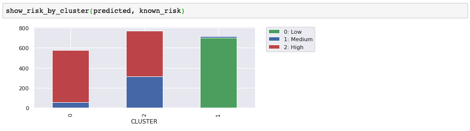
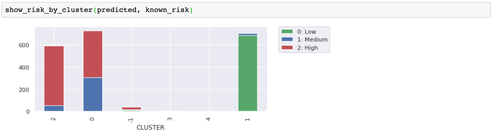
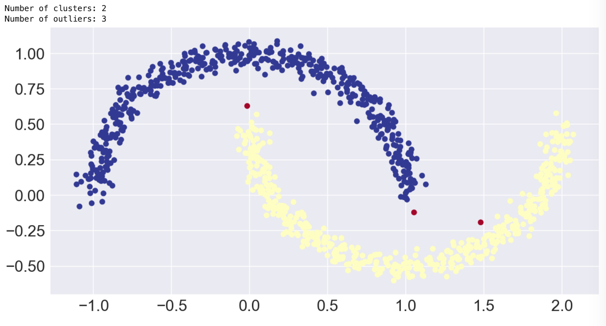
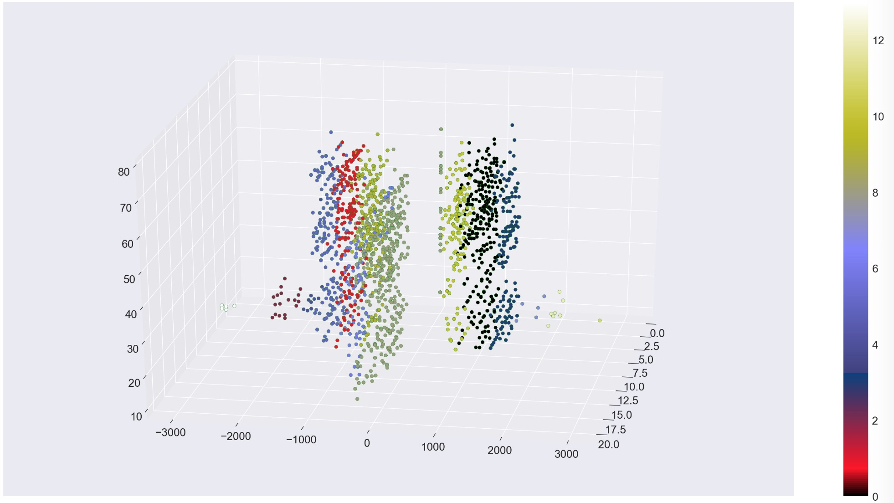
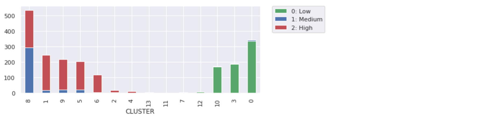

In this tutorial, you use unsupervised learning to discover groupings and anomalies in data. Unsupervised learning is when there is no *ground truth* or labeled data set that shows you the expected result. Instead, you take the raw data and use various algorithms to uncover clusters of data. If you want to learn about the theory and ideas behind unsupervised learning, read [Unsupervised learning for data classification](/articles/cc-unsupervised-learning-data-classification/).

As the clusters become apparent (for example, in 3-D charts), you might be tempted to apply labels to clusters. That is an example of using unsupervised learning to discover hidden features in your data. If you don't care about the clusters, but want to learn more about the outliers, then you are looking at *anomaly detection*.

It's important to note that when you try to visualize data, you tend to use two-dimensional or three-dimensional data, which is the easiest to plot. But the techniques I am using here apply to multidimensional or hyperdimensional data. It is harder to visualize, but you can still measure the mathematical distribution of data in the clusters and use the discovered groupings and outliers in much the same way.

## Let's get started

I've designed this tutorial to be informative for both casual readers and hands-on developers. You get more out of it if you run the code yourself, but if you don't have time (or coding just isn't for you), then I have included enough examples that you'll get the idea anyway. The tutorial includes a Jupyter Notebook written in Python. You can run the Notebook on IBM Cloud using Watson Studio.

1. Sign up or log in.

    * Activate Watson Studio by logging in to your IBM Cloud account from the [Try IBM Watson](https://dataplatform.cloud.ibm.com/registration/stepone?cm_sp=ibmdev-_-developer-tutorials-_-cloudreg) page.
    * Access Watson Studio, by logging in at [https://dataplatform.cloud.ibm.com](https://dataplatform.cloud.ibm.com?cm_sp=ibmdev-_-developer-tutorials-_-cloudreg).

1. Create an empty project.

    * Click either **Create a project** or **New project**.
    * Select **Create an empty project**.
    * Give the project a name.
    * Choose an existing Object Storage service instance or create a new one.
    * Click **Create**.

1. Add the Notebook.

   * Click **+Add to project**.
   * Click **Notebook**.
   * Click **From URL**.
   * Provide a **Name**.
   * Under **Select runtime**, choose **Default Python 3.6 Free**.
   * Enter `https://raw.githubusercontent.com/IBM/ml-learning-path-assets/master/notebooks/clustering_with_scikit-learn.ipynb` as the **Notebook URL**.
   * Click **Create Notebook**.

1. Run the Notebook.

   In the open Notebook, click **Run** to run the cells one at a time. The rest of the tutorial follows the order of the Notebook.

### Visualization tools

To demonstrate the predicted clusters, we always plot two or three features of the data set using color to show the clusters. For most of the charts, we use the matplotlib library with the seaborn data visualization library for style. We've also added Plotly interactive charts in some cases. The Plotly charts are particularly useful when you want to rotate the chart to see the 3-D clusters from different angles.

### scikit-learn

Using the scikit-learn implementation of various clustering algorithms, you'll learn some of their differences, strengths, and weaknesses.

### The data sets

scikit-learn provides data sets that help to illustrate the clustering algorithm differences. We'll use these where needed, but we also use our customer data set to help you visualize clustering with realistic data instead of obvious shapes.

After running the Notebook with our example, you should try using your own data to test what you've learned in this tutorial and to see what you might learn about your data.

## Categories of clustering algorithms

The algorithms we use fall into three different categories:

* Centroid-based clustering
* Density-based clustering
* Hierarchical clustering

The algorithms used in the Notebook are as follows:

| Category | Algorithm | Description |
| --- | --- | --- |
| Centroid-based | k-means | Find a predetermined number (k) of center points to create k clusters based on distance from center. |
| Centroid-based | mean shift | Seek areas of higher density to determine cluster centers. |
| Density-based | DBSCAN | Separate out the noise (points in sparse regions) and group together data in dense regions. |
| Hierarchical | agglomerative clustering | Start with each point as its own cluster and then merge the nearest cluster until the goal is reached. |

### k-means clustering

Let's start with k-means clustering.  k-means is often used as the "Hello World" of clustering algortithms. The "k" stands for the number of clusters (or cluster centers). To use k-means, you must set "k." This is one of the big weaknesses of k-means. Of course, you could write a loop and evaluate different settings of k, but you'll see other algorithms that won't make you do that.

Our first example uses the data set that was generated with scikit-learn's `make_blobs()` function. We created three discrete blobs that are easy for k-means to predict when k=3. We actually created ten-dimensional hyperspheres! But k-means has no problem with the extra dimensions.  We pick three dimensions when we show the blobs in a 3-D matplotlib (plus seaborn) chart.

The following code trains a k-means model and runs prediction on the data set. The chart uses color to show the predicted cluster membership and a red X to show the cluster center.

That's how easy it is when you have the right clustering algorithm for the data. If you are running the Notebook, feel free to change k and rerun the cell to see how the blobs must be divided or combined when k is not equal to 3.

#### How does k-means work?

k-means starts by assigning k (three) cluster centroid seeds in the hyperspace. You could start with random points, but the scikit-learn default is a bit smarter. It puts some distance between the points to avoid randomly falling into the trap of converging on some local minimums. Another scikit-learn default (`n_init=10`) indicates that it will run ten times with different seeds, to make sure it did not get unlucky with some "bad seeds."

Next, it computes the distance between every point and every cluster centroid, and assigns each point to the closest centroid. After the points are assigned, the mean values for each cluster of points are calculated. These mean values are used as the centroids in the next iteration. The assignment and re-centering process is repeated until no significant re-centering is needed.

#### Limitations of k-means clustering

We mentioned earlier that you need to specify "k" (number of clusters). If you tried using a number other than 3 in our blobs example, you'll have to divide or combine the blobs.

The second big limitation is that k-means separates the points into spherical shapes (or hyperspheres in hyperdimensions). To illustrate this, the next example in our Notebook uses scikit-learn's `make_moons()` function to create a two-dimensional data set that looks like two crescent shapes, or a smile and a frown.

Visually, it is obvious that the data points form two shapes, and with k=2 you would like to see the predicted clusters separate the smile from the frown. Unfortunately, you cannot do that separation using spherical clusters.

#### k-means customer clusterer

To look at a less-contrived example, we've used part of a customer data set that includes customer demographics, account activity, and stock-trading profit. Once again, we have more than three dimensions, but we've chosen three significant ones to help with the visualization. The following image shows our result with k=3. We'll use this to show how some of the other algorithms compare. After you get the hang of it, try it out with your own data.

In some use cases, the cluster shapes are useful. For example, clustering is often part of image recognition where the goal is to recognize shapes. However, for our customer example, the shapes help us demonstrate cluster separation and density, but the real goal would be to identify groups of customers so that we can use those groupings for a business purpose. In our example, we had a churn risk label that was not included in the data set for training and prediction. Now, we'll compare our predicted clusters with our known churn risk just to see if we found a customer grouping that might be interesting. Did we uncover a hidden feature or common trait in our customer groupings?

It turns out that these three clusters are great for separating out the low-risk customers. The high-risk cluster looks useful, but we'd need more information to know if the medium/high cluster is useful. We'll use this external evaluation along with scatter diagrams to help illustrate the differences as we try some other clustering algorithms.

### Mean shift

Mean shift is another centroid-based algorithm. In some cases, you'll find it behaves a lot like k-means, but there are some significant differences, too. These mean shift differences include:

* Not needing a predetermined number of clusters
* Seeking dense regions for cluster centers
* Treating sparse areas as noise or outliers

#### Mean shift customer clusterer

Let's look at the customer clusters that were predicted with mean shift. First, notice that we did not need to specify the number of clusters, and the algorithm chose five clusters. It's great that you don't need to predetermine that. Instead of forcing the data into k-clusters, the number of clusters was chosen to match the data.

Next, notice that we used the non-default `cluster_all=False` parameter setting. This allowed the algorithm to take data points in sparse regions and label them as orphans (cluster -1). In the chart, the sparse green points on the left and on the right were orphans. The animated matplotlib chart shows how separating the orphans adds clarity to the remaining clusters and also identifies data points that might be considered anomalies.

When comparing to the risk label, it is not obvious if these groupings are significantly more useful than our original three (from k-means), but it would make sense that the orphans and the mini-clusters on the edges would be less likely to be consistent with the more densely clustered customers. Separating them helps clarify our groupings.

#### Mean shift moons

Because mean shift at least considers density, you might think it would handle the moons data set better than k-means, but actually, we had to customize the parameters quite a bit before it would recognize two clusters. Even then, you see that a centroid-based approach does not work well to separate the smile from the frown. Notice the long tails of orphans that we got with the `cluster_all=False` setting.

Fortunately, there are density-based algorithms for tackling such problems.

### DBSCAN

DBSCAN stands for "density-based spatial clustering of applications with noise." Yes, that is a long name, thank goodness for acronyms. Obviously, DBSCAN is a density-based algorithm.

#### DBSCAN moons

Let's get right to what DBSCAN can do that our centroid-based algorithms failed to do. The following image shows how DBSCAN separated the smile from the frown and also found three points to label as an outliers.

This result was exactly what we wanted! However, it's important to note that we had to customize the `eps` parameter to get the result we wanted. DBSCAN uses density to automatically determine the clusters, but `eps` is used to tell it what we consider "dense."

#### How does DBSCAN work?

DBSCAN works by defining a cluster as the maximal set of density connected points. There are two parameters that are taken into account, `eps` (epsilon) and `minimum_samples`. Epsilon is the maximum radius of the neighborhood, and minimum samples is the minimum number of points in the epsilon neighborhood to define a cluster.

There are three classifications of points: core, border, and outlier. A core point has at least minimum samples within its epsilon neighborhood including itself. These are points that are at the interior of a cluster. A border point has less than minimum points within its epsilon neighborhood but can be reached by the cluster. That is, it's in the neighborhood of a core point. Finally, an outlier, or noise point, is a point that cannot be reached by a cluster.

#### Advantages of DBSCAN

The advantages of DBSCAN include:

* Automatically determining the number of clusters
* Identifying the outliers (noise)
* Not restricted to spherical clusters

#### DBSCAN customer clusterer without noise

In our Notebook, we also used DBSCAN to remove the noise and get a different clustering of the customer data set.

### Hierarchical clustering

Hierarchical clustering knows two directions or two approaches. One is bottom-up, and the other is top-down. For bottom-up, each point starts as an individual cluster. Next, the two closest clusters are joined to form a two-point cluster. The process continues to merge the closest clusters until you have a single cluster containing all the points. Top-down is just the opposite. It starts with a single cluster containing all the points and then divides until each cluster is an individual point.

Either way, hierarchical clustering produces a tree of cluster possibilities for *n* data points. After you have your tree, you pick a level to get your clusters.

#### Agglomerative clustering

In our Notebook, we use scikit-learn's implementation of agglomerative clustering. Agglomerative clustering is a bottom-up hierarchical clustering algorithm. To pick the level that will be "the answer" you use either the `n_clusters` or `distance_threshold` parameter. We wanted to avoid picking `n_clusters` (because we didn't like that in k-means), but then we had to adjust the `distance_threshold` until we got a number of clusters that we liked. You can significantly change the results by tweaking the parameters.

One of the interesting things about agglomerative clustering is that you get different cluster sizes. Our customer data demo with agglomerative clustering is interesting because we ended up with 14 clusters of various shapes and sizes.

Once again, we see that this works fine to separate our low-risk customers from high-risk. The higher number of clusters appears unnecessary, but does help with finer distinctions in our customer groupings. The smallest clusters look less significant, but they help clarify the other customer groupings.

## Use cases
This section gives you some use cases for unsupervised learning.

### Recommenders

Clustering customers can be used to build recommenders that can:

* Offer a coupon that the customer is likely to appreciate
* Recommend a movie that the customer should like
* Identify a customer as high-risk

### Uncover hidden features

After clusters have been analyzed and found to exhibit specific behaviors, they can be used to label data as if you had another attribute or feature. We had some data with a churn risk label, but after we pick our best algorithm we can start labeling all of our customers as: low risk, high risk, or medium/high risk.

Another good example would be to use the movie-recommender clusters and just go ahead and label someone as a Romantic-Comedy fan.

The hidden feature idea is that after you understand the behavior of the group, then you have new attributes to infer about the individual. They are not observed attributes, but predicted or inferred. They can still be used much the same way (that is, fed into supervised learning), but only with some probability of accuracy.

Note that we're not talking about labeling people. We are analyzing data points. Sometimes, they happen to be about people. The next examples are better.

### Anomaly detection

We tried to point out the benefits of identifying outliers because removing noise helps clarify clusters and anomaly detection is a great use case

As we demonstrated, you can use clustering to identify outliers or anomalies. This strategy can be used to identify unusual behavior that should be investigated further, such as:

* Unusual purchases (credit card fraud)
* Unusual network traffic (denial of service attack)

### Computer vision

Clustering algorithms are used for image segmentation, object tracking, and image classification. Using pixel attributes as data points, clustering algorithms help identify shapes and textures and turn images into objects that can be recognized with computer vision.

## Summary

Customers that lose money are more likely to leave than customers that profit. Sure, everyone already knew that. It was just an example. So, what did we really learn? Hopefully, you tried the code and gained hands-on experience with:

* Watson Studio
* Jupyter Notebooks
* Python
* scikit-learn clustering
* scikit-learn data sets
* Plotly interactive charts
* matplotlib with seaborn
* animated matplotlib
* pandas DataFrames

More specifically about clustering, you learned about three different approaches:

1. Centroid-based clustering
1. Density-based clustering
1. Hierarchical clustering