このチュートリアルでは、回帰ベースの機械学習問題を解決するための基本を説明し、現在最も人気のあるアルゴリズムのいくつかを比較検討します。

## セットアップ

1. サインアップまたはログインします。

    * [Try IBM Watson](https://dataplatform.cloud.ibm.com/registration/stepone?cm_sp=ibmdev-_-developer-tutorials-_-cloudreg)ページから IBM Cloud アカウントにログインして、Watson Studio を有効にします。
    * [https://dataplatform.cloud.ibm.com](https://dataplatform.cloud.ibm.com?cm_sp=ibmdev-_-developer-tutorials-_-cloudreg)でログインして、Watson Studio にアクセスします。

1. 空のプロジェクトを作成します。

    * **Create a project** または **New project** のいずれかをクリックします。
    * 「空のプロジェクトを作成する」を選択します。
    * プロジェクトに名前を付けます。
    * 既存のObject Storageサービス・インスタンスを選択するか、新しいインスタンスを作成します。
    * **Create**をクリックします。

1. Notebookを追加します。

   * **+Add to project** をクリックします。
   * **Notebook**をクリックします。
   * **From URL** をクリックします。
   * **名前** を入力します。
   * **Select runtime** で **Default Python 3.6 Free** を選択します。
   * **Notebook URL** に `https://raw.githubusercontent.com/IBM/ml-learning-path-assets/master/notebooks/regression_with_scikit-learn.ipynb` と入力します。
   * 「ノートブックを作成する」をクリックします。

1. ノートブックを実行します。

   開いたノートブックで、**実行**をクリックして、セルを1つずつ実行します。このチュートリアルの残りの部分は、ノートブックの順序に従います。

## 概要

回帰とは、予測すべき特徴に連続値が含まれている場合です。回帰とは、他の独立変数の関係を分析することで、従属変数を予測するプロセスを指します。これらの関係を高めて値をよりよく予測するのに役立つアルゴリズムがいくつか知られています。

## データセットについて

このチュートリアルでは、住宅購入者が住宅を購入する前に検討する様々な情報を含むデータセットを使用します。このデータを使って、他のすべての関連情報が与えられたときに、どの程度住宅価格を予測できるかを分析します。以前の[チュートリアル](/tutorials/build-and-test-your-first-machine-learning-model-using-python-and-scikit-learn/)では、モデルを作成する前に必要な様々な前処理の手順を説明しましたが、このチュートリアルではその詳細は省略します。代わりに、異なる回帰アルゴリズムを詳細に検討し、比較のために同じデータセットに適用します。

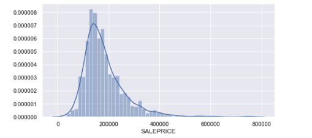

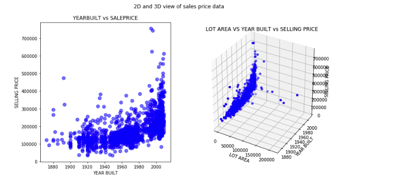

## 回帰アルゴリズム

以下は、このチュートリアルで説明する一般的な回帰アルゴリズムを、コード例とともに示したものです。

* 線形回帰(単回帰、重回帰、多項式回帰)
* 決定木回帰
* ランダムフォレストツリー
* グラディエント・ブースト・ツリー

### 線形回帰

線形回帰モデルは、連続したターゲットと1つ以上の予測変数との間に線形関係がある場合に、そのターゲットを予測します。

#### 単純線形回帰

線形回帰の最も基本的な形態で、予測対象の変数が他の1つの変数のみに依存するものです。これは、一般的に直線の傾きを計算する際に使用される式を用いて計算されます。

*y = w0 + w1 * x1

先ほどの式では、*y*が目的変数、*x1*が独立変数を表しています。また、*w1*は、*y*と*x1*の関係を表す係数で、傾きとも呼ばれています。*w0*は、一定の係数、つまりインターセプトです。これは、独立変数に対して*y*が常に一定のオフセットになることを意味します。

以下のコード例では、sklearnライブラリを使用した単純な線形回帰の計算方法を示しています。

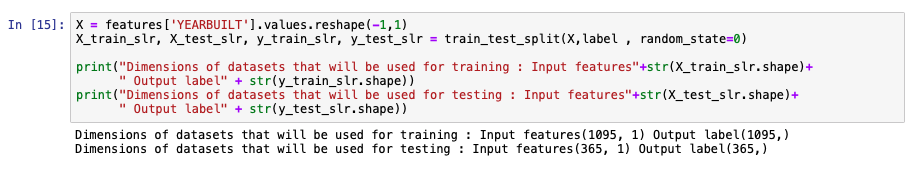

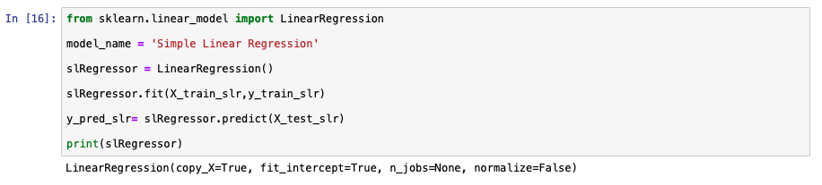

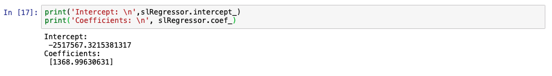

以下のグラフは、テストデータに対するモデルの予測値と、テスト値の実際の販売価格を比較したものです。単純な線形回帰では、1つの変数だけに依存していると仮定しているため、この文脈では3D表示はあまり意味がありません。この比較は、重回帰について説明するときに、より意味をなすでしょう。他にも2つのモデルメトリクスのチャートを示します。

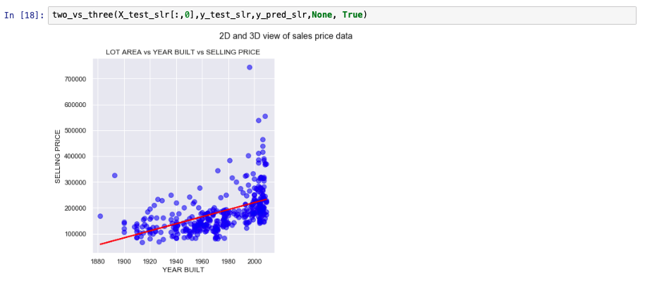

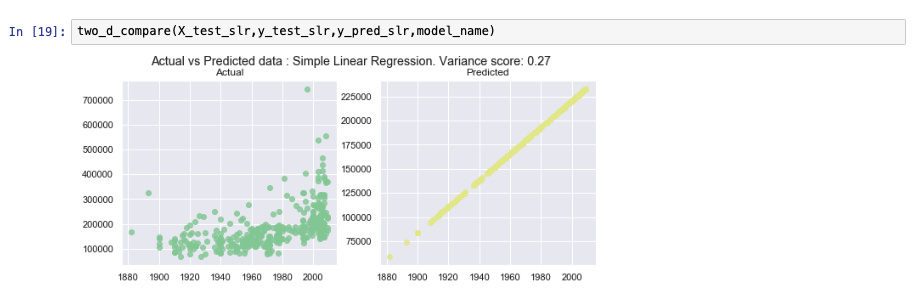

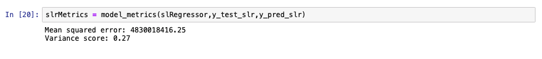

#### 線形重回帰

重回帰は、単純な線形回帰を拡張したものです。この設定では、目標値は複数の変数に依存します。変数の数はユースケースによって異なります。通常、対象分野の専門家が、出力機能のより良い予測に貢献する分野の特定に関与します。

*y = w0 + w1 * x1 + w2 * x2 + ....+ wn * xn

次のコードスニペットでは、データセットをテストセットとトレーニングセットに分割するためにsklearnがどのように使用されるかがわかります。簡単にするために、すべての従属変数が効果的な予測を行うために貢献していると仮定しています。最も正確な予測を行うために必要な最適な列を選択するには、前方選択や後方消去などの方法があります。これらの方法の説明は、このチュートリアルの範囲を超えています。

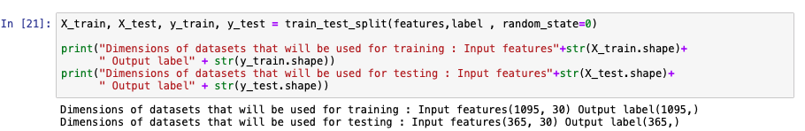

sklearnライブラリを使用して、重回帰モデルを開発します。単純線形回帰と重回帰のコード上の主な違いは、モデルをフィットさせるために含まれる列数です。

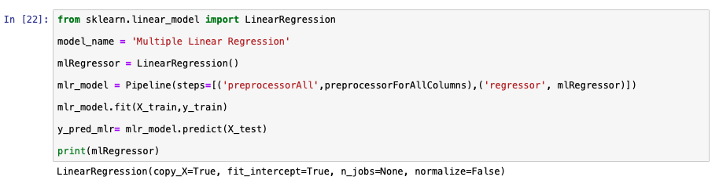

次の画像は、先に開発したモデルのメトリクスの一部です。

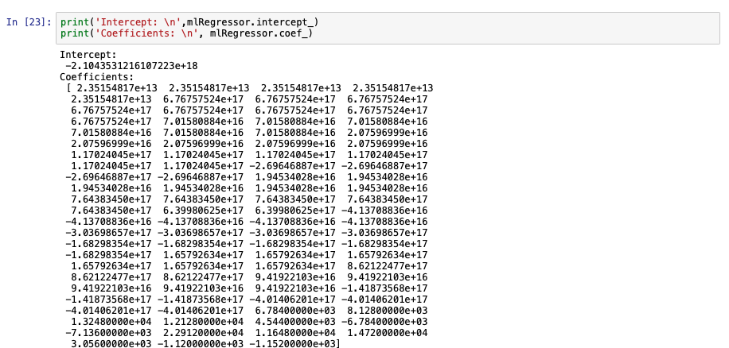

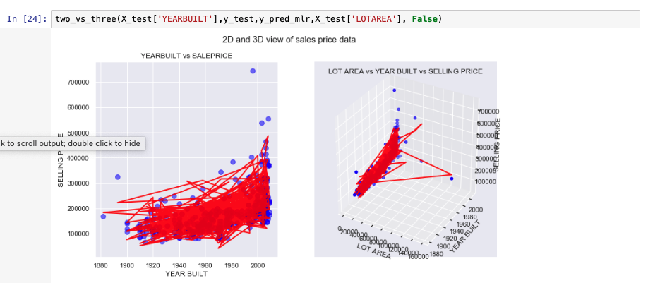

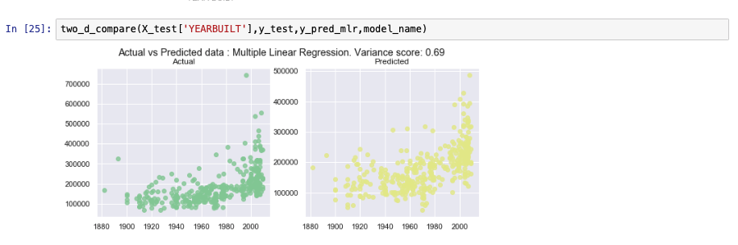

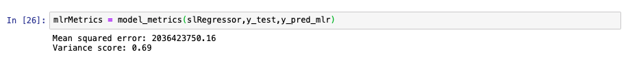

#### 多項式線形回帰

単純回帰や線形回帰で生成される予測線は、通常、直線です。単回帰や重回帰ではデータポイントに正確にフィットしない場合には、多項式線形回帰を使用します。以下の式はバックエンドで多項式線形回帰を生成するために使用されます。

*y = w0 + w1 * x1 + w2 * x21 + ....+ wn * xnn でした。

先ほどの式で独立変数の指数を使っていても、このアルゴリズムは係数が線形結合されているため、非線形とはみなされません。

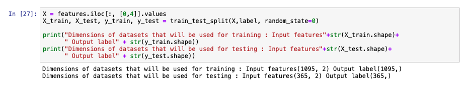

多項式線形回帰モデルを作成するために、データを前処理して、次数の値に記載された数までの変数の指数を作成します。次の画像では、前処理の段階で次数が3に設定されているので、x3までの変数が生成されることになります。次数1の多項式特徴は、多重線形回帰と同じです。以下の式で「次数」の値を1に変更すると、前節で作成したモデルと同じ出力になります。

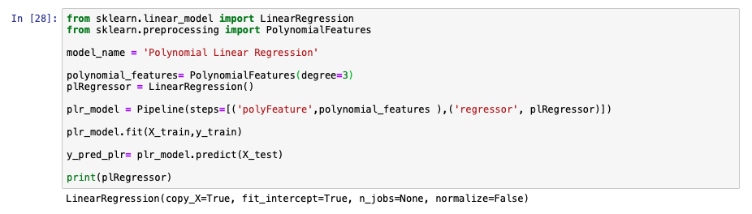

モデルのパフォーマンス指標の一部を以下のグラフに示します。次数3の多項式線形回帰は、重回帰ほど効率的ではありません。このアルゴリズムでより良い出力が得られるかどうかを確認するために、いくつかのパラメータを調整するか、重回帰がこのデータセットに適したモデルであると結論づけることができるでしょう。

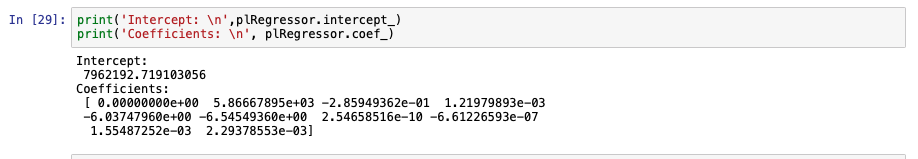

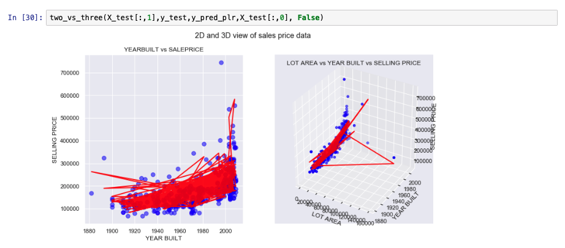

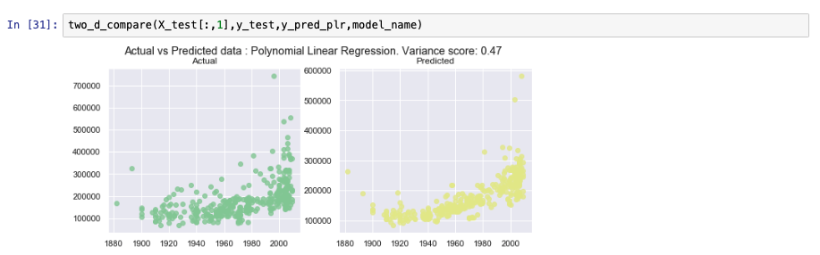

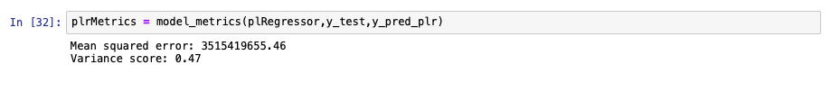

### 決定木

決定木ベースのモデルは、トレーニングデータからルールのセットを構築し、結果を予測することができます。このアルゴリズムは、理解のために、決定によって形成される木と比較されます。モデルには、結果のパス、つまりリーフにつながるルールを表すブランチが含まれています。各予測パスは、複数の値を含むリーフにつながります。この原理は、分類型の問題にも同じように適用されます。回帰型の問題では、最終的な予測値は、通常、該当するリーフに含まれるすべての値の平均値になります。

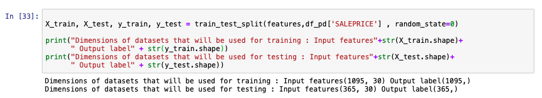

次の画像は、sklearnを使って決定木モデルを作成した例です。

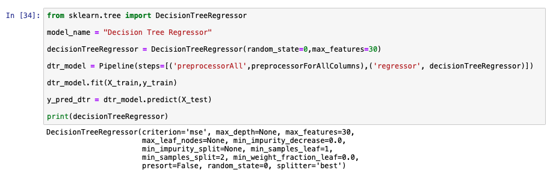

モデルの性能は以下の画像で分析されています。

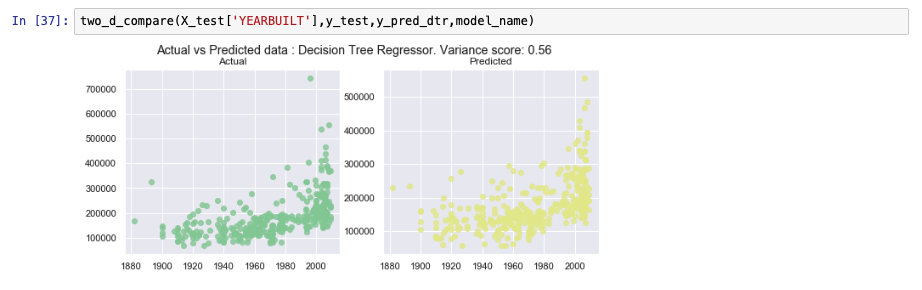

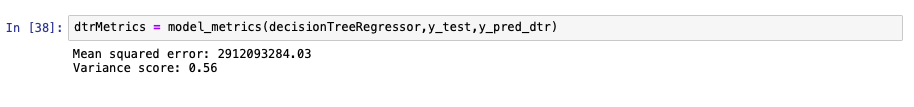

### アンサンブル学習

アンサンブル学習とは、弱いモデルを組み合わせて、より性能の高いモデルを作るアルゴリズムの種類です。アンサンブル学習の詳細については、チュートリアル「Learn classification algorithms using Python and scikit-learn」(/tutorials/learn-classification-algorithms-using-python-and-scikit-learn/)で、分類のためのアンサンブル学習について説明しています。

#### ランダムフォレストツリー

決定木は一般的に弱いモデルと考えられています。なぜなら、データセットが比較的大きい場合、その性能は通常、期待した水準に達しないからです。しかし、複数の決定木を1つのモデルにまとめると、より高い精度が得られます。このランダムフォレスト内の各決定木は、トレーニングデータのサブセットを使用して構築されます。このランダムフォレストを構成する決定木の数は任意であり、精度の変化を見るために調整することができます。予測される値をこのモデルに当てはめると、個々のツリーから得られた値の平均値となります。

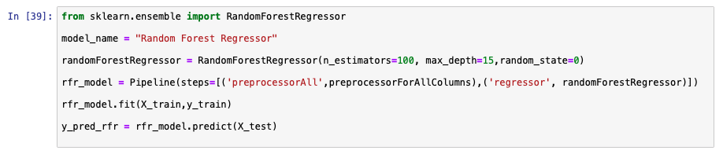

先ほどのモデルと同様に、次の画像はsklearnを使ってランダムフォレストモデルを作成した例です。

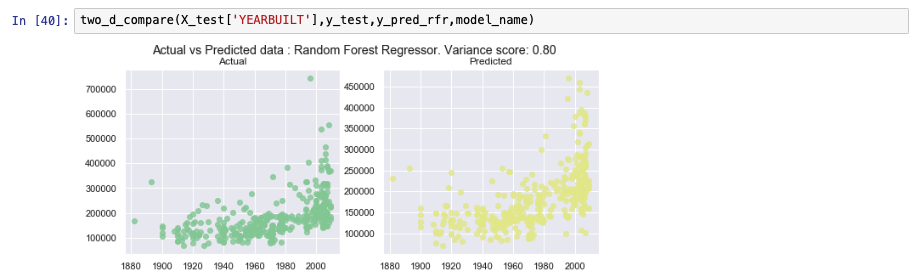

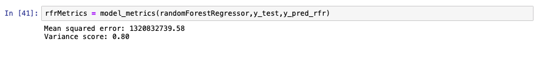

#### グラディエント・ブースト・ツリー

グラディエント・ブースト・ツリーは、前のモデルのパフォーマンスを追加学習することで構築されるモデルです。勾配昇圧木の詳細は、チュートリアルの[Learn classification algorithms using Python and scikit-learn](/tutorials/learn-classification-algorithms-using-python-and-scikit-learn/)に記載されています。

## アルゴリズムの比較

平均2乗誤差とR2は、異なる回帰アルゴリズムを比較するために使用される一般的なメトリクスの一部です。

平均二乗誤差（MSE）は、二乗誤差の平均値を求めることで計算されます。ここでいう誤差とは、実際の値と予測された値の間の距離のことです。MSEが0に近ければ近いほど、モデルの性能が高いことを意味します。

R2は以下の式で算出されます。

R2 = 1 - (SSresidual / SSaverage )

ここで、SSresidualは実測値と予測値の差の二乗の総和、SSaverageは実測値と平均値の差の二乗の総和を意味しています。要するに、R2の値が1に近ければ近いほど、そのモデルは優れているということです。もしR2の値が負であれば、トレーニングデータセットからすべての値の平均値を予測するよりも、モデルのパフォーマンスが劣ることを意味します。

以下は、異なるモデルのMSEとR2の比較グラフです。

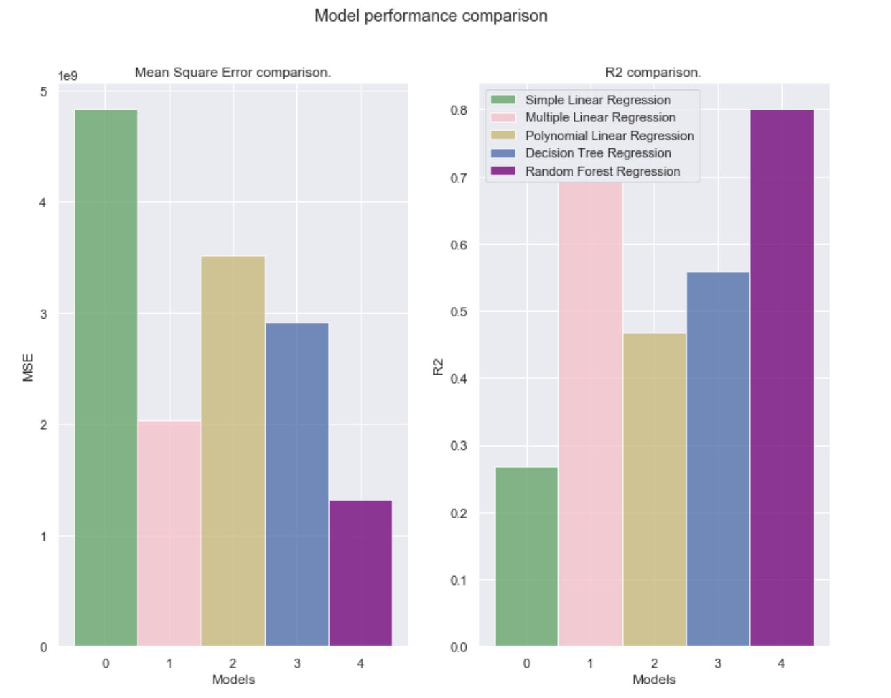

## まとめ

このチュートリアルでは、回帰アルゴリズムの高レベルな概要と、scikit-learnライブラリを使った実装方法を紹介しました。また、matplot libを使って、結果の一部を可視化しました。