In this tutorial, we describe the basics of solving a regression-based machine learning problem, and give you a comparative study of some of the current most popular algorithms.

## Set up

1. Sign up or log in.

    * Activate Watson Studio by logging in to your IBM Cloud account from the [Try IBM Watson](https://dataplatform.cloud.ibm.com/registration/stepone?cm_sp=ibmdev-_-developer-tutorials-_-cloudreg) page.
    * Access Watson Studio, by logging in at [https://dataplatform.cloud.ibm.com](https://dataplatform.cloud.ibm.com?cm_sp=ibmdev-_-developer-tutorials-_-cloudreg).

1. Create an empty project.

    * Click either **Create a project** or **New project**.
    * Select **Create an empty project**.
    * Give the project a name.
    * Choose an existing Object Storage service instance or create a new one.
    * Click **Create**.

1. Add the Notebook.

   * Click **+Add to project**.
   * Click **Notebook**.
   * Click **From URL**.
   * Provide a **Name**.
   * Under **Select runtime**, choose **Default Python 3.6 Free**.
   * Enter `https://raw.githubusercontent.com/IBM/ml-learning-path-assets/master/notebooks/regression_with_scikit-learn.ipynb` as the **Notebook URL**.
   * Click **Create Notebook**.

1. Run the Notebook.

   In the open Notebook, click **Run** to run the cells one at a time. The rest of the tutorial follows the order of the Notebook.

## Overview

Regression is when the feature to be predicted contains continuous values. Regression refers to the process of predicting a dependent variable by analyzing the relationship between other independent variables. There are several known algorithms that help in elevating these relationships to better predict the value.

## About the data set

In this tutorial, we use a data set that contains various information that a home buyer considers before buying a house. We use this data to analyze how well we would be able to predict the house price given all of the other relevant information. Because a previous [tutorial](/tutorials/build-and-test-your-first-machine-learning-model-using-python-and-scikit-learn/) covered the various preprocessing steps that need to occur before creating a model, we skip those details in this tutorial. Instead, we do a detailed study of the different regression algorithms and apply it to the same data set for the sake of comparison.

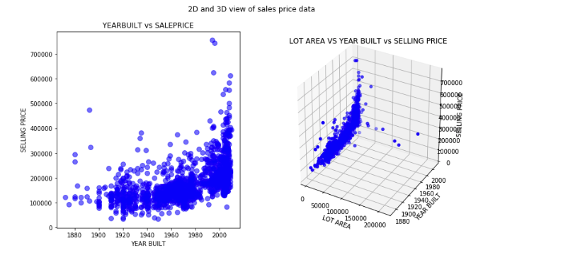

## Regression algorithms

Following are some popular regression algorithms that we discuss in this tutorial, along with code examples.

* Linear regression (Simple, Multiple, and Polynomial)
* Decision tree regression
* Random forest trees
* Gradient boosted trees

### Linear regression

Linear regression models predict a continuous target when there is a linear relationship between the target and one or more predictors.

#### Simple linear regression

This is the most basic form of linear regression, in which the variable to be predicted depends on only one other variable. This is calculated by using the formula that is generally used in calculating the slope of a line.

y = w0 + w1 * x1

In the previous equation, *y* refers to the target variable, and *x1* refers to the independent variable. *w1* refers to the coefficient that expresses the relationship between *y* and *x1* and is also known as the slope. *w0* is the constant coefficient, or the intercept. It refers to the constant offset that *y* will always be with respect to the independent variables.

The following code examples show how simple linear regression is calculated using sklearn libraries.

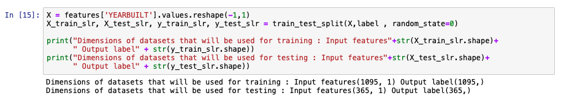

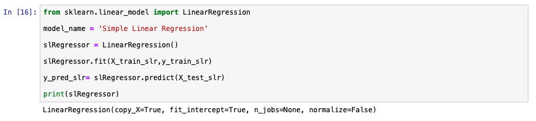

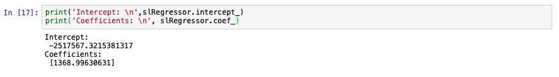

The following graphs show how the model has predicted values for test data versus the actual selling price of the test values. Because simple linear regression assumes dependency on just one variable, a 3-D view doesn't make much sense in this context. The comparison will make more sense when we discuss multiple linear regression. We show two other model metrics charts as well.

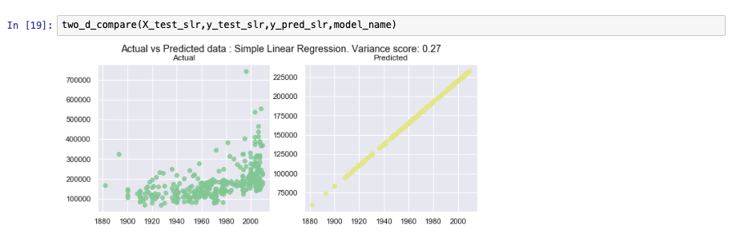

#### Multiple linear regression

Multiple linear regressions is an extension to simple linear regression. In this setup, the target value depends on more than one variable. The number of variables depends on the use case. Usually, a subject matter expert is involved in identifying the fields that will contribute toward a better prediction of the output feature.

y = w0 + w1 * x1 + w2 * x2 + .... + wn * xn

In the following code snippet, you see how sklearn can be used to split the data set into test and training sets. For simplicity, we assume that all of the dependent variables contribute toward making effective predictions. There are several methods like forward selection and backward elimination to choose the optimum columns required to make the most accurate predictions. The descriptions of these methods are beyond the scope of this tutorial.

We use sklearn libraries to develop a multiple linear regression model. The key difference between simple and multiple linear regressions, in terms of the code, is the number of columns that are included to fit the model.

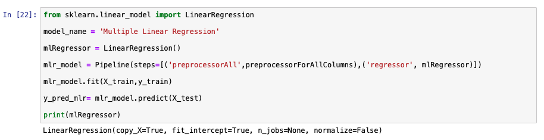

The following images show some of the metrics of the model developed previously.

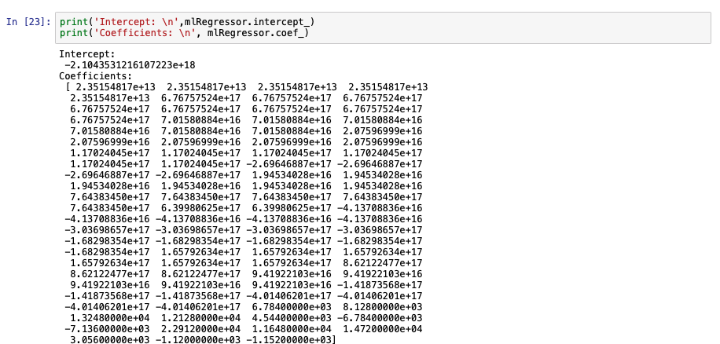

#### Polynomial linear regression

The prediction line generated by simple and linear regression is usually a straight line. In cases when a simple or multiple linear regressions does not fit the data point accurately, we use the polynomial linear regression. The following formula is used in the back end to generate polynomial linear regression.

y = w0 + w1 * x1 + w2 * x21 + .... + wn * xnn

Even though we use exponents of the independent variables in the previous formula, this algorithm is not considered non-linear because of the linear combination of coefficients.

For creating a polynomial linear regression model, the data is preprocessed to create exponents of the variables up to the number mentioned in the degree value. In the following image, you see that the degree in the preprocessing step is set to 3, which means variables up to x3 will be generated. A polynomial feature with degree one is the same as multiple linear regressions. Changing the value of 'degree' to 1 in the following equation has the same output as the model created in the previous section.

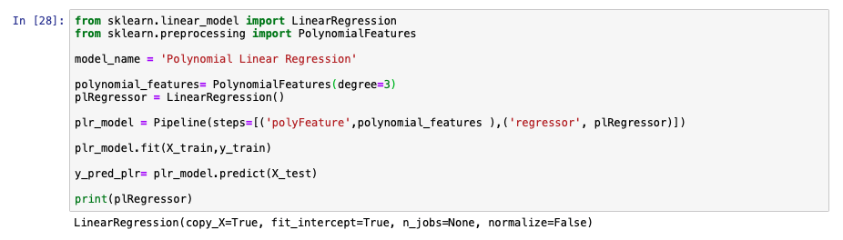

Some of the model performance metrics are shown in the following graph. The polynomial linear regression of degree 3 is not as efficient as the multiple linear regression. We might either tune a few parameters to see whether this algorithm yields a better output or you can conclude that multiple linear regressions is a better suited model for this data set.

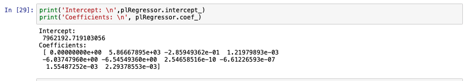

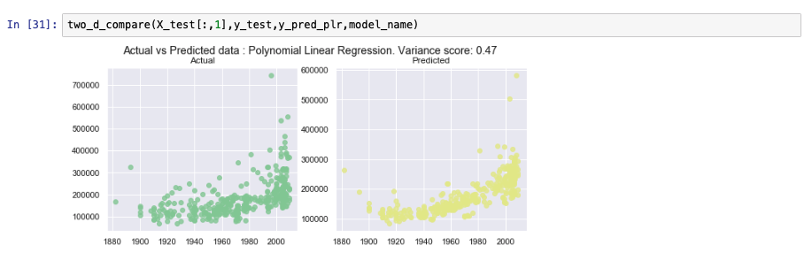

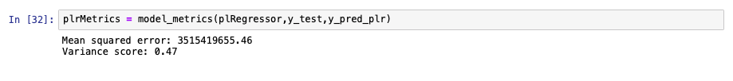

### Decision trees

A decision tree-based model builds a set of rules from the training data to be able to predict the outcome. For the sake of understanding, this algorithm is compared to trees formed through decisions. The model contains branches that represent the rules that lead to the path of the outcome, that is, the leaf. Each prediction path leads to a leaf that contains multiple values. The same principle is applied to classification-type problems as well. For regression-type problems, the final prediction is usually the average of all of the values contained in the leaf it falls under.

The following image shows an example of using sklearn to create a decision tree model.

Model performance is analyzed in the following images.

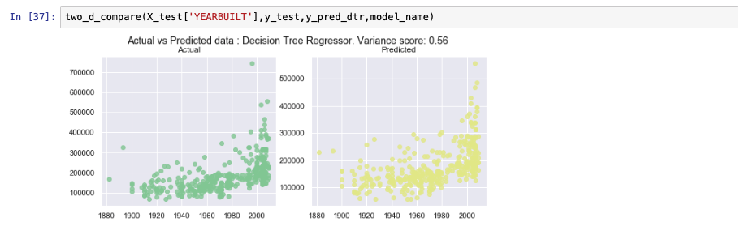

### Ensemble learning

Ensemble learning is types of algorithms that combine weak models to produce a better performing model. More information on ensemble learning can be found in the [Learn classification algorithms using Python and scikit-learn](/tutorials/learn-classification-algorithms-using-python-and-scikit-learn/) tutorial, which discusses ensemble learning for classification.

#### Random forest trees

Decision trees are generally considered weak models because their performance usually is not up to the expected mark when the data set is relatively large. However, when several decision trees are combined into a single model, they provide greater accuracy. Each decision tree within this random forest is built using a subset of the training data. The number of decision trees that make this random forest is an arbitrary number that can be tuned to see the changes in accuracy. When a value to be predicted is run through this resulting model, it is the average of the values acquired from each of these individual trees.

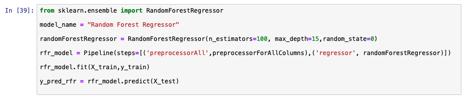

Similar to the previous model, the following image shows an example of using sklearn to create a random forest model.

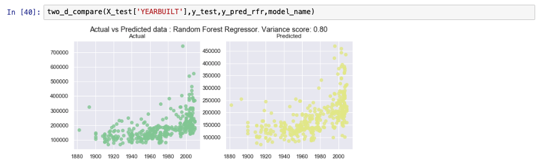

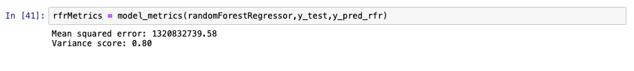

#### Gradient boosted trees

Gradient boosted trees are models that are constructed by additively learning about the performance of the previous model. More details on gradient boosted trees can be found in the [Learn classification algorithms using Python and scikit-learn](/tutorials/learn-classification-algorithms-using-python-and-scikit-learn/) tutorial.

## Comparing algorithms

Mean squared error and R2 are some of the popular metrics used to compare different regression algorithms.

Mean squared error (MSE) is calculated by getting the mean of the squared error. Error here refers to the distance between an actual and predicted value. Closer the MSE is to 0 the better the model performance is.

R2 is calculated using the following formula:

R2  = 1 - (SSresidual / SSaverage )

where SSresidual refers to the sum of the square of differences between the actual and predicted values and SSaverage refers to the sum of the square of difference between actual and average values. In essence, the closer the value of R2 is to 1, the better the model is. If the value R2 is negative, it means that the model performance is poorer than just predicting the average value from the training data set for all values.

Following is a graph comparing the MSE and R2 for different models.

## Summary

In this tutorial, we provided a high-level overview of regression algorithms and showed how they're implemented using the scikit-learn library. We also used matplot lib to visualize some of the results.