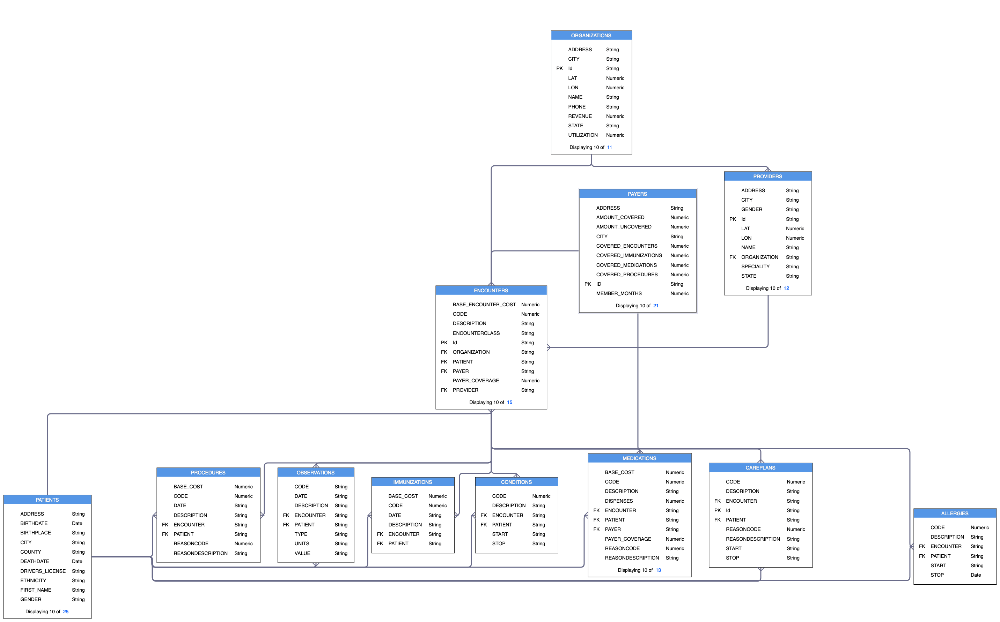
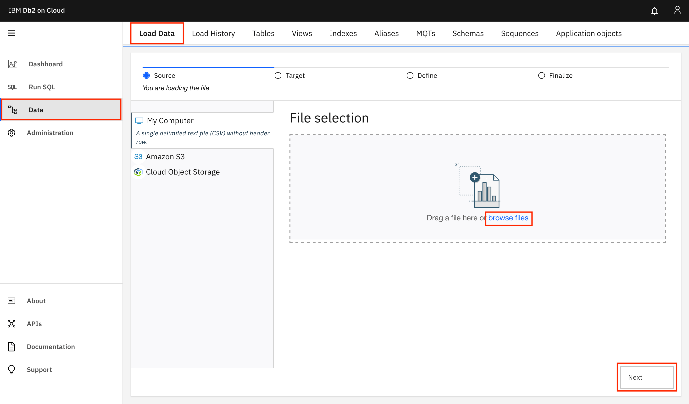
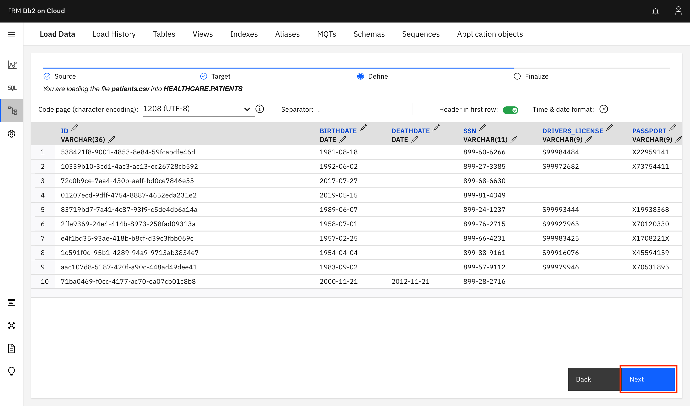
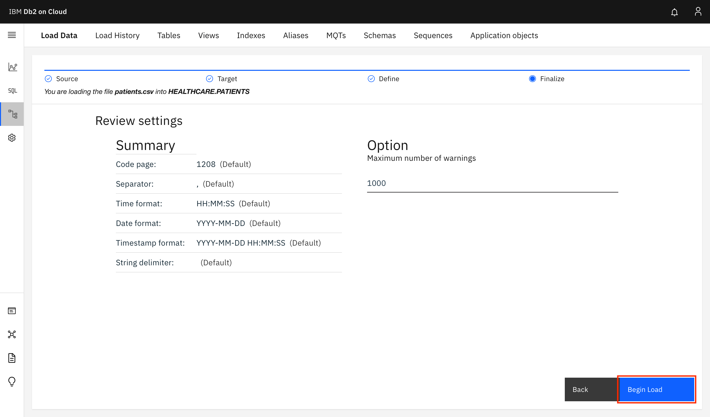
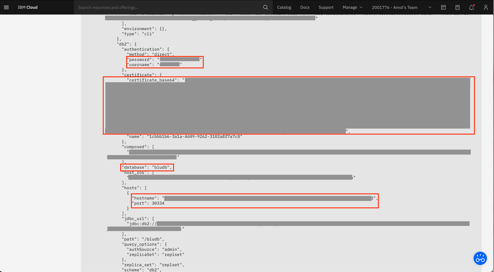

---
also_found_in:
- learningpaths/dataops-fundamentals/
authors: ''
completed_date: '2021-07-20'
components:
- cloud-pak-for-data
draft: false
excerpt: IBM Cloud Pak for DataのQuick scanとAutomated discoveryを使って、データソースからデータ資産を発見して分析する方法を紹介します。
last_updated: '2021-09-27'
meta_description: IBM Cloud Pak for DataのQuick scanとAutomated discoveryを使って、データソースからデータ資産を発見して分析する方法を紹介します。
meta_keywords: discover, analyze, data, quick scan, automated discovery
meta_title: データソースに存在するデータを発見する方法を学ぶ
primary_tag: analytics
subtitle: データソース内のデータ資産の内容を把握できる
tags:
- data-management
title: データソースに存在するデータを発見する方法を学ぶ
---

大規模な企業では、複数のテーブルやファイルにまたがる大量のリンクデータが存在する傾向にあります。これらのテーブルやファイルの品質やビジネスコンテンツに関する洞察を得て、正しい情報を特定し、迅速に探し出す機能が真に求められています。IBM Cloud Pak for DataのWatson Knowledge Catalogは、様々なデータソースに存在する資産を発見し、分析することができます。

Watson Knowledge Catalogのデータ発見機能では、2つの方法のいずれかを使用して、データ資産の品質とコンテンツに関する洞察を得ることができます。資産のサイズや数が不明な場合は、クイックスキャンでデータ品質を素早く確認できます。データ資産の第一レベルの理解が十分な場合は、Automated discovery（自動発見）により、資産をより深く分析するための手段を提供します。

このチュートリアルでは、IBM Cloud Pak for DataのQuick scanとAutomated discoveryを使用して、データ・ソースからデータ資産を発見して分析する方法を学びます。

## 学習目標

このチュートリアルでは

* Quick scanを使用してデータ資産を発見する
* クイックスキャンの結果を見る
* 自動検出によるデータ資産の発見
* 自動検出の結果を見る

## 前提条件

* [IBM Cloud アカウント](https://www.ibm.com/jp-ja/cloud)が必要です。
* [Db2 on IBM Cloud](https://cloud.ibm.com/catalog/services/db2?cm_sp=ibmdev-_-developer-tutorials-_-cloudreg)
* [IBM Cloud Pak for Data v4.0](https://www.ibm.com/jp-ja/products/cloud-pak-for-data)
* [Watson Knowledge Catalog on Cloud Pak for Data](https://www.ibm.com/docs/en/cloud-paks/cp-data/4.0?topic=services-watson-knowledge-catalog)
* [Encorporate Enterprise Governance in your Data](https://developer.ibm.com/tutorials/incorporate-enterprise-governance-in-your-data) の手順の完了。

## 見積もり時間

このチュートリアルを完了するには、約 60 分かかります。

## データについて

このチュートリアルでは、[Synthea](https://synthetichealth.github.io/synthea/)を使って作成した合成患者医療データを使用します。このチュートリアルの一部として提供されているデータセットは以下の通りです。

* PATIENTS:患者の人口統計情報
* PAYERS: 患者の人口統計情報。PAYERS：保険会社などの支払者に関する情報
*PAYERS：保険会社などの支払者に関する情報 * PROVIDERS：主治医などの提供者に関する情報
* organizations:組織：提供者が所属する組織に関する情報
* ENCOUNTERS：患者／提供者／支払者／組織の間の出会いに関する情報
* ALLERGIES：アレルギー。患者のアレルギー情報
* CAREPLANS：患者のために作成されたケアプランに関する情報
* CONDITIONS（コンディション）。CONDITIONS：患者の特定の状態に関する情報
* immunizations:予防接種：患者さんに提供された予防接種に関する情報
* MEDICATIONS（薬）。患者さんが服用している薬に関する情報
* observations:Observations：患者さんが服用している薬に関する情報 *Observation：診察時に測定された体重、身長、血圧などの患者さんの健康状態に関する情報
* PROCEDURES: 処置。処置：患者さんが受けた処置に関する情報

**注**。このチュートリアルでは、PATIENTSテーブルとENCOUNTERSテーブルの発見と分析の手順を説明します。このチュートリアルの拡張バージョンでは、12のデータセットをすべてロードします。

## データ検索について

データ・ディスカバリーには、2つのオプションがあります。データディスカバリーには、「クイックスキャン」と「自動ディスカバリー」の2つのオプションがあります。

クイックスキャンは、データの第一レベルの理解を素早く得るために使用します。これは特に、サイズが不明な資産がある場合に役立ちます。クイックスキャンでは、各テーブルやファイルのサンプルを素早く分析し、データの品質スコア、データ内のビジネス用語、データのデータクラスなどのインサイトを生成します。データを確認した後、1つまたは複数のカタログにデータを公開することができます。

データソースに存在するデータの種類をある程度把握したら、自動検出を使って、最も興味のある資産や最も有用な資産について、より詳細な分析を行うことができます。クイックスキャンとは異なり、自動検出では、メタデータと分析結果が自動的にデフォルトカタログにインポートされます。分析結果は、プロジェクト内で閲覧・更新が可能で、データ品質スコア、自動的に割り当てられたデータクラス、ビジネス用語、データタイプ、フォーマット、頻度分布などが含まれます。

**注**。このチュートリアルでは、まずデータのクイックスキャンを実行し、その結果に目を通します。次に、データの自動検出を行います。このシリーズの次のチュートリアルでは、データの自動検出の結果をより深く分析します。

## Step 1.データソースにデータを読み込む

**注意事項**。先に進む前にDb2 on IBM Cloudのプロビジョニングが完了していることを確認してください。

### データセットのダウンロード

1. [Healthcare-Data.zip](static/Healthcare-Data.zip)ファイルの内容をダウンロードして解凍します。

### Db2 データベースのシード

1. ブラウザを開き、Db2 インスタンスにログインします。

1. 左側のメニューに移動し、**Data**をクリックします。**Load Data**タブを開き、**browse files**をクリックして、ダウンロードしたアーカイブからpatients.csvファイルを選択し、**Next**をクリックします。
    
    

1. スキーマを選択するか（Liteプランの場合、Db2のユーザー名と同じ名前になります）、**New schema +**をクリックして新しいスキーマを作成し、**New table +**をクリックします。**Create a new table**で、テーブル名として`PATIENTS`を指定し、**Create > Next**をクリックします。
    
    

1. 次の画面では、テーブルの列のデータ型を定義します。画面にはDb2で検出されたデータタイプが表示されます。とりあえず、**Next**をクリックして、デフォルトのままで続行します。
    
    

1. 次の画面で、**Begin Load**をクリックします。
    
    

    patients.csvファイルにあるレコードをロードしてPATIENTSテーブルが作成されました。

1. encounters.csv ファイルを ENCOUNTERS テーブルにロードする手順を繰り返します。

**注**:このチュートリアルの拡張バージョンでは、Healthcare-Data.zipファイルに含まれる12個のデータセットをすべてロードします。次の表に、各入力ファイルのテーブル名を示します。

|ファイル名|テーブル名
|-|-|
|allergies.csv|ALLERGIES||。
|careplans.csv|CAREPLANS|?
|conditions.csv|CONDITIONS|?
|エンカウンターズ.csv|ENCOUNTERS|.
|免疫学.csv|IMMUNIZATIONS|.
|medications.csv|MEDICATIONS|?
|observations.csv|OBSERVATIONS|.
|organizations.csv|ORGANIZATIONS|.
|patients.csv|PATIENTS| でした。
|納税者.csv|PAYERS|.
|procedures.csv|PROCEDURES|.
|プロバイダー.csv|PROVIDERS|.

### データベース接続情報の取得

1. IBM Cloud にログインし、Db2 リソースにナビゲートします。

1. **Service Credentials**に進み、**New credential +**をクリックします。新しいサービスクレデンシャルのセットが作成されます。エントリを展開して認証情報を確認します。
    
    

1. サービス資格情報から、以下の値を抽出します。これらの値は、このチュートリアルの後半で、Cloud Pak for DataインスタンスでこのDb2インスタンスのプラットフォーム接続を作成する際に必要になります。
    * ホスト名
    * ポート
    * ユーザー名
    * パスワード
    * データベース
    * 証明書_ベース64

    

1. SSL証明書はbase64でエンコードされたDER形式であり、Cloud Pak for DataのData DiscoveryではPEM形式の証明書が必要です。`certificate_base64`の値をファイル(db2_certificate.pfx)に保存します。その後、ターミナル（またはコマンドプロンプト）で以下のコマンドを実行して、証明書を変換します。