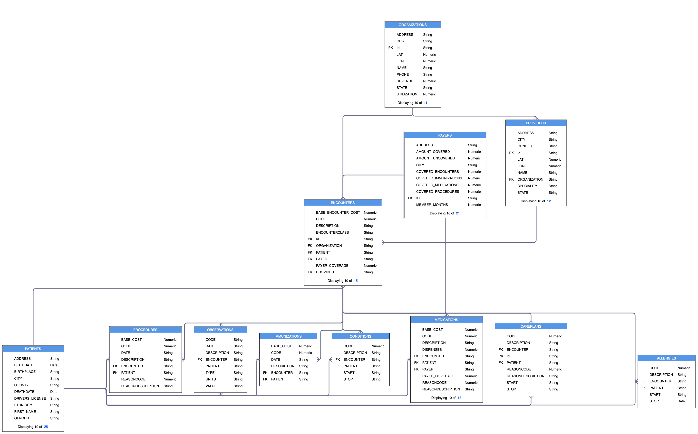
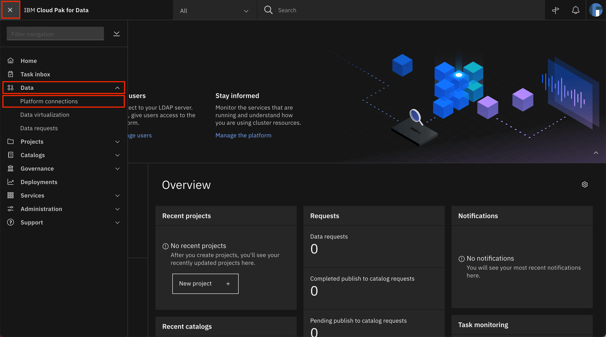
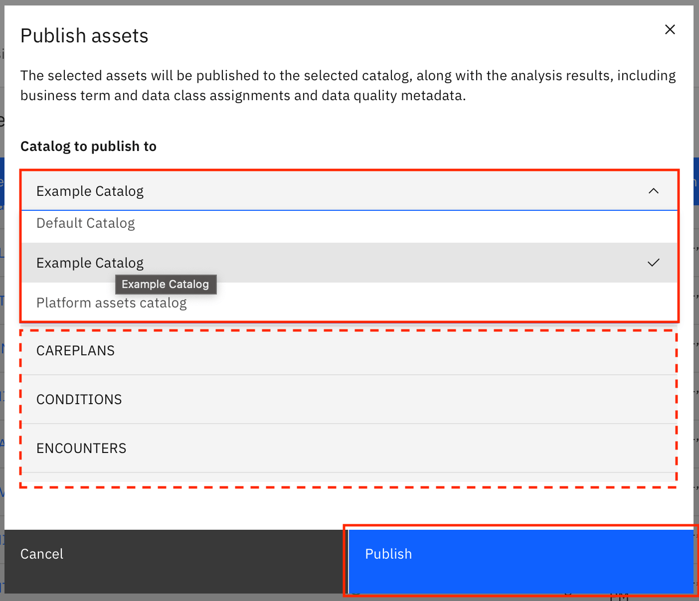
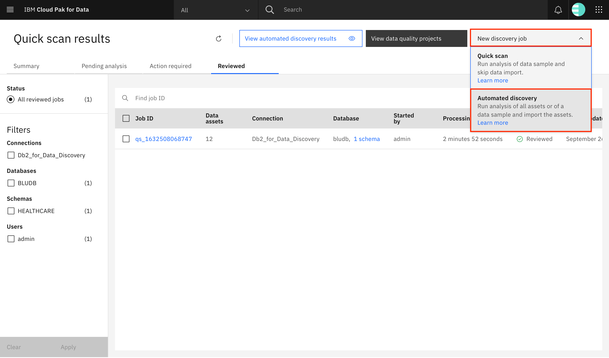
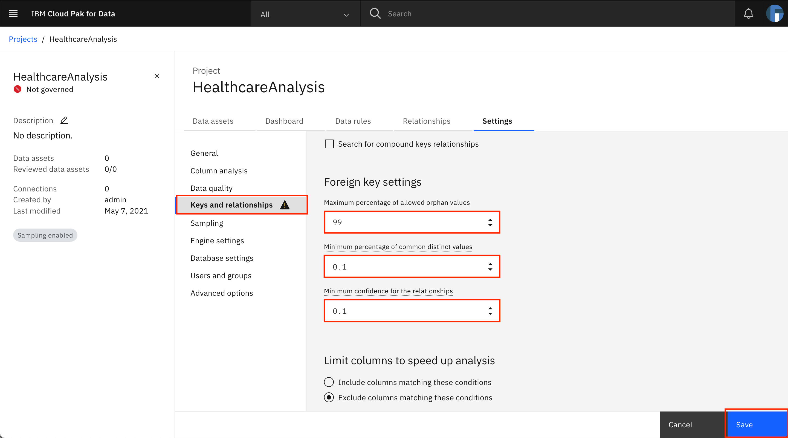
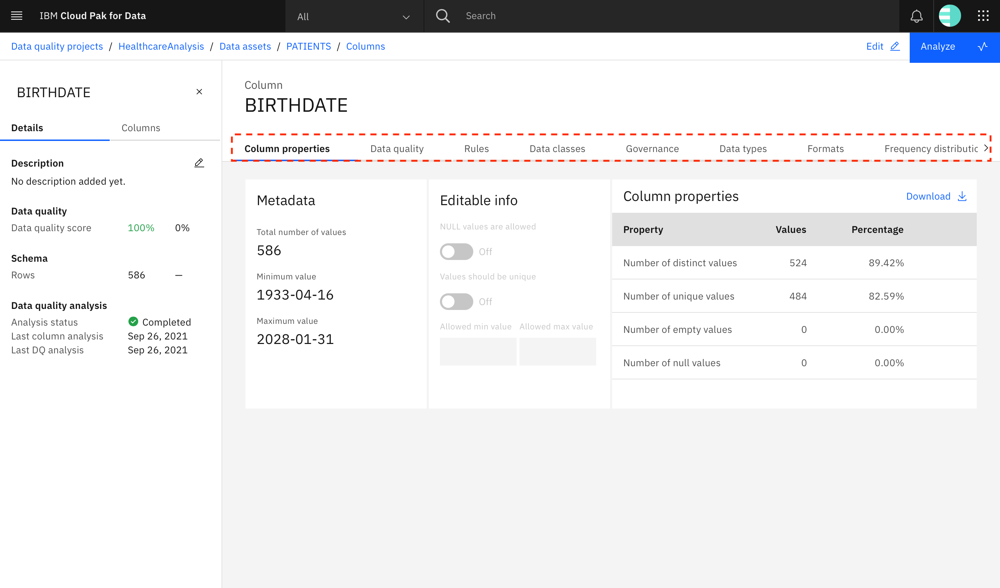

---
also_found_in:
- learningpaths/dataops-fundamentals/
authors: ''
completed_date: '2021-07-20'
components:
- cloud-pak-for-data
draft: false
excerpt: Learn how to use Quick scan and Automated discovery on IBM Cloud Pak for
  Data to discover and analyze data assets from data sources.
last_updated: '2021-09-27'
meta_description: Learn how to use Quick scan and Automated discovery on IBM Cloud
  Pak for Data to discover and analyze data assets from data sources.
meta_keywords: discover, analyze, data, quick scan, automated discovery
meta_title: Learn to discover data that resides in your data sources
primary_tag: analytics
subtitle: Gain insight about the content of data assets in data sources
tags:
- data-management
title: Learn to discover data that resides in your data sources
---

Large-scale enterprises tend to have a large amount of linked data spread across multiple tables and files. There is a real need for the ability to gain insight about the quality and business content of these tables and files to identify and locate the correct information quickly. Watson Knowledge Catalog on IBM Cloud Pak for Data lets you discover and analyze assets present in various data sources.

The data discovery feature of Watson Knowledge Catalog lets you gain insight about the quality and content of your data assets using one of two methods. When the size and number of assets is unknown, Quick scan provides a quick view of your data quality. When there is a good first-level understanding of the data assets, Automated discovery provides the means to run a deeper analysis on the assets.

In this tutorial, you learn how to use Quick scan and Automated discovery on IBM Cloud Pak for Data to discover and analyze data assets from data sources.

## Learning objectives

In this tutorial, you:

* Discover data assets using Quick scan
* Look through the results of Quick scan
* Discover data assets using Automated discovery
* Look through the results of Automated discovery

## Prerequisites

* An [IBM Cloud account](https://www.ibm.com/cloud)
* [Db2 on IBM Cloud](https://cloud.ibm.com/catalog/services/db2?cm_sp=ibmdev-_-developer-tutorials-_-cloudreg)
* [IBM Cloud Pak for Data v4.0](https://www.ibm.com/products/cloud-pak-for-data)
* [Watson Knowledge Catalog on Cloud Pak for Data](https://www.ibm.com/docs/en/cloud-paks/cp-data/4.0?topic=services-watson-knowledge-catalog)
* Completion of the steps in [Incorporate enterprise governance in your data](https://developer.ibm.com/tutorials/incorporate-enterprise-governance-in-your-data)

## Estimated time

It should take you approximately 60 minutes to complete this tutorial.

## About the data

This tutorial uses synthetic patient healthcare data created using [Synthea](https://synthetichealth.github.io/synthea/). The data sets provided as part of this tutorial are:

* PATIENTS: Demographic information about patients
* PAYERS: Information about payers such as an insurance company
* PROVIDERS: Information about providers such as a primary care physician
* ORGANIZATIONS: Information about organizations that the providers are associated with
* ENCOUNTERS: Information about an encounter between patients/providers/payers/organizations
* ALLERGIES: Allergy information for a patient
* CAREPLANS: Information about care plans devised for a patient
* CONDITIONS: Information about identified conditions for a patient
* IMMUNIZATIONS: Information about the immunizations provided to a patient
* MEDICATIONS: Information about the medications that a patient is taking
* OBSERVATIONS: Patients' healthcare observations such as weight/height/blood pressure taken during an encounter
* PROCEDURES: Information about procedures that a patient has undergone



**Note**: This tutorial provides instructions for discovering and analyzing the PATIENTS and ENCOUNTERS tables. For an extended version of this tutorial, load all 12 data sets.

## About data discovery

You can gain insight about the quality and business content of the tables and files within your data sources using data discovery, which has two options: Quick scan and Automated discovery.

Use Quick scan to get a quick first-level understanding of your data. This is especially helpful when you have an unknown number of assets of unknown size. Quick scan quickly analyzes a sample of each table or file to generate insights such as the quality score of the data, the business terms within the data, and the data classes for the data. You can publish the data to one or more catalogs after you have reviewed it.

When you have a fair understanding of the kind of data present in your data sources, you can run a deeper analysis on the most interesting or most useful assets using Automated discovery. Unlike Quick scan, with Automated discovery, the metadata and analysis results are automatically imported into the default catalog. The analysis results are also made available for viewing and updating within a project, and these results include the data quality score, automatically assigned data classes, business terms, data types, formats, and frequency distributions.

**Note**: As part of this tutorial, you first run Quick scan on your data and glance through the results. Next, you run Automated discovery on your data. In the next tutorial within this series, you perform a deeper analysis on the Automated discovery results for your data.

## Step 1. Load data into the data sources

**Note**: Ensure that you have provisioned Db2 on IBM Cloud before proceeding.

### Download the data sets

1. Download and extract the contents of the [Healthcare-Data.zip](static/Healthcare-Data.zip) file.

### Seed the Db2 database

1. Open a browser, and log in to your Db2 instance.

1. Navigate to the left-hand menu, and click **Data**. Go to the **Load Data** tab, click **browse files**, select the patients.csv file from the downloaded archive, then click **Next**.
    
    

1. Choose your schema (for a Lite plan, the name will match your Db2 user name) or click **New schema +** to create a new schema, then click **New table +**. Under **Create a new table**, provide `PATIENTS` as the name of the table, and click **Create > Next**.
    
    

1. On the next screen, you can define the data types for the columns in your table. The screen shows the data types that have been detected by Db2. For now, click **Next** to continue with the defaults.
    
    

1. On the next screen, click **Begin Load**.
    
    

    The PATIENTS table is now created by loading the records found in the patients.csv file.

1. Repeat the steps to load the encounters.csv file into the ENCOUNTERS table.

**Note**: For the extended version of this tutorial, load all 12 data sets provided in the Healthcare-Data.zip file. The following table provides the table names for each input file.

|File name|Table name|
|-|-|
|allergies.csv|ALLERGIES|
|careplans.csv|CAREPLANS|
|conditions.csv|CONDITIONS|
|encounters.csv|ENCOUNTERS|
|immunizations.csv|IMMUNIZATIONS|
|medications.csv|MEDICATIONS|
|observations.csv|OBSERVATIONS|
|organizations.csv|ORGANIZATIONS|
|patients.csv|PATIENTS|
|payers.csv|PAYERS|
|procedures.csv|PROCEDURES|
|providers.csv|PROVIDERS|

### Get the database connection information

1. Log in to IBM Cloud, and navigate to your Db2 resource.

1. Go to **Service Credentials**, and click **New credential +**. A new set of service credentials is created. Expand the entry to look at the credentials.
    
    

1. From the service credentials, extract the following values. You need them later in this tutorial when you create a platform connection for this Db2 instance in your Cloud Pak for Data instance.
    * hostname
    * port
    * username
    * password
    * database
    * certificate_base64

    

1. The SSL certificate is in the base64-encoded DER format, and Data Discovery on Cloud Pak for Data requires that the certificate be in the PEM format. Save the `certificate_base64` value in a file (db2_certificate.pfx). Then, run the following command in a terminal (or command prompt) to convert the certificate:

    ```bash
    openssl base64 -d -A -in db2_certificate.pfx -out decoded_db2_certificate.pem
    ```

The decoded_db2_certificate.pem file contains the decoded certificate that is needed while creating the platform connection on your Cloud Pak for Data instance.

## Step 2. Add connection to Cloud Pak for Data

You now add the Db2 instance as a platform connection to IBM Cloud Pak for Data.

1. Log in to your IBM Cloud Pak for Data instance as a user with admin privileges.
    
    

1. To add a new data source, go to the upper-left **hamburger (☰)** menu, expand **Data**, and click **Platform connections**.
    
    

1. At the overview, click **New connection +**.
    
    

1. Click **Db2 > Select**.
    
    

1. Provide a name for the connection. Ensure that there are no whitespaces in the name.
    
    

1. Scroll down to the Connection details section. Provide the connection details (database name, host, port, username, and password) that were obtained earlier.
    
    

1. Click the checkbox for "Port is SSL-enabled", and provide the converted SSL certificate (from the decoded_db2_certificate.pem file) in the SSL certificate text box. Click **Test connection** to test the connection. When the test is successful, you see a notification at the top of the screen. Click **Create** to create the connection.
    
    

## Step 3. Perform Quick scan data discovery

The next step is to perform a Quick scan of the data in the connection.

**Note**: Ensure that you have completed the steps outlined in the [Incorporate enterprise governance in your data](/tutorials/incorporate-enterprise-governance-in-your-data) tutorial and that the required governance artifacts are available.

1. Navigate to the upper-left **hamburger (☰)** menu, expand **Governance**, and click **Data discovery**.
    
    

1. Click **Quick scan**.
    
    

1. Click **Select a connection > Find or add connection**.
    
    

1. Select the Db2 connection that you added as a platform connection in IBM Cloud Pak for Data, and click **Add**.
    
    

1. Click **Browse** to select the discovery root. This enables you to restrict which schemas and tables within the Db2 database are discovered.
    
    

1. Select the schema where you created the tables, and click **Select**.
    
    

1. Back on the Quick scan job creation screen, click **Select a project > Add a project**.
    
    

1. Give the project a name (HealthcareAnalysis-QS), an optional description (Data Quality project for Healthcare data using Quick scan), and click **Create**.
    
    

1. Ensure that the checkboxes for **Analyze data quality** and **Use machine learning to assign terms** are checked, then click **Discover** to start discovering the assets.
    
    

1. A new Quick scan job starts. An entry for the job is displayed on the **Pending analysis** tab with the status as **Analyzing**. The job takes approximately 2 minutes to complete. You can click the **Refresh** icon to refresh the list.
    

1. When the analysis completes, the record is no longer visible on the **Pending analysis** tab, but is shown under the **Action required** tab with the status as **Ready for review**. Click the **Job ID**.
    
    

## Step 4. Review Quick scan discovery results

1. Take a few minutes to look at all of the information presented on the screen. All of the discovered assets are displayed on the screen. You can use the left-hand panel to choose the type of assets that you would like to see: files, schemas, tables, and columns. Look through the other filter options available, for example, for *Column* asset types, you can filter on Tables, Schemas, Quality score, Assigned business term, and Assigned data classes.
    
    

    **Note**: If you have loaded all 12 tables into Db2 as per the extended version of this tutorial, you see that 12 tables have been discovered during data discovery.

1. Click **Table** to show the table assets, and look for the PATIENTS data asset. The quality score for the PATIENTS data asset is shown under the **Quality** column. Click **PATIENTS**.
    
    

1. All of the columns in the PATIENTS data asset are shown on the screen. Look through the information provided for each column. Most of the values shown are read-only and cannot be updated. For example, for the BIRTHPLACE column, the quality score is 97%, but you cannot see the reasoning behind the score. The Assigned data class is Person Name with a confidence of 100%, which is obviously incorrect, but it is a read-only field, so it cannot be changed. The only thing that you can edit is the Assigned business term. There is no business term assigned to the BIRTHPLACE column, and Patient Birthplace is the Suggested business term. To edit the business term for the column, click the corresponding pencil icon under **Actions**.
    
    

1. A window opens to let you set the business term for the column. To assign a business term from the Suggested business terms, click the checkmark next to the business term. Or, you can use the search box to look for the business term to assign and click the search result that is shown. Click **Update** to save the changes.
    
    

1. The page refreshes, and you can see that the Assigned business term for BIRTHPLACE has been updated. If you want, you can repeat these steps to view and update the business terms for the other columns. (**Note**: You might need to use the arrows at the bottom of the page to view all of the columns.) Click the back arrow to go back to the discovery results for the discovery job.
    
    

    **Note**: Quick scan provides a first glance at your data, which enables you to determine which data assets you want to analyze thoroughly using Automated discovery. You perform Automated discovery on your entire data in the next few sections of this tutorial, and you will be performing in-depth data analysis on the data assets in the next tutorial within this series.

1. As with the PATIENTS data asset, you can continue with updates for the rest of the tables. When you are satisfied with the updates, you can publish the assets to a catalog to make them available for other users. Select all of the tables that you have reviewed and want to publish, and click **Publish assets**.
    
    

1. A window opens that shows the tables that have been selected for publish. Use the drop-down menu to select the catalog to which you want to publish the assets, and click **Publish**.
    
    

1. The status of the assets is updated to Submitted. After the assets are published, the status is updated to Published. Click **Data discovery** in the breadcrumb to go back to the Quick scan results screen.
    
    

1. After the assets are published to the catalog, the Quick scan job status is updated to Reviewed, and the job is moved to the Reviewed tab on the Quick scan results screen.
    
    

## Step 5. Perform automated data discovery

You have performed Quick scan on your data to view the data assets and to get an idea about their data quality. Now, you can perform a deeper analysis on your data assets using automated data discovery.

**Note**: Ensure that you have completed the steps outlined in the [Incorporate enterprise governance in your data](https://developer.ibm.com/tutorials/incorporate-enterprise-governance-in-your-data) tutorial and that the required governance artifacts are available.

1. Click **New discovery job > Automated discovery**.
    
    

1. Click **Select a connection**, and choose the same Db2 connection that you selected for Quick scan.
    
    

1. Click **Browse** to select the discovery root. This enables you to restrict which schemas or tables within the Db2 database are discovered.
    
    

1. Unlike the Quick scan, Automated discovery lets you drill further down and choose tables within the schema. Therefore, you can select which tables that you want to perform the deeper quality analysis on. However, for now, select the schema so you can perform Automated discovery on all of the tables in the schema. Select the schema where you created the tables, and click **Select**.
    
    

1. Back on the Automated discovery job creation screen, click **Select a project > Add a project**.
    
    

1. Name the project (HealthcareAnalysis), and click **Create**.
    
    

1. Click **Go to project settings** to update the project's settings.
    
    

1. The project settings open in a new browser tab. Click the **Keys and relationships** tab, scroll down to **Foreign key settings**, and update **Maximum percentage of allowed orphan values** to 99, **Minimum percentage of common distinct values** to 0.1, and **Minimum confidence for the relationships** to 0.1. Click **Save** to save the changes and close the browser tab.
    
    

1. Back on the Automated discovery job creation screen, check the checkbox for **Analyze columns**, **Analyze data quality**, and **Use data sampling**. Select **Use a random sampling** and enter `1234` as the seed and `100` as the percentage. Click **Discover** to start discovering the assets.
    
    

    **Note**: While the Automated discovery job creation screen lets you publish results to the catalog after the completion of the discovery and analysis processes (using the Publish results to catalog option), keep the box unchecked for now. You will publish the results to the catalog as part of another tutorial in this series.

    While you can provide a different seed, using the same seed results in the same records being selected in your sample as in the example in this tutorial. As a result, you are able to see the same results when the data discovery process is complete.

1. A new Automated discovery job starts, and your schema name should be listed under Discovered assets. It should take a few minutes to import and analyze the assets, and the status is reflected on the screen. Click the refresh icon or refresh your browser to get the updated status. Finally, the status of the import and analyze processes displays as Finished. Click the project name (HealthcareAnalysis) to go into your project.
    
    

## Step 6. Review Automated discovery results

1. All of the discovered assets are displayed on the screen. You can switch the display for these assets between list and cards. Take a look at the different tabs present on the screen, which give a lot of information about the project. The Data assets tab gives information about the data assets in the project. The Dashboard tab gives analytics about the most recent analysis performed on the assets. The Data rules tab gives information about the rules applied to the project and the ones available to be applied. The Relationships tab gives information about the relationships between the data assets. The Settings tab is where the project-specific settings can be applied. Find and click the **PATIENTS** data asset to see more details about it.

    

1. The Columns tab shows information about the columns in the asset. You can see that the discovery process found 25 columns in the PATIENTS data asset. The table provides information regarding the analysis status and last analyzed time of the columns as well as information identified and auto-assigned by the analysis process such as data classes, business terms, format, and data types. Scroll and view all of the information that is present in the table against each record. The Details panel shows the data quality analysis results, the data quality score, and the status of the primary key analysis, and the Columns tpanel shows the data quality scores for each column in the PATIENTS table.

    

1. Look through the other tabs. The Governance tab gives information about suggested business terms for the data asset and provides the ability to assign them or to reject previously assigned terms. The Data quality tab provides information about the data quality score and lists the columns/values that do not satisfy the criteria as specified by the data quality dimensions. The Data classes tab gives a summary of the data classes that were found and the ones that were selected. The Data types tab provides a summary of the types of data found in the data asset. The Rules tab gives information about rules added to the asset and the rule violations found when running the rules.

    

1. Finally, click the **Keys** tab. Here, you can see the results of the primary key analysis process. The status column shows that currently there are six columns that were identified as Candidate primary keys. By default, the filter is set to *Non rejected keys,* meaning only the Candidate and Selected keys are displayed in the list. You can use the filter to show the rejected keys (currently, there are none). Clicking **Show foreign keys** shows you all foreign key relationships that the data asset participates in (currently, there are none because the relationship analysis has not been run on the data assets in the project). **Run primary key analysis** provides the ability to re-run primary key analysis on this asset.

    

1. Now, look at one of the columns within the PATIENTS data asset. Go back to the **Columns** tab, and click **BIRTHDATE**.

    

1. Go through the different tabs to view information about the **BIRTHDATE** column in the PATIENTS data asset. The Column properties tab provides metadata about values present in the column. The Data quality tab lists the values that do not satisfy the criteria as specified by the data quality dimensions. The Rules tab gives information about rules added to the asset that are related to the column and the rule violations found when running the rules. The Data classes tab specifies the various data classes detected for the column along with the confidence that Watson Knowledge Catalog has for each data class. It also mentions the data class that was selected for the column and lets you change the selected data class. The **Governance** tab gives information about suggested business terms for the column and provides the ability to assign or reject previously assigned terms. The **Data types** tab specifies the various data types detected for the column, the confidence that Watson Knowledge Catalog has for each detected data type, and specifies the data type that was selected. The **Formats** tab gives information about the different formats found for the data in the column, along with the number of records that adhere to each of the formats. Finally, **Frequency distribution**, as the name suggests, gives the frequency distribution of the values in the column.

    

## Summary

In this tutorial, you learned how to use data discovery on the IBM Cloud Pak for Data platform to discover data assets in your data sources. You ran both Quick scan and Automated discovery on your data assets. IBM Watson Knowledge Catalog identified the governance artifacts for the assets and performed automatic assignment of these artifacts to your data. It then calculated a quality score for your data assets.

You also observed the differences between Quick scan and Automated discovery. While Quick scan gave a quick view of the quality scores of the assets, Automated discovery -- in addition to the scores -- also displayed data quality dimension violations, which give more insight into the reasoning behind the quality scores. Both Quick scan and Automated discovery identified and assigned data classes and business terms to assets, but while Quick scan only allows updates to the assigned business terms, Automated discovery allows updates for both. In addition, Automated discovery also identifies and allows updates for data types and formats for each column. Finally, Automated discovery provided the ability to identify and select primary keys for data assets as well as foreign key relationships between the data assets.

This tutorial is part of the [An introduction to the DataOps discipline](https://developer.ibm.com/articles/an-introduction-to-the-dataops-discipline) series.