<!--ラーニングパスに組み込まれている場合はコメントアウトされます -->。
<!-- <sidebar> <heading>Learning path:IBM MQ Developer Essentials Badge</heading> 
このチュートリアルは、IBM MQ Developer Essentialsのラーニングパスとバッジの一部です。
 <ul> <li> [IBM MQ fundamentals](/articles/mq-fundamentals/)</li><li> IBM MQ fundamentals (this article)</li><li> [MQ on Containers](/tutorials/mq-connect-app-queue-manager-containers/)を使用して、キュー・マネージャーを立ち上げて実行します。または[MQ on Cloud](/tutorials/mq-connect-app-queue-manager-cloud/)、または[MQ on Ubuntu](/tutorials/mq-connect-app-queue-manager-ubuntu/)、または[MQ on Windows](/tutorials/mq-connect-app-queue-manager-windows/)を使用します。</li> <li> [Explore the MQ Console](/tutorials/mq-setting-up-using-ibm-mq-console/) </li> <li> [Get ready to code in Java](/tutorials/mq-develop-mq-jms/) </li><li> Take on the messaging coding challenge (this tutorial)</li> <li> [Debug your application or environment](/articles/mq-dev-heat-sheet/)</li></ul></sidebar> -->

実世界のメッセージング・ソリューションがいかにシンプルであるかを見てみましょう。

ステップ・バイ・ステップの指示に従って、キュー・マネージャーとコンテナ内に用意されたアプリと相互作用するメッセージング・アプリを開発します。  その過程で、IBM MQ Developer Essentials バッジを獲得するためのクイズに合格するために必要となる、新しいメッセージングの概念とスキルを習得します。

## 前提条件

この課題を完了するには、ローカル環境に以下のものが必要です。

* アプリケーションを開発・実行するための Java Development Kit (JDK)
* JMSクラス（`JMS.jar`ファイル内
* IBMおよびIBM MQのJMSクラス（`com.ibm.mq.allclient.jar`ファイル）。
* `JmsPutGet.java` サンプル
* この MQ デベロッパーチャレンジのサンプルコード（`mq-dev-badge-sample`）。

## The challenge

おめでとうございます。あなたは会議チケット販売会社の開発者として新しい仕事を始めたばかりです。

あなたのチームリーダーは、MQカンファレンス予約サービスと統合し、チケット割り当てプロセスを自動化する新しいメッセージングアプリケーションを作成することをあなたに課しました。これにより、新しい組織が顧客の需要に対応できるようになります。
私たちは、キュー・マネージャーを含むイベント予約サービスをすでに構築し、Dockerイメージとして提供しています。お客様はイメージをビルドして実行するだけです。

そして、このチャレンジでは、再販アプリケーションをコーディングしていただきます。私たちは、コメントとコードスタブを含むJavaアプリケーションのテンプレートをGitHubで提供しています。シナリオのJMSとメッセージ処理の部分をコーディングして、ギャップを埋める必要があります。

あなたのコードは

* **キュー・マネージャーに接続** (私たちが提供したもの)
* **Subscribe** to `newTickets` topic
* **Send** a `request message` for a batch of tickets, **set** a `reply-to destination` and `message expiry` of 15 minutes (for us want to commit a purchase indefinitely)
* `****Reply-to destination` に指定した確認キューから `response message` を取得します。
* **結果を印刷**する

もし、途中で行き詰ってしまった場合は、<a href="https://developer.ibm.com/articles/mq-dev-cheat-sheet/" target="_blank" rel="noopener noreferrer">_cheat sheet_</a>を用意し、<a href="https://github.com/ibm-messaging/mq-dev-badge-sample/tree/master/ModelAnswer/com/ibm/mq/demo" target="_blank" rel="noopener noreferrer">_model answer_</a>をパッケージ化して参考にしています。

この課題に取り組むための3つの方法を用意しました。

1. 今すぐコードを書いてみる
2.模範解答アプリケーションを確認する
3.簡単な不具合を修正してみる

## クライアントアプリのメッセージングサービスアーキテクチャ

サードパーティサービスは、チケットが販売可能になると、リセラーメッセージを生成して、購読者（あなたです！）に通知します。

チケット再販業者は、会議イベントのチケットのバッチを要求します。チケットが割り当てられると、再販業者は顧客に自由に配布することができます。

それでは、アーキテクチャ図を見てみましょう。あなたはリセラーアプリケーションを構築することになります。

メッセージは、イベント予約サービスによって、`newTickets`トピックに_30秒ごとに公開されます。

メッセージのペイロードには、`EventId`と利用可能なチケットの数が含まれています。

リセラーアプリケーションは受け取ったペイロードを使ってリクエストメッセージを作成します。
最後に，予約サービスは購入キューから消費し，ペイロードセットを持つ`JMSReplyTo`の宛先（確認キュー）の各メッセージに対して，以下のように応答します．

`Accepted - <number_of_tickets_allocated>`のように。
または
拒否されました-完売しました

### 作成するクライアントのメッセージングアプリを強調する

IBM MQのクライアントアプリケーションであるチケット再販アプリを作成します。

MVP(minimum viable product)に集中できるように、この図では、MQサーバーとDockerコンテナで提供した再販業者サービスに関連して、作成しなければならないIBM MQ JMSアプリの要素を示しています。メインのクライアントアプリのアクションには、名前と番号が付けられています。

アプリケーションのコーディングが完了すると、アプリケーションは次のようになります。

1. キュー・マネージャーに接続する
2.トピックへの登録
    * 3.パブリケーションの受信
    * パブリケーションを処理する
    * パブリケーションを受信すると、0枚以上のチケットを購入するためのリクエストメッセージを作成し、購入キューに送信します。リクエストメッセージにはプロパティがあります。
        * 何枚のチケットを要求するかを示します。
        * 与えられた `EventID` に対して
        * 確認のための `reply-to destination` を設定します (応答)。
        * 「メッセージの有効期限」を15分に設定します。
3.3. リクエストメッセージを購入（リクエスト）キューに入れます。
    * (チケット購入コーディネータアプリは、このキューから取得します)
    * (メッセージを処理して、チケットがあればその枚数を割り当てる)
    * （確認（応答）キューにメッセージを入れます。応答メッセージにはプロパティがあります。
        * チケットがあれば、何枚割り当てられたかを示します。
        * 与えられた `EventID` に対して
4.レスポンスキューからの取得を行います。
5.何枚のイベントチケットが購入されたかを出力する

クライアントのメッセージングアプリには、次のような動作が求められます。

* 30秒ごとに `newTickets` トピックに公開されたメッセージを処理します。
* 利用可能なチケットのうち何枚購入したいかをユーザーに尋ねるプロンプトを提供する。
* 会議イベント予約サービスがリクエストメッセージを処理した後に提供するレスポンスを処理します。
* レスポンスの結果を `stdout` に出力します。

## 前提条件の確認

まず、Java Development Kitがインストールされているかどうかを確認します。  以下のコマンドを発行します。

のような出力が表示されるはずです。

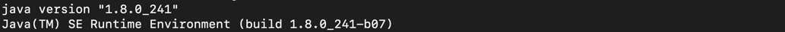

JDK 8, `1.8.n_nnn`が必要です。

Javaがインストールされていない場合は、<a href="https://adoptopenjdk.net/installation.html" target="_blank" rel="noopener noreferrer nofollow">_OpenJDK_ページ</a>にアクセスし、OpenJDK 8とお使いのプラットフォームを選択してください。いくつかのプラットフォームでは、コマンドラインを使って引き込んでインストールすることができます。ただ、JRE（Java Runtime Environment）だけでなく、開発用のJDK（Java Development Kit）を入手するようにしてください。

[このラーニングパスの最初のチュートリアル](/learningpaths/ibm-mq-badge/write-run-first-mq-app/)を完了した場合、すでにJDK(Java Development Kit)と、`com.ibm.mq.allclient.jar`と`javax.jms-api-2.0.1.jar`ファイルのあるMQClientディレクトリを持っているはずです。チャレンジアプリを実行するには、これらの `.jar` ファイルが必要です。MQClientのディレクトリにJDKと`.jar`ファイルがあれば、次のステップである[チャレンジコードの取得](#get-the-challenge-code)に進むことができます。

このチュートリアルを完了していない場合は、セットアップを行いましょう。

1. サンプルに必要なファイルを保存するMQClientディレクトリを、例えばホームディレクトリに作成します。

`2.MQClient`ディレクトリに移動し、`curl`を使って`com.ibm.mq.allclient.jar`ファイルを取り込みます。

3.3. `MQClient` フォルダから、`curl` を使って JMS `.jar` ファイルを取り込みます。

## チャレンジコードの取得

バッジのチャレンジコードをダウンロードする必要があります。このコードは、<a href="https://github.com/ibm-messaging/mq-dev-badge-sample" target="_blank" rel="noopener noreferrer">_ibm/messaging/mq-dev-badge-sample_</a>のGithubリポジトリに格納されています。

Githubのibm/messaging/mq-dev-badge-sampleリポジトリにアクセスして、cloneまたはdownloadボタンをクリックします。「Clone with SSH」、「Use HTTPS」、「Download ZIP with the code」のいずれかを選択できます。リポジトリをMQClientのディレクトリにクローンまたは解凍します。

1. コードをローカルに入手したら、sample codeディレクトリに変更します。

`    cd mq-dev-badge-sample`。

2.2. print-working-directory コマンドを実行して、正しい場所にいることを確認します。

    `pwd`

    あなたのパスが次のようになっていることを確認してください。

`    ~/MQClient/mq-dev-badge-sample`となります。

    Windowsでは、パスが次のようになっているはずです。

    ~MQClient/mq-dev-badge-sample}となります。

3.3. 「ls」と入力して、ディレクトリの内容を表示します。

「    ls」と入力してください。

    これらのディレクトリとファイルが表示されます。

`   `├-- MQTicketService
    │ ├-- Dockerfile
    │ .
    │ .
    │ └-- チケットジェネレーター
    ├-- ModelAnswer
    ├-- ModelAnswerWithDefectToFix
`    └-- TicketReseller`（チケットリセラー

`MQTicketService`ディレクトリには、MQサーバー(キューマネージャー)を搭載したイメージを構築し、コンテナを立ち上げるための定義が記載された`Dockerfile`があります。また、`TicketGenerator`というディレクトリには、アプリをコーディングして実行したときに相互作用するアプリやサービスのJavaコードが入っています。サーバーサイドのアプリは、キューマネージャーと同時にコンテナ内で起動します。

## イベント予約システムの立ち上げ

リセラーアプリのコーディングを始める前に、サーバーサイドやイベント予約サービスがどのように動作するか見てみましょう。

まず、Dockerイメージを構築し、MQと、チケットの空き状況を公開し、アプリからのリクエストに応答するアプリを入れたコンテナを実行します。

動作を確認したら終了させて、後でチャレンジアプリをテストする準備ができたら再起動させます。

以下の手順で、イベント予約サービスを立ち上げます。

1. mq-dev-badge-sample ディレクトリ内で、MQTicketService ディレクトリに変更します。

2.この場所にある `Dockerfile` には、コンテナ内で MQ を実行し、パブリッシャーとレスポンスアプリを実行するためのすべてが定義されています。以下のコマンドを実行してイメージを構築します。

3.Dockerはすべての前提条件を取り込み、イメージをビルドします。ビルドが完了したら、ビルドされたイメージ `mqbadge` があることを確認してください。

    と表示されます。
    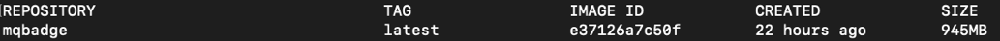

7.イメージからコンテナを実行します。

    すぐに、コンテナからの出力がコマンドラインに表示されるようになります。イベントが公開され始めているので、気をつけてください。
    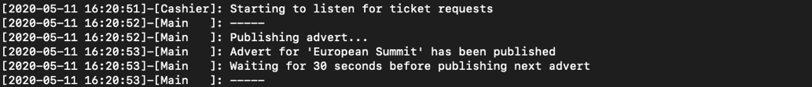

イベント予約システムがコンテナ内で動作しています。コンテナは`--detach`オプションを付けずに起動しているので、コンテナの実行中にログが画面に表示されていることに注意してください。

コンテナのプロセスは以下の通りです。

* **publisher app** (30秒ごとに利用可能なチケットに関する情報を送信する)
* **チケット購入コーディネータ**：購入リクエストを処理し、チケットのバッチを割り当てます。
    **重要：**購入リクエストを処理し、チケットを割り当てる、イベント予約ビジネスの中核となる部分です。IBM MQ Messagingは、会議イベント処理コードの中で重要な役割を果たしており、会議イベント予約サービスとチケット販売会社の間で、価値の高いメッセージの確実な配信を行っています。チケットを売りすぎたり、リクエストに応えられなかったりすると、会議イベントの予約事業者の評判が下がってしまうので、この点を正しく理解することが重要です。
* IBM MQサーバ**：サブスクリプション・トピック** `newTickets`、リクエスト・メッセージ用の**purchase queue**、レスポンス・メッセージ用の**confirmation queue**をホストするキュー・マネージャです。

キューは、Dockerコンテナの起動時に<a href="https://www.ibm.com/docs/ibm-mq/latest?topic=reference-runmqsc-run-mqsc-commands" target="_blank" rel="noopener noreferrer">_MQSC_ commands</a>を実行することで、管理的に作成されました。
キューオブジェクトは、MQコンソールで、<a href="https://www.ibm.com/docs/ibm-mq/latest?topic=api-getting-started-administrative-rest" target="_blank" rel="noopener noreferrer">_MQ REST interface_</a>を使用して、またはプログラムで作成することもできます。

これで、リセラーアプリケーションの開発を始める準備が整いました。しかしその前に、ModelAnswerアプリがイベント予約サービスとどのように連携するかを見てみましょう。

## ModelAnswerアプリを実行して動作を確認する

別のターミナルを開き、`MQClient/mq-dev-badge-sample/ModelAnswer`ディレクトリに移動します。

そのディレクトリで、アプリケーションをコンパイルするコマンドを実行します。

*`javac -cp ../../com.ibm.mq.allclient-9.2.3.0.jar: ../../javax.jms-api-2.0.1.jar com/ibm/mq/demo/*.java` のようにします。

Windowsの場合、このコマンドは

`*javac -cp ...com.ibm.mq.allclient-9.2.3.0.jar; ...\javax.jms-api-2.0.1.jar com\ibm˶demo˶*.java` です。

このコマンドは、`MQClient`ディレクトリに`.jar`ファイルがある場合にのみ動作します。  また、[Check your prereqs](#check-your-prereqs)や[Get the challenge code](#get-the-challenge-code)のセクションを参照して、コードが正しくセットアップされているか確認してください。

ファイルを見て、アプリが正しくコンパイルされたことを確認します。`ls com/ibm/mq/demo`.

`ls com/ibm/mq/demo`というファイルを見て、アプリが正しくコンパイルされたことを確認してください。

サービスの入ったコンテナが停止した元のターミナル・ウィンドウに戻ります。

2つのターミナル・ウィンドウを並べて配置し、両方を簡単に操作できるようにします。

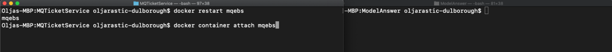

左側のDockerコンテナのターミナルでは、コンテナを再起動して、サーバーとアプリの動作による出力を確認する必要があります。  コンテナを起動します。

コンテナからの出力をターミナルで取得します。

右側のターミナルで、ModelAnswerアプリケーションを実行するためのコマンドを準備しますが、コマンドを入力する前に、サーバーターミナルのイベントが表示され始めるのを待ちます。

`java -cp ../../com.ibm.mq.allclient-9.2.3.0.jar:../../javax.jms-api-2.0.1.jar:. com.ibm.mq.demo.Reseller`.

Windowsでは、このようなコマンドになります。

`Java -cp ...\\com.ibm.mq.allclient-9.1.4.0.jar;...\javax.jms-api-2.0.1.jar;...com.ibm.mq.demo.Reseller`.

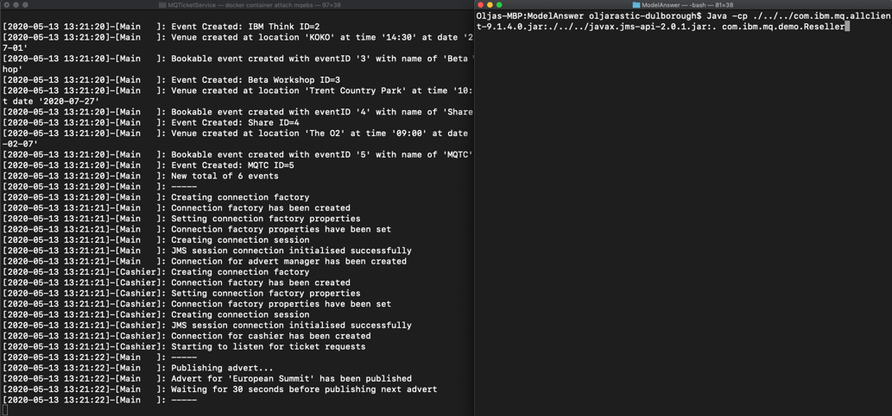

これで、ModelAnswerアプリケーションを起動するコマンドを実行すると、次のように表示されるはずです。

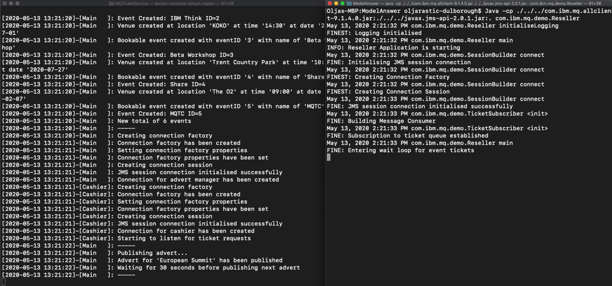

次の利用可能なチケットのセットが公開されると、ModelAnswerのターミナルに、確保したいチケットの数を尋ねるプロンプトが表示されます。

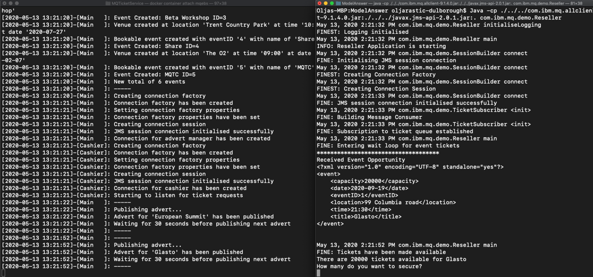

ModelAnswerアプリの端末に確保したいチケットの枚数を入力します。  両方の端末に交換メッセージが表示されているはずです。

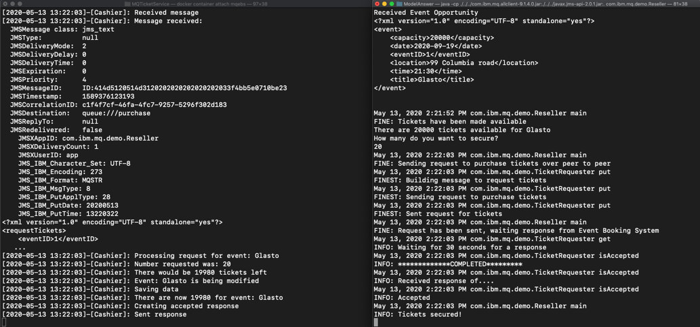

公開するチケットイベントがなくなると、コンテナは終了します。

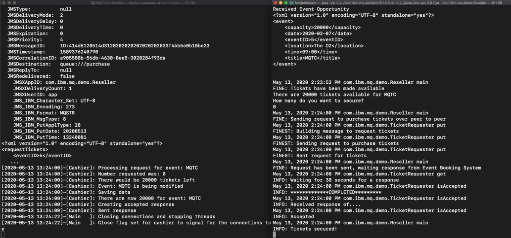

ModelAnswerアプリは、最後に告知されたイベントのチケット数を入力するまで終了しません。その後、コンテナ内のアプリも切断され、MQキュー・マネージャーがスレッドを停止して接続を閉じたため、アプリが切断されるのがわかるはずです。

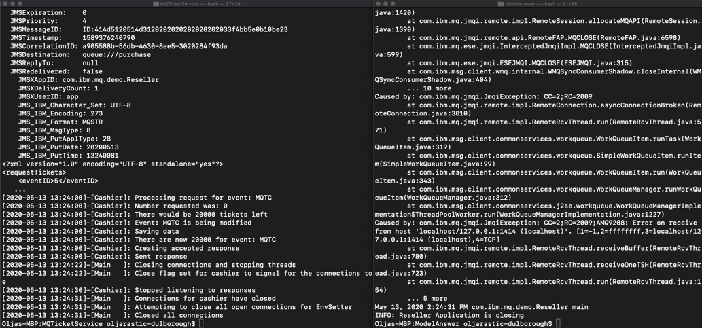

アプリとサービスがどのように相互作用するかを確認したので、先に進み、`TicketReseller`ディレクトリで独自のJavaコードを書くか、`ModerAnswerWithDefectToFix`ディレクトリで不具合を修正して動作するようにしてください。

## リセラーアプリケーションのコーディング

便宜上、<a href="https://www.eclipse.org/downloads/" target="_blank" rel="noopener noreferrer nofollow">_Eclipse_</a>のようなJava IDEを使用するとよいでしょう。あるいは、<a href="https://atom.io/" target="_blank" rel="noopener noreferrer nofollow">_Atom_</a>のようなお好みのエディタでコードを開発することもできます。

お好みのエディタで、`TicketReseller`または`ModelAnswerWithDefectToFix`ディレクトリを開いてください。

サンプルコードは複数のクラスに分かれています。課題をクリアするためには、これらのクラスに対してコードの更新を行う必要があります。

* `SessionBuilder.java` (セッションビルダー)
* `TicketSubscriber.java` (チケットサブスクライバー)
* `TicketRequester.java` (チケット要求者)

これらのクラスのスタブに記載されているコメントを参考に、何をすべきかを考えてみてください。アプリに必要なこと、コンパイルの助け、アプリの動作例については、これまでのセクションを参照してください。

### デバッグが必要な場合

何か問題が発生しましたか?  <a href="https://developer.ibm.com/articles/mq-dev-cheat-sheet/" target="_blank" rel="noopener noreferrer">_cheat sheet_</a>を見てみましょう。

## あなたのアプリケーションを強化する

運用可能なクライアントメッセージングアプリケーションについて詳しく知るには、セキュリティとメッセージの永続性を考慮する必要があります。  また、メッセージのトランザクション性についても考慮する必要があります。

### なぜメッセージングを使うのか？

カンファレンスイベントシステムとリセラーのアプリケーションは疎結合になっています。非同期メッセージングを使用することで、これらのコンポーネントを統合し、バッファー(ショックアブソーバー)を組み込むことができます。万が一、どちらかのコンポーネントが接続性を失ったり、故障したり、スループットが変動したりしても、メッセージングレイヤーがその不安定さに対処します。コンポーネント間のメッセージ交換のセキュリティ、リカバリー、永続性などの難しい問題をメッセージングレイヤーが処理してくれるので、アプリケーションコードはシンプルになります。

メッセージングAPIはフレームワークを提供しているので、リセラーアプリケーションのロジックは、サーバーを継続的にポーリングして動作を確認するのではなく、メッセージが配信されたときに駆動されます。これにより、ネットワークと会議イベントアプリケーションから不要な負荷を取り除くことができます。IBM MQは、需要の増加に応じてソリューションを拡張することができます。

#### パブリッシュ/サブスクライブ・メッセージング・スタイル

パブリッシュ/サブスクライブは、IBM MQ が実装するメッセージング・スタイルの 1 つです。もう 1 つはポイント・ツー・ポイントです。ポイント・ツー・ポイントでは、メッセージは 2 つの単一のアプリケーション間で交換されます。パブリッシュ/サブスクライブでは、1 つのトピックに対して 1 つまたは複数のパブリッシャーが 1 つまたは複数のサブスクライバーにパブリッシュできます。

ここでは、パブリッシュ／サブスクライブのメッセージングスタイルがどのように実装されているかをご紹介します。
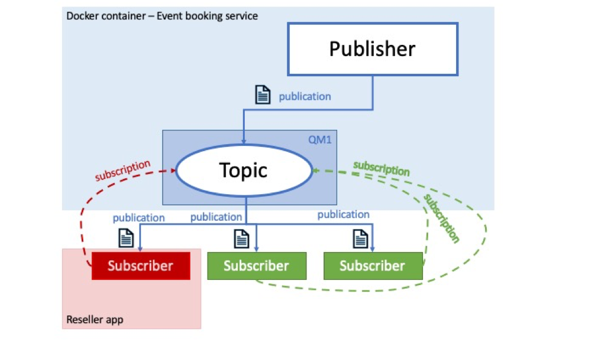

イベント予約サービスはパブリッシャーであり、リセラーアプリはサブスクライバーの1つです。このメッセージングスタイルの他のコンポーネントについて説明します。

* トピックはオブジェクトであり、プロパティを持っています。
* トピックの主要なプロパティはトピック文字列です。
* メッセージはパブリッシャーによってトピック文字列に発行されます。
* 各パブリッシュは1つのトピック文字列に対して行われます。購読者はトピック文字列に興味を持ち、登録します。
* パブリッシャーがトピック文字列にメッセージをパブリッシュすると、そのトピック文字列の1人以上のサブスクライバーがパブリッシュメッセージを受信します。
* JMSアプリケーションは、トピックに対応するJMSデスティネーションオブジェクトを、キューに対応するデスティネーションを使用するのと同じように、ポイント・ツー・ポイントのシナリオで使用できます。パブリケーションがサブスクライバーに正常に到達するためには、パブリッシャーとサブスクライバーの両方が同じトピック文字列にマッチする必要があります。サブスクライバーは、トピックを購読した時点からパブリケーションを取得します。
* 特定のアプリケーションのサブスクリプションが作成される前にパブリケーションが送信された場合、そのアプリケーションはパブリケーションを取得しません。

#### Request/Response メッセージングパターン

リクエスト・レスポンスまたはリクエスト・リプライは、統合またはメッセージング・パターンの1つで、メッセージを他のアプリケーションに送信するアプリケーションが、受信側のアプリケーションに何らかの返信を要求するものです。これは、ポイント・ツー・ポイントのメッセージングスタイルに基づいていることが多く、同期型（送信側のアプリケーションがタイムアウトする前に応答を待つ）と非同期型（リクエスト／コールバックとも呼ばれ、送信側のアプリケーションは切断するが、応答を処理するためのコールバックを設定する）があります。

リセラーアプリが送信側アプリ、イベント予約サービスが受信側アプリとなります。
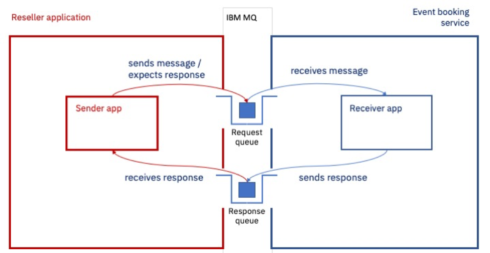

送信側のアプリケーションは通常、応答が正しい送信側のアプリケーションに戻るように、reply-to-destinationとcorrelation-idを設定します。

イベント予約サービスでは、返信先はキュー・マネージャーで管理的に定義されています。しかし、リクエスターは、交換を完了するために、そのJMSセッションから一時的な宛先を動的に作成することができます。

### アプリケーションの安全性確保

インターネット上でサーバとクライアントの間を流れるメッセージを<a href="https://developer.ibm.com/tutorials/mq-secure-msgs-tls/" target="_blank" rel="noopener noreferrer">_use TLS to encrypt messages_</a>するように、キューマネージャとクライアントアプリケーションを設定する方法をご紹介します。

### アプリケーションにメッセージの永続性を設定する

アプリケーションを設計する際には、メッセージの永続性を考慮することが重要です。IBM MQ は永続的なメッセージングと非永続的なメッセージングをサポートしています。今回のイベント予約のシナリオでは、定義済みのMQキューのデフォルト設定として、永続的なメッセージングを使用しています。

重要なのは、システムが停止した場合、非永続的なメッセージは復旧後に失われる可能性があることです。ほとんどの場合、非永続的メッセージングはメッセージをより速く交換できるかもしれませんが、すべてのアプリケーションに適したソリューションではありません。

例えば、価値の高いメッセージには永続性が重要かもしれませんが、情報メッセージが継続的に送信されるシナリオではそれほど重要ではありません。後者の場合、システムデザインはある程度のメッセージロスを許容することができます。

メッセージの永続性については、<a href="https://www.ibm.com/docs/en/ibm-mq/9.0?topic=messages-message-persistence" target="_blank" rel="noopener noreferrer">_IBM MQ Docs_</a>で詳しく説明しています。

### メッセージのトランザクション性はどうなりますか？

多くの場合、本番アプリケーションは今回のサンプルよりも洗練されており、メッセージやデータベースの更新など、複数のリソースを含む各インタラクションが1つのアトミックな操作として調整されています。このように管理されたリソースは、1つの作業単位（トランザクション）で発生すると言われています。

例えば、単純な銀行取引では、ある口座から100ドルを引き落とし、別の口座に同額を入金する必要があります。
トランザクションコーディネータは、両方の操作が正常に完了するか、あるいは全く完了しないかを確認するために使用されます。

アプリケーションが複雑になると、複数のアプリケーションやバックエンドシステムのトランザクションを調整するために、エンタープライズ規模のフレームワークが使用されます。  エンタープライズ・スケールのフレームワークには、以下のようなものがあります。
* IBMのオープンソースプロジェクトである<a href="https://openliberty.io/" target="_blank" rel="noopener noreferrer nofollow">_Open Liberty_</a>。
* <a href="https://www.ibm.com/jp-ja/cloud/websphere-application-platform" target="_blank" rel="noopener noreferrer">_IBM WebSphere Application Server_</a> のことです。
* <a href="https://spring.io/" target="_blank" rel="noopener noreferrer nofollow">_Spring_</a>

### アプリのパフォーマンスを重視する

アプリケーションのパフォーマンスを確実に向上させたい場合は、<a href="https://developer.ibm.com/articles/mq-best-practices/" target="_blank" rel="noopener noreferrer">開発者向けのベストプラクティス_</a>を参考にしてください。

## まとめ

おめでとうございます。  あなたは私たちの[GitHub リポジトリ](https://github.com/ibm-messaging/mq-dev-badge-sample)に、私たちのサンプルに参加するための3つの方法をチェックしました。MQ開発者チートシートには、MQ開発者が知っておくべき忍術が詰まっていますので、ぜひチェックしてみてください。