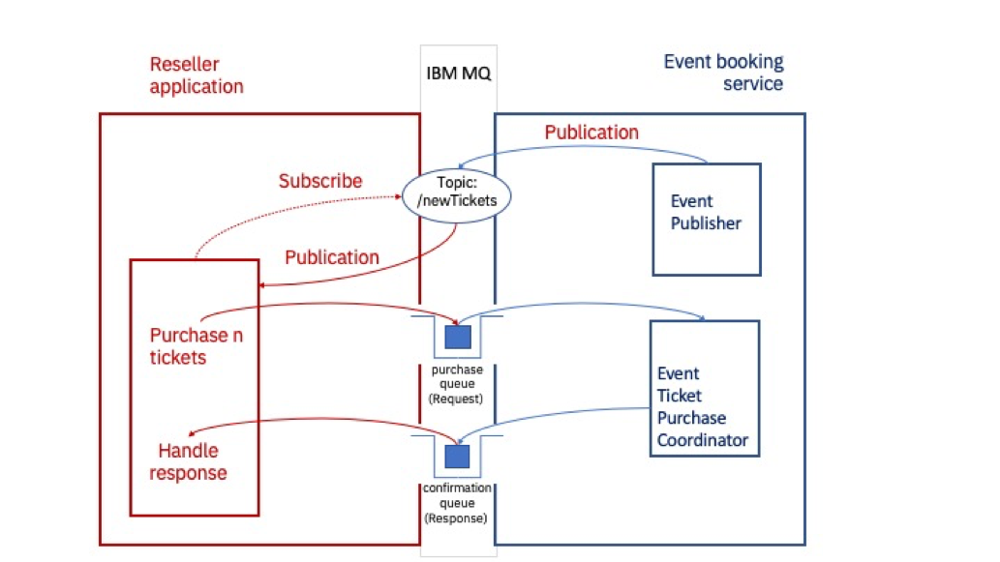
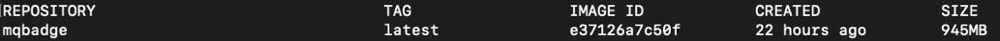
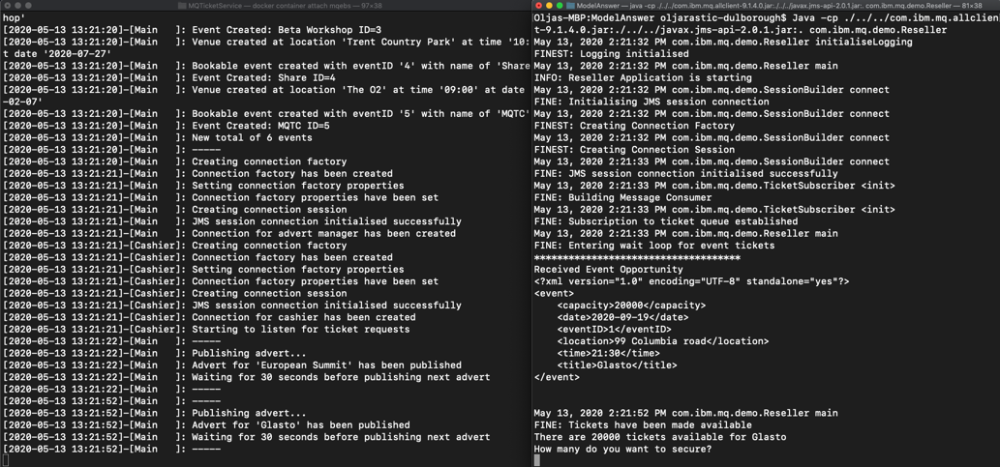
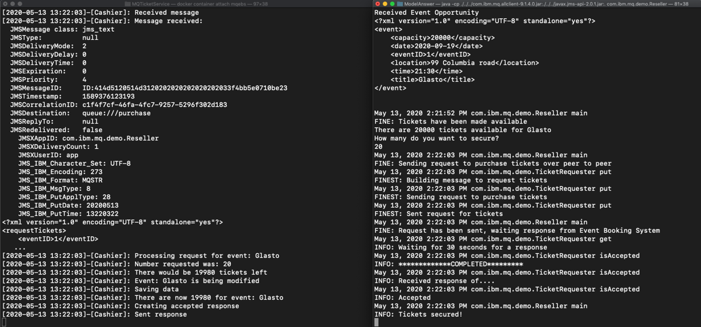
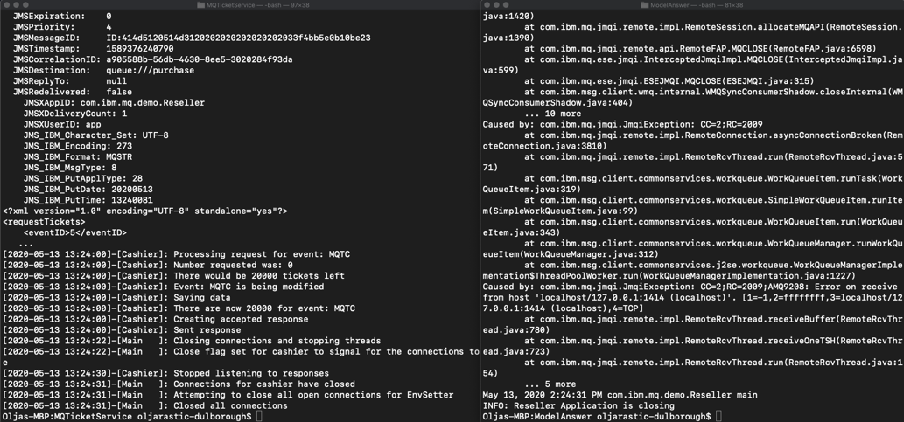

<!-- COMMENTED OUT WHEN EMBEDDED IN LEARNING PATH -->
<!-- <sidebar> <heading>Learning path: IBM MQ Developer Essentials Badge</heading> <p>This tutorial is part of the IBM MQ Developer Essentials learning path and badge.</p> <ul> <li> [IBM MQ fundamentals](/articles/mq-fundamentals/)</li><li> IBM MQ fundamentals (this article)</li><li> Get up and running with a queue manager using [MQ on Containers](/tutorials/mq-connect-app-queue-manager-containers/), or [MQ on Cloud](/tutorials/mq-connect-app-queue-manager-cloud/), or [MQ on Ubuntu](/tutorials/mq-connect-app-queue-manager-ubuntu/), or [MQ on  Windows](/tutorials/mq-connect-app-queue-manager-windows/). </li> <li> [Explore the MQ Console](/tutorials/mq-setting-up-using-ibm-mq-console/) </li> <li>[Get ready to code in Java](/tutorials/mq-develop-mq-jms/) </li><li> Take on the messaging coding challenge (this tutorial)</li> <li> [Debug your application or environment](/articles/mq-dev-cheat-sheet/)</li></ul></sidebar> -->

Dive in and see how simple a real-world messaging solution can be.

Follow the step-by-step instructions to develop a messaging app that interacts with a queue manager and apps that we've provided in a container.  Along the way, you'll master new messaging concepts and skills that you'll need to pass the quiz to earn the IBM MQ Developer Essentials badge.

## Prerequisites

To complete this challenge, you'll need the following in your local environment:

* Java Development Kit (JDK) to develop and run applications
* JMS classes, in the `JMS.jar` file
* IBM and IBM MQ classes for JMS, in the `com.ibm.mq.allclient.jar` file
* The `JmsPutGet.java` sample
* Sample code for this MQ Developer Challenge, in the `mq-dev-badge-sample`

## The challenge

Congratulations! You’ve just started a new job as a developer for a conference ticket reseller.

Your team lead has tasked you with creating a new messaging application that integrates with an MQ conference booking service and automates the ticket allocation process. This will ensure your new organization keeps pace with customer demand.
We’ve already built the event booking service, including a queue manager, and made it available as a Docker image. You just need to build the image and run it.

Then, for this challenge, you will be coding the reseller application. We have provided a Java application template in GitHub with comments and code stubs. You just need to fill in the gaps by coding the JMS and message processing parts of the scenario.

Your code will:

* **Connect** to a queue manager (the one we provided)
* **Subscribe** to the `newTickets` topic
* **Send** a `request message` to purchase a batch of tickets, **set** a `reply-to destination` and `message expiry` of 15 minutes (we don’t want to commit to a purchase indefinitely)
* **Get** a `response message` from the confirmation queue specified as the `reply-to destination`
* **Print** out the result

If you get stuck along the way, we’ve included a <a href="https://developer.ibm.com/articles/mq-dev-cheat-sheet/" target="_blank" rel="noopener noreferrer">_cheat sheet_</a> and packaged a <a href="https://github.com/ibm-messaging/mq-dev-badge-sample/tree/master/ModelAnswer/com/ibm/mq/demo" target="_blank" rel="noopener noreferrer">_model answer_</a> for reference.

We've provided three ways to engage with the challenge:

1. Write the code right now, as you go
2. Review the model answer application
3. Have a go at fixing a simple defect

## Messaging service architecture of the client app

When tickets become available for sale, the third-party service generates a reseller message to notify its subscribers (that’s you!).

Ticket resellers then request a batch of tickets for the conference event. Once tickets are allocated, the reseller is free to distribute to their customers.

Let’s take a look at the architecture diagram. Your will be building the reseller application.



Messages are published on the `newTickets` topic _every 30 seconds_ by the event booking service.

The message payload contains an `EventId` and the number of available tickets.

The Reseller application uses the received payload to construct a request message.
Finally, the booking service consumes from the purchase queue and responds to each message on the `JMSReplyTo` destination (confirmation queue) with a payload set, as follows:

`Accepted - <number_of_tickets_allocated>`
or
`Rejected - Sold out`

### Highlighting the client messaging app you'll create

You are creating the ticket reseller app, which is an IBM MQ client application.

To help you focus on your MVP (minimum viable product), this diagram shows the elements of the IBM MQ JMS app that you have to create in relation to the MQ server and the reseller service we’ve provided in a Docker container. The main client app actions are named and numbered.


When you've completed coding your application, your application will:

1. Connect to a queue manager
2. Subscribe to a topic
    * Receive a publication
    * Process a publication
    * On receiving a publication, construct and send a request message to the purchase queue to purchase zero or more tickets. Request message has properties:
        * says how many tickets to ask for
        * for a given `EventID`
        * sets a `reply-to destination` for the confirmation (the response)
        * sets `message expiry` to 15 minutes
3. Puts the request message to a purchase (request) queue
    * (The ticket purchase coordinator app does a get from this queue)
    * (Processes the message and allocates a number of tickets, if any are available)
    * (Put a message to the confirmation (response) queue. Response message has properties:
        * says how many tickets have been allocated, if any
        * for a given `EventID`
4. Does a get from the response queue
5. Prints how many event tickets have been purchased

The following behavior is required from the client messaging app:

* Handle a published a message on the `newTickets` topic every 30 seconds.
* Provide the prompt to ask the user how many of the available tickets they want to purchase.
* Handle the response that the conference event booking service provides after processing your request message.
* Print the outcome of the response to `stdout`.

## Check your prereqs

First, let's check that you have the Java Development Kit installed.  Issue this command:

```
java -version
```

You should see output similar to:


You need JDK 8, `1.8.n_nnn`.

If you don't have Java installed, go to the <a href="https://adoptopenjdk.net/installation.html" target="_blank" rel="noopener noreferrer nofollow">_OpenJDK_ page</a>, select OpenJDK 8 and your platform. On some platforms, you can pull in and install it using the command line. Just make sure to get the JDK (Java Development Kit), for developing, not just the JRE (Java Runtime Environment).

If you completed the [first tutorial in this learning path](/learningpaths/ibm-mq-badge/write-run-first-mq-app/), you should already have the JDK (Java Development Kit) and the MQClient directory with the `com.ibm.mq.allclient.jar` and `javax.jms-api-2.0.1.jar` files. You’ll need these `.jar` files to run the challenge app. If you have JDK and `.jar` files in the MQClient directory, you can skip to the next step, [getting the challenge code](#get-the-challenge-code).

If you did not complete that tutorial, let's get you set up:

1. Create the MQClient directory to save the files needed for the sample, for example in your home directory:

    ```
    mkdir MQClient
    ```

2. Change to the `MQClient` directory, and pull in the `com.ibm.mq.allclient.jar` file by using `curl`.

    ```
    curl -o com.ibm.mq.allclient-9.1.4.0.jar https://repo1.maven.org/maven2/com/ibm/mq/com.ibm.mq.allclient/9.2.3.0/com.ibm.mq.allclient-9.2.3.0.jar
    ```

3. From the `MQClient` folder, pull in the JMS `.jar` file by using `curl`.

    ```
    curl -o javax.jms-api-2.0.1.jar https://repo1.maven.org/maven2/javax/jms/javax.jms-api/2.0.1/javax.jms-api-2.0.1.jar
    ```

## Get the challenge code

You need to download the badge challenge code, which is stored in the <a href="https://github.com/ibm-messaging/mq-dev-badge-sample" target="_blank" rel="noopener noreferrer">_ibm/messaging/mq-dev-badge-sample_</a>Github repository.

Go to our ibm/messaging/mq-dev-badge-sample repository in Github, and click the clone or download button. You can choose to Clone with SSH, Use HTTPS, or Download ZIP with the code. Clone or unzip the repository into the MQClient directory.

1. Once you have the code locally, change to the sample code directory:

    `cd mq-dev-badge-sample`

2. Run the print-working-directory command to make sure you’re in the right place:

    `pwd`

    You should see your path ending in:

    `~/MQClient/mq-dev-badge-sample`

    On Windows, you should see your path ending in:

    `~\MQClient\mq-dev-badge-sample`

3. Type ls to list the contents of the directory:

    `ls`

    You should see these directories and files:

   `├-- MQTicketService
    │   ├-- Dockerfile
    │    .
    │    .
    │   └-- TicketGenerator
    ├-- ModelAnswer
    ├-- ModelAnswerWithDefectToFix
    └-- TicketReseller`

The `MQTicketService` directory has the `Dockerfile` with the definition for building an image and standing up a container with the MQ server (queue manager). It also has the `TicketGenerator` with the Java code for the apps/services that will interact with your app when you code and run it. The server-side apps get started inside the container at the same time as the queue manager.

## Standing up the Event Booking system

Before you get started coding your reseller app, let’s see how the server-side or the event booking service works.

First, we’ll build a Docker image and run the container with MQ and the app that publishes ticket availability and responds to requests from your app.

Once we see it work, we’ll let it end and restart it later once we’re ready to test the challenge app.

Follow these steps to stand up the event booking service:

1. From inside the mq-dev-badge-sample directory, change to the MQTicketService directory:

    ```
    cd MQTicketService
    ```

2. Our `Dockerfile` in this location has everything defined to run MQ inside the container as well as run the publisher and response apps. Run the command to build the image:

    ```
    docker build . -t mqbadge:latest
    ```

3. Docker will pull all the prerequisites and build the image. When it is done, check that you have the built image `mqbadge`:

    ```
    docker images
    ```

    You'll see:
    

7. Run the container from the image:

    ```
    docker run -e LICENSE=accept -e MQ_QMGR_NAME=QM1 -e LOG_FORMAT=json -e MQ_APP_PASSWORD=passw0rd -p 1414:1414 -p 9443:9443 -ti --name mqebs mqbadge:latest
    ```

    Very quickly you’ll see the output from the container starting in your command line. Look out for events starting to be published:
    

The event booking system is now running inside the container. Note that the container was started without the `--detach` option so that the logs are displayed to screen while the container is running.

The container process includes:

* The **publisher app**, which sends a publication about available tickets every 30 seconds
* **Ticket purchase coordinator**, which processes purchase requests and allocates a batch of tickets.  
    **Important:** This is the core of the event booking business where purchase requests are processed, and tickets are allocated. IBM MQ Messaging performs a crucial role within the conference event processing code, providing assured delivery of high value messages between the conference event booking service and ticket resellers. It’s vital that the conference event booking business get this right as overselling tickets or failing to respond to requests would be damaging to their reputation.
* **IBM MQ server**, which is the queue manager that hosts the **subscription topic** `newTickets`, the **purchase queue** for request messages, and the **confirmation queue** for response messages.

Queues were created administratively by running <a href="https://www.ibm.com/docs/ibm-mq/latest?topic=reference-runmqsc-run-mqsc-commands" target="_blank" rel="noopener noreferrer">_MQSC_ commands</a> when the Docker container started.
Queue objects can also be created with the MQ Console, using the <a href="https://www.ibm.com/docs/ibm-mq/latest?topic=api-getting-started-administrative-rest" target="_blank" rel="noopener noreferrer">_MQ REST interface_</a> or programatically.

You are now ready to start developing your reseller application. But first, let's see how the ModelAnswer app works with the event booking service.

## Run the ModelAnswer app to see it in action

Open another terminal, and change to the `MQClient/mq-dev-badge-sample/ModelAnswer` directory.

From that directory, run the command to compile the application:

`javac -cp ../../com.ibm.mq.allclient-9.2.3.0.jar:../../javax.jms-api-2.0.1.jar com/ibm/mq/demo/*.java`

On Windows, this command is:

`javac -cp ..\..\com.ibm.mq.allclient-9.2.3.0.jar;..\..\javax.jms-api-2.0.1.jar com\ibm\mq\demo\*.java`

This command only works if you have the `.jar` files in the `MQClient` directory.  See the [Check your prereqs](#check-your-prereqs) and [Get the challenge code](#get-the-challenge-code) sections to ensure your code is set up correctly.

Check that the app compiled correctly by looking at the files: `ls com/ibm/mq/demo`.

You should see the compiled classes along with the java files:


Go back to the original terminal window where the container with the service had stopped.

Arrange the two terminal windows side by side so you can easily interact with both.


In the Docker container terminal on the left, you need to restart the container and see the output from the server and the app running.  Start the container:

```
docker restart mqebs
```

Get the output from the container in the terminal:

```
docker container attach mqebs
```

In the terminal on the right, get the command ready to run the ModelAnswer application, but wait for the events in the server terminal to start appearing before entering the command:

`java -cp ../../com.ibm.mq.allclient-9.2.3.0.jar:../../javax.jms-api-2.0.1.jar:. com.ibm.mq.demo.Reseller`

On Windows, this is the command:

`java -cp ..\..\com.ibm.mq.allclient-9.1.4.0.jar;..\..\javax.jms-api-2.0.1.jar;. com.ibm.mq.demo.Reseller`


Now when you run the command to start the ModelAnswer application you should see:


Once the next set of available tickets is published, you should see the prompt in the ModelAnswer terminal asking for a number of tickets you want to secure:



Enter a number of tickets you want to reserve in the ModelAnswer app terminal.  You should see the exchange messages in both the terminals.



The container will exit once there are no more ticket events to publish.


The ModelAnswer app will not exit till you enter a number of tickets for the last event advertised. You should then see the app disconnect because apps in the container also disconnected and the MQ queue manager stopped threads and closed connections.



Now that you've seen how the app and the service interact, go ahead and write your own Java code in the `TicketReseller` directory, or fix the defect and get things to work in the `ModelAnswerWithDefectToFix` directory.

## Coding your reseller application

For convenience, you might want to use a Java IDE such as <a href="https://www.eclipse.org/downloads/" target="_blank" rel="noopener noreferrer nofollow">_Eclipse_</a>. Alternatively, you can develop your code in your favorite editor such as <a href="https://atom.io/" target="_blank" rel="noopener noreferrer nofollow">_Atom_</a>.

In the editor of your choice, open either the `TicketReseller` or the `ModelAnswerWithDefectToFix` directory.

The sample code is broken down into multiple classes. To complete the challenge, you need to make code updates to these classes:

* `SessionBuilder.java`
* `TicketSubscriber.java`
* `TicketRequester.java`

The comments in the stubs of these classes should guide you on what needs to be done. Refer to the previous sections for what your app needs to do, for help in compiling, and for examples of how the apps work.

### Need to debug?

Did something go wrong?  Take a look at the <a href="https://developer.ibm.com/articles/mq-dev-cheat-sheet/" target="_blank" rel="noopener noreferrer">_cheat sheet_</a>.

## Enhancing your application

To learn more about production-ready client messaging applications, you need to consider security and message persistence.  You might also consider the transactionality of your messages.

### Why use messaging?

The conference event system and reseller applications are loosely coupled. Asynchronous messaging allows us to integrate these components and build in a buffer, or shock absorber. Should either component lose connectivity, fail or experience fluctuations in throughput, the messaging layer will deal with any instability. Our application code is simplified as the messaging layer takes care of the difficult stuff like security, recovery and persistence of message exchange between the components.

The messaging API provides a framework so that our reseller application logic is driven when a message is delivered rather than continually polling the server to check for work. This removes unnecessary load from the network and conference event application. IBM MQ allows the solution to scale as demand increases.

#### Publish/subscribe messaging style

Publish/subscribe is one of the messaging styles that IBM MQ implements. The other is point-to-point. In point-to-point, messages are exchanged between two single applications. In publish/subscribe, one or many publishers can publish to one or many subscribers to a topic.

Here's how the publish/subscribe messaging style is implemented in our solution:


The event booking service is the publisher, and your reseller app is one of the subscribers. Let's talk through the other components in this messaging style:

* Topics are objects and they have properties.
* The key property of a topic is a topic string.
* Messages are published to a topic string by a publisher.
* Each publication is to a single topic string. Subscribers register an interest in, or subscribe to, a topic string.
* When a publisher publishes a message to a topic string, one or more subscribers for that topic string receives the publication message.
* A JMS application can use the JMS destination object which maps to a topic in the same way as it would use the destination to map to a queue, in a point to point scenario. For the publication to reach the subscriber successfully, both the publisher and the subscriber must match same topic string. The subscriber will get publications only from the time they subscribe to a topic.
* If a publication is sent before the subscription by a specific application is created, that application will not get it.

#### Request/Response messaging pattern

Request response or request reply is an integration or messaging pattern where the application that sends a message to another application, requires a reply of some sort from the receiving application. This is often based on the point to point messaging style and can be synchronous (the sending application waits for the response before it times out) and asynchronous (also called request/callback, where the sending application disconnects but sets up a callback to handle a reply).

Your reseller app is the sender app, and the event booking service is the receiver app.


The sending application usually sets a reply-to-destination and a correlation-id so that a response can get back to the right sender application.

For the event booking service the reply-to destination has been defined administratively on the queue manager. However, the requester could dynamically create a temporary destination from its JMS session to complete the exchange.

### Securing your application

Find out how you can configure your queue manager and client application to <a href="https://developer.ibm.com/tutorials/mq-secure-msgs-tls/" target="_blank" rel="noopener noreferrer">_use TLS to encrypt messages_</a> as they flow between the server and the client, over the internet.

### Setting message persistence in your application

It is important to consider message persistence when designing an application. IBM MQ supports persistent and non-persistent messaging. In our event booking scenario, we use persistent messaging as the default setting on the pre-defined MQ queues.

Critically, in the event of a system outage, non-persistent messages may be lost following recovery. While in most cases non-persistent messaging might provide for faster exchange of messages, it’s not the right solution for all applications.

For example, persistence might be of importance for a high value message, but less so for a scenario where information messages are transmitted continually. In the latter cases, the system design might tolerate some level of message loss.

You can read more about message persistence in the <a href="https://www.ibm.com/docs/en/ibm-mq/9.0?topic=messages-message-persistence" target="_blank" rel="noopener noreferrer">_IBM MQ Docs_</a>.

### What about the transactionality of my messages?

Often production applications are more sophisticated than our sample, with each interaction involving multiple resources, such as messages or database updates, being coordinated as a single atomic operation. Resources that are managed in this way are said to occur within a unit of work, or a transaction.

For example, a simple banking transaction might require one account to be debited by $100 and another credited by the same amount.
A transactional coordinator is used to ensure that either both operations complete successfully, or none of them complete at all.

As application complexity increases, enterprise scale frameworks are used to coordinate transactions across multiple applications or back end systems.  Enterprise scale frameworks such as those provided by:
* <a href="https://openliberty.io/" target="_blank" rel="noopener noreferrer nofollow">_Open Liberty_</a>, which is an IBM Open Source Project
* <a href="https://www.ibm.com/cloud/websphere-application-platform" target="_blank" rel="noopener noreferrer">_IBM WebSphere Application Server_</a>
* <a href="https://spring.io/" target="_blank" rel="noopener noreferrer nofollow">_Spring_</a>

### Focusing on app performance

If you want to make sure your application is going to perform reliably and well, have a look at these <a href="https://developer.ibm.com/articles/mq-best-practices/" target="_blank" rel="noopener noreferrer">_best practices_ for developers</a>.

## Summary

Congratulations!  You've checked out our [GitHub repository](https://github.com/ibm-messaging/mq-dev-badge-sample) with three ways to engage with our sample. Be sure that you've checked out the MQ developer cheat sheet, because it's packed full of ninja moves that every MQ developer should know.