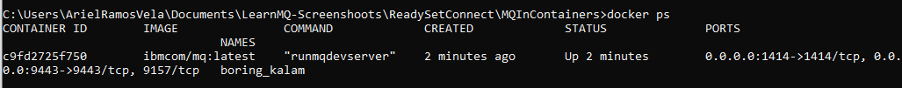

<!--ラーニングパスに組み込まれている場合はコメントアウトされます -->。
<!-- <sidebar> <heading>ラーニングパス。     IBM MQ Developer Essentials Badge</heading>
このシリーズは、IBM MQ Developer Essentialsのラーニングパスとバッジの一部です。
<ul><li>[IBM MQ fundamentals](/articles/mq-fundamentals/)</li><li>MQ on Containersを使ってキュー・マネージャーを立ち上げて実行する（このチュートリアル）。または[MQ on Cloud](/tutorials/mq-connect-app-queue-manager-cloud/)、[MQ on Ubuntu](/tutorials/mq-connect-app-queue-manager-ubuntu/)、または[MQ on Windows](/tutorials/mq-connect-app-queue-manager-windows/)を使用します。</li> <li>[Explore the MQ Console](/tutorials/mq-setting-up-using-ibm-mq-console/) </li> <li>[Get ready to code in Java](/tutorials/mq-develop-mq-?jms/) </li><li> [Take on the messaging coding challenge](/tutorials/mq-badge-mq-dev-challenge/)</li> <li> [Debug your application or environment](/articles/mq-dev-cheat-sheet)</li></ul></sidebar> -->

IBM MQがどのように機能するかを確認するために、キュー・マネージャー（サーバー）の作成と構成を案内します。その後、アプリケーション（クライアント）を接続します。

このチュートリアルを終了すると、キューにメッセージを送信したり、キューからメッセージを取得することができるようになります。

IBM MQ キュー・マネージャー（サーバー）は、さまざまな方法でダウンロード、インストール、および実行することができます。

* コンテナの中（このチュートリアル）。
* <a href="https://developer.ibm.com/tutorials/mq-connect-app-queue-manager-cloud/" target="_blank" rel="noopener noreferrer">_IBM Cloud_</a>の中で。
* 様々なOS上で。<a href="https://developer.ibm.com/tutorials/mq-connect-app-queue-manager-ubuntu/" target="_blank" rel="noopener noreferrer">_Linux/Ubuntu_</a> または <a href="https://developer.ibm.com/tutorials/mq-connect-app-queue-manager-windows/" target="_blank" rel="noopener noreferrer">_Windows_</a>。

MacOSの場合は、MQ on Containersをご利用ください。

## 学習目標

このチュートリアルを終了すると、以下の概念を理解することができます。

* IBM MQ キュー・マネージャー
* IBM MQ キュー
* ポイント・ツー・ポイント・メッセージング

## 前提条件

* Docker Community Edition、バージョン17.06以降
* Docker HubからのIBM MQ Dockerイメージ

## 見積もり時間

このチュートリアルの所要時間は約30分です。

## ステップ

1. [Dockerのインストール](#step-1-install-docker)
2.[MQのDockerイメージの取得](#step-2-get-the-mq-in-docker-image)
3.[イメージからコンテナを実行](#step-3-run-the-container-from-the-image)
<!-- 4. [メッセージの送信と受信](#step-4-put and get-a-messageusing-the-mq-console) -->

MQをコンテナにインストールする方法をビデオで見たい方は、こちらをご覧ください。

<iframe width="560" height="315" src="https://www.youtube.com/embed/xBX1P9OUteg" frameborder="0" allow="accelerometer; autoplay; clipboard-write; encrypted-media; gyroscope; picture-in-picture" allowfullscreen></iframe>

### Step 1.Dockerのインストール

すでにDockerをシステムにインストールしている場合は、どのバージョンがインストールされているかを確認します。  Docker のバージョンが `docker` や `docker-engine` と呼ばれている場合は、これらをアンインストールしてから、最新の `docker-ce` をインストールしてください。

1. <a href="https://hub.docker.com/search/?type=edition&offering=community" target="_blank" rel="noopener noreferrer nofollow">_Docker Hub_</a>から、Docker Community Edition（バージョン17.06以降）をダウンロードします。

2.<a href="https://docs.docker.com/get-docker/" target="_blank" rel="noopener noreferrer nofollow">_installation documentation_</a>の指示に従って、Dockerをインストールします。

### ステップ2.MQをDockerイメージで取得する

コンテナはイメージから実行され、イメージはDockerfileに記載された仕様から構築されます。ここでは、イメージを構築しなくても、コンテナを実行するだけで済むように、Docker Hubから事前に構築されたIBM MQサーバー・イメージを使用します。  最終的には、MQのインストールと、開発者が作業するためのオブジェクトが事前に設定されたキュー・マネージャーが完成します。

1. Docker HubからMQサーバの最新バージョンを含むイメージを取り出します。

2.完了したら、どのイメージを持っているか確認します。

    このような出力が表示されるはずです。

### ステップ3.イメージからコンテナを実行する

MQサーバーのイメージがローカルのDockerリポジトリに入ったので、コンテナを実行してRHELのMQをコンテナで立ち上げます。

コンテナを立ち上げる際には、コンテナが削除されると削除されるメモリ内ファイルシステムが使用されます。キューマネージャーとキューのデータはこのファイルシステムに保存されます。キュー・マネージャーとキューのデータを失わないために、Dockerボリュームを使用することができます。

ボリュームは、コンテナの実行時にコンテナに添付され、コンテナが削除された後も持続します。新しいコンテナを実行するときに、既存のボリュームをアタッチして、後でキュー・マネージャーとキュー・データを再利用することができます。

1. Dockerを使用してボリュームを作成します。

2.MQサーバーコンテナを実行します。****このコマンドを編集して、アプリケーションに接続するための独自のパスワードを設定してください。**** このパスワードは、後にクライアントのデモアプリケーションと独自のクライアントアプリケーションを実行する際に必要になります。この例では、パスワードを「passw0rd」に設定していますが、任意のパスワードを設定することもできます。

キュー・マネージャーには、最初のクライアント・アプリケーションを接続するための簡単なデフォルト設定がなされています。

例えば、IBM MQ Advanced for developers のライセンスを受け入れることや、キューを常駐させるキューマネージャーの名前を "QM1" とすることなど、パラメータを docker run コマンドに追加しています。

MQ はコンテナ内で実行されているため、他の世界から隔離されていることになるので、MQ が使用するいくつかのポートを開きました。

キューマネージャーのリスナーは、ポート 1414 で着信接続を待ち、ポート 9443 は MQ コンソールが使用します。

MQデモのクライアントアプリケーションは、リスナーポートを使用し、MQコンソールのダッシュボードは、ポート9443でブラウザで見ることができます。

コンテナが起動するのを待ってから、起動していることを確認します。

このような出力が表示されるはずです。

おめでとうございます。あなたは、最初のシンプルなキュー・マネージャーを作成しました。これは QM1 と呼ばれ、コンテナの中で実行されています。

このキュー・マネージャーにアクセスするためには、TCP/IP で接続することになり、そのためにポート 1414 を公開する必要があります。

自分のコンテナIDをメモしておいて、それを使ってコンテナ内のコマンドラインにアクセスします。例えば、以下のようになります。

このような出力が表示されるはずです。

コマンドラインインターフェイスで`dspmqver`コマンド（MQのバージョンを表示）を実行すると、MQのインストールとデータパスを表示することができます。  

このような出力が表示されるはずです。

`dspmq`コマンドを使って、実行中のキューマネージャーを表示することができます。  

このような出力が表示されるはずです。

Dockerコンテナから出てコマンドラインに戻るには、`exit`と入力して**Enter**を押します。

#### これまでに行ってきたこと

**事前に構築されたDockerイメージ**をダウンロードし、**コンテナ**を実行して、RHEL上でMQを動作させました。**クライアントアプリケーションがキューマネージャーに接続し、キューとの間でメッセージを送受信するために必要なIBM **MQオブジェクトとパーミッション**は自動的に作成されます**。DockerとMQはあなたのホストコンピュータのリソースと接続性を使用しています。

コンテナの中では、RHEL上のMQインストールは以下のオブジェクトを持っています。

* `キューマネジャ QM1`
* `キューDEV.QUEUE.1`.
* Channel:チャンネル: `dev.app.svrconn`
* リスナーです。ポート1414の`SYSTEM.LISTENER.TCP.1`。

使用する**キュー**、**DEV.QUEUE.1**は、**キューマネージャーQM1**に「住んで」います。**QM1**にはリスナー**があり、例えばポート1414**への接続を監視します。****クライアント・アプリケーションはキュー・マネージャに接続することができ、 **メッセージをオープン、プット、ゲットしたり、キューをクローズしたりすることができます**。

アプリケーションは、キューイングマネージャに接続するために **MQチャンネル** を使用します。これらの3つのオブジェクトへのアクセスは、異なる方法で制限されています。**例えば、**グループ "mqclient "のメンバーである**ユーザー "app "は、チャンネル`DEV.APP.SVRCONN`を使用してキューマネージャー`QM1`に接続することが許可されており、キュー`DEV.QUEUE.1`**にメッセージを入れたり、キューからメッセージを取得することが許可されています。

クライアントアプリケーションが必要とするすべてのMQオブジェクトとパーミッションは、MQサーバコンテナの実行時に作成および構成されます。

<!--STEP4は別のチュートリアルで取り上げられるようになりました....-->
<!-- ### ステップ4.MQコンソールを使ってメッセージを入れたり取得したりする

MQコンソールは、MQオブジェクトを操作するためのWebブラウザベースのインターフェースです。MQコンソールは、開発者版MQのコンテナ内にあらかじめ設定されています。

管理者は、MQコンソールを使用してキュー・マネージャを管理します。  開発者は、MQコンソールを使用して、クライアントアプリケーションのテストとデバッグを行うことができます。

キューにアクセスしてメッセージを置いたり取得したりする方法については、[このチュートリアルのステップ2と3](/tutorials/mq-setting-up-using-ibm-mq-console/)を参照してください。

<!--最初にMQコンソールが使用するポート9443を割り当てましたので、ローカルシステムのブラウザで[https://localhost:9443/ibmmq/console/](https://localhost:9443/ibmmq/console/)を指定すれば、キューマネージャーQM1を見ることができます。クラウドプラットフォームを使用している場合は、`localhost:9443`をクラウドデプロイメントのエンドポイントに置き換えてください。

では、MQコンソールを使って、キューにメッセージを入れたり、取得したりしてみましょう。

1. ユーザー「admin」、パスワード「passw0rd」でMQコンソールにログインします。
「2.Home」アイコンの下にある「**Manage**」をクリックします。QM1のリソースを表示するページが開きます。
3.QM1リソースのページで、`DEV.QUEUE.1`をクリックします。
4.Local queue `DEV.QUEUE.1` ページで **Create** ボタンをクリックすると、キューにメッセージが入ります。
5.5. メッセージインターフェースの **Application data** フィールドに `Hello World` と入力します。そして，**Create**をクリックする．
6.作成したメッセージがキューページの行として表示される。
7.7. 右上の3つの縦のドットをクリックして、オプションメニューを開きます。
8.8. **Clear messages** をクリックして、キューをクリアする。-->

## まとめ

このチュートリアルでは、MQキュー・マネージャーをコンテナ内に立ち上げました。このコンテナには、クライアントからの接続を許可するための開発者用設定がプリセットされています。

キュー・マネージャーに接続する独自のクライアント・アプリケーションを開発する際には、以下の手順に従ってください。

1. 1. キュー・マネージャーへの接続を設定する。
2.キューを開く。
3.メッセージをキューに入れる。
4.キューからメッセージを取得する。
5.キュー・マネージャーへの接続を閉じる。

このプロセスは、**ポイントツーポイントスタイルのメッセージング**を示しています。

**IBM MQでは、キュー・マネージャーはシステムの実質的なサーバー**であり、キュー・マネージャーに接続する**アプリケーションはクライアント**です。

通常、すべてのMQオブジェクトが定義され、メッセージのルーティングが行われるMQサーバーを管理するのは、管理者です。クライアント・アプリケーションは開発者によって作成され、IBM MQは開発者がアプリケーションに組み込む必要のあるクライアント・ライブラリーを提供します。これらのライブラリはMQクライアントとも呼ばれ、管理者がMQサーバー側で設定したMQオブジェクトをアドレスして使用します。より複雑なシナリオでは、MQライブラリが重いメッセージング作業のほとんどを代行してくれるので、使い方を覚えるだけで十分です。

****メッセージングを動作させるためには、サーバー側とクライアント側の両方で設定が必要です。

MQクライアントアプリケーションの開発を始めたばかりの頃は、クライアントアプリケーションをテストするために、自分のキューマネージャとキューにアクセスする必要があります。事前に設定されたMQ in Dockerイメージと、そこから簡単に実行できるコンテナにより、キュー・マネージャへのアクセスが可能になり、独自のMQアプリケーションの開発を始める際に、MQオブジェクトを設定するための多くのオプションが提供されます。