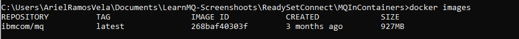

<!-- COMMENTED OUT WHEN EMBEDDED IN LEARNING PATH -->
<!-- <sidebar> <heading>Learning path:     IBM MQ Developer Essentials Badge</heading><p>This series is part of the IBM MQ Developer Essentials learning path and badge.</p><ul><li>[IBM MQ fundamentals](/articles/mq-fundamentals/)</li><li> Get up and running with a queue manager using MQ on Containers (this tutorial), or [MQ on Cloud](/tutorials/mq-connect-app-queue-manager-cloud/), [MQ on Ubuntu](/tutorials/mq-connect-app-queue-manager-ubuntu/), or [MQ on  Windows](/tutorials/mq-connect-app-queue-manager-windows/). </li> <li> [Explore the MQ Console](/tutorials/mq-setting-up-using-ibm-mq-console/) </li> <li>[Get ready to code in Java](/tutorials/mq-develop-mq-jms/) </li><li> [Take on the messaging coding challenge](/tutorials/mq-badge-mq-dev-challenge/)</li> <li> [Debug your application or environment](/articles/mq-dev-cheat-sheet)</li></ul></sidebar> -->

To see how IBM MQ works, you will be guided through creating and configuring a queue manager (server). Then, you will connect an application (client) to it.

After completing the tutorial, you will be able to send messages to and retrieve messages from a queue.

You can download, install, and run IBM MQ queue manager (server) in a variety of ways:

* In a container (this tutorial).
* In the <a href="https://developer.ibm.com/tutorials/mq-connect-app-queue-manager-cloud/" target="_blank" rel="noopener noreferrer">_IBM Cloud_</a>.
* On various operating systems: <a href="https://developer.ibm.com/tutorials/mq-connect-app-queue-manager-ubuntu/" target="_blank" rel="noopener noreferrer">_Linux/Ubuntu_</a> or <a href="https://developer.ibm.com/tutorials/mq-connect-app-queue-manager-windows/" target="_blank" rel="noopener noreferrer">_Windows_</a>.

For MacOS, use MQ on Containers.

## Learning objectives

After completing this tutorial, you will understand these concepts:

* IBM MQ queue managers
* IBM MQ queues
* Point-to-point messaging

## Prerequisites

* Docker Community Edition, version 17.06 or later
* The IBM MQ Docker image from Docker Hub

## Estimated time

This tutorial should take about 30 minutes.

## Steps

1. [Install Docker](#step-1-install-docker)
2. [Get the MQ in Docker image](#step-2-get-the-mq-in-docker-image)
3. [Run the container from the image](#step-3-run-the-container-from-the-image)
<!-- 4. [Put and get a message](#step-4-put-and-get-a-message-using-the-mq-console) -->

If you'd rather watch a video to learn how to install MQ in a container, you can watch this one.

<iframe width="560" height="315" src="https://www.youtube.com/embed/xBX1P9OUteg" frameborder="0" allow="accelerometer; autoplay; clipboard-write; encrypted-media; gyroscope; picture-in-picture" allowfullscreen></iframe>

### Step 1. Install Docker

If you have already installed Docker on your system, check to see what version is installed.  If your Docker version is called `docker` or `docker-engine`, you must uninstall these before installing the latest `docker-ce` version.

1. Download Docker Community Edition, version 17.06 or later, from <a href="https://hub.docker.com/search/?type=edition&offering=community" target="_blank" rel="noopener noreferrer nofollow">_Docker Hub_</a>.

2. Follow the instructions in the <a href="https://docs.docker.com/get-docker/" target="_blank" rel="noopener noreferrer nofollow">_installation documentation_</a> to install Docker.

### Step 2. Get the MQ in Docker image

Containers are run from images and images are built from a specification listed in a Dockerfile. We will use a pre-built IBM MQ server image from Docker Hub so that we can just run our container without having to build an image.  We will end up with a working MQ installation and a queue manager that is pre-configured with objects ready for developers to work with.

1. Pull the image from Docker hub that contains the latest version of the MQ server:

    ```
    docker pull ibmcom/mq:latest
    ```

2. When it's done, check which images you have:

    ```
    docker images
    ```

    You should see output like this:



### Step 3. Run the container from the image

Now that the MQ server image is in your local Docker repository, you can run the container to stand up MQ in RHEL in a container.

When you stand up a container, an in-memory file system is used that is deleted when the container is deleted. Queue manager and queue data is saved in this file system. To avoid losing the queue manager and queue data, we can use Docker volumes.

Volumes are attached to containers when they are run and persist after the container is deleted. When you run a new container you can attach an existing volume and later reuse your queue manager and queue data.

1. Use Docker to create a volume:

    ```
    docker volume create qm1data
    ```

2. Run the MQ server container. **Edit the command to set your own password for connecting applications.** You will need this password later, for both the client demo application and when you run your own client applications. In this example, we're setting the password to "passw0rd" but you can also choose your own:

    ```
    docker run --env LICENSE=accept --env MQ_QMGR_NAME=QM1 --volume qm1data:/mnt/mqm --publish 1414:1414 --publish 9443:9443 --detach --env MQ_APP_PASSWORD=passw0rd ibmcom/mq:latest
    ```

Your queue manager has been set up with some simple default configuration to help you connect your first client application.

We've added parameters to the docker run command, for example to accept the license for IBM MQ Advanced for developers and name the queue manager "QM1" where our queue will live.

Because MQ is running inside a container, it would be isolated from the rest of the world, so we've opened a couple of ports that MQ uses.

The queue manager's listener listens on port 1414 for incoming connections and port 9443 is used by MQ console.

The MQ demo client application will use the listener port and MQ Console dashboard can be seen in your browser on port 9443.

Give the container a moment to start, and then check that it's running:

```
docker ps
```

You should see output like this:


Congratulations! You've just created your first simple queue manager. It's called QM1 and it's running inside the container.

To access this queue manager, you'll be connecting over TCP/IP, which is why you needed to expose the port 1414.

Make a note of your own container ID, and use it to get command line access inside the container. For example:

```
docker exec -ti <your container id> /bin/bash
```

You should see output like this:


You can display the MQ installation and data paths by running the `dspmqver` command (display MQ version) in your command line interface.  

```
dspmqver
```

You should see output like this:


You can display your running queue managers using the `dspmq` command.  

```
dspmq
```

You should see output like this:


To come out of the Docker container and return to your command line, type `exit` and press **Enter**.

#### What you've done so far

You **downloaded the pre-built Docker image** and **ran the container** to get MQ running on RHEL. The IBM **MQ objects and permissions** that the client applications need to connect to a queue manager and to be able to put and get messages to and from the queue **are created automatically**. Docker and MQ are using your host computer resources and connectivity.

Inside the container, the MQ installation on RHEL has the following objects:

* `Queue manager QM1`
* `Queue DEV.QUEUE.1`
* Channel: `DEV.APP.SVRCONN`
* Listener: `SYSTEM.LISTENER.TCP.1` on port 1414

The **queue** that you will be using, **DEV.QUEUE.1**, "lives" on the **queue manager QM1**. The **queue manager also has a listener** that listens for incoming connections, for example, **on port 1414**. **Client applications can connect** to the queue manager and **can open, put, and get messages, and close the queue**.

Applications use an **MQ channel** to connect to the queue manager. Access to these three objects is restricted in different ways. For example, **user "app", who is a member of the group "mqclient" is permitted to use the channel `DEV.APP.SVRCONN` to connect to the queue manager `QM1` and is authorized to put and get messages to and from the queue `DEV.QUEUE.1`**.

All the MQ objects and permissions that the client application needs are created and configured when you run the MQ server container.


<!-- STEP 4 is now covered in a separate tutorial.... -->
<!-- ### Step 4. Put and get a message using the MQ Console

The MQ Console is a web browser based interface for interacting with MQ objects. It comes pre-configured inside the developer version of MQ in a container.

Administrators use the MQ Console to administer queue managers.  Developers can use the MQ Console to test and debug client applications.

To learn how to access and put and get a message on the queue, follow [steps 2 and 3 of this tutorial](/tutorials/mq-setting-up-using-ibm-mq-console/).

<!-- We assigned port 9443 for the MQ Console to use at the start, so if you point a browser on your local system to [https://localhost:9443/ibmmq/console/](https://localhost:9443/ibmmq/console/) you’ll be able to take a look at your queue manager QM1. If you are using a cloud platform, substitute `localhost:9443` for your cloud deployment endpoint.

Now, let's use the MQ Console to put and get a message on the queue:

1. Log in to the MQ Console with user “admin” and password “passw0rd”.
2. Click **Manage** below the Home icon. A page will open showing your QM1 resources
3. In the QM1 resources page, click `DEV.QUEUE.1`.
4. In the Local queue `DEV.QUEUE.1` page, click the **Create** button to put a message on the queue.
5. In the message interace, type `Hello World` in the **Application data** field. Then, click **Create**.
6. View your message as a row on the queue page.
7. Click the three vertical dots in the top right corner to open the options menu.
8. Click **Clear messages** to clear the queue. -->

## Summary

In this tutorial, you stood up an MQ queue manager in a container, which came with a preset developer configuration to allow incoming client connections.

When you start developing your own client applications to connect to the queue manager, you'll follow these steps:

1. Configure the connection to the queue manager.
2. Open a queue.
3. Put a message on the queue.
4. Get the message from the queue.
5. Close the connection to the queue manager.

This process demonstrates **point-to-point style of messaging**.

In IBM MQ, the **queue manager is effectively the server** part of the system, and **applications that connect to it are clients**.

Usually it is the administrators that look after the MQ server where all the MQ objects are defined and the routing of messages happens. Client applications are created by developers and IBM MQ provides client libraries that developers must include in their applications. These libraries, also called MQ clients, address and use the MQ objects that admins have set up on the MQ server side. In more complex scenarios, the MQ libraries do most of the heavy messaging work for you, so you just have to learn how to use them.

**Configuration is needed on both the server and the client sides for the messaging to work.**

When you first start developing MQ client applications, you need to have access to your own queue manager and a queue, for testing your client application against. The preconfigured MQ in Docker image and the container that you can easily run from it gives you access to a queue manager and many options for configuring MQ objects as you begin developing your own MQ applications.