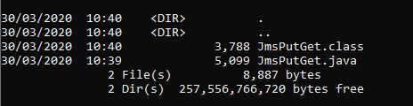

<!--ラーニングパスに組み込まれている場合はコメントアウトされます -->。
<!-- <sidebar> <heading>ラーニングパスです。IBM MQ Developer Essentials Badge</heading> 
この記事は、IBM MQ Developer Essentialsのラーニングパスとバッジの一部です。
 <ul> <li> [IBM MQ fundamentals](/articles/mq-fundamentals/)</li><li> [MQ on Containers](/tutorials/mq-connect-app-queue-manager-containers/)を使用して、キュー・マネージャーを立ち上げて実行します。または[MQ on Cloud](/tutorials/mq-connect-app-queue-manager-cloud/)、または[MQ on Ubuntu](/tutorials/mq-connect-app-queue-manager-ubuntu/)、または[MQ on Windows](/tutorials/mq-connect-app-queue-manager-windows/)を使用します。</li> <li> [Explore the MQ Console](/tutorials/mq-setting-up-using-ibm-mq-console/) </li> <li>Javaでコーディングする準備をする（このチュートリアル） </li><li> [Take on the messaging coding challenge](/tutorials/mq-badge-mq-dev-challenge/)</li> <li> [Debug your application or environment](/articles/mq-dev-cheat-sheet)</li></ul></sidebar> -->

JMSとは、<a href="https://download.oracle.com/otndocs/jcp/jms-2_0-fr-eval-spec/index.html" target="_blank" rel="noopener noreferrer nofollow">_Java Message Service_</a>の略です。JMSは、Javaプログラムからエンタープライズメッセージングシステムにアクセスする方法を定義した規格です。JMS APIは、IBM MQのようなメッセージング・サービス・プロバイダによって実装され、JMSクライアント・アプリケーションがプロバイダのメッセージング・サービスにアクセスできるようにします。

このチュートリアルでは、データを保持するメッセージをキューに入れ、消費側のアプリケーションがキューからデータを取得します。JMS API を使用して、メッセージング・プロバイダー（この場合は IBM MQ）に接続します。

## 前提条件

* <a href="https://www.ibm.com/support/pages/java-sdk-downloads-version-80" target="_blank" rel="noopener noreferrer nofollow">_Java Software Development Kit (JDK)_</a> (アプリケーションを開発・実行するためのソフトウェア)
<a href="https://repo1.maven.org/maven2/javax/jms/javax.jms-api/2.0.1/javax.jms-api-2.0.1.jar" target="_blank" rel="noopener noreferrer nofollow">_JMS.jar_ファイル</a>に含まれるJMSクラス
<a href="https://ibm.biz/mq-jms-allclient-jar" target="_blank" rel="noopener noreferrer nofollow">_com.ibm.mq.allclient.jar_file</a>にある JMS 用の IBM および IBM MQ クラス。
* <a href="https://github.com/ibm-messaging/mq-dev-samples/blob/master/gettingStarted/jms/com/ibm/mq/samples/jms/JmsPutGet.java" target="_blank" rel="noopener noreferrer nofollow">_JmsPutGet.java_ サンプル</a>。
<!-- biz link needs updating: https://ibm.biz/learn-mq-jms-sample -->

## JMSとIBM MQを使ったポイント・ツー・ポイント・アプリの開発

あなたのアプリケーションは、これらのことができなければなりません。

* キューマネージャーへの接続
* キューを開く
* メッセージを置く
* メッセージの取得
* キューを閉じる
* キューマネジャからの切断

これらのMQオブジェクトは、接続先のMQサーバーに設定されていることを前提としています。

* キュー・マネージャー QM1
* キューDEV.QUEUE.1
* チャンネル DEV.APP.SVRCONN
* ポート 1414

独自のオブジェクトを使用している場合は、これらの名前を適宜調整する必要があります。または、<a href="https://developer.ibm.com/series/mq-ready-set-connect/" target="_blank" rel="noopener noreferrer">_Ready, Set, Connect_シリーズ</a>のチュートリアルを見て、始めてみるのもいいでしょう。

すでにReady, Set, Connectのチュートリアルを終了している場合は、キュー・マネージャーが正しく設定されているはずです。  そうでない場合は、キュー・マネージャーに権限を設定して、アプリケーションからの接続を名前付きのチャネルを通して受け入れ、アプリケーションがキューとの間でメッセージを送受信する権限を持つ必要があります。

<sidebar>このビデオを見て、<a href="https://developer.ibm.com/videos/messaging-apis-how-messaging-fits-into-your-code/" target="_blank" rel="noopener noreferrer">メッセージングがアプリケーションにどのように適合するか</a>、およびこのチュートリアルで説明されている IBM MQ JMS アプリケーションをどのように構築するかを学んでください。</sidebar>

すでに JMS アプリケーションを持っていて、パフォーマンスやデバッグについて助けが必要な場合は、<a href="https://developer.ibm.com/articles/mq-best-practices/" target="_blank" rel="noopener noreferrer">_this article_</a>をご覧ください。

## 環境を整える

この最初のステップでは、前提条件のインストールと設定を説明します。  

1. ホームディレクトリなどに、サンプルに必要なファイルを保存するディレクトリを作成します。

「2.MQClient」フォルダから「com.ibm.mq.allclient.jar」ファイルを「curl」を使ってダウンロードします。

3.3. `MQClient` フォルダから `curl` を使って JMS API ファイルをダウンロードします。

4.Java JDKバージョン8をまだお持ちでない方は、<a href="https://www.ibm.com/support/pages/java-sdk-downloads-version-80" target="_blank" rel="noopener noreferrer nofollow">_here_</a>からダウンロードすることができます。お使いのプラットフォームに適したダウンロードを選択し、インストールしてください。

## ポイントツーポイントJMSサンプルアプリケーションのダウンロード

サンプルをGitHubから入手してローカルマシンに保存し、主要なJMSの構造や、サンプルがキュー・マネージャーに接続できるようにホスト、ポート、チャンネル、キューの詳細を追加する箇所に目を通してみましょう。

1. `MQClient`のディレクトリに、以下のようなディレクトリ構造を作成します。
`com/ibm/mq/samples/jms`とします。

    Windowsの場合です。

    Linuxの場合

`2.MQClient/com/ibm/mq/samples/jms`ディレクトリから、`curl`を使ってGitHubからJmsPutGet.javaサンプルをダウンロードします。

3.3. `JMSPutGet.java` ファイルを編集します。ホスト、ポート、アプリのパスワード変数をキューマネージャーの構成に合わせて変更します。

これで、アプリケーションをコンパイルして実行できるようになります。

## JMSアプリケーションのコンパイルと実行

ここでようやく、アプリケーションをキュー・マネージャに接続し、キューとの間でメッセージの送受信を行うことができます。

サンプルをコンパイルするには、MQClientのディレクトリに移動します。

javacを使ってアプリケーションをコンパイルします。

1. MQClient "ディレクトリから、"javac "を使用してアプリケーションをコンパイルします。

    Windowsの場合

    Linuxの場合

    サンプルがコンパイルされたことを確認するために、これらのコマンドのいずれかを実行します。  これで、`.java`ファイルに付随する`.class`ファイルが表示されるはずです。

    Windowsでは、`dir`コマンドを実行してください。

    Linuxの場合は、「ls」コマンドを実行します。
    これで、`.java`ファイルに付随する`.class`ファイルが表示されるはずです。
    

2.作成したアプリケーションを実行します。

    Windowsの場合

    Linuxの場合
    このような出力が表示されるはずです。

### まとめ

おめでとうございます。初めての JMS アプリケーションを編集・コンパイルし、IBM MQ キューにメッセージを送信し、キューからそのメッセージを取得しました。また、JMS および IBM MQ での開発に必要なすべてのものを備えた環境を設定しました。

JMSアプリケーションのオブジェクトを使ってMQサーバー側で何をヒットさせようとしているのか、JMSがどのようにそれを達成するのに役立つのかを基本的に理解しています。

JMSアプリケーションの信頼性とパフォーマンスを確認したい場合は、<a href="https://developer.ibm.com/articles/mq-best-practices/" target="_blank" rel="noopener noreferrer">_this article_</a>を参照してください。