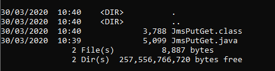
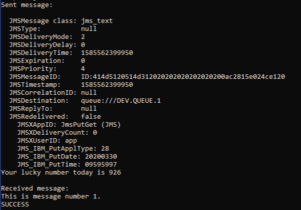

<!-- COMMENTED OUT WHEN EMBEDDED IN LEARNING PATH -->
<!-- <sidebar> <heading>Learning path: IBM MQ Developer Essentials Badge</heading> <p>This article is part of the IBM MQ Developer Essentials learning path and badge.</p> <ul> <li> [IBM MQ fundamentals](/articles/mq-fundamentals/)</li><li> Get up and running with a queue manager using [MQ on Containers](/tutorials/mq-connect-app-queue-manager-containers/), or [MQ on Cloud](/tutorials/mq-connect-app-queue-manager-cloud/), or [MQ on Ubuntu](/tutorials/mq-connect-app-queue-manager-ubuntu/), or [MQ on  Windows](/tutorials/mq-connect-app-queue-manager-windows/). </li> <li> [Explore the MQ Console](/tutorials/mq-setting-up-using-ibm-mq-console/) </li> <li>Get ready to code in Java (this tutorial) </li><li> [Take on the messaging coding challenge](/tutorials/mq-badge-mq-dev-challenge/)</li> <li> [Debug your application or environment](/articles/mq-dev-cheat-sheet)</li></ul></sidebar> -->

JMS stands for <a href="https://download.oracle.com/otndocs/jcp/jms-2_0-fr-eval-spec/index.html" target="_blank" rel="noopener noreferrer nofollow">_Java Message Service_</a>. JMS is a standard that defines how you can access enterprise messaging systems from Java programs. The JMS API is implemented by messaging service providers like IBM MQ to allow JMS client applications to access the provider's messaging service.

In this tutorial, you'll put a message that holds your data to a queue and the consuming application will get it from the queue. You’ll be using the JMS API to connect to your messaging provider, which in this case is IBM MQ.

## Prerequisites

* <a href="https://www.ibm.com/support/pages/java-sdk-downloads-version-80" target="_blank" rel="noopener noreferrer nofollow">_Java Software Development Kit (JDK)_</a>, to develop and run applications
* JMS classes, in the <a href="https://repo1.maven.org/maven2/javax/jms/javax.jms-api/2.0.1/javax.jms-api-2.0.1.jar" target="_blank" rel="noopener noreferrer nofollow">_JMS.jar_ file</a>
* IBM and IBM MQ classes for JMS, in the <a href="https://ibm.biz/mq-jms-allclient-jar" target="_blank" rel="noopener noreferrer nofollow">_com.ibm.mq.allclient.jar_ file</a>
* The <a href="https://github.com/ibm-messaging/mq-dev-samples/blob/master/gettingStarted/jms/com/ibm/mq/samples/jms/JmsPutGet.java" target="_blank" rel="noopener noreferrer nofollow">_JmsPutGet.java_ sample</a>
<!-- biz link needs updating: https://ibm.biz/learn-mq-jms-sample -->

## Developing a point-to-point app with JMS and IBM MQ

Your application has to be able to do these things:

* Connect to the queue manager
* Open a queue
* Put a message
* Get a message
* Close the queue
* Disconnect from the queue manager

We assume that these MQ objects are set up on the MQ server that you are connecting to:

* Queue manager QM1
* Queue DEV.QUEUE.1
* Channel DEV.APP.SVRCONN
* Port 1414

If you are using your own objects, you'll need to adjust these names accordingly. Or, you can go to a tutorial in the <a href="https://developer.ibm.com/series/mq-ready-set-connect/" target="_blank" rel="noopener noreferrer">_Ready, Set, Connect_ series</a> to get started.

If you’ve already worked through a Ready, Set, Connect tutorial, your queue manager should already be configured correctly.  If not, you'll need to set up authorization on the queue manager to accept connection from the application through a named channel and the application has to be authorized to put and get messages to and from the queue.

<sidebar>Watch this video to learn how <a href="https://developer.ibm.com/videos/messaging-apis-how-messaging-fits-into-your-code/" target="_blank" rel="noopener noreferrer">_messaging fits into your apps_</a> and how to build the IBM MQ JMS  application explained in this tutorial.</sidebar>

If you already have a JMS application, but you want some help with performance or debugging, review <a href="https://developer.ibm.com/articles/mq-best-practices/" target="_blank" rel="noopener noreferrer">_this article_</a>.

## Set up your environment

In this first step, we walk you through installing and setting up the prerequisites.  

1. Create a directory to save the files needed for the sample, for example in your home directory:

    ```
    mkdir MQClient
    ```

2. From the `MQClient` folder, download the `com.ibm.mq.allclient.jar` file by using `curl`.

    ```
    curl -o com.ibm.mq.allclient-9.2.3.0.jar https://repo1.maven.org/maven2/com/ibm/mq/com.ibm.mq.allclient/9.2.3.0/com.ibm.mq.allclient-9.2.3.0.jar
    ```

3. From the `MQClient` folder, download the JMS API file by using `curl`.

    ```
    curl -o javax.jms-api-2.0.1.jar https://repo1.maven.org/maven2/javax/jms/javax.jms-api/2.0.1/javax.jms-api-2.0.1.jar
    ```

4. If you don’t already have Java JDK version 8, you can download it from <a href="https://www.ibm.com/support/pages/java-sdk-downloads-version-80" target="_blank" rel="noopener noreferrer nofollow">_here_</a>. Select the right download for your platform and install.

## Downloading the point-to-point JMS sample application

Let's get the sample from GitHub, save it on your local machine, and look through some of the key JMS constructs and where you can add the host, port, channel, and queue details so that your sample can connect to the queue manager.

1. In your `MQClient` directory, create the following directory structure:
`com/ibm/mq/samples/jms`.

    On Windows:
    ```
    mkdir -p com\ibm\mq\samples\jms
    ```

    On Linux:
    ```
    mkdir -p com/ibm/mq/samples/jms
    ```

2. From the `MQClient/com/ibm/mq/samples/jms` directory, download the JmsPutGet.java sample from GitHub by using`curl`:

    ```
    curl -o JmsPutGet.java https://raw.githubusercontent.com/ibm-messaging/mq-dev-samples/master/gettingStarted/jms/com/ibm/mq/samples/jms/JmsPutGet.java
    ```

3. Edit the `JMSPutGet.java` file. Replace the host, port and app password variables to match your queue manager configuration.

    ```
    // Create variables for the connection to MQ
    private static final String HOST = "_YOUR_HOSTNAME_"; // Host name or IP address
    private static final int PORT = 1414; // Listener port for your queue manager
    private static final String CHANNEL = "DEV.APP.SVRCONN"; // Channel name
    private static final String QMGR = "QM1"; // Queue manager name
    private static final String APP_USER = "app"; // User name that application uses to connect to MQ
    private static final String APP_PASSWORD = "_APP_PASSWORD_"; // Password that the application uses to connect to MQ
    private static final String QUEUE_NAME = "DEV.QUEUE.1"; // Queue that the application uses to put and get messages to and from
    ```

You should now be able to compile your application and run it.

## Compile and run your JMS application

This is where you’ll finally connect your application to the queue manager and put and get messages to and from the queue.

To compile the sample, go to your MQClient directory.

Use javac to compile your application.

1. From the `MQClient` directory, use `javac` to compile your application.

    On Windows:
    ```
    javac -cp .\com.ibm.mq.allclient-9.2.3.0.jar;.\javax.jms-api-2.0.1.jar com\ibm\mq\samples\jms\JmsPutGet.java
    ```

    On Linux:
    ```
    javac -cp ./com.ibm.mq.allclient-9.2.3.0.jar:./javax.jms-api-2.0.1.jar com/ibm/mq/samples/jms/JmsPutGet.java
    ```

    To confirm that the sample is compiled, run one of these commands.  You should now see a `.class` file accompanying the `.java` file.

    On Windows, run the `dir` command:
    ```
    dir com\ibm\mq\samples\jms\
    ```

    On Linux, run the `ls` command:
    ```
    ls -l com/ibm/mq/samples/jms/
    ```
    You should now see a `.class` file accompanying the `.java` file:
    

2. Run your application.

    On Windows:
    ```
    java -cp .\com.ibm.mq.allclient-9.2.3.0.jar;.\javax.jms-api-2.0.1.jar;. com.ibm.mq.samples.jms.JmsPutGet
    ```

    On Linux:
    ```
    java -cp ./com.ibm.mq.allclient-9.2.3.0.jar:./javax.jms-api-2.0.1.jar:. com.ibm.mq.samples.jms.JmsPutGet
    ```
    You should see output like this:




### Summary

Congratulations! You edited and compiled your first JMS application, sent a message to an IBM MQ queue, and got that message from the queue. You also set up your environment with everything you need to develop with JMS and IBM MQ.

You have a basic understanding of what you’re aiming to hit on the MQ server side with the objects in your JMS application and how JMS helps you achieve that.

If you want to make sure your JMS application is going to perform reliably and well, have a look at <a href="https://developer.ibm.com/articles/mq-best-practices/" target="_blank" rel="noopener noreferrer">_this article_</a>.