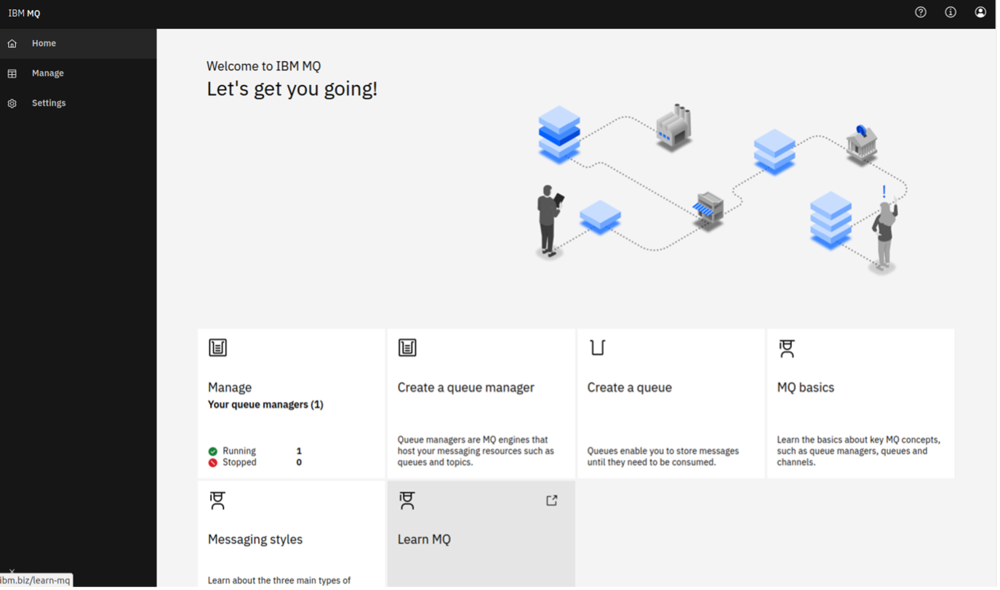
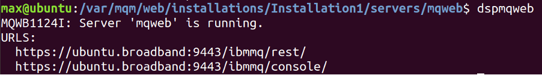
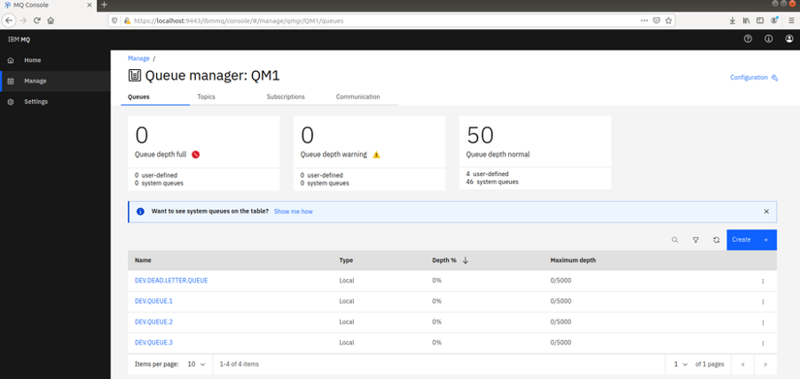

---
also_found_in:
- learningpaths/ibm-mq-badge
authors: ''
check_date: '2022-08-15'
completed_date: '2021-03-12'
components:
- ibm-mq
draft: false
excerpt: MQコンソール（またはMQウェブUI）は、キュー・マネージャやキューなどのMQオブジェクトを視覚化して管理することができる、強力なブラウザ内のユーザー・インターフェースです。コンソールでは、キュー・マネージャやキューの作成、メッセージの確認、パーミッションやプロパティの設定などが可能です。管理者は、MQコンソールを使用してキュー・マネージャを管理します。  開発者は、MQ
  コンソールを使用して、クライアントアプリケーションをテストおよびデバッグすることができます。
ignore_prod: false
last_updated: '2021-08-24'
meta_description: MQコンソール（またはMQウェブUI）は、キュー・マネージャやキューなどのMQオブジェクトを視覚化して管理することができる、強力なブラウザ内のユーザー・インターフェースです。コンソールでは、キュー・マネージャやキューの作成、メッセージの確認、パーミッションやプロパティの設定などが可能です。管理者は、MQコンソールを使用してキュー・マネージャを管理します。  開発者は、MQ
  コンソールを使用して、クライアントアプリケーションをテストおよびデバッグすることができます。
meta_keywords: MQ console
meta_title: IBM MQコンソールの設定と使用
primary_tag: ibm-mq
related_content:
- slug: mq-fundamentals
  type: articles
subtitle: IBM MQコンソールを使用してMQオブジェクトを表示および編集する方法について説明します。
time_to_read: 30 minutes
title: IBM MQコンソールの設定と使用
---

<!--ラーニングパスに組み込まれている場合はコメントアウトされます -->。
<!-- <sidebar> <heading>ラーニングパス。IBM MQ Developer Essentials Badge</heading>
このシリーズは、IBM MQ Developer Essentialsのラーニングパスとバッジの一部です。
<ul><li>[IBM MQ fundamentals](/articles/mq-fundamentals/)</li><li>[MQ on Containers](/tutorials/mq-connect-app-queue-manager-containers/)を使用して、キュー・マネージャーを立ち上げて実行します。または[MQ on Cloud](/tutorials/mq-connect-app-queue-manager-cloud/)、または[MQ on Ubuntu](/tutorials/mq-connect-app-queue-manager-ubuntu/)、または[MQ on Windows](/tutorials/mq-connect-app-queue-manager-windows/)を使用します。</li> <li>MQコンソールを調べる（このチュートリアル）</li> <li>[Javaでコーディングする準備をする](/tutorials/mq-develop-mq-jms/) </li><li>[メッセージングのコーディングチャレンジに挑戦する](/tutorials/mq-badge-mq-dev-challenge/)</li> <li>[アプリケーションや環境をデバッグする](/articles/mq-dev-heat-sheet)</li></ul></sidebar> -->

MQ コンソール (または MQ Web UI) は、キューマネージャやキューなどの MQ オブジェクトを視覚化して管理することができる、強力なブラウザ内のユーザーインターフェースです。その内部では、キューマネージャやキューの作成、メッセージの確認、権限やプロパティの設定などを行うことができます。

管理者は、MQコンソールを使用してキュー・マネージャを管理します。  開発者は、MQ コンソールを使用して、クライアントアプリケーションをテストおよびデバッグすることができます。

<!--サイドバーの見栄えが悪いので、これを外しました....-->
<!-- MQ Consoleは次のようになっています。

 -->

このチュートリアルでは、IBM MQ コンソールを設定し、アクセスし、それを使用して MQ オブジェクトを表示および編集する方法を紹介します。

## 前提条件

まず、MQ をインストールするか、コンテナやクラウド上で実行する必要があります。<a href="https://developer.ibm.com/series/mq-ready-set-connect/" target="_blank" rel="noopener noreferrer">_Ready, Set, Connect_シリーズ</a>のリストからプラットフォームを選んでください。これらの各チュートリアルの最後のステップは、このチュートリアルに戻ります。  (***MQをクラウドで運用している場合***は、このチュートリアルを使う必要はありません。代わりに、<a href="https://cloud.ibm.com/docs/mqcloud?topic=mqcloud-mqoc_admin_mqweb" target="_blank" rel="noopener noreferrer">_IBM Cloud docs_</a>のチュートリアルをご利用ください)。

LinuxまたはWindows用のMQをインストールした場合、このチュートリアルに従うことで、コンソールを設定し、その強力な機能を使用することができます。このチュートリアルでは、Linux（Ubuntu）用の具体的なコマンドを紹介しますが、原理はすべてのプラットフォームに適用され、コマンドは他のプラットフォームでも少しの変更で動作するはずです。Windowsを使用している場合は、<a href="https://www.ibm.com/docs/en/ibm-mq/9.2?topic=windows-program-data-directory-locations" target="_blank" rel="noopener noreferrer">この_IBM Docs_ article</a>に、使用すべきMQデータパスが記載されています。

## 見積もり時間

このチュートリアルの完了には約30分かかります。

## 手順

***MQをクラウドで運用している場合***、このチュートリアルは必要ありません。代わりに、<a href="https://cloud.ibm.com/docs/mqcloud?topic=mqcloud-mqoc_admin_mqweb" target="_blank" rel="noopener noreferrer">_IBM Cloud docs_</a>のチュートリアルをご利用ください。

***MQをコンテナで実行している場合***、MQのインストール時にMQコンソールが事前に設定されているため、このチュートリアルのステップ2から始めることができます。

コンソールでは、クライアントとしてブラウザで接続されたユーザーが、MQのインストールを管理、変更、および保護することができるため、ユーザーがこれらのタスクを実行する権限を持っていることを確認することが重要です。そのためには、トークン認証またはクライアント証明書認証が必要です。このチュートリアルでは、トークン認証を設定する方法を紹介しますが、証明書認証を使用したい場合は、<a href="https://www.ibm.com/docs/en/ibm-mq/9.2?topic=mcras-using-client-certificate-authentication-rest-api-mq-console" target="_blank" rel="noopener noreferrer">この_IBM Docs_ article</a>に有用な情報があります。

1. [MQコンソールの設定](#step-1-set-up-the-mq-console)
2.[MQコンソールへのアクセス](#step-2-access-the-mq-console)
3.[MQコンソールを使用してMQオブジェクトを表示および編集する](#step-3-view and-edit-mq-objects-by-using-the-mq-console)

MQコンソールにアクセスする方法（ステップ2）と、MQコンソールを使用してMQオブジェクトを表示・編集する方法（ステップ3）を動画で見たいという方は、こちらをご覧ください。

<iframe width="560" height="315" src="https://www.youtube.com/embed/gp_ep-xYWfU" title="YouTube video player" frameborder="0" allow="accelerometer; autoplay; clipboard-write; encrypted-media; gyroscope; picture-in-picture" allowfullscreen></iframe>

### Step 1: MQコンソールの設定

***MQをコンテナで***実行する場合は、MQのインストール時にMQコンソールが事前に設定されているため、このステップをスキップしてステップ2から始めることができます。

ここではまず、サンプルの設定を使用します。sampleディレクトリに移動して、`basic_registry.xml`をMQ webディレクトリにコピーします。

この`basic_registry.xml`ファイルの中には、使用したいアクセスグループが定義されていて、その他の基本的な設定もあります。

デフォルトでは、MQコンソールを実行しようとすると、`mqwebuser.xml`ファイルの内容が使用されます。先ほどコピーしたサンプルコードを代わりに使用したいので、この不要なファイルの名前を変更し、`basic_registry.xml`の名前を`mqwebuser.xml`に変更します。

また、このファイルには書き込み権限が必要ですが、現在は持っていません。これは今のところありませんが、これを与えてみましょう。

これで、`mqwebuser.xml`ファイルへの書き込みアクセスが可能になったことを確認してください。

現在、コンソールにはローカルでしかアクセスできません。もし、他の場所からMQコンソールにアクセスできるようにしたい場合は、これを許可する必要があります。これには、コマンドラインツールの `setmqweb` を使用します。

これで、ユーザが正しいユーザ名とパスワードを知っていれば、どの場所からでもコンソールにアクセスできるようになりました。

コンソールは現在起動していません。コンソールを起動するには、単に `strmqweb` と入力してください。  次のような出力が表示されるはずです。

コンソールが利用できるURLを見るには、`dspmqweb`と入力してください。このような出力が表示されるはずです。

成功です。サインインして、コンソールを使ってみましょう。

### Step 2: MQ コンソールへのアクセス

`https://localhost:9443/ibmmq/console` に移動します。ブラウザが安全でない接続について警告します。これは、MQ を実行しているサーバーがデフォルトで自己署名証明書を使用しているためで、ここでは警告を受け入れてコンソールに進んでも問題ありません。(独自の自己署名証明書またはCA署名証明書をブラウザに提供したい場合は、<a href="https://www.ibm.com/docs/en/ibm-mq/9.2?topic=mcras-using-client-certificate-authentication-rest-api-mq-console" target="_blank" rel="noopener noreferrer">この_IBM Docs_記事</a>を参照してください。

ブラウザで続行することを確認すると、サインインページが表示され、ユーザー名とパスワードの入力を求められます。使用しているMQのプラットフォームとバージョンに応じて、特定のユーザー名とパスワードでサインインする必要があります。

| **プラットフォーム** | **MQバージョン** | **認証情報** |
|- |- |- |
| Containers/Docker | Any | Username: admin Password: passw0rd |.
| LinuxまたはWindows | 9.0.2以上 | ユーザー名：mqadmin パスワード：mqadmin
| LinuxまたはWindows | 9.0.1以下 | ユーザー名：admin パスワード：admin
| クラウド | 任意 | [MQコンソールの使用に関するこのクラウドチュートリアルには、必要な情報がすべて含まれています](https://cloud.ibm.com/docs/mqcloud?topic=mqcloud-mqoc_admin_mqweb)。   コンソールは、キュー・マネージャーのダッシュボードの "Administration "タブの下にあります。            |

さて、あなたはコンソールの中にいるはずです!

### Step 3: MQ コンソールを使った MQ オブジェクトの表示と編集

コンソールでは、すべてのMQオブジェクトを表示・編集したり、他のオブジェクトを作成することができます。また、ユーザーやオブジェクトごとに権限を設定することもできます。MQコンソールの完全なツアーは、<a href="https://www.ibm.com/docs/en/ibm-mq/9.2?topic=console-quick-tour-new-web" target="_blank" rel="noopener noreferrer">この_IBM Docs_の記事</a>にありますが、ここでは基本的な操作を説明します。

これでコンソールのスタートページが表示されるはずです。MQの管理、オブジェクトの作成、いくつかの教育アイテムなどのオプションがあるタイルが表示されます。「管理」を選択すると、キュー・マネージャーのリストが表示されます。ここから作成したり管理したりすることができます。QM1のようなキュー・マネージャーを選択すると、下の画像のように、このキュー・マネージャーに関連するキューやその他のオブジェクトが表示されます。

ここから、"Create "オプションを使って、独自のキューを作成することができます。また、以下のように、個々のキューを選択することで、既存のキューのメッセージを見ることができます。

このページの「Create」オプション（ここでは「create a new message」の意味）を使って、このキューにメッセージを入れることができます。Application data "フィールドには、メッセージの内容が入ります。「Create」をクリックすると、メッセージがキューに入ります。

これで、MQコンソールの設定が完了しました。MQコンソールは、メッセージングシステムの管理と可視化に役立ちます。

## まとめ

このチュートリアルでは、MQコンソールについて説明しました。コンソールを設定し、アクセスし、メッセージをキューに入れるために使用しました。

もっと詳しく知りたい方は、<a href="https://www.ibm.com/docs/en/ibm-mq/9.2?topic=administering-administration-using-web-console" target="_blank" rel="noopener noreferrer">この _IBM Docs_ article</a>で、MQ Console に関連するすべての機能とオプションの概要を説明しています。