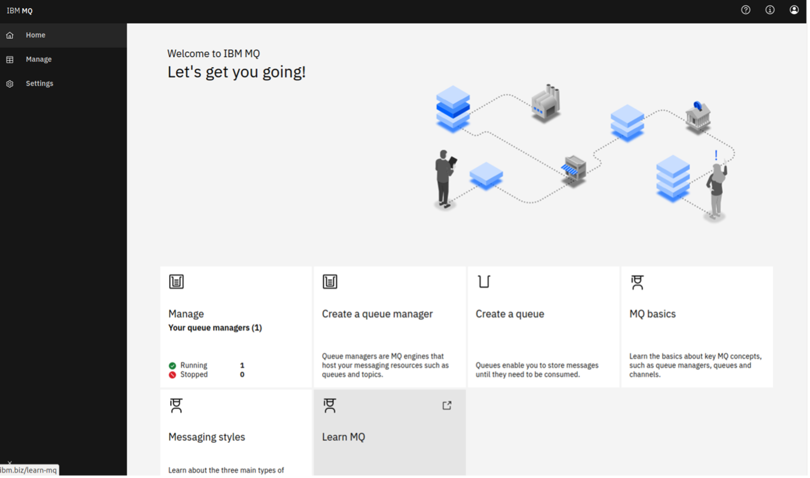
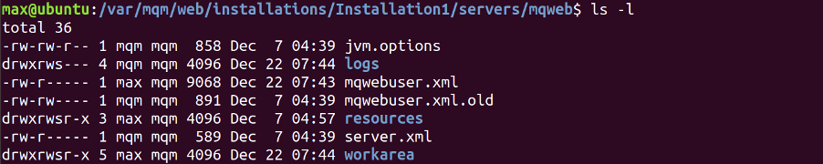
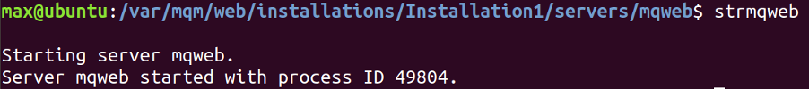
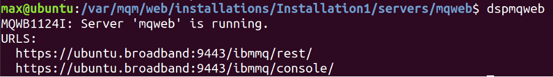
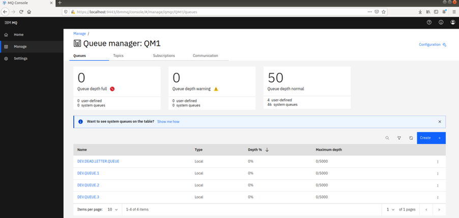
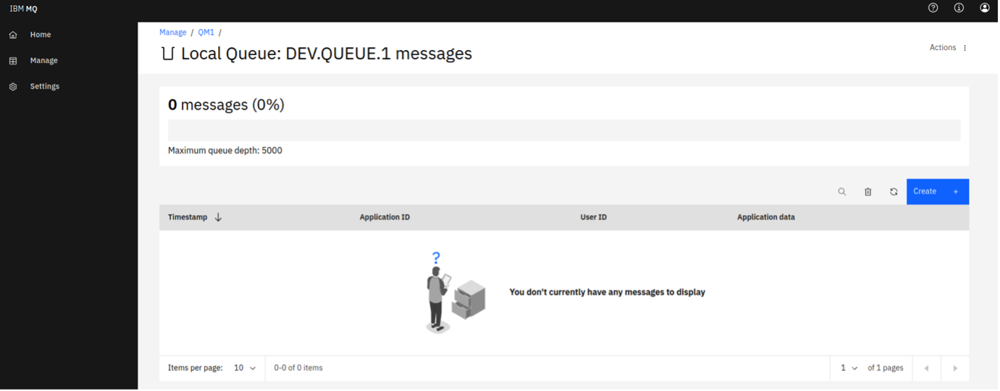
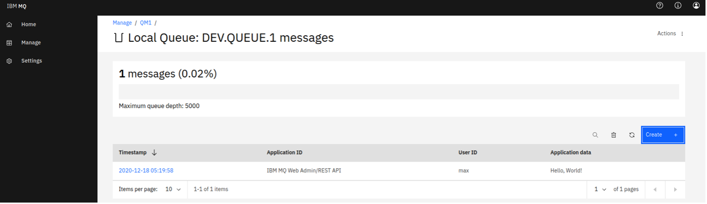

---
also_found_in:
- learningpaths/ibm-mq-badge
authors: ''
check_date: '2022-08-15'
completed_date: '2021-03-12'
components:
- ibm-mq
draft: false
excerpt: The MQ Console (or MQ web UI) is a powerful, in-browser user interface that
  lets you visualize and manage your MQ objects, including queue managers and queues.
  Inside it, you can create queue managers and queues, see your messages, set permissions
  and properties, and much more. Administrators use the MQ Console to administer queue
  managers.  Developers can use the MQ Console to test and debug client applications.
ignore_prod: false
last_updated: '2021-08-24'
meta_description: The MQ Console (or MQ web UI) is a powerful, in-browser user interface
  that lets you visualize and manage your MQ objects, including queue managers and
  queues. Inside it, you can create queue managers and queues, see your messages,
  set permissions and properties, and much more. Administrators use the MQ Console
  to administer queue managers.  Developers can use the MQ Console to test and debug
  client applications.
meta_keywords: MQ console
meta_title: Setting up and using the IBM MQ Console
primary_tag: ibm-mq
related_content:
- slug: mq-fundamentals
  type: articles
subtitle: Learn how to view and edit MQ objects using the IBM MQ Console
time_to_read: 30 minutes
title: Setting up and using the IBM MQ Console
---

<!-- COMMENTED OUT WHEN EMBEDDED IN LEARNING PATH -->
<!-- <sidebar> <heading>Learning path: IBM MQ Developer Essentials Badge</heading><p>This series is part of the IBM MQ Developer Essentials learning path and badge.</p><ul><li>[IBM MQ fundamentals](/articles/mq-fundamentals/)</li><li> Get up and running with a queue manager using [MQ on Containers](/tutorials/mq-connect-app-queue-manager-containers/), or [MQ on Cloud](/tutorials/mq-connect-app-queue-manager-cloud/), or [MQ on Ubuntu](/tutorials/mq-connect-app-queue-manager-ubuntu/), or [MQ on  Windows](/tutorials/mq-connect-app-queue-manager-windows/). </li> <li> Explore the MQ Console (this tutorial) </li> <li>[Get ready to code in Java](/tutorials/mq-develop-mq-jms/) </li><li> [Take on the messaging coding challenge](/tutorials/mq-badge-mq-dev-challenge/)</li> <li> [Debug your application or environment](/articles/mq-dev-cheat-sheet)</li></ul></sidebar> -->

The MQ Console (or MQ web UI) is a powerful, in-browser user interface that lets you visualize and manage your MQ objects, including queue managers and queues. Inside it, you can create queue managers and queues, see your messages, set permissions and properties, and much more.

Administrators use the MQ Console to administer queue managers.  Developers can use the MQ Console to test and debug client applications.

<!-- I took this out because of how sidebar looked with it.... -->
<!-- The MQ Console looks like this:

 -->

In this tutorial, we'll show you how to set up the IBM MQ Console, access it, and view and edit MQ objects using it.

## Prerequisites

First, you'll need to install MQ, or run it in a container or on the cloud. Pick your platform from the list in the <a href="https://developer.ibm.com/series/mq-ready-set-connect/" target="_blank" rel="noopener noreferrer">_Ready, Set, Connect_ series</a>. The last step in each of these tutorials will lead you back to this tutorial.  (***If you are running MQ in the cloud***, then you do not need to use this tutorial. Instead, use <a href="https://cloud.ibm.com/docs/mqcloud?topic=mqcloud-mqoc_admin_mqweb" target="_blank" rel="noopener noreferrer">the tutorial in the _IBM Cloud docs_</a>.)

If you installed MQ for Linux or Windows, following this tutorial will help you to set up the console and use its powerful features. In this tutorial, the specific commands we give will be for Linux (Ubuntu), but the principles apply to all platforms and the commands should work on other platforms with little modification. If you're using Windows, <a href="https://www.ibm.com/docs/en/ibm-mq/9.2?topic=windows-program-data-directory-locations" target="_blank" rel="noopener noreferrer">this _IBM Docs_ article</a> will tell you the MQ data paths you should use.

## Estimated time

Completing this tutorial should take about 30 minutes.

## Steps

***If you are running MQ in the cloud***, then you do not need to use this tutorial. Instead, use <a href="https://cloud.ibm.com/docs/mqcloud?topic=mqcloud-mqoc_admin_mqweb" target="_blank" rel="noopener noreferrer">the tutorial in the _IBM Cloud docs_</a>.

***If you are running MQ in containers***, you can start with Step 2 in this tutorial, as the MQ console is preconfigured when you install MQ.

As the console allows a user connected as a client via their browser to manage, change, and secure their MQ installation, it's important to make sure the user is authorized to perform these tasks. The ways to do this involve token authentication or client certificate authentication. In this tutorial, we'll show you how to set up token authentication but if you'd like to use certificate authentication, <a href="https://www.ibm.com/docs/en/ibm-mq/9.2?topic=mcras-using-client-certificate-authentication-rest-api-mq-console" target="_blank" rel="noopener noreferrer">this _IBM Docs_ article</a> has some useful information on the subject.

1. [Set up the MQ console](#step-1-set-up-the-mq-console)
2. [Access the MQ console](#step-2-access-the-mq-console)
3. [View and edit MQ objects by using the MQ console](#step-3-view-and-edit-mq-objects-by-using-the-mq-console)

If you'd rather watch a video to learn how to access the MQ console (Step 2) and view and edit MQ objects by using the MQ Console (Step 3), you can watch this one.

<iframe width="560" height="315" src="https://www.youtube.com/embed/gp_ep-xYWfU" title="YouTube video player" frameborder="0" allow="accelerometer; autoplay; clipboard-write; encrypted-media; gyroscope; picture-in-picture" allowfullscreen></iframe>

### Step 1: Set up the MQ console

If you are ***running MQ in containers***, you can skip this step and start with Step 2 , as the MQ console is preconfigured when you install MQ.

We're going to start by using a sample configuration. Navigate to the sample directory and copy the `basic_registry.xml` into the MQ web directory.

```
cd /opt/mqm/web/mq/samp/configuration
cp basic_registry.xml /var/mqm/web/installations/Installation1/servers/mqweb
```

Inside the `basic_registry.xml` file, there are some defined access groups we want to use, as well as some other basic configuration.

By default, when we try to run the MQ Console, it will use the contents of the `mqwebuser.xml` file. As we want to instead use the sample code we just copied, we rename this unwanted file and change the name of `basic_registry.xml` to `mqwebuser.xml`:

```
mv mqwebuser.xml mqwebuser.xml.old
mv basic_registry.xml mqwebuser.xml

```

We'll also need write access to this file, which we don't currently have. Let's give ourselves this now.

```
chmod 640 mqwebuser.xml
```

We should see that we now have write access to the `mqwebuser.xml` file.



Currently, the console can only be accessed locally. If we want to be able to access our MQ console from any other location, we need to allow this. We can do this with the command line tool `setmqweb`:

```
setmqweb properties -k httpHost -v "*"
```

The console can now be accessed from any location, provided the user knows the correct username and password.

The console isn't currently running. To start it, simply type `strmqweb`.  You should see output like this:



To see the URL where the console is available, type `dspmqweb`. You should see output like this:



Success! Let's sign in and start using the console.

### Step 2: Access the MQ console

Navigate to `https://localhost:9443/ibmmq/console`. Your browser will warn you about an unsafe connection. This is because the server running MQ uses a self-signed certificate by default, so it's okay here to accept the warning and continue to the console. (If you'd rather provide your own self- or CA-signed certificate to the browser, see <a href="https://www.ibm.com/docs/en/ibm-mq/9.2?topic=mcras-using-client-certificate-authentication-rest-api-mq-console" target="_blank" rel="noopener noreferrer">this _IBM Docs_ article</a>.

Once you've confirmed to your browser that you want to proceed, you'll be taken to the sign in page, which will ask for a username and password. You'll now need to sign in with a specific username and password, depending on the platform and version of MQ you're using.

|     **Platform**      |     **MQ Version**      |     **Credentials**      |
|-  |-  |-  |
|     Containers/Docker      |     Any      |     Username: admin     Password: passw0rd      |
|     Linux or Windows      |     9.0.2 or above      |     Username: mqadmin     Password: mqadmin      |
|     Linux or Windows      |     9.0.1 or below      |     Username: admin     Password: admin      |
|     Cloud      |     Any      |     [This cloud tutorial on using the MQ Console has all the information you need](https://cloud.ibm.com/docs/mqcloud?topic=mqcloud-mqoc_admin_mqweb).   The console can be found under the "Administration" tab of your queue manager dashboard.            |

Now, you should be inside the console!

### Step 3: View and edit MQ objects by using the MQ console

Inside the console, you can view and edit all of your MQ objects, as well as create others. You can also set permissions for different users and objects. A full MQ Console tour is available in <a href="https://www.ibm.com/docs/en/ibm-mq/9.2?topic=console-quick-tour-new-web" target="_blank" rel="noopener noreferrer">this _IBM Docs_ article</a>, but we'll go over some basic actions here.

You should now see the console start page. You will see tiles with options, including managing MQ, creating objects and some educational items. Selecting "Manage" will take you to a list of queue managers. You can create or manage them from here. Selecting a queue manager, such as QM1, will display the queues and other objects associated with this queue manager, like the image below.



From here, the "Create" option allows you to create your own queues. You can also see the messages on existing queues by selecting an individual queue, as show below:



You can put a message onto this queue using the "Create" option on this page, which here means "create a new message". The "Application data" field contains the message contents. Clicking "Create" puts your message onto the queue.



Now, we've set up the MQ Console, which will help us to manage and visualize our messaging system.

## Summary

In this tutorial, we explored the MQ Console. We set it up, accessed it, and used it to put a message onto a queue.

If you want to know more, <a href="https://www.ibm.com/docs/en/ibm-mq/9.2?topic=administering-administration-using-web-console" target="_blank" rel="noopener noreferrer">this _IBM Docs_ article</a> gives an overview of all the features and options relating to the MQ Console.