---
also_found_in:
- learningpaths/multitenancy-red-hat-openshift/
authors: ''
check_date: '2021-12-17'
completed_date: '2020-12-17'
components:
- redhat-openshift-ibm-cloud
display_in_listing: true
draft: false
excerpt: Red Hat OpenShift Container Platformのロールベースのアクセス制御とロールバインディングを使用して、クラスタ内のマルチテナンシーを実現します。
last_updated: '2020-12-17'
meta_description: Red Hat OpenShift Container Platformのロールベースのアクセス制御とロールバインディングを使用して、クラスタ内のマルチテナンシーを実現します。
meta_keywords: red hat, openshift, role binding, multitenant, ibm cloud, multitenancy,
  rbac
meta_title: Red Hat OpenShiftのマルチテナンシーとロールベースのアクセスコントロール
primary_tag: containers
related_content:
- slug: multitenancy-red-hat-openshift
  type: learningpaths
- slug: kubernetes-cluster-multiple-tenants-part-1
  type: tutorials
- slug: securing-multi-tenant-kubernetes-with-rbac-iam-networkpolicy-and-psp
  type: videos
social_media_meta: Achieve multitenancy in your cluster using Red Hat OpenShift Container
  Platform role-based access control and role bindings.
subtitle: ロールバインディングによるワークロードの分離
tags:
- cloud
time_to_read: 30 minutes
title: Red Hat OpenShiftにおけるマルチテナンシーとロールベースのアクセスコントロール
---

## Introduction

マルチテナンシーとは、1つのソフトウェアアプリケーションのインスタンスが複数の顧客（テナント）にサービスを提供するアーキテクチャのことで、各テナントのデータは他のテナントから論理的に分離されています。ロールベース・アクセス・コントロール（RBAC）は、クラスター内のユーザーの役割に基づいてアクセスを制限する方法で、ユーザーは必要なリソースにアクセスする権利を持ちます。RBACでは、ロールバインディングにより、どのユーザーが許可されたリソースを閲覧・管理する権利を持つかを定義し、ロールで定義された権限をユーザーやグループに付与します。ロール・バインディングがプロジェクト・スコープで権限を付与するのに対し、クラスター・ロール・バインディングはクラスター・レベルで権限を付与します。

このチュートリアルでは、Red Hat OpenShift Container Platform の RBAC とロールバインディングを使用して、マルチテナンシーを実現する方法を説明します。OpenShift でプロジェクトを作成し、クラスターにユーザーを追加し、ロールバインディングを使用してユーザーを特定のプロジェクト (名前空間) に制限し、ワークロードが他のユーザーから隔離されるようにする方法を説明します。ユーザーのリソースとビューは、同じOpenShiftクラスターで同じ共有ハードウェアリソースのセットを使用している他のユーザーから分離されます。また、管理者がクラスター上のユーザーの問題をトラブルシューティングするために使用できる、ユーザーの偽装方法についても学びます。このチュートリアルでは、なりすましを使用して、あるユーザーのクラスター・ビューを表示します。

## 前提条件

このチュートリアルでは、以下のものが必要です。

* IBM Cloud 上の Red Hat OpenShift 4.3 クラスターまたはそれ以上が必要です。
* [IBM Cloud Shell](https://shell.cloud.ibm.com/shell?cm_sp=ibmdev-_-developer-tutorials-_-cloudreg)

## 見積もり時間

このチュートリアルを完了するには、約30分かかります。

## 手順

1. [ログインしてプロジェクトを作成する](#log-in-and-create-projects)
1. [ユーザーの作成](#create-users)
1. [ロールバインディングの作成](#create-role-bindings)
1. [ユーザーになりすましてアプリケーションをデプロイ](#impersonate-user-and-deploy-application)
1. [ポッドの作成とデプロイ](#create-and-deploy-the-pod)
1. [別のユーザーに切り替える](#switch-to-another-user)

## ログインしてプロジェクトを作成

Webコンソールからはローカルユーザーを作成できないため、IBM Cloud Shellでユーザーとプロジェクトを作成します。

1. クラスターの Red Hat OpenShift for IBM Cloud Web コンソールにログインします。ヘッダーの自分のユーザー名をクリックして、**Copy Login Command**をクリックします。**Display Token**をクリックし、`oc login`コマンドをコピーしてターミナルに貼り付けます。

  

1. 以下のコマンドをターミナルにコピーして、2つのプロジェクトを作成します（例では各ユーザーに1つずつ）。

`  my-first-project` が作成されたというメッセージが表示されます。

`  my-second-project` が作成されたというメッセージが表示されます。

## ユーザーの作成

1. 以下のコマンドをコマンドラインにコピー＆ペーストして、2人のユーザーを作成します。

「  first-user」が作成されたというメッセージが表示されます。

`  second-user`が作成されたというメッセージが表示されます。

  管理者として、クラスターに関連するすべてのユーザー、プロジェクト、ポッドを確認することができます。

1. Webコンソールで、**User Management** > **Users**をクリックして、新しいユーザーの一覧を表示します。

  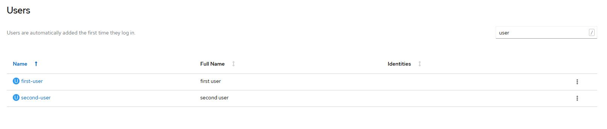

1. **Home > Projects**をクリックして、クラスタ内のすべてのプロジェクトを表示します。

  

1. **Workloads > Pods**をクリックして、すべてのポッドを表示します（すべてのプロジェクトを一覧表示するには、**Project** > **all projects**をクリックしていることを確認してください）。

  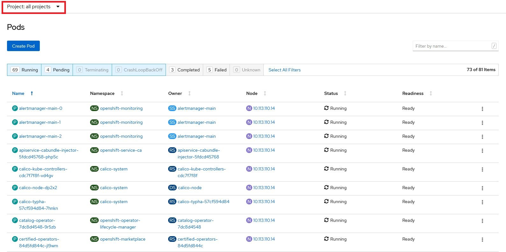

OpenShiftのWebコンソールUIのバージョン4.3では、[spoof other users and groups](https://www.openshift.com/blog/openshift-4-3-spoofing-a-user)という機能が追加されました。ユーザーの一人になりすまして、そのユーザーが現時点で何にアクセスできるかを確認してみましょう。

**User Management > Users**をクリックして、**first-user**の縦の省略記号ボタンをクリックします。**Impersonate User first-user**をクリックします。

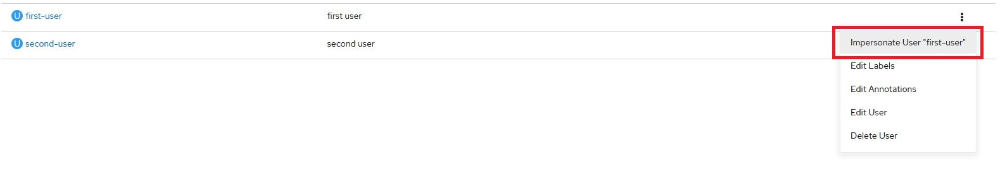

**Home > Projects**をクリックすると、`first-user`がプロジェクト/ポッドを閲覧したり、新しいプロジェクト/ポッドを作成したりできないことがわかります。これは、`first-user`がまだロールバインディングを持っていないためです。つまり、`first-user`は、プロジェクトやポッドを作成、表示、管理するための特権やパーミッションを持っていないということです。

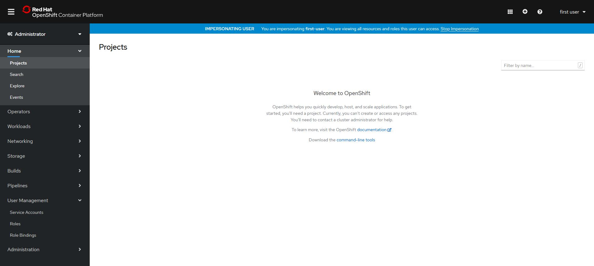

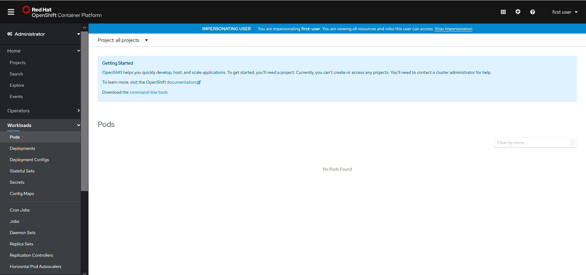

Impersonating Userヘッダーの**Stop Impersonation**をクリックすると、`first-user`へのなりすましが止まり、Administratorに戻ります。

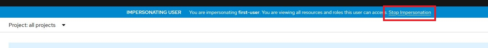

## ロールバインディングの作成

このステップでは、ユーザーがそれぞれのプロジェクトにアクセスできるように、ロールバインディングを作成します。ロールバインディングは、ウェブコンソールから簡単に作成できます。

1. **User Management > Role Bindings**をクリックします。
1. [バインディングの作成]をクリックします。
1. **Role Binding**の作成画面で、以下のフォームに必要事項を入力し、**Create**をクリックします。

  * **Binding Type**:名前空間ロールバインディング(RoleBinding)
  * **名前**: first-user-rb
  * **名前空間**: my-first-project
  * **Role Name**: cluster-admin
  * **Subject**：ユーザー
  * **Subject Name**: first-user

  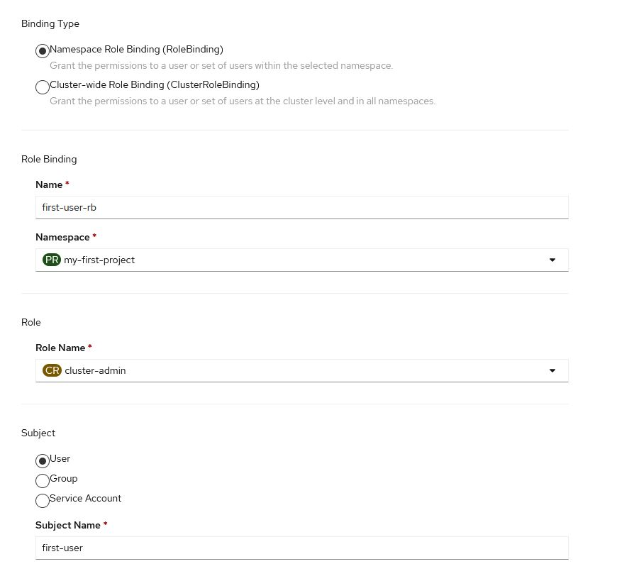

1. **User Management > Users**をクリックして、**first-user**をクリックします。**Role Bindings**タブをクリックすると、名前空間`my-first-project`に対する`first-user-rb`ロールバインディングによって、ロール`cluster-admin`が`first-user`に正常に関連付けられていることがわかります。

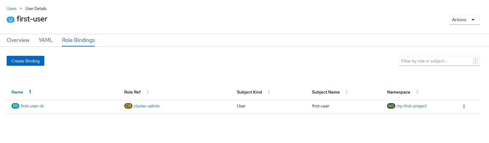

## ユーザーになりすましてアプリケーションをデプロイ

このステップでは、先ほどと同じように `first-user` になりすましますが、今回は `first-user` が `my-first-project` の管理者権限を持っているので、`first-user` はその名前空間で管理者ができるすべてのことができることになります。

1. 1. **ユーザー管理>ユーザー**をクリックし、**first-user**をクリックします。**Actions > Impersonate Users first-user**をクリックします。

  これで`first-user`が`my-first-project`ネームスペースを閲覧できることに注目してください。これは、`first-user`が`my-first-project`ネームスペースに限定されていたため、このユーザーが閲覧できる唯一のプロジェクトです。

  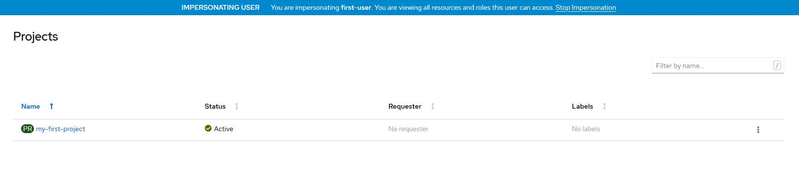

1. **Workloads > Pods**をクリックすると、`first-user`がポッドにもアクセスできる(ポッドを作成できる)ことがわかりますが、まだポッドは作成されていません。

  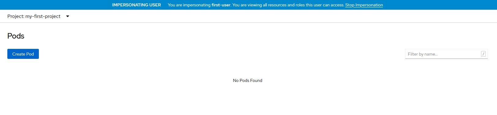

## ポッドの作成とデプロイ

このステップでは、`my-first-project`の名前空間に`first-user`という名前のポッドを作成します。

1. WebコンソールでDeveloper Perspectiveに切り替えます。
1. 「Topology」をクリックして、「Container Image」をクリックします。

  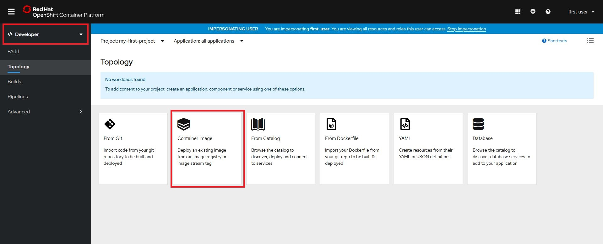

1. **Deploy Image**ページで、**Image name from external registry**欄に`ibmcom/guestbook:v1`と入力します。(すると、**Validated**というメッセージが表示されます。デフォルトの設定のまま、**Create**をクリックします。

  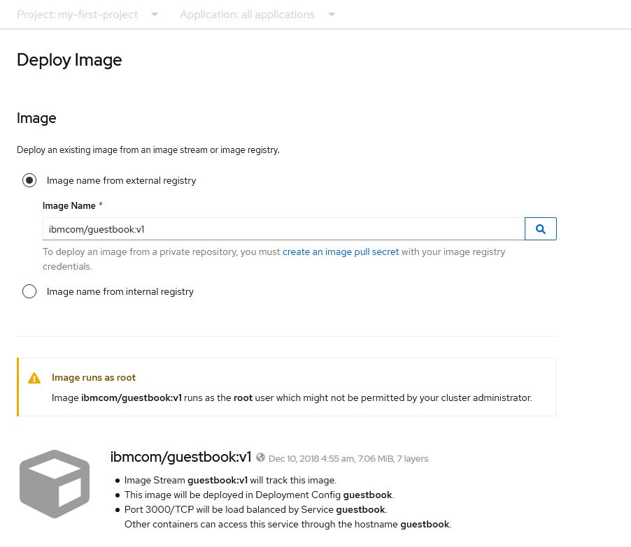

ポッドを作成すると、**Topology**ビューにリダイレクトされ、ポッドが表示されます。ビルドに成功すると、ポッドを囲む水色の円が濃紺に変わります。`first-user`として、プロジェクト`my-first-project`にコンテナ化されたアプリケーション(guestbook:v1)のデプロイに成功し、アプリケーションに関連するポッドやデプロイメントリソースを確認することができます。

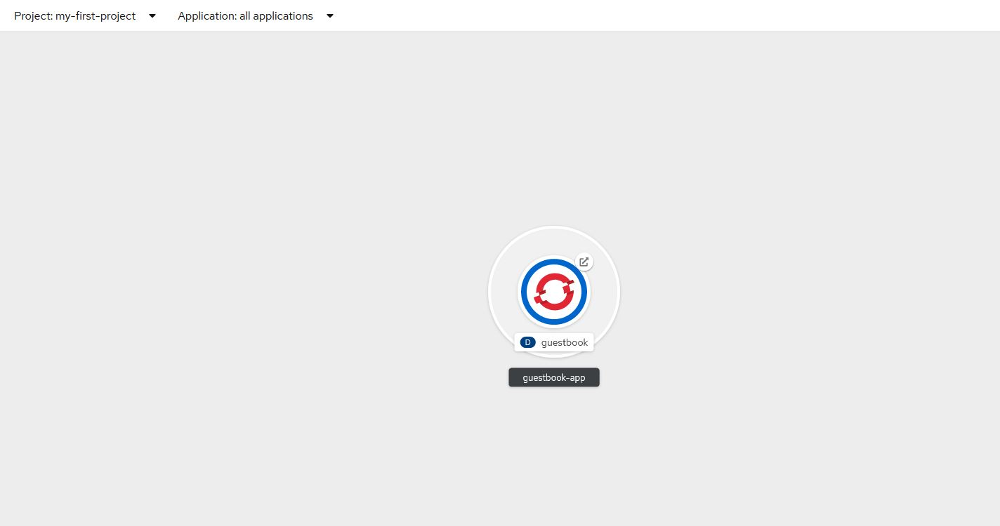

デプロイされたアプリケーションにアクセスするには、ポッドの上隅にある小さな四角をクリックすると、Guestbook-v1が新しいウィンドウで開きます。

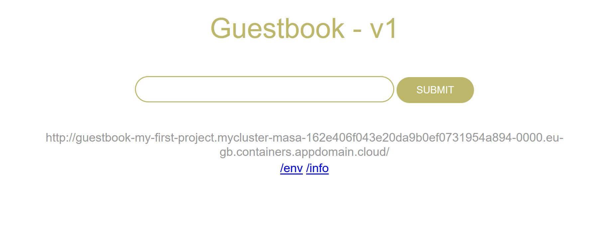

Webコンソールで、Administratorの視点に戻します。新しいポッドが、プロジェクト `my-first-project` のポッドのリストに追加されていることに注目してください。

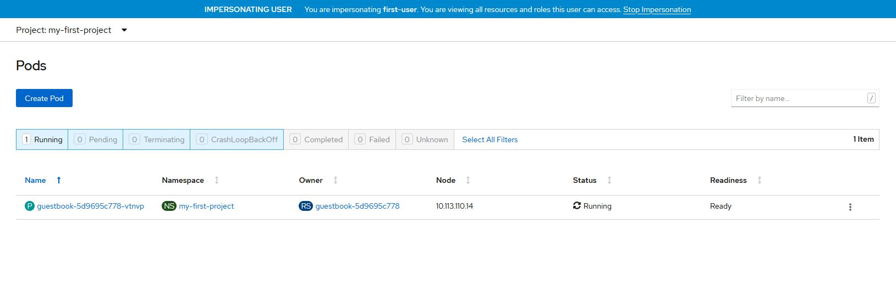

## 別のユーザーに切り替える

では、`first-user`のなりすましを止めて、`second-user`に切り替えて、`second-user`が`first-user`が作成したポッドを見られるかどうかを検証してみましょう。

1. Impersonating Userヘッダーの**Stop Impersonation**をクリックして、`first-user`へのなりすましを停止し、Administratorに戻ります。
1. 1. **User Management > Users** をクリックして、**second-user** の縦の省略記号をクリックします。**Impersonate Users second-user**をクリックします。

予想通り、`second-user`には権限がないため、`my-first-project`のプロジェクトを見ることができません。

## まとめ

OpenShift のロールバインディングのおかげで、クラスター上のユーザー間でワークロードを分離し、マルチテナンシーを実現することができました。実際の使用例としては、マネージドサービスプロバイダーがこの機能を使用して、同じOpenShift Container Platformクラスタと同じ共有ハードウェアリソースのセットを使用しながら、顧客に論理的な分離を提供することができます。