---
also_found_in:
- learningpaths/multitenancy-red-hat-openshift/
authors: ''
check_date: '2021-12-17'
completed_date: '2020-12-17'
components:
- redhat-openshift-ibm-cloud
display_in_listing: true
draft: false
excerpt: Achieve multitenancy in your cluster using Red Hat OpenShift Container Platform
  role-based access control and role bindings.
last_updated: '2020-12-17'
meta_description: Achieve multitenancy in your cluster using Red Hat OpenShift Container
  Platform role-based access control and role bindings.
meta_keywords: red hat, openshift, role binding, multitenant, ibm cloud, multitenancy,
  rbac
meta_title: Red Hat OpenShift multitenancy and role-based access control
primary_tag: containers
related_content:
- slug: multitenancy-red-hat-openshift
  type: learningpaths
- slug: kubernetes-cluster-multiple-tenants-part-1
  type: tutorials
- slug: securing-multi-tenant-kubernetes-with-rbac-iam-networkpolicy-and-psp
  type: videos
social_media_meta: Achieve multitenancy in your cluster using Red Hat OpenShift Container
  Platform role-based access control and role bindings.
subtitle: Isolate your workloads with role binding
tags:
- cloud
time_to_read: 30 minutes
title: Multitenancy and role-based access control in Red Hat OpenShift
---

## Introduction

Multitenancy is an architecture in which a single instance of a software application serves multiple customers (tenants), where each tenant's data is logically separated from the other tenants. Role-based access control (RBAC) is a method of restricting access based on the roles of the users in the cluster, where users have the rights to access the resources they need. In RBAC, role bindings define which users are entitled to view and manage authorized resources, and they grant the permissions defined in a role to a user or a group. While a role binding grants permissions at a project scope, cluster role binding grants permissions at a cluster level.

This tutorial shows how you can achieve multitenancy by using Red Hat OpenShift Container Platform RBAC and role binding. It walks you through creating a project in OpenShift, adding users to the cluster, and then using role bindings to limit the users to specific projects (namespaces) to ensure that their workloads are isolated from other users. Their resources and views are separated from other users on the same OpenShift cluster using the same set of shared hardware resources. You also learn how to impersonate a user, which administrators can use to troubleshoot a user's issues on the cluster. In this tutorial, we use impersonation to show you the cluster view of a user.

## Prerequisities

For this tutorial, you need:

* A Red Hat OpenShift 4.3 cluster or above on IBM Cloud
* [IBM Cloud Shell](https://shell.cloud.ibm.com/shell?cm_sp=ibmdev-_-developer-tutorials-_-cloudreg)

## Estimated Time

It will take you around 30 minutes to complete this tutorial.

## Steps

1. [Log in and create projects](#log-in-and-create-projects)
1. [Create users](#create-users)
1. [Create role bindings](#create-role-bindings)
1. [Impersonate user and deploy application](#impersonate-user-and-deploy-application)
1. [Create and deploy the pod](#create-and-deploy-the-pod)
1. [Switch to another user](#switch-to-another-user)

## Log in and create projects

We create users and projects with the IBM Cloud Shell because you cannot create local users from the web console.

1. Log in to the Red Hat OpenShift for IBM Cloud web console for your cluster. Click your username in the header and then click **Copy Login Command**. Click **Display Token** and copy the `oc login` command and paste it in your terminal.

  

1. Create two projects, one for each user in our example, by copying the following commands in your terminal:

  ```
  oc create namespace my-first-project
  ```

  You see a message that `my-first-project` has been created.

  ```
  oc create namespace my-second-project
  ```

  You see a message that `my-second-project` has been created.

## Create users

1. Copy and paste the following commands on the command line to create two users:

  ```
  oc create user first-user --full-name="first user"
  ```

  You see a message that `first-user` has been created.

  ```
  oc create user second-user --full-name="second user"
  ```

  You see a message that `second-user` has been created.

  As Administrator, you can see all the users, projects, and pods associated with the cluster.

1. In the web console, click **User Management** > **Users** to see the new users listed.

  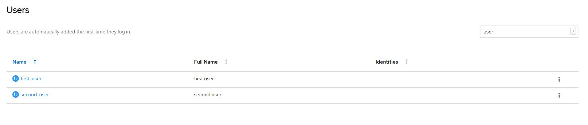

1. Click **Home > Projects** to view all the projects in the cluster.

  

1. Click **Workloads > Pods** to view all pods (make sure that you click **Project** > **all projects** to list all of the projects).

  

Version 4.3 of the OpenShift web console UI added the ability to [spoof other users and groups](https://www.openshift.com/blog/openshift-4-3-spoofing-a-user). Let's impersonate one of the users to see what that user has access to at this point.

Click **User Management > Users** and then click the vertical ellipsis button for **first-user**. Click **Impersonate User first-user**.

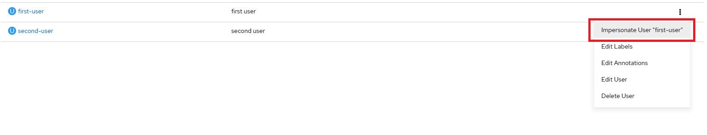

If you click **Home > Projects**, you can see that `first-user` can't view any projects/pods or create any new projects/pods. That's because `first-user` doesn't have a role binding yet, which means `first-user` does not have any privileges and/or permissions to create, view, or manage projects and pods.

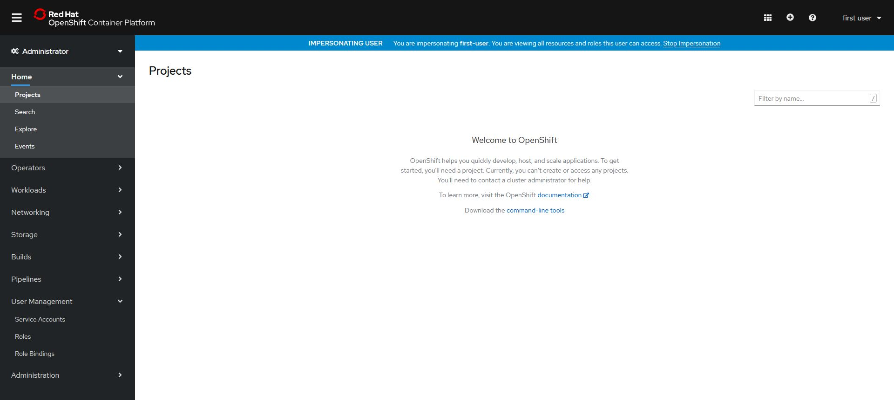

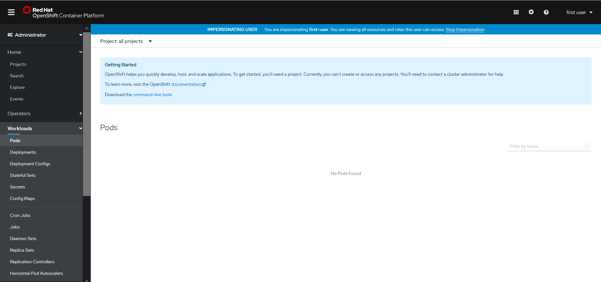

Click **Stop Impersonation** in the Impersonating User header to stop impersonating `first-user` and switch back to Administrator.


## Create role bindings

In this step, you create role bindings to give users access to their respective projects. You can easily create role bindings through the web console.

1. Click **User Management > Role Bindings**.
1. Click **Create Binding**.
1. On the **Create Role Binding** page, fill out the form as follows and click **Create**:

  * **Binding Type**: Namespace Role Binding (RoleBinding)
  * **Name**: first-user-rb
  * **Namespace**: my-first-project
  * **Role Name**: cluster-admin
  * **Subject**: User
  * **Subject Name**: first-user

  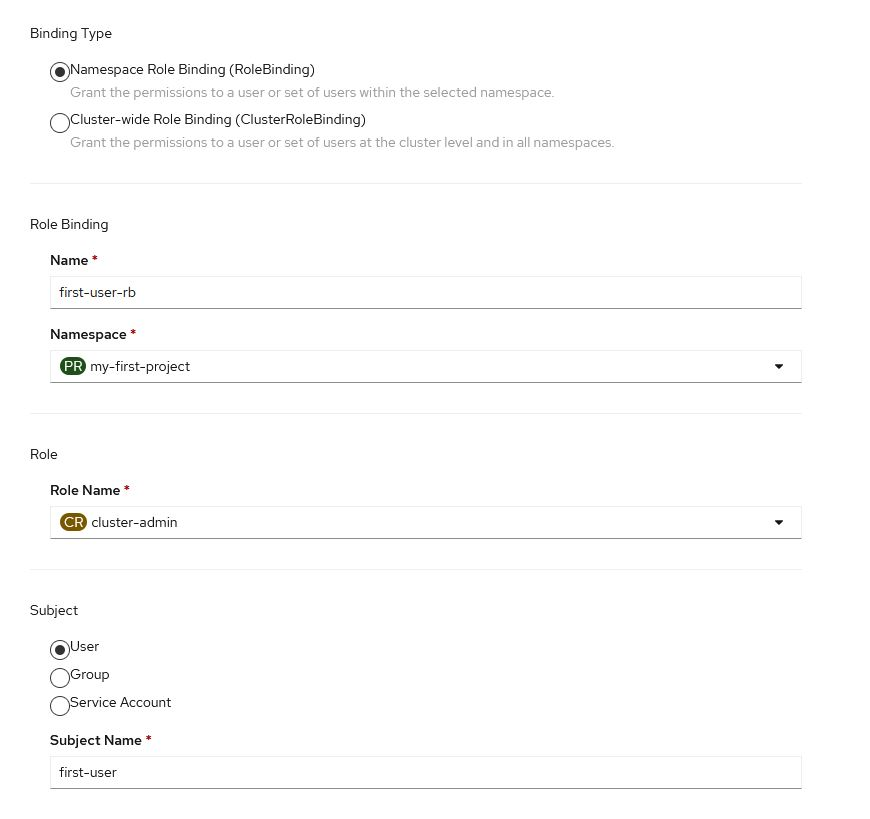

1. Click **User Management > Users** and click **first-user**. Click the **Role Bindings** tab, and you can see that the role `cluster-admin` has been successfully associated with `first-user` through the `first-user-rb` role binding for the namespace `my-first-project`.

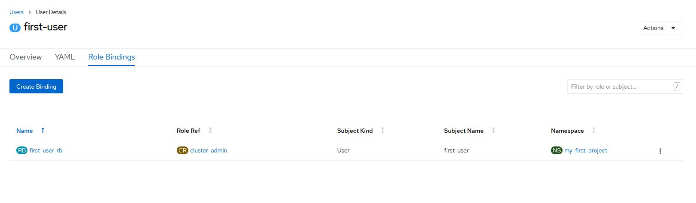

## Impersonate user and deploy application

In this step, you impersonate `first-user` like you did previously, but this time, `first-user` has admin permissions to `my-first-project`, which means `first-user` can do everything an admin can do on that namespace.

1. Click **User Management > Users** and then click **first-user**. Click **Actions > Impersonate Users first-user**.

  Notice that now `first-user` can view the `my-first-project` namespace. It is the only project this user can view because `first-user` was limited to the `my-first-project` namespace.

  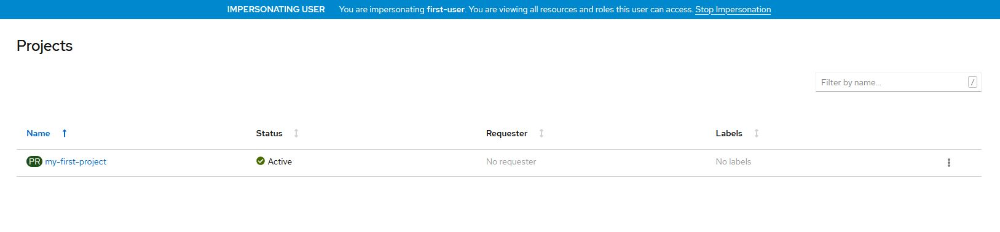

1. Click **Workloads > Pods** to see that `first-user` has access to the pods as well (and can create pods), but no pods have been created yet.

  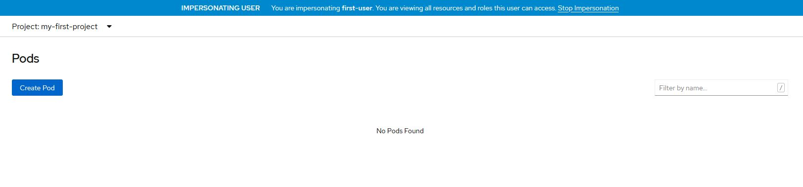

## Create and deploy the pod

In this step, you create a pod as `first-user` in the `my-first-project` namespace.

1. Switch to the Developer Perspective on the web console.
1. Click **Topology**, and then click **Container Image**.

  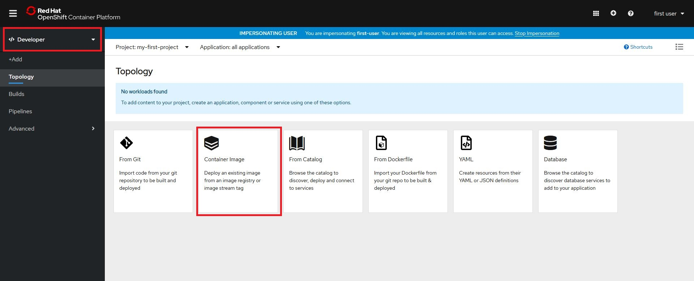

1. On the **Deploy Image** page, enter `ibmcom/guestbook:v1` in the **Image name from external registry** field. (You should see a **Validated** messsage. Keep the default settings and click **Create**.

  

Once you create the pod, you are redirected to the **Topology** view, which shows the pod. The light blue circle around the pod turns dark blue once it successfully builds. As `first-user`, you can successfully deploy a containerized application (guestbook:v1) in the project `my-first-project` and can view the pods and deployment resources associated with the application.


You can access the deployed application by clicking on the small square on the top corner of the pod, which opens Guestbook-v1 in a new window.

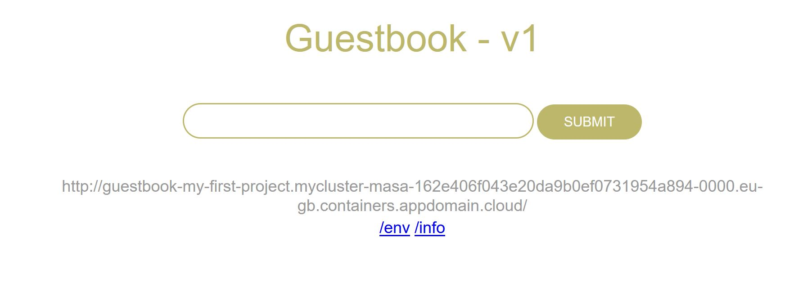

In the web console, switch back to the Administrator perspective. Notice that the new pod has been added to the list of pods for the project `my-first-project`.

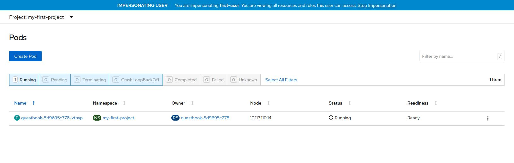

## Switch to another user

Now, let's stop the impersonation for `first-user`, and switch to `second-user` to verify if `second-user` can see the pods `first-user` created.

1. Click **Stop Impersonation** in the Impersonating User header to stop impersonating `first-user` and switch back to Administrator.
1. Click **User Management > Users** and then click the vertical ellipsis button for **second-user**. Click **Impersonate Users second-user**.

As expected, `second-user` cannot see the project `my-first-project` because `second-user` is not authorized.


## Summary

Thanks to role bindings in OpenShift, we have isolated the workloads across users on the cluster and achieved multitenancy. As a real-world use case, a managed service provider could use this feature to provide logical isolation to its customers while using the same OpenShift Container Platform cluster and the same set of shared hardware resources.