---
also_found_in:
- learningpaths/dataops-fundamentals/
authors: ''
completed_date: '2021-07-20'
components:
- cloud-pak-for-data
draft: false
excerpt: IBM Cloud Pak for Data上のWatson Knowledge Catalog内のデータ保護ルールなどのデータプライバシー機能を使用して企業データを保護します。
last_updated: '2021-09-27'
meta_description: IBM Cloud Pak for Data上のWatson Knowledge Catalog内のデータ保護ルールなどのデータプライバシー機能を使用して企業データを保護します。
meta_keywords: privacy,data
meta_title: データプライバシー機能によるデータの保護
primary_tag: analytics
subtitle: 組織のガイドラインおよび規制に従ったデータの適切な管理および使用の徹底
tags:
- data-management
title: データプライバシー機能によるデータの保護
---

近年、世界中でプライバシーに関する規制が復活しています。企業は、データ・プライバシーに関する複雑な規制要件や、データのプライバシーを求める個人の要求への対応に苦慮しています。

データの不適切な保護は、深刻な結果をもたらします。データ漏洩や規制要件の不遵守は、企業に罰金や罰則を課す原因となります。また、顧客のロイヤリティの低下、収益の減少、訴訟などを引き起こし、企業のブランドを傷つける可能性があります。

このチュートリアルでは、IBM Cloud Pak for Data 上の Watson Knowledge Catalog 内のデータ保護ルールなどのデータ・プライバシー機能を使用して企業データを保護する方法を学びます。

## 学習目標

このチュートリアルでは

* 以前にインポートしたポリシーとガバナンスルールで指定された制限を実施するデータ保護ルールを追加する。
* ガバナンスされたカタログにデータを公開する
* データ保護ルールが適用されていることを確認するために、さまざまなユーザーとしてログインする。

## 前提条件

* [IBM Cloud Pak for Data v4.0](https://www.ibm.com/jp-ja/products/cloud-pak-for-data)。
* [Watson Knowledge Catalog on Cloud Pak for Data](https://www.ibm.com/docs/en/cloud-paks/cp-data/4.0?topic=services-watson-knowledge-catalog)。
* [Analyze discovered data to gain insights on the quality of your data](https://developer.ibm.com/tutorials/analyze-discovered-data-to-gain-insights-on-the-quality-of-your-data)の手順を完了すること。
* データ・プライバシー・ルールを適用した結果を検証するために、IBM Cloud Pak for Data インスタンスに 2 人の非管理者ユーザーを作成する必要があります。このチュートリアルでは、*regular_user*というユーザーは通常のユーザーを表し、*restricted_user*は、いくつかの追加のアクセス制限があるユーザーを表します。カタログや割り当てられたサービスにアクセスできるように、両方のユーザーに**User**と**Developer**のロールを提供します。

## 見積もり時間

このチュートリアルを完了するには、約60分かかります。

## Step 1.アクセスを拒否するデータ保護ルールの追加

ルールで指定されたユーザーがデータを閲覧できないようにするデータ保護ルールの作成から始めます。

ここでは、「Restrict access for Passport and Driver's License number」というガバナンスルールを実施するためのデータ保護ルールを作成します。これは、これらのフィールドを持つアセットの可視性を特定のユーザー（ここではrestricted_user）に制限するというものです。

1. IBM Cloud Pak for Data インスタンスにログインします。

    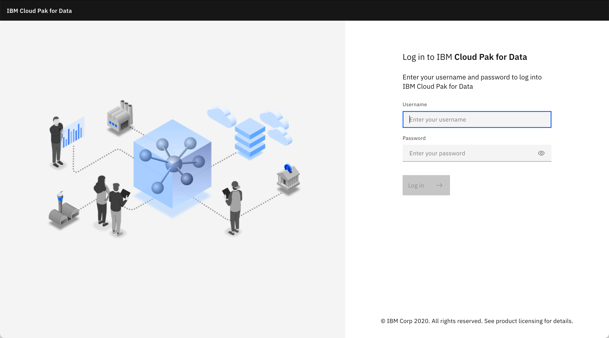

1. 左上の**ハンバーガー（☰）**メニューに行き、**Governance**を展開し、**Rules**をクリックします。

    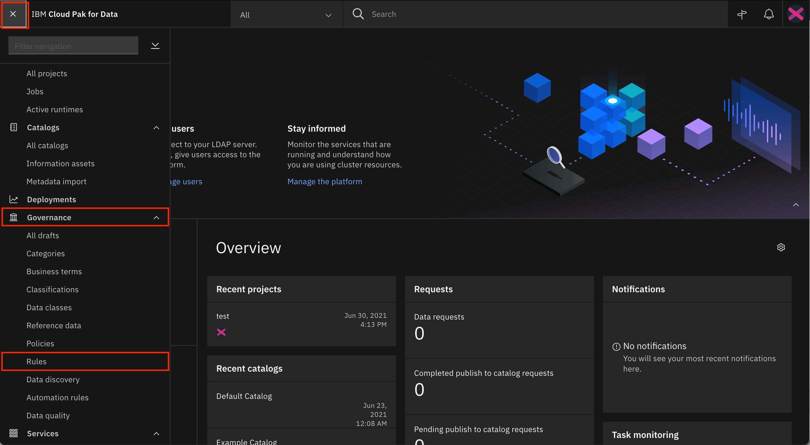

1. **Add rule > New rule**をクリックします。

    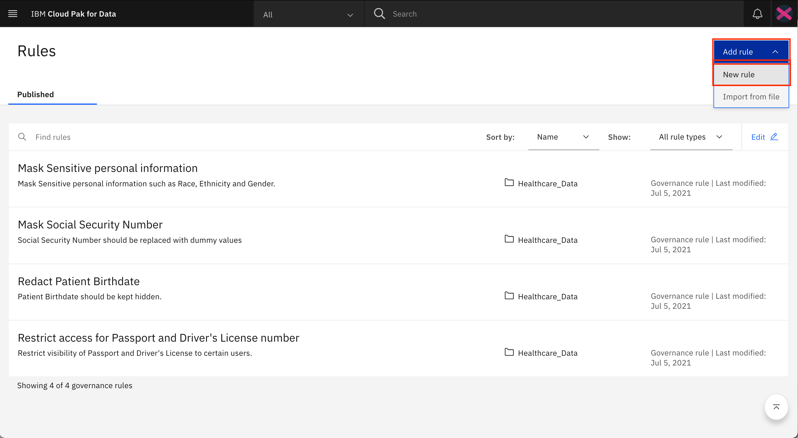

1. 「データ保護ルール」をクリックします。

    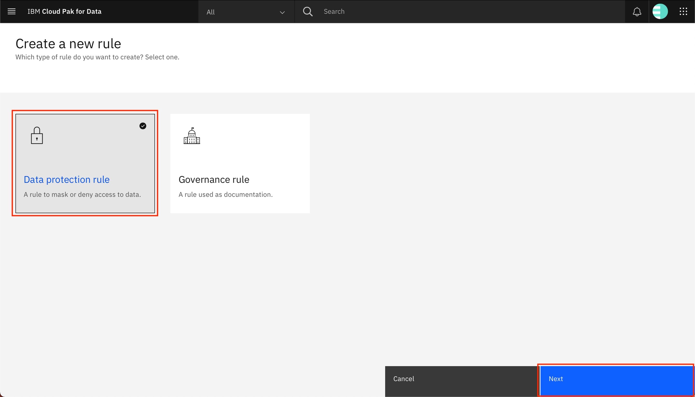をクリックします。

1. ルールの名前を入力し（`Restrict access - Passport and Drivers License`）、ルールのタイプを **Access** と選択し、ルールの説明を入力します。右側にある*Condition 1*の最初の部分を作成します。"If `Data class contains any Passport`"という条件を構成する値を選択して入力します。条件の中にさらにセクションを追加するには、**+**記号をクリックします。**OR**を選択して2つのセクションを結合し、"`Business term contains any Patient Driver's License`"という形で値を入力・選択して2つ目のセクションを更新します。この条件は、オブジェクトのデータ・クラスがPassportである場合、またはオブジェクトのビジネス・タームがPatient Driver's Licenseである場合に、ルールを実行することを示しています。

    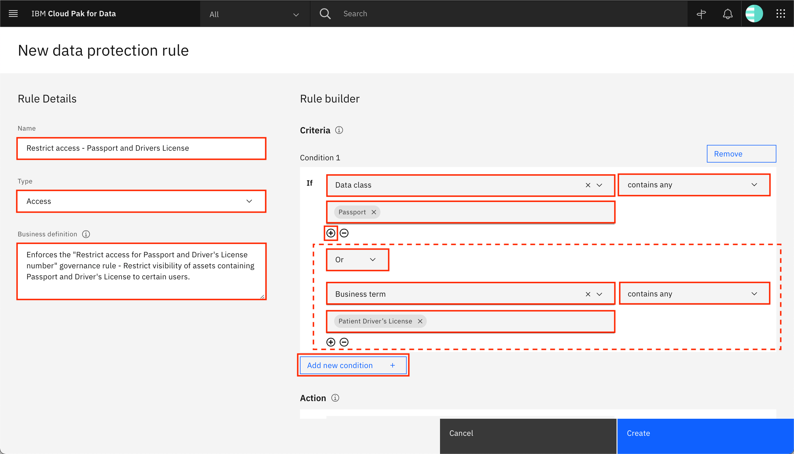

1. 「**Add new condition +**」をクリックします。

1. 新しい条件(*Condition 2*)が追加されます。2つの条件を結合するために**AND**を選択し、"If `User name contains any`. "という形式で値を入力・選択して*Condition 2*を更新する。「**Add users +**」をクリックします。

    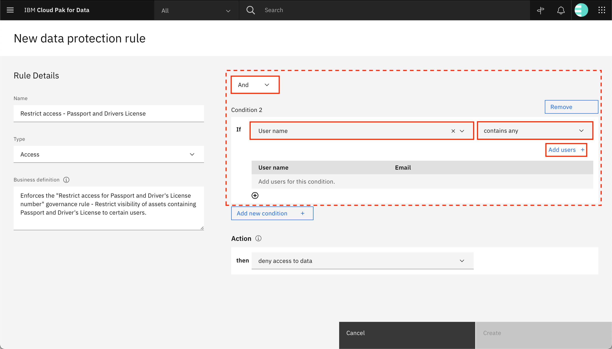

1. ポップアップウィンドウで、**restricted_user**を選択し、**Add**をクリックします。

    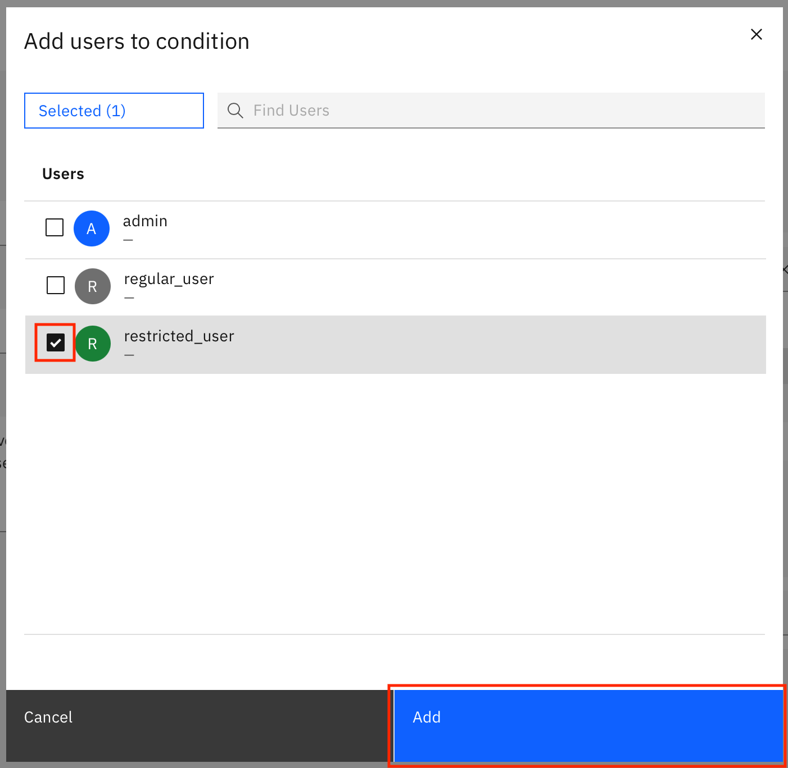
    
    **注意**:**restricted_user**は、PassportデータクラスまたはPatient Driver's Licenseビジネスタームを持つすべてのデータへのアクセスを拒否したい、システムに存在するユーザーを表します。

1. 条件2は "If User name contains any restricted_user. "となっています。この条件は、データにアクセスしようとしているユーザーが**restricted_user**である場合にルールを実行することを示しています。最後に、実行する*Action*を**deny access to data**にして、**Create**をクリックします。

    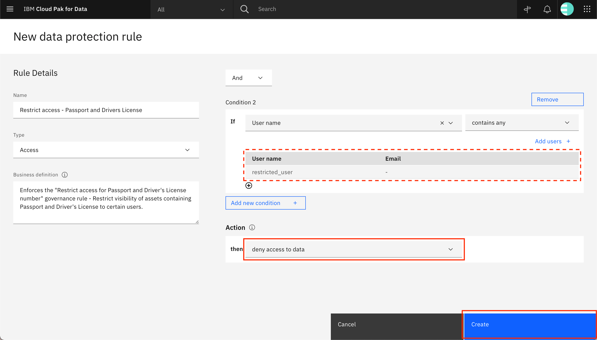

1. ルールが保存され、画面に表示されます。パンくずリストの**Rules**をクリックすると、Rulesページに戻ります。

    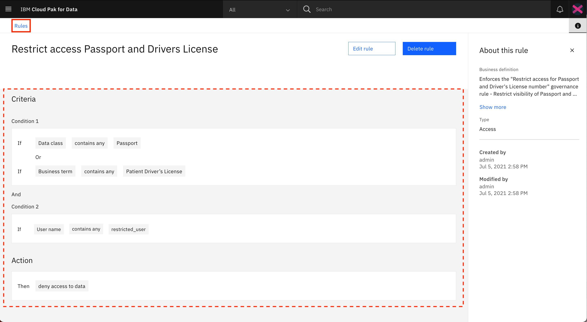

## Step 2.データを再編集するデータ保護ルールの追加

次に、データ保護ルールを使用してデータを再編集する方法を確認します。この方法では、列のデータを正確に10個のX文字からなる文字列に置き換えます。この方法は、データを隠すのに役立ちますが、データの元の形式を保持することはできません。すべての値が 10 X 文字に置き換えられるため、データの参照整合性も失われます。その列が他のテーブルの外部キー参照として使用されていた場合、データが再編集されるとその外部キー参照も失われます。

データ保護ルールを作成して、「患者の生年月日を再編集する」というガバナンス・ルールを実施します。これは、患者の生年月日を隠しておくべきだというものです。

1. ルール］ページで、［**ルールの追加->新規ルール**］をクリックします。

    

1. 「データ保護ルール」をクリックします。

    をクリックします。

1. ルールの名前を入力し（`Redact the Birthdate of Patient`）、ルールのタイプを **Access** に選択し、ルールの説明を入力します。右側に、"If `Business term contains any Patient Birth Date`"という条件を構成する値を選択して入力し、*Condition 1*を作成します。**Action**の項目で、**deny access to data**をクリックしてドロップダウンメニューを開き、**mask data**をクリックします。

    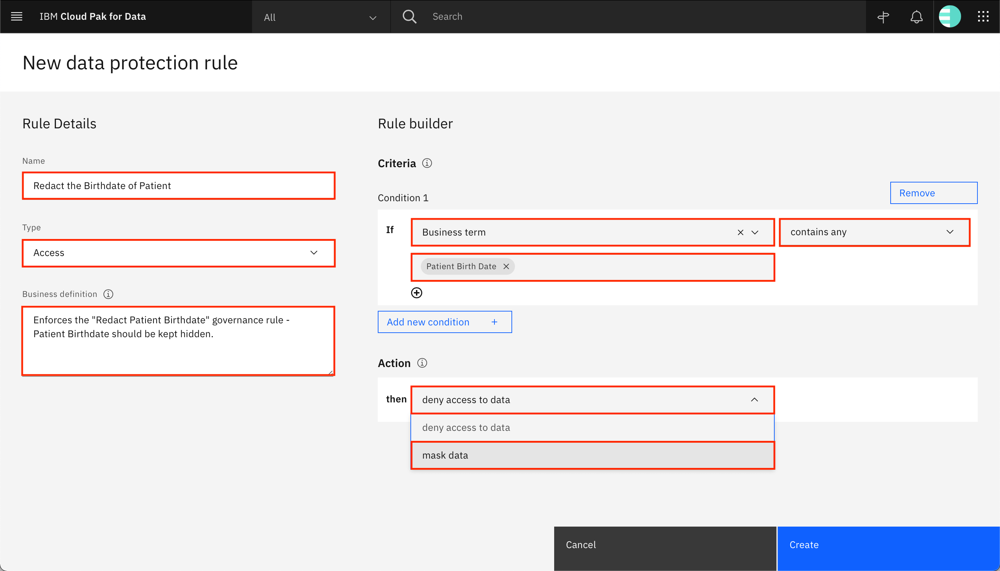

1. 新しいフィールドが画面に表示されます。値を入力・選択して**Action**を更新し、"then `mask data in columns containing Business term Patient Birth Date`"という形式にします。**データをマスクする方法を選択してください**で、**再編集**を選択します。*再演*ボックス内の値にカーソルを合わせると、マスキング後の値が表示されます。「作成」をクリックします。

    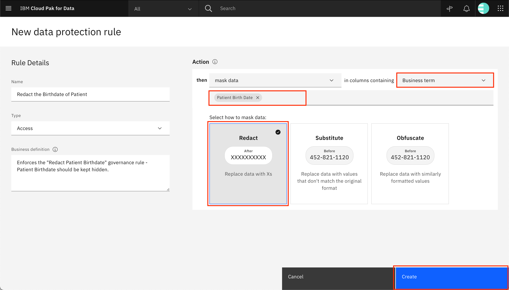

1. ルールが保存され、画面に表示されます。パンくずリストの**Rules**をクリックすると、Rulesページに戻ります。

    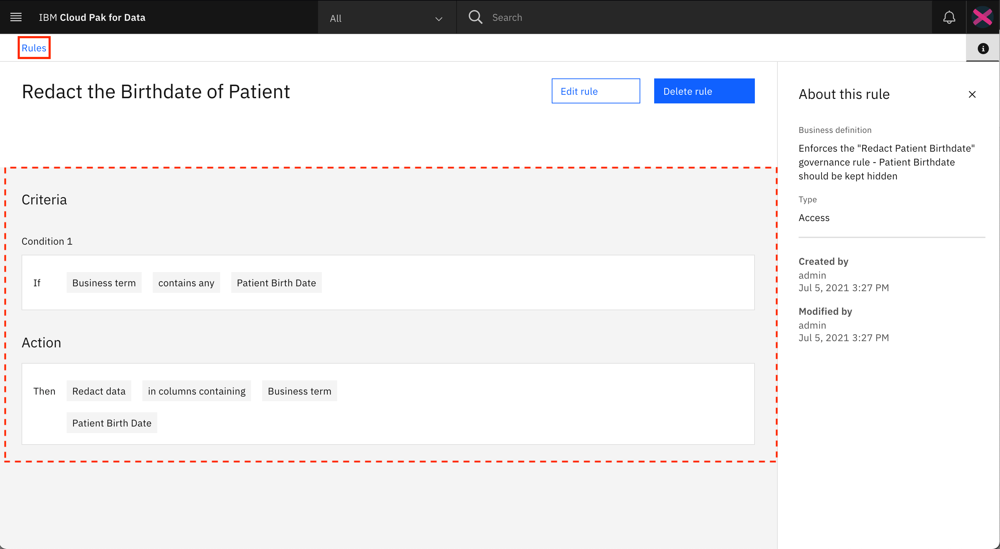

## Step 3.置換するデータにデータ保護ルールを追加する

データ保護ルールを使用して、データを置換する方法を確認します。この方法では、元の形式とは一致しない値でデータを置換します。ただし、置換されたデータのある列で、ある値が何度も使用されている場合は、同じ置換値に置き換えられます。このように、このデータのマスキング方法では、データを元のフォーマットに保つことはできませんが、データの参照整合性を保つことができます。

人種、民族、性別などのセンシティブな個人情報をマスクするという「センシティブな個人情報をマスクする」というガバナンスルールを実施するためのデータ保護ルールを作成してみましょう。

1. 「ルール」ページで、「**ルールの追加」>「新しいルール」**をクリックします。

    

1. 「データ保護ルール」をクリックします。

    をクリックします。

1. ルールの名前(`Hide Sensitive Personal Information`)を入力し、ルールの種類を **Access** にして、ルールの説明を入力します。右側で、"If `Business term contains any Patient Race Patient Ethnicity Patient Gender`"という条件を構成する値を選択して入力し、*Condition 1*を作成します。**Action**では、**deny access to data**をクリックしてドロップダウンメニューを開き、**mask data**をクリックします。

    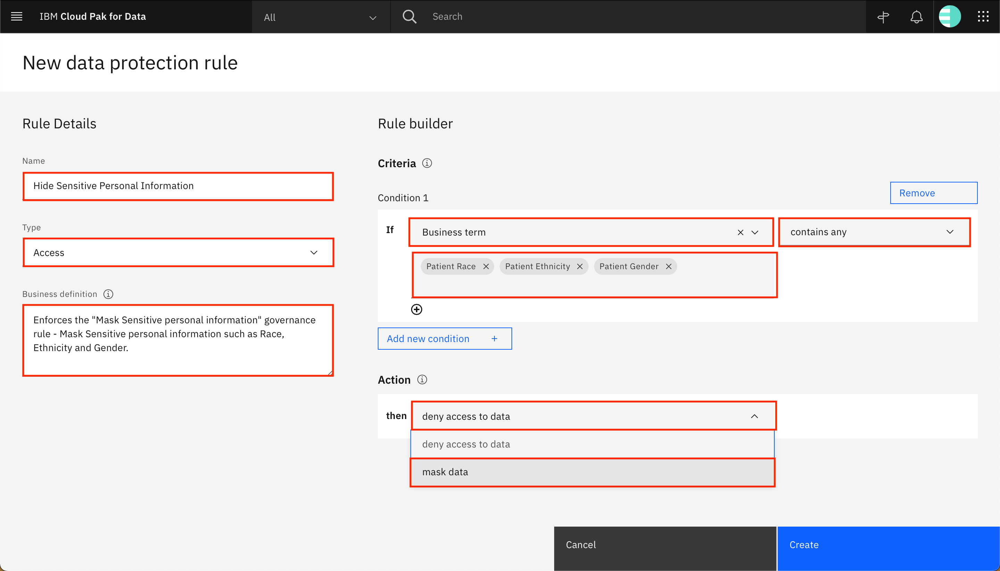

1. 新しいフィールドが画面に表示されます。値を入力・選択して**Action**を更新し、「then `mask data in columns containing Business term Patient Race Patient Ethnicity Patient Gender`」の形にします。**データをマスクする方法を選択する**で、**Substitute**を選択します。*Substitute*ボックス内の値にカーソルを合わせると、マスキング後の値が表示されます。「作成」をクリックします。

    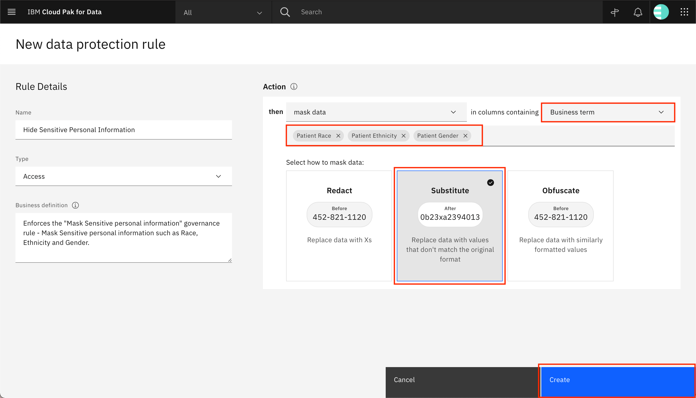

1. ルールが保存され、画面に表示されます。パンくずリストの**Rules**をクリックすると、Rulesページに戻ります。

    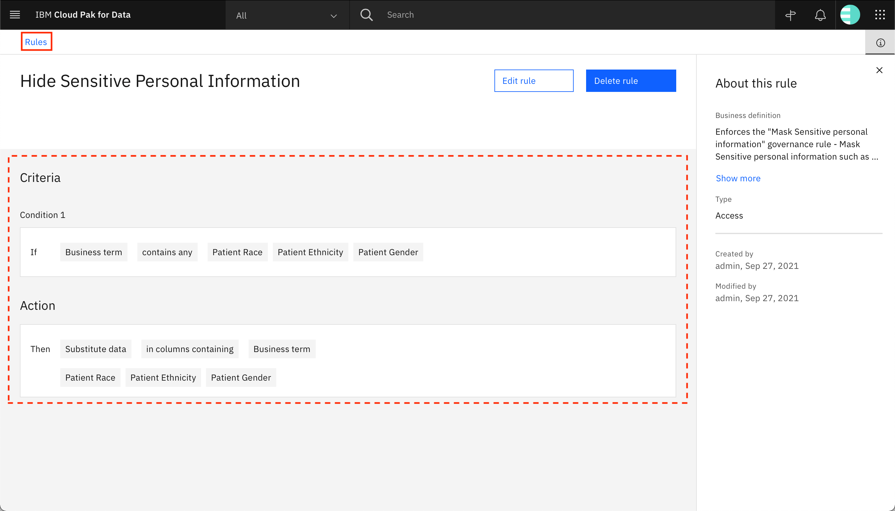

## Step 4.データを難読化するデータ保護ルールの追加

次に、データ保護ルールを使って、データを難読化する方法を見てみましょう。この方法では、データを同様の形式の値に置き換えます。ただし、参照整合性やデータの分散は保持されません。したがって、クレジットカード番号や銀行口座番号などの金融口座情報、パスポート番号や社会保障番号などの政府の身分証明書、電話番号や電子メールアドレスなどの連絡先情報などのデータをマスキングするのに適した方法です。

ここでは、社会保障番号をダミーの値に置き換えるという「社会保障番号のマスク」というガバナンスルールを実施するデータ保護ルールを作成します。

1. 「ルール」ページで、**「ルールの追加」>「新しいルール」**をクリックします。

    

1. 「データ保護ルール」をクリックします。

    をクリックします。

1. ルールの名前(`Hide Social Security Number`)を入力し、ルールの種類を **Access** にして、ルールの説明を入力します。右側に、"If `Data class contains any US Social Security Number`. "という条件を構成する値を選択して入力し、*Condition 1*を作成します。**Action**では、**deny access to data**をクリックしてドロップダウンメニューを開き、**mask data**をクリックします。

    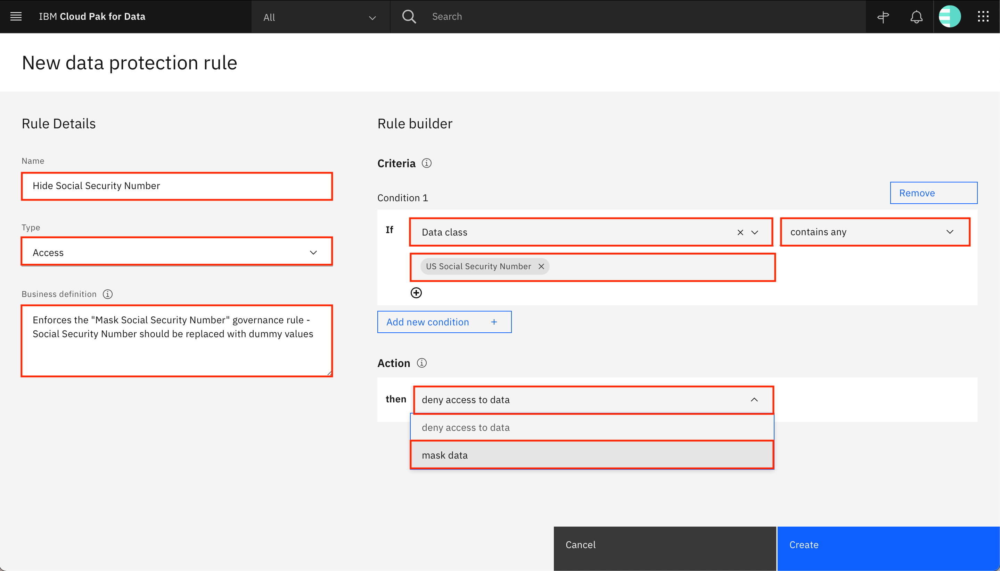

1. 新しいフィールドが画面に表示されます。値を入力・選択して**Action**を更新し、"then `mask data in columns containing Data class US Social Security Number`"という形式にします。**データをマスクする方法を選択してください**で、**難読化**を選択します。[難読化]ボックス内の値にカーソルを合わせたり離したりすると、[前]と[後]の値のデータ形式がマスキング後も同じであることがわかります。「作成」をクリックします。

    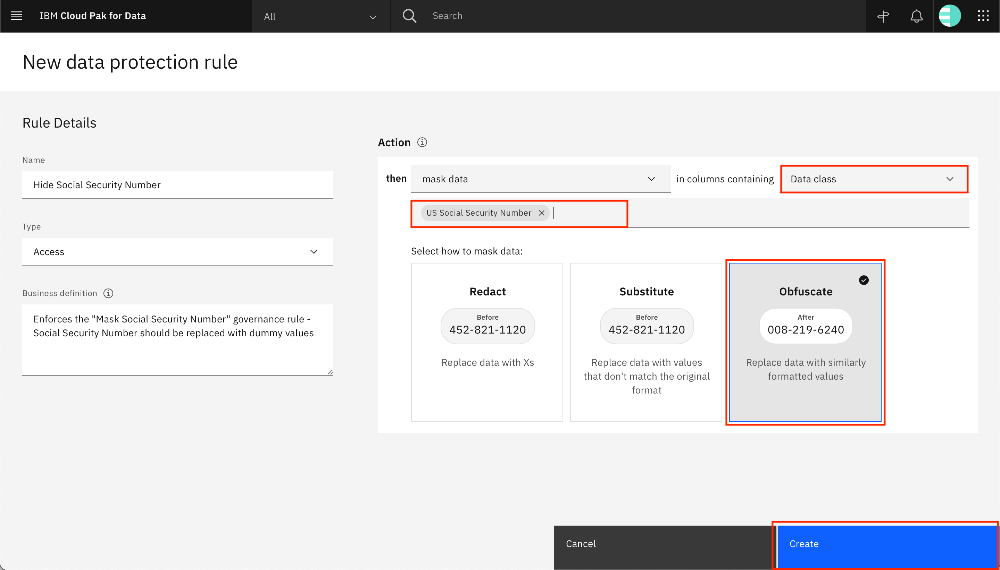

1. ルールが保存され、画面に表示されます。

    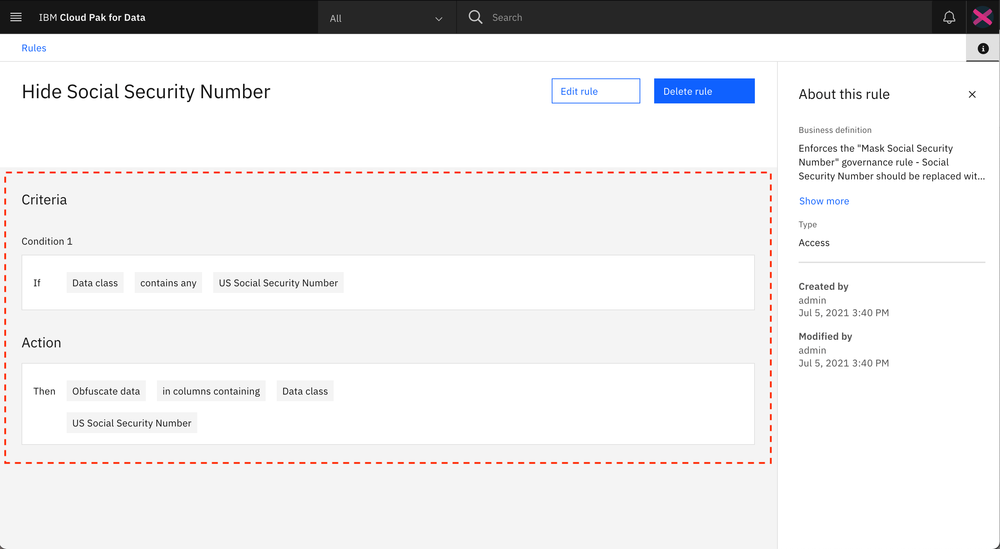

## Step 5.デフォルトカタログへのアセットの発行

ここまでで、アセットの検出と分析の手順が完了し、データを保護するためのルールも組み込まれました。次に、アセットをカタログに公開して、他のユーザーがこれらのアセットを利用できるようにします。

1. 左上の**ハンバーガー**メニューを開き、**ガバナンス**を展開し、**データ品質**をクリックします。あなたの **HealthcareAnalysis** プロジェクトのタイルをクリックします。

    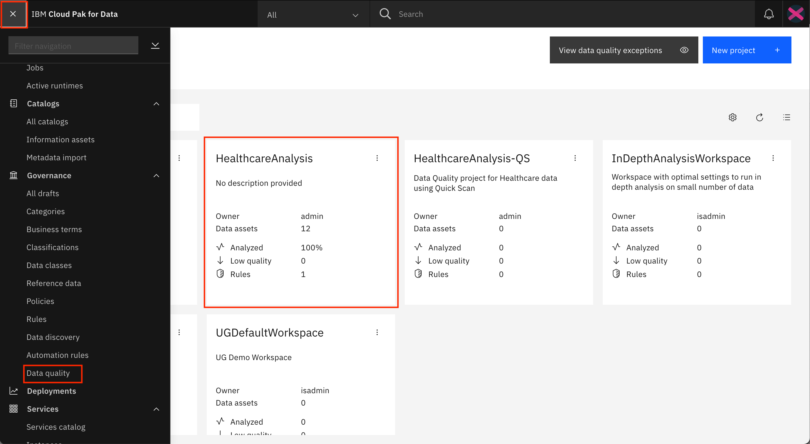をクリックします。

1. すべてのアセットを選択して、**Publish +**をクリックします。

    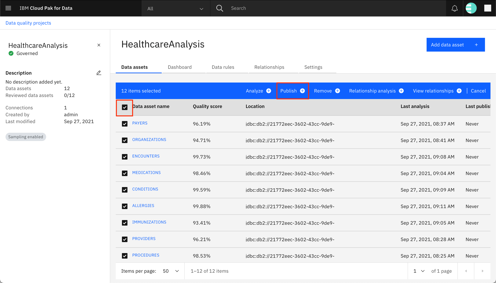

1. ポップアップウィンドウで、**Publish**をクリックします。

    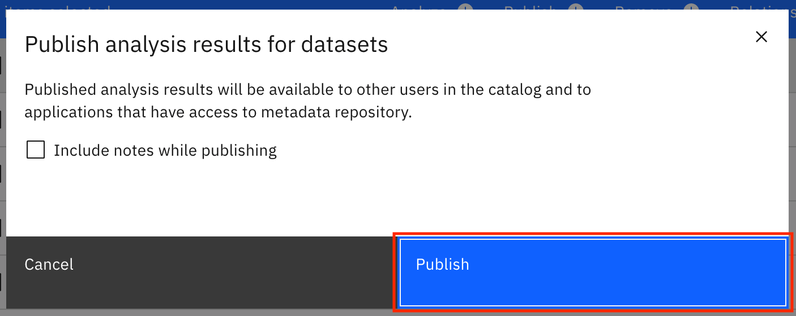をクリックします。

1. アセットがデフォルトのカタログに公開されます。**Refresh**アイコンをクリックしてテーブルを更新すると、アセットの最終公開日が更新されていることを確認できます。

    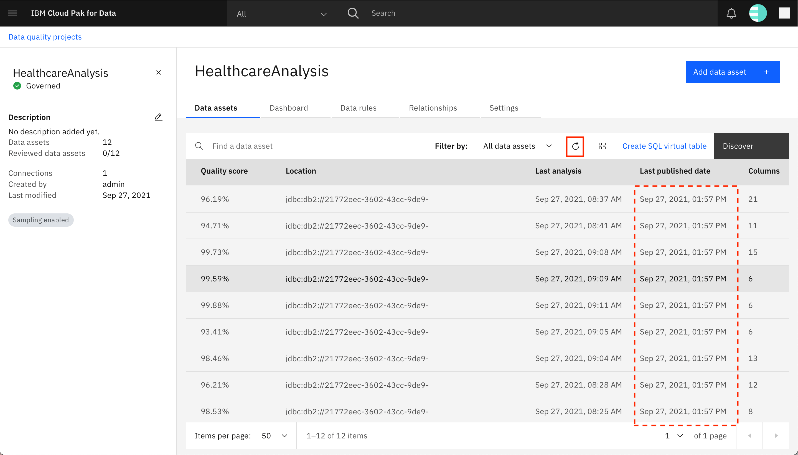

1. 左上の**ハンバーガー（☰）**メニューに移動し、**Catalogs**を展開し、**All catalogs**をクリックします。

    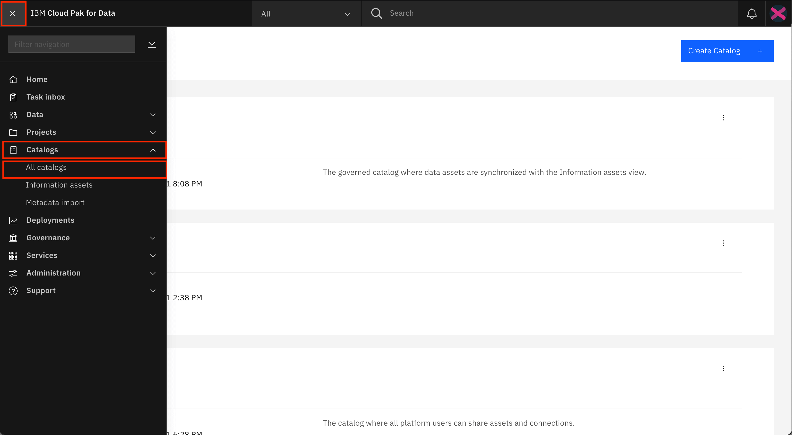

1. 1. **Default Catalog**のタイルをクリックします。

    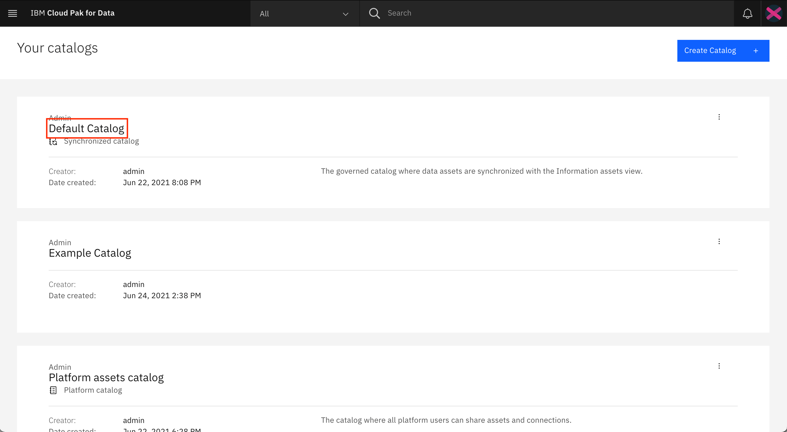をクリックします。

1. アセットがカタログに表示されます。

    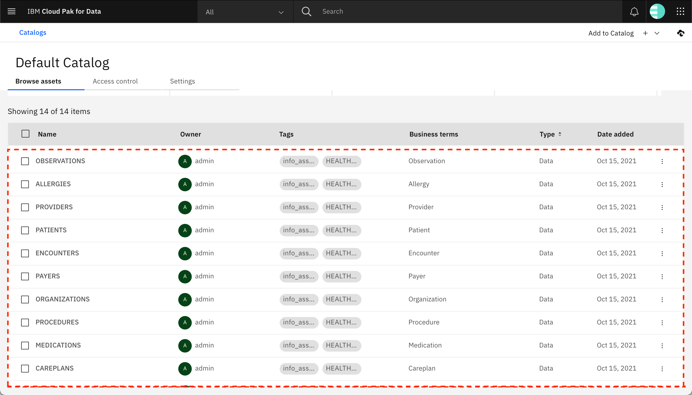

## ステップ6.コラボレーターをデフォルトカタログに追加する

デフォルトでは、デフォルトカタログには**admin**ユーザーのみがアクセスできます。他のユーザーがカタログやカタログ内のアセットにアクセスできるようにするには、カタログにコラボレーターとして追加する必要があります。

1. 「**Access Control」タブを開き、「Add collaborators +**」をクリックします。

    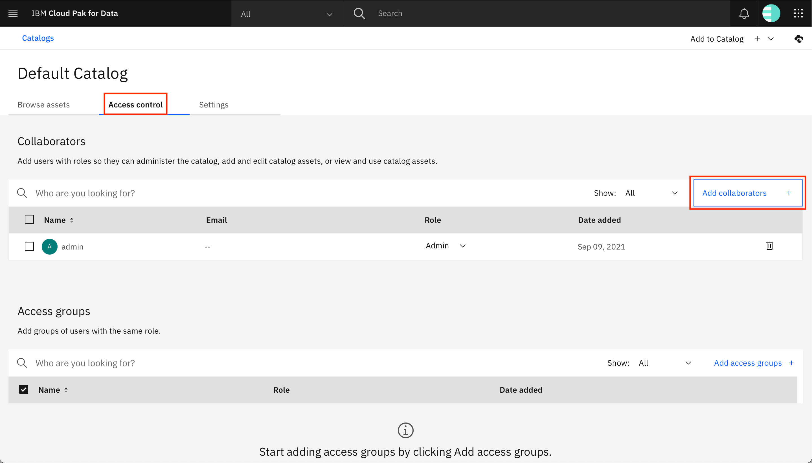

1. ポップアップウィンドウで、新しいユーザーに提供するロールを選択します（このチュートリアルでは**Viewer**で十分です）。**Collaborators**で、デフォルトのカタログに共同作業者として追加したいユーザーを検索して選択し、**Add**をクリックします。

    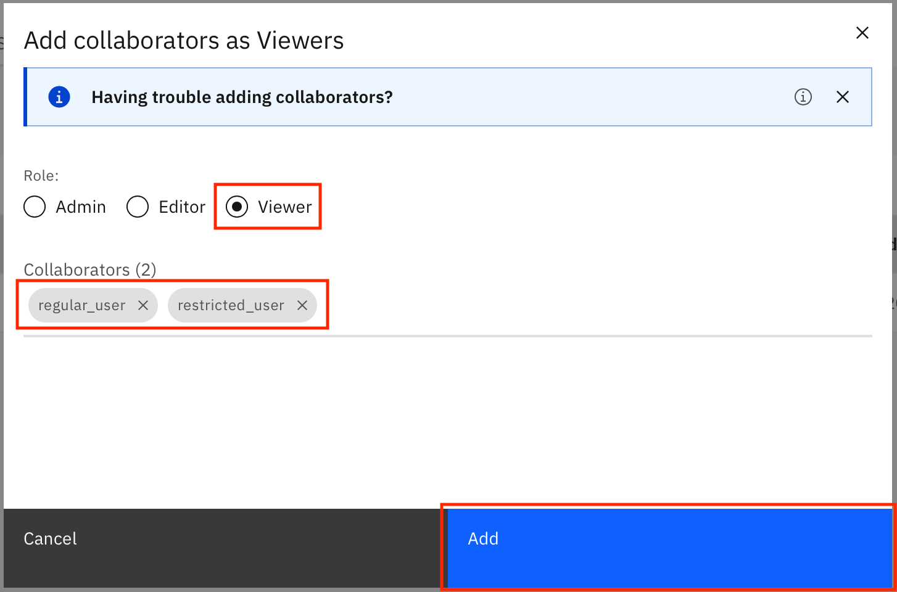
    
    **注意**:カタログには、最低2人の非管理者ユーザーを追加する必要があります。そのうちの1人は、[Step 1: Add data protection rule to deny access](#step-1-add-data-protection-rule-toeny-access)で定義したルールで指定したユーザーです。

1. 新しく追加されたユーザーは、デフォルトカタログの**アクセス制御**タブの共同作業者のリストに表示されます。

    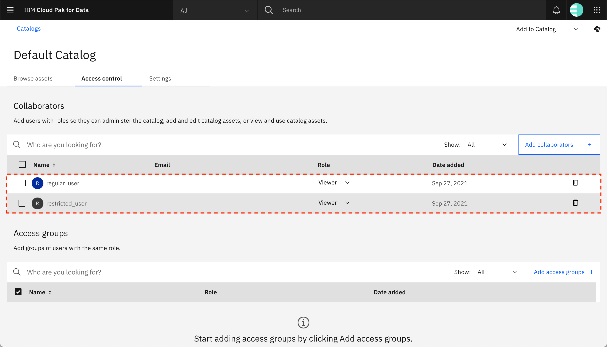

## Step 7.データ保護ルールが適用されていることを確認する

デフォルトのカタログへのアクセス権を与えられた管理者以外のユーザーとしてログインし、データ保護ルールが適用されているかどうかを確認できます。

1. IBM Cloud Pak for Dataからログアウトし、[Step 1: Add data protection rule to deny access](#step-1-add-data-protection-rule-toeny-access)で定義したルールで指定したユーザーである**restricted_user**でログインし直します。

1. 左上の**ハンバーガー**メニューで**Catalogs**を展開し、**All catalogs**をクリックします。

    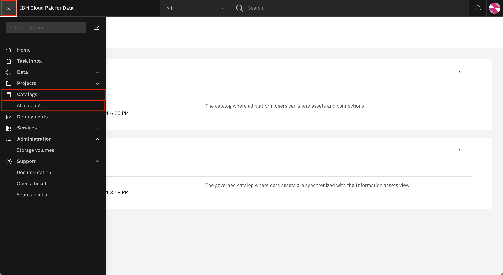

1. 1. **Default Catalog**タイルをクリックします。

    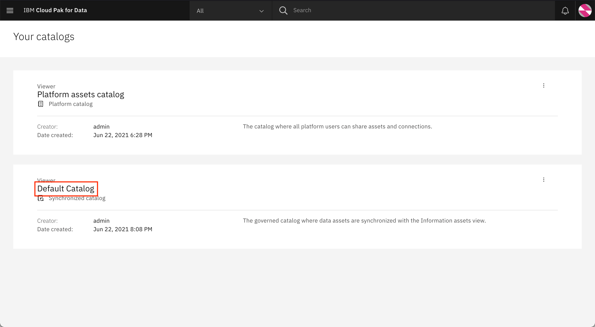をクリックします。

1. ページの一番下までスクロールすると、カタログのアセットが表示されます。**PATIENTS**をクリックします。

    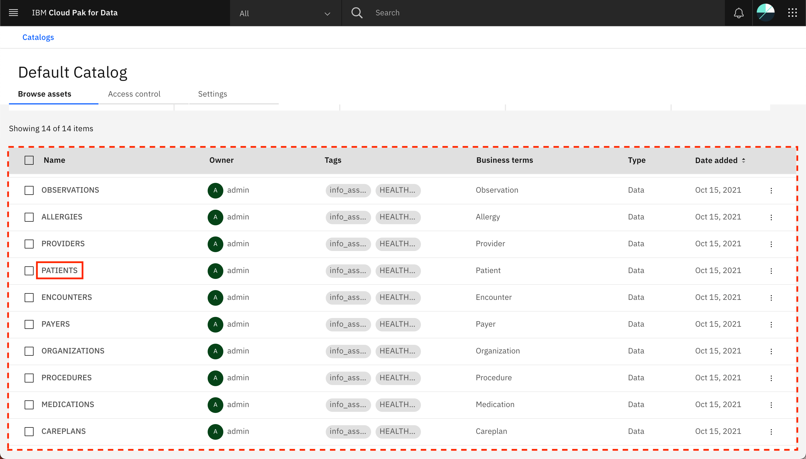

1. Restrict access Passport and Drivers Licenseデータ保護ルールによってブロックされているため、ユーザーがPATIENTSアセットを表示できないというエラーが表示されます。

    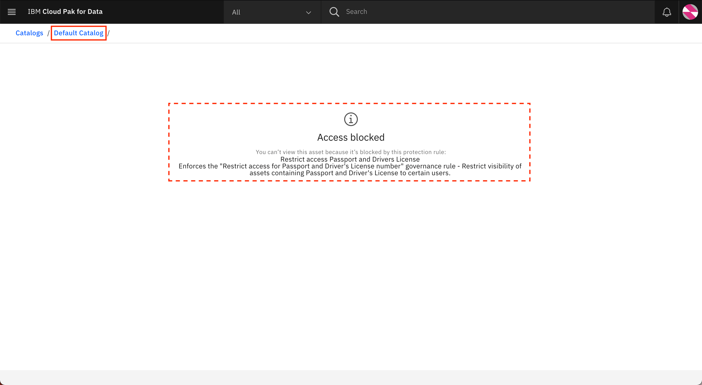

1. ブレッドクラムを使用して**Default Catalog**に戻り、**ENCOUNTERS**などの別のアセットにアクセスしようとすると、そのアセットのコンテンツを見ることができるはずです。これは、ユーザーはDriver's License（運転免許証）またはPassport（パスポート）フィールドを含むアセットへのアクセスを拒否されているだけで、ENCOUNTERSアセットにはそれらが存在しないためです。

    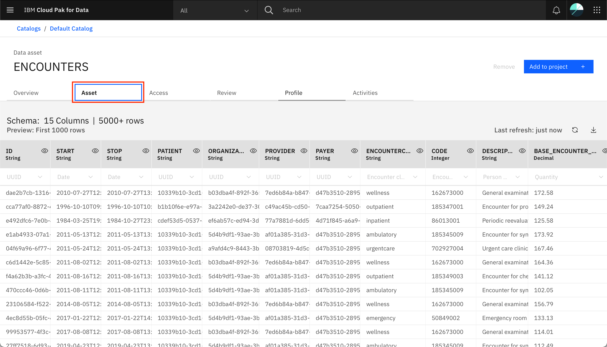

1. IBM Cloud Pak for Data からログアウトし、デフォルトのカタログにコラボレーターとして追加されたもう 1 人のユーザーである **regular_user** としてログインし直します。

1. 前と同様に、左上の**ハンバーガー（☰）**メニューに行き、**Catalogs**を展開して、**All catalogs**をクリックします。

    

1. 1. **Default Catalog**タイルをクリックします。

    をクリックします。

1. ページの一番下までスクロールして、カタログのアセットを確認し、**PATIENTS**をクリックします。

    

1. 今回は、このユーザーがデータへのアクセスを拒否されていないため、PATIENTSアセットが画面に読み込まれているはずです。**Asset**タブに移動します。アセットのプレビューが画面に読み込まれます。データがマスクされるまで時間がかかる場合がありますが、その場合は通知が表示されます。画面上では、5つの列がマスキングされていることが確認できます。**Lock**アイコンをクリックすると、マスクされた列の詳細が表示されます。1つの列は難読化され、3つの列は置換され、1つの列は再編集されています。

    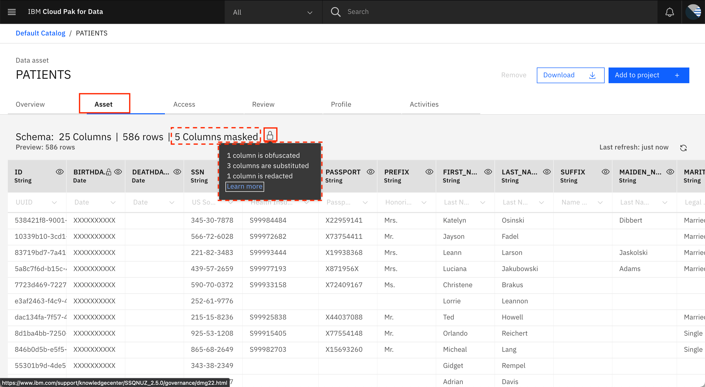

1. 「BIRTHDATE」と「SSN」の列を見てください。これらの列には、列名の横にロックアイコンが付いています。これは、これらの列がマスクされていることを示しています。ロックアイコンをクリックすると、マスクされている列の詳細が表示されます。例えば、BIRTHDATEの近くにあるロックアイコンは、この列の値とフォーマットが「Redact the Birth Date of Patient」データ実施ルールによって再編集されていることを示しています。すべてのBIRTHDATEの値が10個のX文字の文字列に置き換えられていることがわかります。SSNについては、値が難読化されています。つまり、同じフォーマットの他の値に置き換えられています。したがって、実際のSSN値は隠されますが、フィールドのフォーマットは維持されます。

    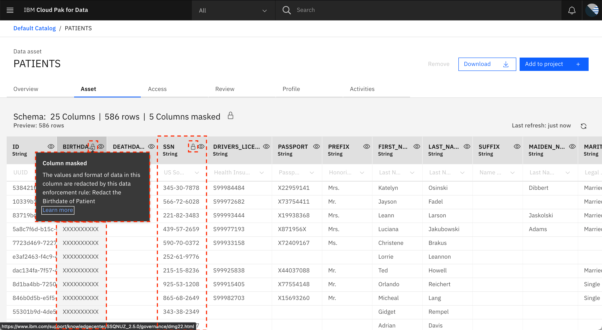

1. 右側にスクロールして、「RACE」、「ETHNICITY」、「GENDER」の各列を見てください。これらの列のデータは、元のフィールドの形式とは一致しない値で置き換えられています。しかし、それぞれの列では、同じ値が複数回出現していることがわかります。これは、列内で出現するすべての値が同じテキストに置き換えられているためです。これにより、列の参照整合性が保たれます。

    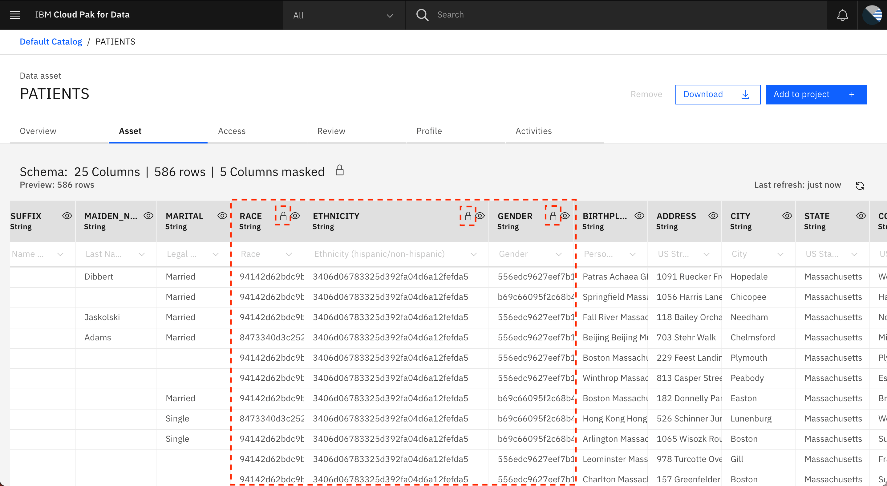

## まとめ

このチュートリアルでは、IBM Cloud Pak for Data 上の Watson Knowledge Catalog 内でデータ保護ルールを使用する方法を学びました。医療データにデータ保護ルールを追加して、特定のユーザーにデータの利用を制限しました。また、他のデータ保護ルールを追加して、一部のデータを他のデータに置き換えて隠すようにしました。これにより、ユーザーは実際のデータを見ることはできませんが、存在する列を見ることができ、使用されたデータマスキングのタイプに基づいて、それらの列のフォーマットやテーブル参照についても知ることができます。最後に、データ資産をデフォルトカタログに公開し、データ資産の所有者ではない他のユーザーとしてログインすることで、資産とデータへのアクセス権があることを確認することで、データ保護ルールが実施されていることを確認しました。

このチュートリアルは、[An introduction to the DataOps discipline](https://developer.ibm.com/articles/an-introduction-to-the-dataops-discipline)シリーズの一部です。