---
also_found_in:
- learningpaths/dataops-fundamentals/
authors: ''
completed_date: '2021-07-20'
components:
- cloud-pak-for-data
draft: false
excerpt: Protect enterprise data using data privacy features such as data protection
  rules within the Watson Knowledge Catalog on IBM Cloud Pak for Data.
last_updated: '2021-09-27'
meta_description: Protect enterprise data using data privacy features such as data
  protection rules within the Watson Knowledge Catalog on IBM Cloud Pak for Data.
meta_keywords: privacy,data
meta_title: Protect your data using data privacy features
primary_tag: analytics
subtitle: Enforce proper management and use of data as per the organization's guidelines
  and regulations
tags:
- data-management
title: Protect your data using data privacy features
---

In recent years, there has been a resurgence of privacy regulations worldwide. Enterprises are struggling to comply with complex regulatory requirements regarding data privacy as well as individuals' demand for the privacy of their data.

There are serious consequences of improper protection of data. Data breaches and non-compliance of regulatory requirements can cause fines and penalties to be imposed on the enterprises. In addition, they can result in a loss of customer loyalty, loss of revenue, and lawsuits, and can damage the enterprise's brand.

In this tutorial, you learn to protect enterprise data by using data privacy features such as data protection rules within the Watson Knowledge Catalog on IBM Cloud Pak for Data.

## Learning objectives

In this tutorial, you:

* Add data protection rules that enforce the restrictions that are specified in the policies and governance rules you previously imported
* Publish data to a governed catalog
* Log in as various users to verify that the data protection rules are enforced

## Prerequisites

* [IBM Cloud Pak for Data v4.0](https://www.ibm.com/products/cloud-pak-for-data).
* [Watson Knowledge Catalog on Cloud Pak for Data](https://www.ibm.com/docs/en/cloud-paks/cp-data/4.0?topic=services-watson-knowledge-catalog).
* Completion of the steps in [Analyze discovered data to gain insights on the quality of your data](https://developer.ibm.com/tutorials/analyze-discovered-data-to-gain-insights-on-the-quality-of-your-data).
* You must create two non-admin users in your IBM Cloud Pak for Data instance to verify the results of applying the data privacy rules. In this tutorial, the user called *regular_user* represents regular users, and *restricted_user* represents users that have some additional access restrictions. Provide the **User** and **Developer** roles to both of the users so that they can access catalogs and assigned services.

## Estimated time

It should take you approximately 60 minutes to complete the tutorial.

## Step 1. Add data protection rule to deny access

Start by creating a data protection rule that prevents the users specified in the rule from viewing data.

Here, you create a data protection rule to enforce the "Restrict access for Passport and Driver's License number" governance rule, which says to restrict visibility of assets with these fields to certain users (in this case, restricted_user).

1. Log in to your IBM Cloud Pak for Data instance.

    

1. Go to the **hamburger (☰)** menu in the upper left, expand **Governance**, and click **Rules**.

    

1. Click **Add rule > New rule**.

    

1. Click **Data protection rule**.

    

1. Provide a name for the rule (`Restrict access - Passport and Drivers License`), select the type of the rule as **Access**, and provide a description for the rule. On the right side, create the first portion of *Condition 1* by selecting and typing out the values to form the condition "If `Data class contains any Passport`." Click the **+** sign to add an additional section within the condition. Choose **OR** to join the two sections, and update the second section by typing and selecting the values to form "`Business term contains any Patient Driver's License`." This condition states that the rule should be run if the data class of an object is Passport or if the business term of the object is Patient Driver's License.

    

1. Click **Add new condition +**.

1. A new condition (*Condition 2*) is added. Choose **AND** to join the two conditions and update *Condition 2* by typing and selecting the values to form "If `User name contains any`." Click **Add users +**.

    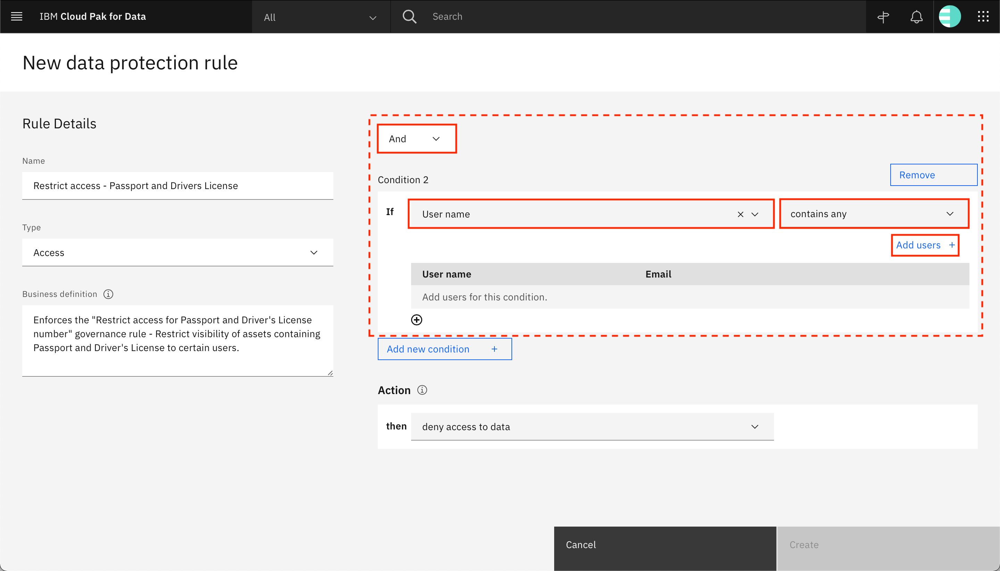

1. In the pop-up window, select **restricted_user**, and click **Add**.

    
    
    **Note**: **restricted_user** represents a user that exists in your system, whom you want to deny access to any data that has the Passport data class or the Patient Driver's License business term.

1. The condition 2 now reads "If User name contains any restricted_user." This condition states that the rule should be run if the user that is trying to access the data is the **restricted_user**. Finally, choose the *Action* to be taken as **deny access to data**, and click **Create**.

    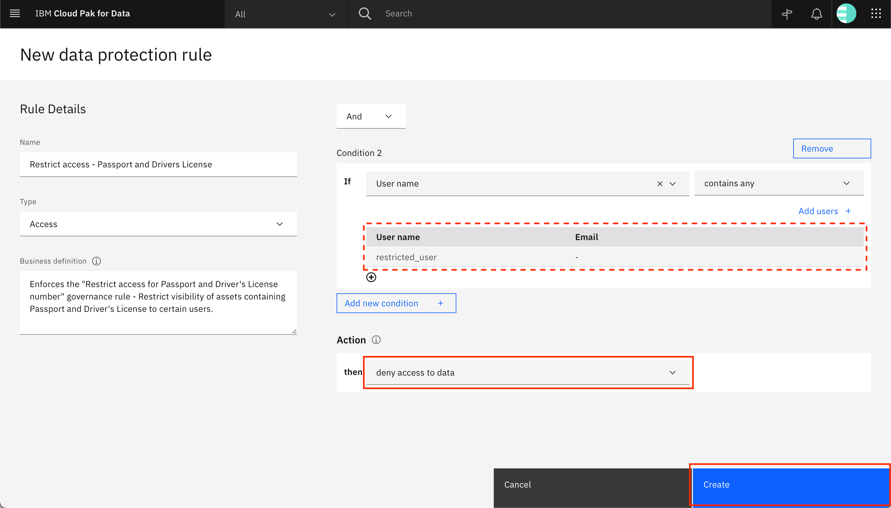

1. The rule is saved and is displayed on the screen. Click **Rules** in the breadcrumb to return to the Rules page.

    

## Step 2. Add data protection rule to redact data

Next, see how data can be redacted by using data protection rules. This method replaces the data in the column with a string of exactly 10 X characters. While this method helps in hiding the data, it does not retain the original format of the data. Because all of the values are replaced with 10 X characters, it also loses referential integrity of the data, so if the column was used as a foreign key reference to some other table, that foreign key reference is lost when the data is redacted.

You'll create a data protection rule to enforce the "Redact Patient Birthdate" governance rule, which says that the patient birthdate should be kept hidden.

1. From the Rules page, click **Add rule > New rule**.

    

1. Click **Data protection rule**.

    

1. Provide a name for the rule (`Redact the Birthdate of Patient`), select the type of the rule as **Access**, and provide a description for the rule. On the right side, create *Condition 1* by selecting and typing out the values to form the condition "If `Business term contains any Patient Birth Date`." Under **Action**, click **deny access to data** to open the drop-down menu, and click **mask data**.

    

1. New fields are displayed on the screen. Update the **Action** by typing and selecting the values to form "then `mask data in columns containing Business term Patient Birth Date`." Under **Select how to mask data**, choose **Redact**. Hovering over the value within the *Redact* box shows you what the value would look like after masking. Click **Create**.

    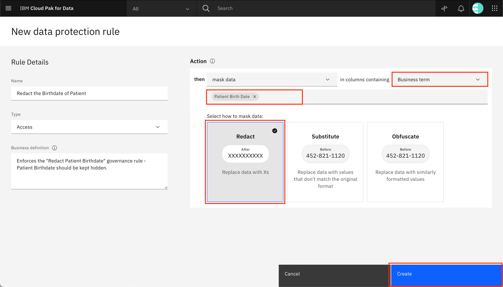

1. The rule is saved and is displayed on the screen. Click **Rules** in the breadcrumb to go back to the Rules page.

    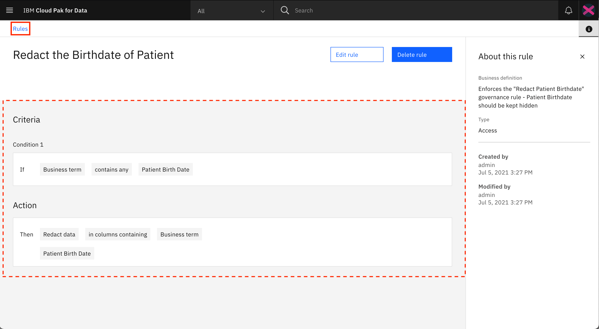

## Step 3. Add data protection rule to substitute data

See how data can be substituted by using data protection rules. This method replaces data with values that do not match the original format. However, if a value is used several times in a column with substituted data, it is replaced with the same substitution value. Thus, this method of masking data does not keep the data in the original format, but preserves referential integrity of the data.

Let's create a data protection rule to enforce the "Mask Sensitive personal information" governance rule, which says to mask sensitive personal information such as race, ethnicity, or gender.

1. From the Rules page, click **Add rule > New rule**.

    

1. Click **Data protection rule**.

    

1. Provide a name for the rule (`Hide Sensitive Personal Information`), select the rule type as **Access**, and provide a description for the rule. On the right side, create *Condition 1* by selecting and typing out the values to form the condition "If `Business term contains any Patient Race Patient Ethnicity Patient Gender`." Under **Action**, click **deny access to data** to open the drop-down menu, then click **mask data**.

    

1. New fields are displayed on the screen. Update the **Action** by typing and selecting the values to form "then `mask data in columns containing Business term Patient Race Patient Ethnicity Patient Gender`". Under **Select how to mask data**, choose **Substitute**. Hovering over the value within the *Substitute* box shows you what the value would look like after masking. Click **Create**.

    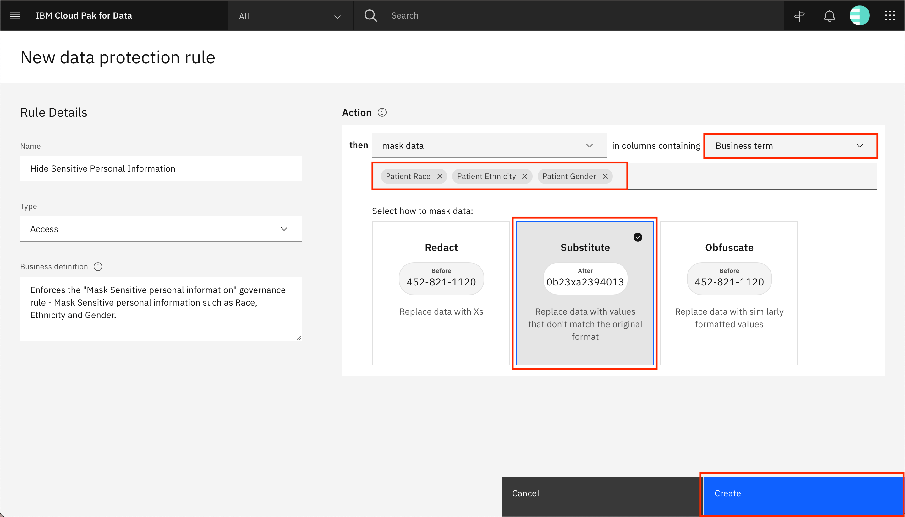

1. The rule is saved and is displayed on the screen. Click **Rules** in the breadcrumb to return to the Rules page.

    

## Step 4. Add data protection rule to obfuscate data

Next, see how data can be obfuscated by using data protection rules. This method replaces data with similarly formatted values. However, it does not preserve referential integrity or data distribution. Thus, this is a good method of masking data such as financial account information like credit card numbers and bank account numbers, government identity documents such as passport numbers and Social Security numbers, or contact details like phone numbers and email addresses.

Here, you create a data protection rule to enforce the "Mask Social Security Number" governance rule, which says that the Social Security number should be replaced with dummy values.

1. From the Rules page, click **Add rule > New rule**.

    

1. Click **Data protection rule**.

    

1. Provide a name for the rule (`Hide Social Security Number`), select the rule type as **Access**, and provide a description for the rule. On the right side, create *Condition 1* by selecting and typing out the values to form the condition "If `Data class contains any US Social Security Number`." Under **Action**, click **deny access to data** to open the drop-down menu, and click **mask data**.

    

1. New fields are displayed on the screen. Update the **Action** by typing and selecting the values to form "then `mask data in columns containing Data class US Social Security Number`." Under **Select how to mask data**, choose **Obfuscate**. Hovering over and moving away from the value within the *Obfuscate* box, you can see that the data format for both the *Before* and *After* values are the same after masking. Click **Create**.

    

1. The rule is saved and is displayed on the screen.

    

## Step 5. Publish assets to the default catalog

You have completed the steps to discover and analyze your assets, and you have also incorporated rules to protect your data. Now, you can publish the assets to a catalog to make these assets available to other users.

1. Go to the **hamburger (☰)** menu in the upper left, expand **Governance**, and click **Data quality**. Click your **HealthcareAnalysis** project tile.

    

1. Select all of the assets, and click **Publish +**.

    

1. In the pop-up window, click **Publish**.

    

1. The assets are published to the default catalog. You can click the **Refresh** icon to refresh the table, and you should see that the last published date for the assets is updated.

    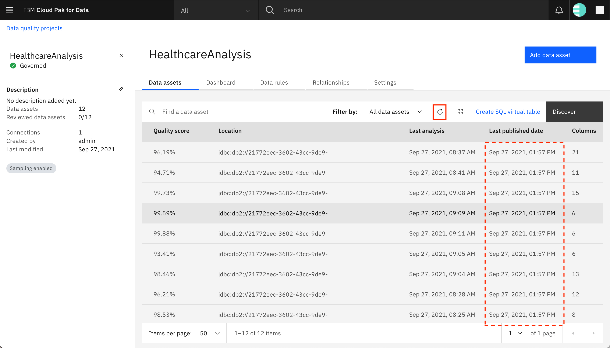

1. Go to the **hamburger (☰)** menu in the upper left, expand **Catalogs**, and click **All catalogs**.

    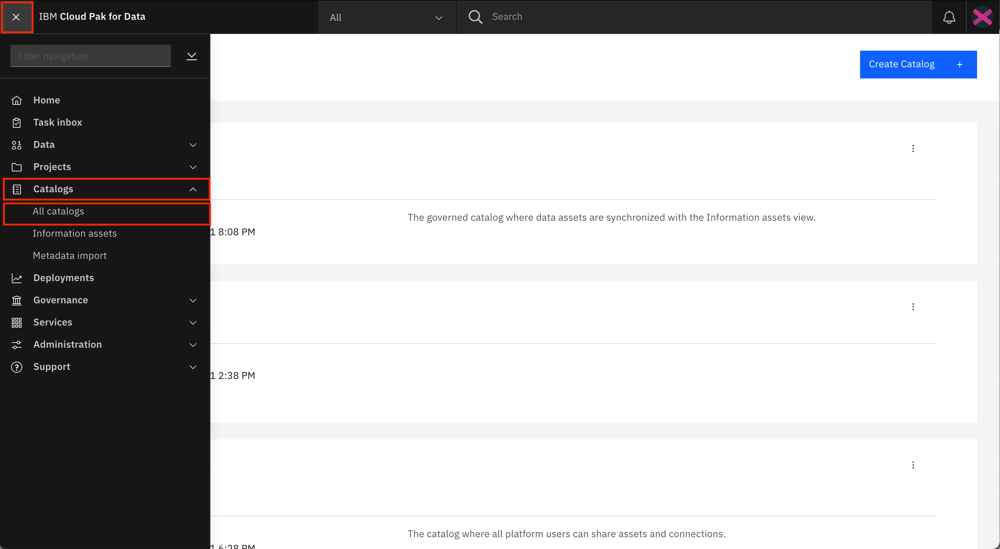

1. Click the tile for **Default Catalog**.

    

1. The assets should now be available within the catalog.

    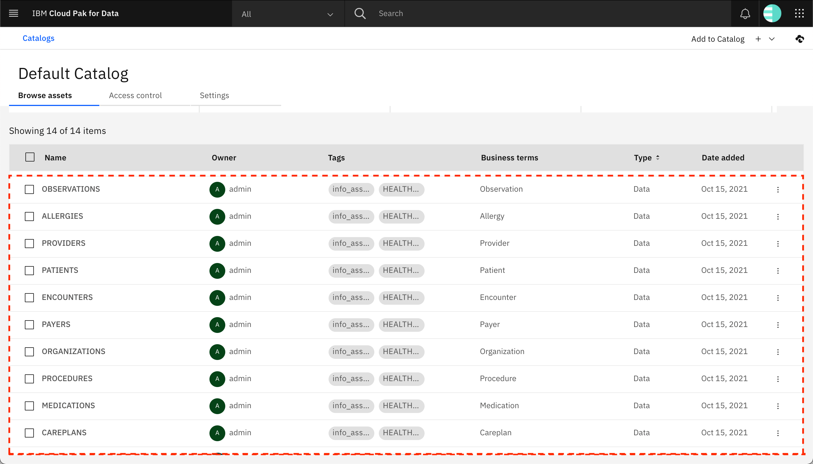

## Step 6. Add collaborators to the default catalog

By default, the default catalog can be accessed only by the **admin** user. You must add other users as collaborators to the catalog to provide them with access to the catalog and the assets within the catalog.

1. Go to the **Access control** tab, and click **Add collaborators +**.

    

1. In the pop-up window, choose the role that you want to provide to the new users (**Viewer** should suffice for this tutorial). Under **Collaborators**, search for and select the users that you want to add as collaborators to the default catalog, then click **Add**.

    
    
    **Note**: You must add a minimum of two non-admin users to the catalog, one of which was specified in the rule defined in [Step 1: Add data protection rule to deny access](#step-1-add-data-protection-rule-to-deny-access).

1. The newly added users should be displayed in the list of collaborators on the **Access control** tab of the default catalog.

    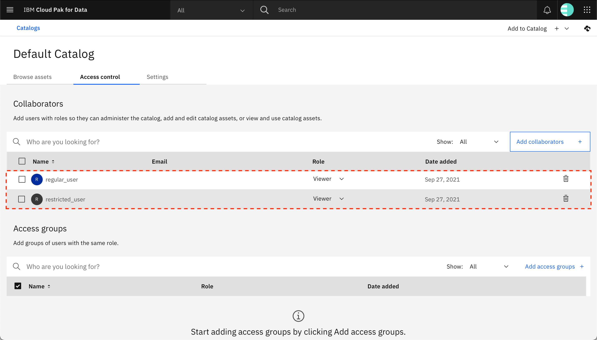

## Step 7. Verify the data protection rules are enforced

You can now log in as the non-admin users that were provided access to the default catalog and verify whether the data protection rules were enforced.

1. Log out of IBM Cloud Pak for Data and log back in as **restricted_user**, the user specified in the rule defined in [Step 1: Add data protection rule to deny access](#step-1-add-data-protection-rule-to-deny-access).

1. Go to the **hamburger (☰)** menu in the upper-left corner, expand **Catalogs**, and click **All catalogs**.

    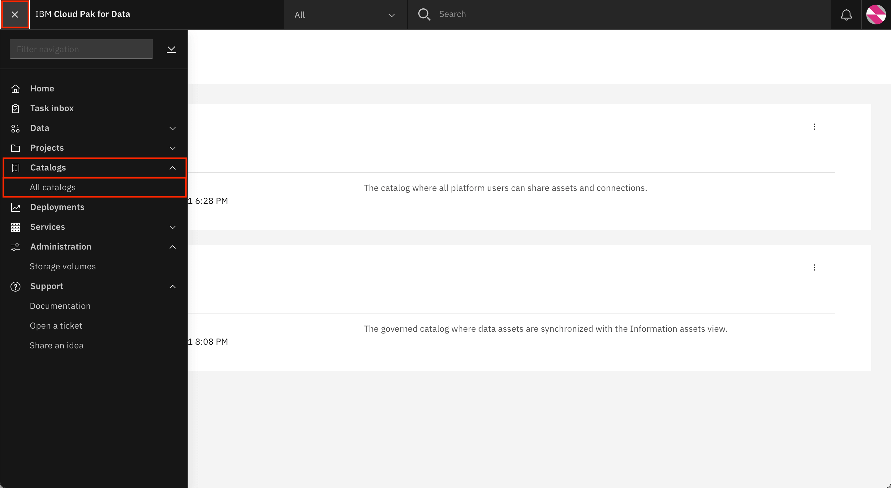

1. Click the **Default Catalog** tile.

    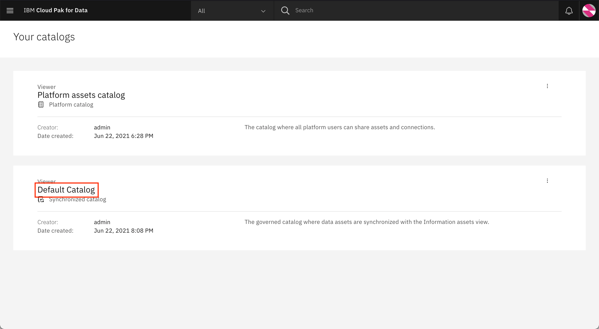

1. Scroll to the bottom of the page to see the catalog assets. Click **PATIENTS**.

    

1. You should see an error that the user cannot view the PATIENTS asset because it is blocked by the Restrict access Passport and Drivers License data protection rule.

    

1. If you return to the **Default Catalog** using the breadcrumb and try to access another asset like **ENCOUNTERS**, you should be able to see the contents of that asset. This is because the user is only denied access to the assets containing Driver's License or Passport fields, and none of them exist in the ENCOUNTERS asset.

    

1. Log out of IBM Cloud Pak for Data, and log back in as **regular_user**, the other user that was added to the default catalog as a collaborator.

1. As before, go to the **hamburger (☰)** menu in the upper left, expand **Catalogs**, and click **All catalogs**.

    

1. Click the **Default Catalog** tile.

    

1. Scroll to the bottom of the page to see the catalog assets, and click **PATIENTS**.

    

1. This time, the PATIENTS asset should be loaded on the screen because this user was not denied access to data. Go to the **Asset** tab. The asset preview is loaded on the screen. It might take a while for the data to be masked, in which case, you see a notification. You can see on the screen that five columns have been masked. Clicking the **Lock** icon provides more details about the masked columns: one column is obfuscated, three columns are substituted, and one column is redacted.

    

1. Look at the BIRTHDATE and SSN columns. Both of these have a lock icon next to the column name. This indicates that these columns have been masked. As before, clicking the **lock** icons gives you more details about the masked column. For example, the lock icon near BIRTHDATE says that the values and format in this column are redacted by the "Redact the Birthdate of Patient" data enforcement rule. You can see that all of the BIRTHDATE values are replaced by a string of 10 X characters. For SSN, the values are obfuscated -- that is, they are replaced with other values of the same format. Thus, the real SSN values are hidden, but the formatting of the field is preserved.

    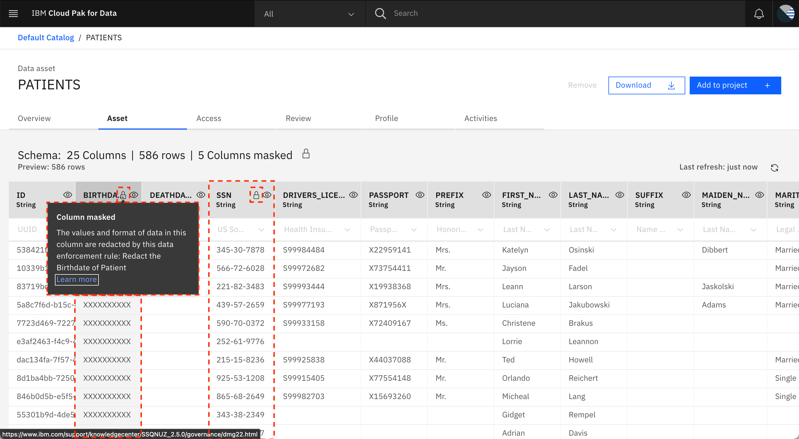

1. Scroll to the right and look at the RACE, ETHNICITY, and GENDER columns. The data in these columns has been substituted with values that do not match the original format of the fields. However, you can see that within each of these columns, the same values occur multiple times. This is because all occurrences of a value in the column are replaced with the same text. This preserves the referential integrity of the column.

    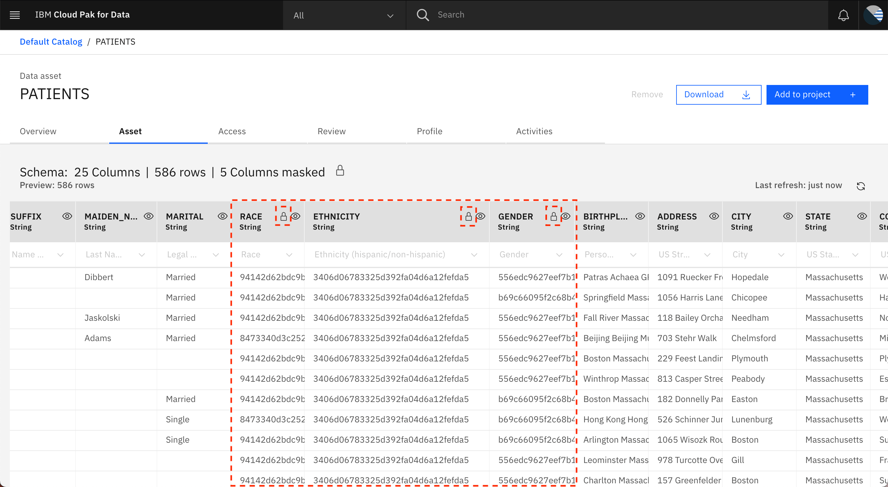

## Summary

In this tutorial, you learned to use data protection rules within Watson Knowledge Catalog on IBM Cloud Pak for Data. You added data protection rules to your healthcare data to limit the availability of the data to certain users. You added other data protection rules to hide some data by replacing it with some other data. This ensured that while the real data is not visible to users, they can view the columns that exist and based on the type of data masking used, they can also get an idea about the formats or table references of those columns. Finally, you verified that the data protection rules are enforced by publishing the data assets to the default catalog and verifying that you have access to the assets and the data by logging in as other users who are not owners of the data asset.

This tutorial is part of the [An introduction to the DataOps discipline](https://developer.ibm.com/articles/an-introduction-to-the-dataops-discipline) series.