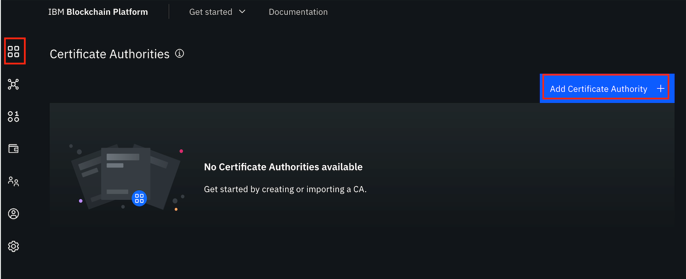
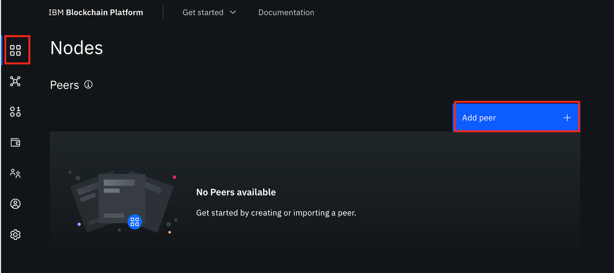
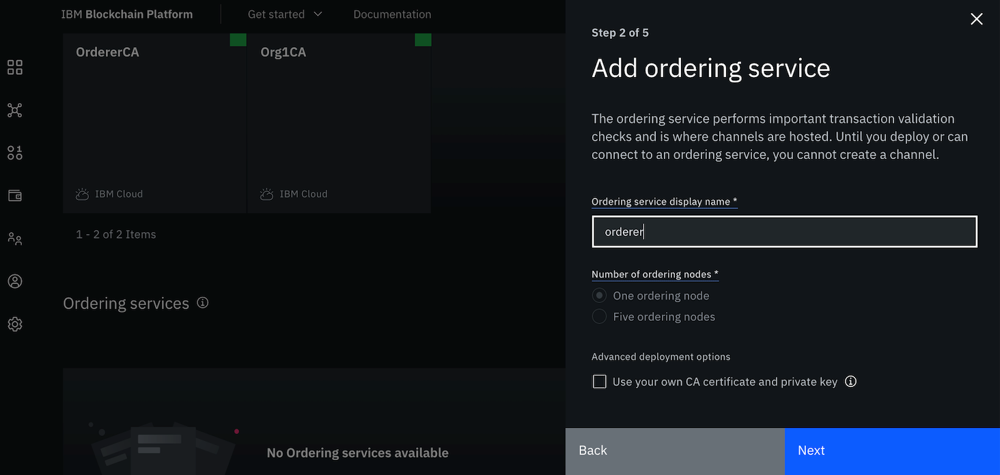
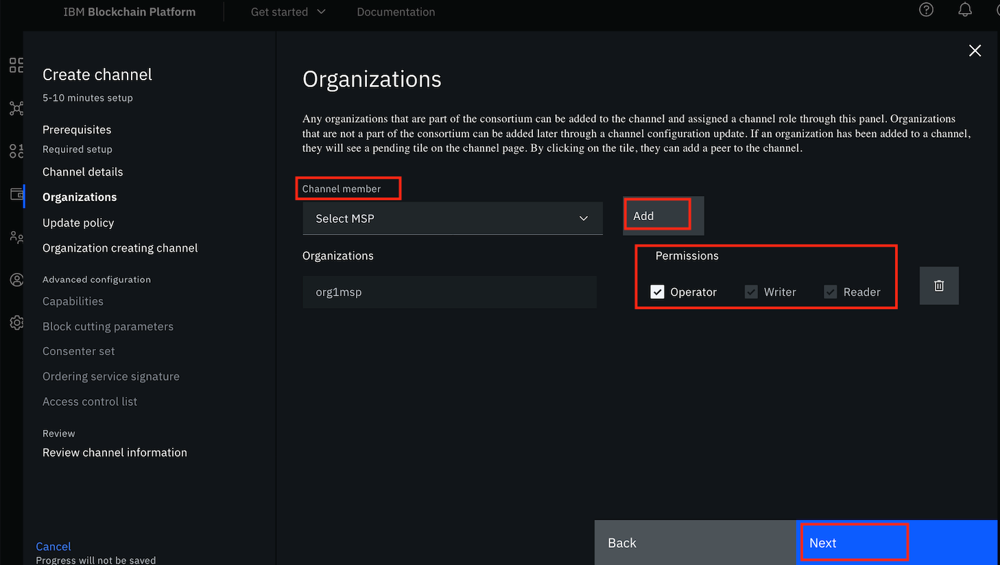

IBM Blockchain Platformは、ネットワーク・コンポーネントのデプロイメントの柔軟性、スケーラビリティ、コントロールをユーザーに提供するBlockchain-as-a-serviceのサービスです。このプラットフォームは、Hyperledger Fabric 1.4.xのコードベースを使用し、ユーザーが管理・制御するIBM Cloud Kubernetes Serviceにコンポーネントをデプロイします。ユーザー・インターフェースは、ブロックチェーン・ネットワークのコンポーネントをデプロイするプロセスを簡素化し、高速化します。このチュートリアルでは、IBM Blockchain Platformで基本的なブロックチェーン・ネットワークをセットアップする手順を説明します。

## 前提条件

このチュートリアルを完了するには、次のものが必要です。

* ブロックチェーンの基礎：Hyperledger Fabric。ブロックチェーンネットワークとその構成要素についての知識が必要です。[この記事](/articles/blockchain-basics-hyperledger-fabric/)は、Hyperledger Fabric Networkの基本を理解するのに役立ちます。
* [IBM Cloud](https://cloud.ibm.com/login?cm_sp=ibmdev-_-developer-tutorials-_-cloudreg)のアカウント。
* VS Code バージョン 1.38 以上。
* IBM Blockchain Platform extension for VS Code.
  
* 任意のサンプルのGo/Node.jsのChaincode。
* [Go 1.12.x or greater](https://golang.org/dl/) Go chaincodeを使用する場合。
* [Node v8.x or v10.x](https://nodejs.org/en/download/) and npm v6.x or greater if using Node.js chaincode.

## 見積もり時間

Kubernetes クラスターのデプロイには、IBM Blockchain Platform のセットアップにかかる時間に加えて、約 25 ～ 30 分かかります。すでにKubernetesクラスターが存在する場合は、このチュートリアルを完了するのに約60分かかります。

## ステップ

ブロックチェーンソリューションを設計する最初のステップとして、ブロックチェーンコンソーシアム（言い換えれば、ブロックチェーンネットワークの参加者）を決定する必要があります。ブロックチェーンネットワークの構成要素（組織の数、各組織のピアの数、発注者、認証局（CA）など）を決めたら、クラウド上でネットワークの設定を始めます。あなたのブロックチェーンネットワークの構造が次の図のようなものであれば、この構造が示すように、次のものを作成する必要があります。

* 3つのCA
* 3つのメンバーシップ・サービス・プロバイダ（MSP）
* 2つのピア
* 1オーダ
* 2つのピア組織と1つのオーダ組織を含む1つのチャネル

このチュートリアルでは、1つのCA、1つのMSP、1つのピア・ノードなどを作成する方法を示していることに注意してください。ネットワーク構造に合わせて、同じ手順を繰り返す必要があります。

以下の手順で、IBM Blockchain Platform コンソールを使用してブロックチェーン・ネットワークを展開します。

### 1 IBM Cloud Kubernetes Serviceを作成する

適切なプラン、Kubernetesのバージョン、フレーバーなどを選択した後、IBM Cloud上に[IBM Cloud Kubernetes Service (IKS)](https://cloud.ibm.com/kubernetes/catalog/cluster?cm_sp=ibmdev-_-developer-tutorials-_-cloudreg)を作成します。Kubernetes のサービスクラスタが完全にデプロイされていることを確認してください。

### 2 IBM Cloud上に[IBM Blockchain Platformサービスインスタンス](https://cloud.ibm.com/catalog/services/blockchain-platform-20?cm_sp=ibmdev-_-developer-tutorials-_-cloudreg)を作成します。

IBM Cloud カタログで IBM Blockchain Platform サービスを検索し、クリックします。リージョンを選択し、サービス名とリソースグループを指定して、「**Create**」をクリックします。

このチュートリアルでは、すでにKubernetesクラスターをセットアップしているので、オプションの**Link a Kubernetes cluster on IBM Cloud**を選択し、**Let's get setup!**をクリックします。既存のクラスターの名前を入力し、**Next**をクリックします。(Kubernetes Clusterを作成していない場合は、**Create a Kubernetes cluster on IBM Cloud**を選択します)。

### 3 IBMブロックチェーン・プラットフォームの起動

IBM Blockchain Platform がクラスターに正常にデプロイされたら、IBM Blockchain Platform を起動することができます。

**Launch the IBM Blockchain Platform console**をクリックします。IBM Blockchain Platformのページで、**Let's get started**をクリックします。ハイライトされた情報アイコンは、そのノード/ステップの詳細を表示します。このような情報は、ブロックチェーン・プラットフォームをデプロイしている間、すべてのステップで役立ちます。

### 4 認証局(CA)の追加

ブロックチェーンへのエントリーポイントとして、MSP組織を作成する必要があります。そのためには、org admin ユーザーのアイデンティティが必要です。CAは、組織を定義するだけでなく、組織に属するすべてのアイデンティティと証明書を作成します。したがって、ブロックチェーンネットワークを設定する最初のステップとして、CAを作成する必要があります。

  1. CAを使ってネットワークの設定を開始します。[認証局の追加]をクリックし、[認証局の作成]セクションを選択して、[次へ]をクリックします。
  

  2.認証局の名前（例："Org1CA"）、認証局管理者の登録IDと登録シークレット（例：ID "admin"、シークレット "adminpw"）を入力して、**Next**をクリックします。

  3.サマリーが表示されたら、**Add Certificate Authority**をクリックします。

### 5 ユーザーの登録

前の手順で作成した認証局を使って、ユーザーを登録します。

  1. 以下のように、作成したCAをクリックします。
  

「**  2.Associate identity**」をクリックします。これにより、CA admin identityとCA nodeが関連付けられます。CAのエンロールIDとエンロールシークレットを入力します（ステップ4で使用したものと同じ）。アイデンティティの表示名を変更することもできますが、デフォルトの表示名を使用することもできます。**Associate identity**をクリックします。

  3.3. **Register user**をクリックして、組織の管理者を登録する。
  

  登録IDと登録シークレットを入力します（例：ID「org1admin」、シークレット「org1adminpw」）。このIDのタイプを**admin**と設定します。このIDは組織の管理者として動作し、コンソールを使用してノードを操作することができます。残りの属性である**Maximum enrollments**はオプションです。空白にして、**次へ**をクリックします。
  

  4.次に、属性を追加するように求められます。これは、リソースに対するロールベースのアクセス制御に使用します。このチュートリアルの目的では、属性を使用する必要はありません。「ユーザーを登録する」をクリックします。

  5.ステップ1～4を繰り返して、もう1人、**peer**タイプのIDを持つユーザーを登録します。このアイデンティティでは、ピアをデプロイすることができます。

### 6 組織のMSP定義の作成

対戦相手の組織の正式な定義をMSPと呼びます。org CA とユーザーの作成は既に完了していますので、次に MSP の定義を作成します。

  1. 左側パネルの「Organizations」タブに移動し、図のように「Create MSP definition」をクリックします。
  

  2.必要な情報をすべて入力します。

   * **MSPの詳細**。**MSPの表示名**と**MSPのID**。

   * ****ルート認証局の詳細**:Root Certificate Authority**（ステップ4で作成した組織のルートCA）を選択し、ID名を入力します。

   * **管理者の証明書**:管理者IDとして組織で作成したエンロールIDを選択します（例：org1admin）。エンロールシークレットとアイデンティティ名を入力します。

**  3.Generate**をクリックします。組織の管理者としてのIDが生成され、Walletに追加されます。
  

  4.これらの公開鍵と秘密鍵の紛失を防ぐために、今すぐエクスポートして、**Next**をクリックします。最後に、**Create MSP definition**をクリックします。

### 7.ピアノードの作成

ピアは、台帳やスマートコントラクトをホストするネットワークの基本的な要素です。

  1. **Nodes**タブに移動し、**Add peer**をクリックし、**Create a peer**を選択して、**Next**をクリックします。
  

  2.2. ピアの表示名を入力し、詳細なデプロイメントオプションをデフォルト値のままにして、**Next**をクリックします。

  3.次の画面で、ステップ4で作成したCAを選択します。手順5の最後に作成したピアIDのエンロールIDを選択し、関連するシークレットを入力します。そして、ドロップダウンリストから「**組織MSP**」と「ファブリックバージョン」を選択して、「**次へ**」をクリックします。
  

  4.次の画面では、ピアの管理者となるためのIDを関連付けるように求められます。このチュートリアルでは、組織の管理者（org1 msp admin）を選択して、**Next**をクリックします。

  5.サマリーを確認して、**Add Peer**をクリックします。同じ組織内でさらにピアを追加するには、ステップ5で述べたようにピアのIDを持つ新規ユーザーを登録し、このステップを繰り返します。

**注：**必要に応じてステップ4～7を繰り返し、組織とピアを追加します。

### 8 注文者の作成

ordererノードは、ネットワーク上でトランザクションの配送を保証する通信サービスを実行します。

  1. 1. オーダラーを作成するには、まずオーダラーCA を作成する必要があります。手順4と同じ手順で、オーダラーCAを作成します。

  2.次に、オーダリングCAを使って、オーダリングユーザのアイデンティティを登録します。ステップ5のすべての手順を再度実行して、admin と orderer の ID を持つユーザを登録します。

  3.3. 手順6と同じ方法で、注文主のMSP定義を作成します。ルート認証局に注文主のCAを選択していることを確認します。

  4.4. いよいよordererノードを作成します。**Nodes**タブを開き、**Add ordering service**をクリックします。

**  Create an ordering service**を選択し、**Next**をクリックします。注文サービスの表示名**を入力し、注文ノードの数**を1つの注文ノードとして指定することができます。(開発やテストには1つの注文ノードが適しています。) そして、**次へ**をクリックします。
  

  5.ステップ7で説明したように必要な情報を提供しますが、正しい発注者CAと発注者MSPを選択していることを確認してください。「**Next**」をクリックします。

  6.Orderer admin identityを関連付けて、**Next**をクリックします。

  7.概要を確認し、「**注文サービスの追加**」をクリックします。

### 9 オーダラーのコンソーシアムメンバーとして組織を追加します。

  1. **Nodes**タブに移動し、手順8で作成したordererをクリックします。

**  2.Consortium members**の下の**Add organization**をクリックします。

「**  3.既存のMSP ID**」を選択し、ドロップダウンリストから手順6で作成した組織のMSP（相手の組織を表すMSP）を選択して、「組織の追加」をクリックします。

  4.4. コンソーシアムに参加するすべての組織について、この手順を繰り返します。

### 10 チャンネルの作成

チャネルとは、ブロックチェーンネットワーク内の一連のコンポーネントが通信や取引を行うための仕組みです。

  1. 左側のナビゲーションの**Channels**タブに移動し、**Create channel**をクリックします。「**次へ**」をクリックします。
  

**  2.チャンネルの詳細**で、チャンネルの名前を入力します。「注文サービス」のドロップダウンリストから、作成した注文者を選択します。「**Next**」をクリックします。

  3.次に、チャネルに組織を追加します。チャネルに参加する組織（組織のMSP）をチャネルメンバーとして選択し（1つずつ）、「**追加**」をクリックします。組織の適切なパーミッション（オペレーター/ライター/リーダー）を選択します。この手順を繰り返して、必要な組織をすべてチャネルに追加します。「次へ」をクリックします。
  

  4.利用可能なオプションから適切なチャネルアップデートポリシーを選択し、**Next**をクリックします。

  5.次は、チャネル作成者の組織です。**Channel Creator MSP**を選択し、ドロップダウンリストからチャネル作成用の組織を特定します。次に、その組織で利用可能な管理者IDを関連付けて、「**次へ**」をクリックします。

  7.上記の手順がすべて完了したら、チャネル情報を確認し、**Create channel**をクリックします。

### 11 チャネルに参加する

  1. 左側のナビゲーションの**Channels**タブに移動し、**Join Channel**をクリックします。
  2.注文者を選択して、**次へ**をクリックします。
  3.手順10で作成したチャンネルの名前を入力し、「**次へ**」をクリックします。
  4.4. チャネルに参加させたいピアを選択し、「**Join Channel**」をクリックします。

### 12 スマートコントラクトのパッケージ化

  1. スマートコントラクトがGolangで書かれている場合は、`$HOME/go/src/<chaincode_folder>/<chaincode_file>.go`としてスマートコントラクトを配置します。GOPATHを`$HOME/go`に、GOROOTを`<go install directory>`に設定し、PATHに`$GOROOT/bin`を追加します。

*  2.2.VS Codeでフォルダを開き、Go/Node.jsで書かれたスマートコントラクトのみ*が入っているはずです。このフォルダにスマートコントラクトのファイル以外のファイルがあると、スマートコントラクトのパッケージ化の際に問題が発生する可能性があります。

  3.3. **F1**キーを押して、さまざまなVS Codeオプションを表示します。「IBM Blockchain Platform」を選択します。**Package Open Project**を選択します。このステップを実行する前に、Node、NPM、およびGoがインストールされ、対応するパスが設定されていることを確認してください。
  

  4.パッケージ名とバージョンの入力を求められます。スマートコントラクトをアップグレードして新しいバージョンをデプロイすることができるので、適切なバージョンを提供することが重要です。これらの情報を提供すると、スマートコントラクトのパッケージが作成されます。

  5.左のナビゲーションパネルで、**IBM Blockchain Platform**をクリックします。スマートコントラクトパッケージの下に、`<パッケージ名>@<バージョン>`という名前の.cdsファイルが表示されているはずです。

  6.パッケージを右クリックして、**Export Package**をクリックし、ファイルを保存します。

### 13 スマートコントラクトのインストール

  1. **スマートコントラクト**タブに移動し、**スマートコントラクトのインストール**をクリックします。
  

**  2.パッケージのアップロード**セクションで、**Add file**をクリックし、ステップ12でVS Code拡張子を使用してパッケージ化したスマートコントラクトパッケージファイル（.cd）をアップロードします。
  

  3.スマートコントラクトのアップロードが完了したら、**Install smart contract**をクリックします。

### 14 スマートコントラクトのインスタンス化

  1. **スマートコントラクト**タブに移動します。既にインストールされているスマートコントラクトの一覧が表示されます。リストの中からピアにインストールされているスマートコントラクトを探し、行の右側にあるオーバーフローメニューから **Instantiate** を選択します。
  

  2.サイドパネルで、スマートコントラクトをインスタンス化するチャネルを選択して、**Next**をクリックします。

  3.次に、エンドースメントポリシーを設定する必要があります。エンドースメントポリシーに含める組織のメンバーを選択し、「**Next**」をクリックします。

  4.この時点で、プライベートデータ収集を設定することもできますが、このステップはオプションなので、今回は省略します。「**Next**」をクリックします。

  5.スマートコントラクトを初期化するための関数名と必要な引数を入力し、**Instantiate smart contract**をクリックします。初期化が完了するまで待ちます。

  6.6. インスタンス化されると、**スマートコントラクト**タブの下に、インスタンス化されたスマートコントラクトの1つとして表示されます。

### 15 接続プロファイルのダウンロード
ネットワークが正常に作成され、ネットワーク上にスマートコントラクトがインスタンス化されると、任意のFabric SDK（Node.js/Java）を使用して、ブロックチェーンネットワークと対話するクライアントアプリケーションの作成を開始できます。SDKは、あなたのネットワークに接続するために接続プロファイルを使用します。接続プロファイルを構築してダウンロードするには、「**組織**」タブに移動し、組織のMSPタイルをクリックして、「**接続プロファイルの作成**」をクリックします。含めるピアを選択して、ダウンロードします。

## まとめ
このチュートリアルでは、IBM Blockchain Platform コンソールを使用して、ブロックチェーン・ネットワークを作成し、ネットワークにスマート・コントラクトをデプロイし、ネットワークの接続プロファイルをダウンロードする手順を紹介しました。IBM Blockchain Platform は高度なカスタマイズが可能で、ネットワークでインスタンス化されたスマートコントラクトをテスト、デバッグ、アップグレードすることもできます。次のステップとして、スマートコントラクトを起動してブロックチェーン台帳上の資産を作成、転送、または更新するクライアント・アプリケーションを書くことができます。  これについて詳しく知りたい方は、IBM Developer Blockchain [code patterns](/patterns/category/blockchain/)をご覧ください。

**最後の注意：** ネットワークのコンポーネントは、クラスタのリソースの空き状況に応じて追加することができます。より多くのコンポーネント(peerやorgなど)を追加する必要がある場合は、それに応じてKubernetesクラスタのサイズを拡張する必要があるかもしれません。