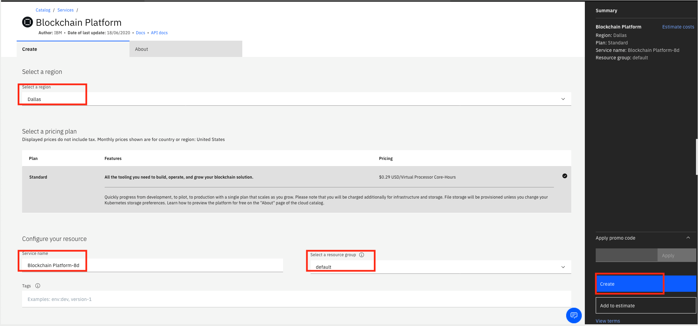
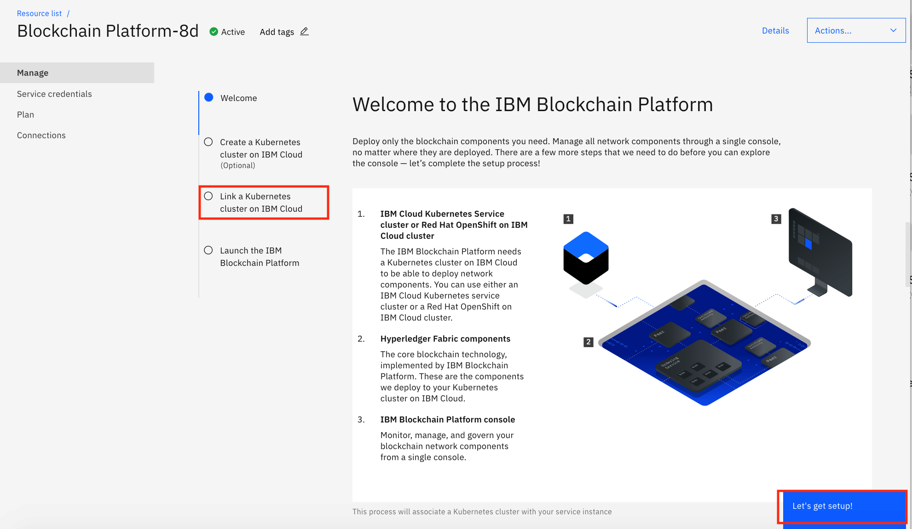
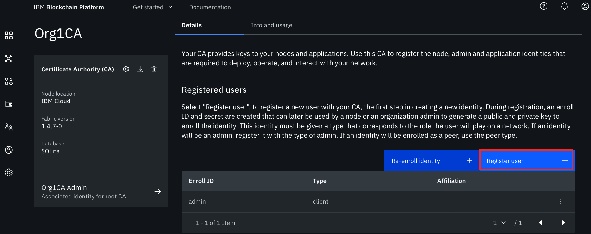
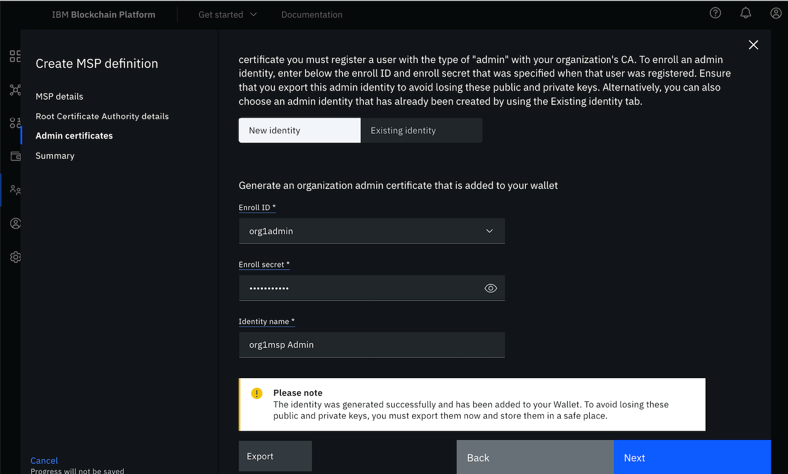
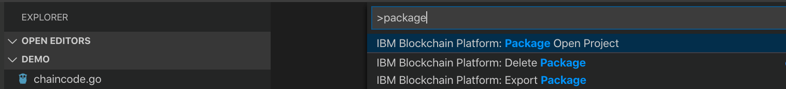

The IBM Blockchain Platform is a blockchain-as-a-service offering that provides users with deployment flexibility, scalability, and control over network components. The platform uses the Hyperledger Fabric 1.4.x code base and deploys components into a IBM Cloud Kubernetes Service that's managed and controlled by the user. The user interface simplifies and accelerates the process of deploying components of the blockchain network. This tutorial takes you through the steps for setting up a basic blockchain network with IBM Blockchain Platform.

## Prerequisites

To complete this tutorial, you will need:

* Blockchain Basics: Hyperledger Fabric: You should have knowledge of blockchain networks and their components. [This article](/articles/blockchain-basics-hyperledger-fabric/) can help you understand the basics of the Hyperledger Fabric Network.
* An [IBM Cloud](https://cloud.ibm.com/login?cm_sp=ibmdev-_-developer-tutorials-_-cloudreg) account.
* VS Code version 1.38 or greater.
* IBM Blockchain Platform extension for VS Code.
  
* Any sample Go/Node.js chaincode.
* [Go 1.12.x or greater](https://golang.org/dl/) if using Go chaincode.
* [Node v8.x or v10.x](https://nodejs.org/en/download/) and npm v6.x or greater if using Node.js chaincode.

## Estimated time

Deploying the Kubernetes cluster should take about 25 - 30 minutes, in addition to the time it takes to set up the IBM Blockchain Platform. If a Kubernetes cluster already exists, then it should take about 60 minutes to complete this tutorial.

## Steps

As a first step in designing any blockchain solution, you need to decide on the blockchain consortium (in other words, the blockchain network participants). Once you've chosen the components of your blockchain network (such as number of organizations, number of peers in each organization, orderer, and certificate authorities (CA)), you can start setting up the network on the cloud. If the structure of your blockchain network is similar to that shown in the following diagram, then, as this structure illustrates, you need to create the following:

* 3 CAs
* 3 Membership Service Providers (MSPs)
* 2 peers
* 1 orderer
* 1 channel that includes 2 peer orgs and 1 orderer org

Note that this tutorial shows you how to create 1 CA, 1 MSP, 1 peer node, and so on. You should repeat the same steps in accordance with your network structure.

Follow the steps below to deploy your blockchain network using the IBM Blockchain Platform console.

### 1 Create the IBM Cloud Kubernetes Service

Create the [IBM Cloud Kubernetes Service (IKS)](https://cloud.ibm.com/kubernetes/catalog/cluster?cm_sp=ibmdev-_-developer-tutorials-_-cloudreg) on the IBM Cloud after you select the appropriate plan, Kubernetes version, flavor, and more. Make sure that the Kubernetes service cluster is completely deployed.

### 2 Create the [IBM Blockchain Platform service instance](https://cloud.ibm.com/catalog/services/blockchain-platform-20?cm_sp=ibmdev-_-developer-tutorials-_-cloudreg) on the IBM Cloud

Search for the IBM Blockchain Platform service on the IBM Cloud Catalog and click on it. Select the region, provide the service name and resource group, and then click **Create**.

In this tutorial, we have set up a Kubernetes cluster already, so choose the option **Link a Kubernetes cluster on IBM Cloud** and click **Let’s get setup!**. Provide the name of the existing cluster and click **Next**. (If you had not created a Kubernetes Cluster, then you would choose the **Create a Kubernetes cluster on IBM Cloud**.)

### 3 Launch the IBM Blockchain Platform

You can launch the IBM Blockchain Platform once it is successfully deployed to the cluster.

Click **Launch the IBM Blockchain Platform console**. On the IBM Blockchain Platform page, click **Let’s get started**. The information icon highlighted gives you more details about that node/step. Such information is available to help you at every step while you're deploying the blockchain platform.

### 4  Add the certificate authority (CA)

As an entry point to your blockchain, you need to create an MSP organization. To do this, you need an org admin user identity. The CA creates all of the identities and certificates that belong to your organization in addition to defining the organization. Therefore, as a first step to setting up the blockchain network, you need to create the CA.

  1. Start setting your network with the CA. Click **Add Certificate Authority**, choose the **Create a Certificate Authority** section, and then click **Next**.
  

  2. Provide a name for the CA (for example, "Org1CA"), the CA administrator enroll ID and enroll secret (for example, ID "admin" and secret "adminpw"), and click **Next**.

  3. When you see the summary, click **Add Certificate Authority**.

### 5 Register your users

You use the CA created in the previous step to register your users.

  1. Click on the CA that you created as shown here:
  

  2. Click **Associate identity**. It associates the CA admin identity with the CA node. Provide the CA enroll ID and enroll secret (same as used in Step 4). You can change the identity display name or proceed with the default name provided. Click **Associate identity**.

  3. Click **Register user**, and then register an admin for your organization.
  

  Provide an enroll ID and enroll secret (for example ID "org1admin" and secret "org1adminpw"). Set the type for this identity as **admin**. This identity works as an organization admin and allows you to operate nodes using the console. The remaining attribute, **Maximum enrollments**, is optional. Leave it blank and click **Next**.
  

  4. Next, it asks you to add attributes. This is used for role-based access control over resources. For the purpose of this tutorial, you do not need to use attributes. Click **Register user**.

  5. Repeat Steps 1 - 4 to register one more user with a **peer** type identity. This identity allows you to deploy a peer.

### 6 Create the organization's MSP definition

A formal definition of the peer's organization is known as the MSP. You have already created the org CA and users, so you can now create the MSP definition.

  1. Navigate to the **Organizations** tab in the left-side panel and click **Create MSP definition** as shown:
  

  2. Provide all of the required information:

   * **MSP details**: **MSP display name** and **MSP ID**.

   * **Root Certificate Authority details**: Choose **Root Certificate Authority** (the root CA for the organization that you created in Step 4) and provide an identity name.

   * **Admin certificates**: Select the enroll ID that you created for your organization as admin identity (for example, org1admin). Provide the enroll secret and identity name.

  3. Click **Generate**. It generates the identity as the admin for your organization and adds it to your Wallet.
  

  4. To avoid losing these public and private keys, export them now and click **Next**. Finally, click **Create MSP definition**.

### 7 Create the peer node

Peers are a fundamental element of the network that host ledgers and smart contracts.

  1. Navigate to the **Nodes** tab, click **Add peer**, choose **Create a peer**, and then click **Next**.
  

  2. Provide a peer display name, leave advanced deployment options with the default value, and click **Next**.

  3. On the next screen, select the CA that you created in Step 4. Select the enroll ID of the peer identity that you created for your peer at the end of Step 5 and provide the associated secret. Then, select the **Organization MSP** and fabric version from the drop-down list, and click **Next**.
  

  4. On the next screen, you are asked to associate an identity to make it admin of your peer. For the purpose of this tutorial, you can choose the organization admin (org1 msp admin), and then click **Next**.

  5. Review the summary and click **Add Peer**. To add more peers in the same organization, register a new user with peer identity as mentioned in Step 5 and repeat this step.

**Note:** Repeat Steps 4 - 7 to create more organizations and peers as needed.

### 8 Create the orderer

The orderer node runs the communication service that guarantees transaction delivery in the network.

  1. To create the orderer, you need to create the orderer CA first. Perform the same steps that you did in Step 4 to create the orderer CA.

  2. Next, register the orderer user identities using your orderer CA. Perform all of the steps in Step 5 again to register users with admin and orderer identities.

  3. Create the orderer MSP definition in the same way that you did in Step 6. Make sure that you select the orderer CA for the Root Certificate Authority.

  4. Now it's time to create the orderer node. Navigate to the **Nodes** tab and click **Add ordering service**.

  Choose **Create an ordering service** and click **Next**. Provide the **Ordering service display name** and you can designate the **Number of ordering nodes** as one ordering node. (One ordering node is suitable for development and testing.) Then click **Next**.
  

  5. Provide the required information as explained in Step 7, but make sure you choose the correct orderer CA and orderer MSP. Click **Next**.

  6. Associate the Orderer admin identity and click **Next**.

  7. Review the summary and then click **Add ordering service**.

### 9 Add an organization as a consortium member on the orderer

  1. Navigate to the **Nodes** tab and click on the orderer that you created in Step 8.

  2. Under **Consortium members**, click **Add organization**.

  3. Choose **Existing MSP ID** and from the drop-down list, select the organization's MSP that you created in Step 6 (the MSP represents the peer's organization) and then click **Add organization**.

  4. Repeat this step for all of the organizations that will be part of this consortium.

### 10 Create the channel

The channel is the mechanism through which a set of components within a blockchain network communicate and transact.

  1. Navigate to the **Channels** tab in the left navigation and click **Create channel**. Click **Next**.
  

  2. In **Channel details**, provide a name for the channel. Select the orderer you created from the Ordering service drop-down list. Click **Next**.

  3. Now add organizations to the channel. Select the organizations (organization's MSP) as the channel member that will be part of the channel (one at a time) and click **Add**. Choose the appropriate permissions (operator/writer/reader) for the organization. Repeat this step to add all of the required organizations to your channel. Click **Next**.
  

  4. Choose the appropriate channel update policy from the available options and click **Next**.

  5. Next is the channel creator organization. Select the **Channel Creator MSP**, identifying an organization for channel creation from the drop-down list. Then associate an available admin identity for that organization and click **Next**.

  7. When you've completed all of the above steps, review the channel information and click **Create channel**.

### 11 Join the channel

  1. Navigate to the **Channels** tab in the left navigation and click **Join Channel**.
  2. Select your orderer and click **Next**.
  3. Provide the name of the channel you created in Step 10 and click **Next**.
  4. Select the peers you want to join the channel and click **Join Channel**.

### 12 Package the smart contract

  1. If the smart contract is written in Golang, then you should place the smart contract as `$HOME/go/src/<chaincode_folder>/<chaincode_file>.go`. Set GOPATH as `$HOME/go`, GOROOT as `<go install directory>`, and append PATH with `$GOROOT/bin`.

  2. Open the folder in VS Code, which should have *only* the smart contract written in Go/Node.js. If you have any files in this folder other than smart contract files, then you might encounter issues while packaging the smart contract.

  3. Press the **F1** key to see the various VS Code options. Choose **IBM Blockchain Platform: Package Open Project**. Make sure Node, NPM, and Go are installed and the corresponding paths are set before you perform this step.
  

  4. You will be prompted for the package name and version. It's important to provide the proper version as the smart contract can then be upgraded to deploy a newer version. After you've provided this information, the smart contract package will be created.

  5. In the left navigation panel, click on **IBM Blockchain Platform**. Under smart contract packages, you should be able to see a .cds file named `<package name>@<version>`.

  6. Right-click on the package and click **Export Package**, then save the file.

### 13 Install the smart contract

  1. Navigate to the **Smart contracts** tab and click **Install smart contract**.
  

  2. In the **Upload package** section, click **Add file** and provide your smart contract package file (.cds) to upload, which you packaged in Step 12 using the VS Code extension.
  

  3. Once the smart contract is uploaded, click **Install smart contract**.

### 14 Instantiate the smart contract

  1. Navigate to the **Smart contracts** tab. You should see a list of smart contracts that have already been installed. Find the smart contract from the list installed on your peers and select **Instantiate** from the overflow menu on the right side of the row.
  

  2. On the side panel, select the channel to instantiate the smart contract on, then click **Next**.

  3. Next, you need to set up the endorsement policy. Select the organization members to be included in the endorsement policy and click **Next**.

  4. At this point, you can also set up the private data collection -- but this step is optional, so we'll skip it this time. Click **Next**.

  5. Provide the function name to initialize the smart contract with the required arguments and click **Instantiate smart contract**. Wait until the instillation is complete.

  6. Once instantiated, it will be listed as one of the instantiated smart contracts under the **Smart contracts** tab.

### 15 Download connection profile
Once the network is created successfully and a smart contract has been instantiated on your network, you can start writing your client applications to interact with the blockchain network using any Fabric SDK (Node.js/Java). The SDK uses a connection profile to connect to your network. To build and download a connection profile, navigate to the **Organizations** tab, click on an organization MSP tile, and then click **Create connection profile**. Select peers to include and then download.

## Summary
This tutorial showed you the steps to create your blockchain network, deploy a smart contract on your network, and download the connection profile for your network using the IBM Blockchain Platform console. The IBM Blockchain Platform is highly customizable -- you can even test, debug, and upgrade an instantiated smart contract in your network. As a next step, you can write client applications that will invoke smart contracts to create, transfer, or update assets on blockchain ledger.  To learn more about this, explore the IBM Developer Blockchain [code patterns](/patterns/category/blockchain/).

**One final note:** The components in your network can be added depending on the availability of resources in your cluster. If you need to add more components (such as peers or orgs), you might need to scale the size of your Kubernetes cluster accordingly.