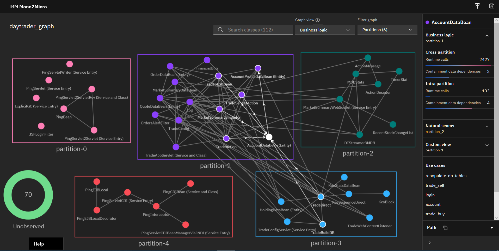
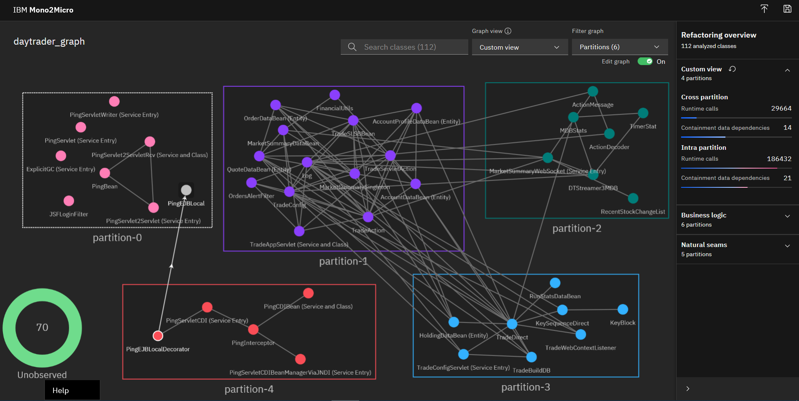

<!-- ## Before you begin

This tutorial is part of the *[Introduction to IBM Mono2Micro](/series/intro-to-ibm-mono2micro/)* series.

| Level | Topic | Type |
| --- | --- | --- |
| 101 | [Introducing IBM Mono2Micro](/articles/mono2micro-automate-application-refactoring-using-ai/) | Article |
| 101 | [Get a visual introduction to IBM Mono2Micro](/videos/introduction-to-mono2micro/) | Video |
| 102 | [Understand the advantages of using IBM Mono2Micro to automate application refactoring](/articles/advantages-of-using-ibm-mono2micro-to-automate-application-refactoring/) | Article |
| **201** | **Use IBM Mono2Micro to transform monolithic Java applications into microservices with the power of AI** | **Tutorial** |

In this series, learn about the key features of IBM Mono2Micro and how to use them to transform monolithic Java applications into microservices. -->

## Introduction

One of the best ways to modernize business applications is to refactor them into microservices, allowing each microservice to be independently enhanced and scaled while providing agility and improved speed of delivery. Microservices are also a natural way to shift legacy applications to the cloud, a destination many enterprise customers are yet to reach.

IBM&reg; Mono2Micro is an AI-based semi-automated toolset that uses novel machine learning algorithms and a first-of-its-kind code generation technology to assist you in that refactoring journey to full or partial microservices, all without **rewriting** the Java application code and the business logic within. It analyzes the monolithic application in both a static and dynamic fashion, and then provides recommendations for how the monolithic application can be partitioned into groups of classes that can become potential microservices. Based on the partitioning, Mono2Micro also generates the microservices foundation code and APIs, which, alongside the existing monolith Java classes, can be used to implement and deploy running microservices.


The following figure is a high-level flow diagram that illustrates how to get started with Mono2Micro in collecting data on an existing monolithic application and then running the AI analyzer tool to generate two kinds of recommendations on different ways to partition the application.


The "[Collecting data on the monolithic application](#collecting-data-on-the-monolithic-application)" section will go into more detail about how to collect all the data, but essentially data is collected statically from code analysis and dynamically as the instrumented monolithic application is run through various use case scenarios to exercise as much of the codebase as possible.

Based on the collected data, Mono2Micro generates a *Natural Seams Partitioning* recommendation that aims to partition and group the monolithic classes such that there are minimal class containment dependencies and entanglements (in other words, classes calling methods outside their partitions) between the partitions. The "Data Dependency Analysis" refers to this kind of dependency analysis between the Java classes. In effect, this breaks up the monolithic application along its natural seams with the least amount of disruption.

Based on the use case data and runtime log traces, and not taking class containment dependencies and method calls into account, Mono2Micro also generates a *Business Logic Partitioning* that might present more entanglements and dependencies between partitions, but ultimately provides a more useful partitioning of the monolithic application divided along functional and business logic capabilities.

This tutorial uses an open source monolithic Java EE benchmark application emulating an online stock trading system, called DayTrader, to walk you through the entire Mono2Micro toolset end to end, starting with the monolithic application, and ending with a deployed and containerized microservices version of the same app.

## Prerequisites

It's recommended that you visit the [Mono2Micro](http://ibm.biz/Mono2Micro) page and download the:

* User guide
* Data collector tool
* `Mono2Micro-example.zip` file, which contains all of the code and files this tutorial discusses (more details about each can be found in the `README` within):

   * Monolith source code: `./daytrader/monolith`
   * Monolith application data: `./daytrader/application-data/`
   * Mono2Micro analysis (initial recommendations by the AI analysis tool): `./daytrader/mono2micro-analysis/`
   * Mono2Micro analysis (further customized by hand): `./daytrader/mono2micro-analysis-custom/`
   * Deployable microservices source code based on Mono2Micro generated code: `./daytrader/microservices/`

    **Note:** If you have any trouble downloading the `Mono2Micro-example.zip` file, you can also [download it directly](http://public.dhe.ibm.com/ibmdl/export/pub/software/websphere/wasdev/mono2micro/Mono2Micro-Example.zip).

This tutorial assumes that you've already installed the Mono2Micro containers and tools on your machine. Note that running the specific tools and editing or generating the files outlined in the steps throughout this tutorial are completely optional. You can follow along by examining all generated files and code provided in the .zip file.

## Collecting data on the monolithic application

The first step in using Mono2Micro to begin the refactoring process is to prepare the monolithic application's Java source code for static and dynamic analysis (at the very least, the source code for the parts or modules of the monolithic application that you intend to refactor to microservices). For the DayTrader app, the complete set of source files are already available in a single directory tree, consisting of an EAR module, an EJB module, and a web module, along with other auxiliary files. For the purposes of this article, assume that `Mono2Micro-example.zip` is extracted in the `/m2m/` parent directory. The monolith source files tree can then be found in `/m2m/daytrader/monolith/` directory.

Let's begin with the static data collection phase by running the Mono2Micro **Bluejay** tool to analyze the Java source code, instrument it, and produce the analysis in two JSON files. To run the analysis, issue the following command:

```
docker run -e LICENSE=accept --rm -it -v /m2m/daytrader:/var/application ibmcom/mono2micro-bluejay /var/application/monolith
```

Bluejay then runs and creates a mirror copy of the input source directory in its parent directory with a `-klu` extension. For example, in `/m2m/daytrader/monolith-klu/`, where all the Java files within the entire directory tree will be instrumented to log entry and exit times in each method (more on this to come). In addition to instrumenting the source, two JSON files `refTable.json` and `symTable.json` are produced in `/m2m/daytrader/monolith-klu/`. These files capture various details and metadata about each Java class, such as their method signatures, class variables and types, class containment dependencies (when one classes uses another class as an instance variable type, or method return/argument type), class inheritance, package dependencies, source file locations, and so on. This static analysis therefore gathers a detailed overview of the Java code in the monolithic application, which the Mono2Micro AI analyzer tool will use to provide recommendations on how to partition the monolithic application. Furthermore, this information is also used by the Mono2Micro code generation tool to generate the foundation and plumbing code for implementing each partition as microservices.

As previously mentioned, along with generating the two table .json files from the static analysis, Bluejay also instruments all Java files in the entire source tree, injecting logging statements into each method to mark the exact times the method was entered and exited. Additionally, it also logs the thread ID, which is used later by the Mono2Micro AI analyzer tool to piece together broken fragments in the trace data. Using this version of the source code, an instrumented version of the monolithic application can then be built and run, exercising as much of the code as possible by running various user scenarios throughout the application, and dynamically collecting additional data in preparation for AI analysis. To build and run the instrumented DayTrader app, using the source in `/m2m/daytrader/monolith-klu/`, the same [build process](https://github.com/WASdev/sample.daytrader7/blob/master/docs/Using-cmd-line.md) that is already used for the original monolithic application can be used.

Before starting this next phase of data collection, let's take a look at an example of the instrumentation in the monolithic code by looking at the TradeAction class in `/m2m/dayatrader/monolith-klu/daytrader-ee7-ejb/src/main/java/com/ibm/websphere/samples/daytrader/TradeAction.java`, which shows exactly how the statements to record entry and exit times are injected:

```java
public OrderDataBean buy(String userID, String symbol, double quantity, int orderProcessingMode) throws Exception {

    try {

        System.err.println(&quot;|v2.0.0r34|&quot;+String.valueOf(System.currentTimeMillis())+&quot;,[&quot;+String.valueOf(Thread.currentThread().getId())+&quot;],&quot;+&quot;Entering daytrader_src/daytrader-ee7-ejb/src/main/java/com/ibm/websphere/samples/daytrader/TradeAction.java::com.ibm.websphere.samples.daytrader.TradeAction::buy(String, String, double, int)|&quot;);

        if (Log.doActionTrace()) {

            Log.trace(&quot;TradeAction:buy&quot;, userID, symbol, new Double(quantity), new Integer(orderProcessingMode));

        }

        OrderDataBean orderData = trade.buy(userID, symbol, quantity, orderProcessingMode);

        // after the purchase or sell of a stock, update the stocks volume and price

        updateQuotePriceVolume(symbol, TradeConfig.getRandomPriceChangeFactor(), quantity);

        return orderData;

    }

    finally {

        System.err.println(&quot;|v2.0.0r34|&quot;+String.valueOf(System.currentTimeMillis())+&quot;,[&quot;+String.valueOf(Thread.currentThread().getId())+&quot;],&quot;+&quot;Exiting daytrader_src/daytrader-ee7-ejb/src/main/java/com/ibm/websphere/samples/daytrader/TradeAction.java::com.ibm.websphere.samples.daytrader.TradeAction::buy(String, String, double, int)|&quot;);

    }

}
```

Now we're ready to proceed to the next phase of data collection from the monolithic application. This is a crucial phase, where both the quantity and quality of the data gathered will impact the quality and usefulness of the partitioning recommendations from the Mono2Micro AI analyzer tool. The key concept here is to run as many user scenarios as possible in the running instrumented monolithic application, exercising as much of the codebase as possible. These user scenarios (or business use cases, if you will), should be typical user threads through the application, related to various functionality that the application provides -- more akin to functional verification test cases or larger green threads, and less so to unit test cases.

In the case of DayTrader, a few examples of these scenarios would include:

- Configuring the application and setting up the database
- Logging into the application as a user
- Once logged in, pulling up the market summary and looking at stock quotes
- Purchasing stocks and doing other trades

As these use cases are run on the instrumented monolithic application, we will use the Mono2Micro **Flicker** tool to record use case labels and the start and stop times of when that use case or scenario was run. The Flicker tool acts like a stopwatch to record use cases, and the labels provided to Flicker for each use case should be meaningful, as this will come into play later when viewing the Mono2Micro AI analysis, where the classes and flow within the code is associated with the use case labels. Flicker is a simple Java-based tool that prompts the user for the use label and then records the start time, and prompts again for the "stop" command after the user finishes running that scenario on the monolithic application.

The following command is a typical command to run the Flicker tool, where both it and the running monolithic application are on the same machine (refer to the Mono2Micro user guide for more complicated setups):

```
java -cp commons-net-3.6.jar;json-simple-1.1.jar;. Flicker -no_ntp
```

The following figure is a screenshot of an example use cases (logging in as a user) being run on the monolithic application as I ran the Flicker tool alongside:


As I ran through the user login scenario, for example, Flicker recorded the start time, and then the stop time after I returned to it and entered the "STOP" command to indicate that I had finished with the scenario.

Similarly, the following figure is a screenshot of another example use cases (a user viewing their stock portfolio) being run on the monolithic application as I ran the Flicker tool alongside:


After exiting the Flicker tool, it produces a context .json file that captures the use case labels and their start/stop times. One or more of these context .json files can be produced. These are just two simple examples. A more complete list of use cases I ran on the instrumented monolithic application can be found in `/m2m/daytrader/application-data/contexts/daytrader.json`.

To review, the following list is a summary of the data that has been collected on the monolithic application:

* Two table .json files containing specific information about the Java classes and their relationships from static analysis of the code.
* One or more context .json files that contain use case names/labels and their start and stop times.
* All the standard console output/error log files captured on the application server side as the use cases were being run on the instrumented application.

With these three sets of data, Mono2Micro can now correlate what exact Java classes and methods were executed during the start and stop times of each use case, and thereby associate the observed flow of code within the application to a use case. Let's now proceed to the next phase of using Mono2Micro, which is to run the AI analyzer tool against this data.

## Running the Mono2Micro AI analysis for application partitioning recommendations

The Mono2Micro **AIPL** tool is the analyzer that uses unsupervised machine learning AI techniques to analyze the three sets of data collected on a monolithic application, as done in the previous section. To prepare for the analysis, the input directories and an optional config.ini file can be set up before running the tool. The `/m2m/daytrader/application-data/` directory contains the subdirectories within which the data files are placed:

* `contexts/`: One or more context .json files generated while running the Flicker tool alongside the use case runs.
* `logs/`: One or more console log files from the application server as the instrumented monolithic application was run through the various use cases.
* `tables/`: The two table .json files generated by the Bluejay tool.
* `config.ini`: Optional file to configure various parameters for the analysis tool. If one doesn't exist, AIPL generates it for you with default values. (Please refer to the user guide for more details on the parameters.)

To run the AIPL tool, issue the following command:

```
docker run -e LICENSE=accept --rm -it -v /m2m/daytrader/application-data:/var/application ibmcom/mono2micro-aipl
```

When the AIPL tool finishes its analysis, it will generate an application partitioning recommendations graph .json file, various reports, and other output files in the `mono2micro/mono2micro-output/` subdirectory within the parent directory of the input subdirectories. In this example, that means a `/m2m/daytrader/application-data/mono2micro/mono2micro-output/` will be created. For your convenience, the output files are already packaged in the .zip. If you exctract it into `/m2m/`, it can be found in the `/m2m/daytrader/mono2micro-analysis/` directory. Some files of note:

* `/m2m/daytrader/mono2micro-analysis/oriole/final_graph.json`: The full set of application partition recommendations (natural seams and business logic) and associated details, viewable in the Mono2Micro UI.
* `/m2m/daytrader/mono2micro-analysis/Cardinal-Report.html`: A detailed report of all the application partitions, their member classes, outward facing classes, and more.
* `/m2m/daytrader/mono2micro-analysis/Oriole-Report.html`: A summary report of all the application partitions and their associated business use cases.
* `/m2m/daytrader/mono2micro-analysis/cardinal/*`: A complete set of input files (based on the partitioning) for the next and last stage of the Mono2Micro pipeline -- running the code generator.

Let's now take a look at the partitioning recommendations Mono2Micro generated by loading the `final_graph.json` in the graph UI. To do this, first launch the UI with the following command:

```
docker run -e LICENSE=accept -d -p 3000:3000 --name=m2mgui ibmcom/mono2micro-ui
```

Load the UI in your favorite browser by pointing it at this URL: `http://localhost:3000/`.

Be sure to read the user guide to learn more about all the features of this UI, and how to navigate within it to view and interact with the partitions and classes in the different views for the natural seams and business logic partitioning schemes, to re-arrange the partition and class nodes, and to create a customized partitioning based on either of the two recommended schemes. For now, load the `/m2m/daytrader/mono2micro-analysis-custom/oriole/final_graph.json` file in the UI, as this graph file already has the generated partitionings optimally arranged and expanded, as well as a customized partitioning view that will be discussed in the next section.


Once loaded, the default view will show the business logic partitioning view, as illustrated in the following figure.



As you can see, Mono2Micro has recommended five partitions (partition-0 to partition-4), allocating and grouping the monolithic applications's Java classes within them based on the use case runs that the AIPL tool observed and analyzed.

A bulk of the back-end functionality of the DayTrader app -- most of its EJB, JPA, and action classes that handle the application's core functionality such as user logins, accounts, etc -- just so happened to get grouped into `partition-1` based on the use case observations. And, similarly, based on other observed use cases runs, some Message-Driven Bean (MDB) classes that handle messaging got placed in `partition-2`, and various other classes into `partition-3`. Note how `partition-0` and `partition-4` are fairly isolated partitions containing the Ping* servlet classes, which are essentially standalone test code in DayTrader. The edges between the class nodes represent the flow of code that Mono2Micro observed, very likely from method calls from one class to another, or by other means. When clicking on a class node, partition, or edge, more information can be gleaned from the side panel in terms of number calls between classes, the use cases involved, and so on. As expected, there are a lot of interactions between the classes in `partition-1`, `partition-2`, and `partition-3`.

In the tool UI, you can click on the AccountDataBean class in `partition-1` to show what other classes call into it from this and other partitions. To aid in your viewing experience, you can double-click on any partition to expand or collapse it, you can choose to filter which partitions are shown, and more.

It is interesting to note the "Unobserved" partition that I left collapsed in the screenshot above. The following figure shows a view with the partition expanded.


Most of the classes in there are the various other Ping* test classes that come with the DayTrader app, along with some JSF classes, and so on. Given that I did not run use cases that exercised this section of the application codebase, Mono2Micro placed them in this partition. Another possible reason that classes could get allocated to this partition is when there's dead code in a monolith -- where, despite a fairly good coverage of use case execution, certain classes never get hit since they are essentially dead code.

Switching to the natural seams view, we see a partitioning scheme where there are less interactions between partitions (as expected), and the bulk of the monolithic application's functionality is encapsulated by the classes in `partition-2` and `partition-3` with minimal interactions between them:


In both of these views, each partition is essentially the beginning of a potential microservice meant to run on its own instance of an application server, such as WebSphere Liberty, where the functionality provided by the Java classes within it can be served up as microservice APIs.

Alongside the graph and the insights it provides into the monolithic application and partitioning recommendations, the Mono2Micro AIPL tool also generates two HTML reports:

* Oriole-Report.html gives an overview of how the business logic partitions are related to the use cases.
* Cardinal-Report.html ("deep partition analysis" report) provides more details on the partitions themselves, including the list of member monolithic classes within each partition, which classes are external-facing (classes whose methods are called by classes outside of the partition), which external classes are called from each partition, and so on.

Both of these reports are generated directly in the `/m2m/daytrader/application-data/mono2micro/mono2micro-output/`, if you ran AIPL, as per above. You can also find these reports in `/m2m/daytrader/mono2micro-analysis/` after extracting `Mono2Micro-example.zip` in `/m2m/`. Please refer to the user guide for more details about these two reports.

Another useful report that AIPL generates in the output folder is coverage.txt, which provides details about the percentage of classes and methods coverages based on the use case data provided.

In order to proceed with a set of partitions that best allows DayTrader to be refactored as a set of microservices, let's take the business logic partitioning scheme and further customize and tweak it, using our knowledge of how the monolithic application works, in order to come up with an optimal partitioning scheme.

### Customizing and adjusting partitions

In order to refine the recommended business logic partitions, I started by considering `partition-0`, `partition-4`, and the `Unobserved` partitions. In these partitions, almost all of the classes are discrete test Ping\* servlet classes, as well as some JSF classes. Given that the DayTrader monolith has a web-based front end and UI, I decided it was best to use one single partition to house all of the front-end code for the application, which then would include all html/jsp/etc files, the Java servlet classes that are referred to by the html files, and any other code/files related to the front end. An important point to note here is that Java servlets need to be running on the **same** application server instance that serves up the html files referring to the servlets.

As a general guideline, we recommend that users do a similar customization where all front-end- or UI-related classes are grouped into a single partition, if their monolithic application happens to have a UI or front end. Given that most web-based UIs will likely be composed of non-Java code (such has Javascript, HTML, JSP, and so on), Mono2Micro will not consider such code and, therefore, they will not be in the recommended partitions. So this "front end" partition serves as an ideal home for these files, along with any Java code in the monolithic application that goes hand-in-hand with the front end, such as servlet classes.

To start editing the graph, select **Custom view** from in the "Graph view" drop-down list (assuming you load the original graph .json file in `/m2m/daytrader/mono2micro-analysis/oriole/final_graph.json` or if you generated a new graph after running AIPL yourself in `/m2m/daytrader/application-data/mono2micro/mono2micro-output/oriole/final-graph.json`):


The UI will ask you to choose whether to start your custom view based on the business logic view or the natural seams view. Let's choose the business logic view:


Once you select **Start**, you'll be presented with the same business logic partitioning in the custom view. To begin editing, set **Edit graph** to **On**. You're now able to drag classes from one partition to another in order to move them, or drag them to any empty space between the partitions to create a new partition with that class.



In order to form my front end partition to house all the servlet classes and other front-end code, I decided to repurpose `partition-0`. To start that process, the first step was to move all the classes in `partition-4` to `partition-0`, starting with PingEJBLocal, for example, and continuing with the other classes until the last class is moved across, at which time the Mono2Micro UI automatically removes `partition-4` altogether:


Similarly, I then moved all the classes in the `Unobserved` partition to `partition-0`. After that, I renamed this partition to "web" by editing the partition name field.

You should now have a good idea of how to edit the graph, move classes around, and rename partitions. Let's switch back to the pre-customized graph file provided in the sample and load `/m2m/daytrader/mono2micro-analysis-custom/oriole/final_graph.json` in the UI. Once that's loaded and you switch to the custom view, you will see the final customizations I did to the business logic partitioning in order to prepare for code generation and deployment of microservices:


The following table provides a complete list of the classes I moved from the original business logic partitioning and the reasoning behind each move:

| **Class** | **Original partition** | **Destination partition** | **Reason for move** |
| --- | --- | --- | --- |
| TradeAppServlet | partition-1 | web | Servlet class, needs to be on same app server instance as calling html |
| TradeConfigServlet | partition-3 | web | Servlet class, needs to be on same app server instance as calling html |
| TradeServletAction | partition-1 | web | Servlet related code |
| TradeScenarioServlet | unobserved | web | Servlet class, needs to be on same app server instance as calling html |
| TradeWebContextListener | partition-3 | web | @WebListener annotated class that is associated to servlets |
| Ping* classes | partition-4, unobserved | web | Discrete unit tests tied to the front-end of the application and html call points |
| TradeBuildDB | partition-2 | web | Though it's not a servlet or servlet related Java EE class itself, this class's methods are called from other code using arguments based on `HttpServletResponse`, such as `TradeConfigServlet.service()`, therefore requiring it to be on the same app server as the servlets. This was not readily apparent until I initially tried to run the partitions where `TradeBuildDB` still remained in `partition-2` while the servlets were in the `web` partition, and errors occurred at runtime that then lead to this solution. See next section for more details. |
| DTBroker3MDB | unobserved | partition-1 | Message driven beans need to be running on the same app server as other back-end Java EE objects which they are messaging with |
| KeyBlock and inner classes | partition-3 | partition-2 | Has to be on the same application server instance as `KeySequenceDirect` |
| RunStatsDataBean | partition-3 | partition-2 | Closely related to `TradeDirect` in `partition-2` |
| HoldingDataBean | partition-3 | partition-1 | `HoldingDataBean` is an entity (JPA) bean that needs to be running on the same application server with the other entity JPA beans in `partition-1`, since the whole JPA persistence unit resides there and the database model cannot be broken apart |
| OrdersAlertFilter | partition-1 | web | See next section |
| all remaining classes | unobserved | web | See next section |

Some important aspects to consider here are how JPA entity beans that belong to the same persistence unit in the monolith should be kept together in the same partition if the database model is to remain intact. And any Java EE classes that use resource injection (i.e. to inject EJB instances, persistence manager objects, etc), should also be in the same partition as those require the same application server instance to orchestrate the injections.

Apart from figuring out how best to move around classes based on your knowledge of the monolith application and middleware specifications it uses, you can also start to incrementally move classes between partitions and/or make them external facing as you build and run the partitions (see next sections), by observing and debugging errors at runtime with more tracing enabled. More than likely, the need to make some customizations won&#39;t be apparent until the first few runs of the partitions as deployed microservices.

## Generating initial microservices foundation code

Once the custom partitioning is finalized, you can re-run AIPL to re-generate the `cardinal/` folder which along with the monolith source code serves as input to the Mono2Micro **Cardinal** code generator tool. Please refer to the user guide as to how run the AIPL tool again for a modified graph file. The `cardinal/` input folder for my customized partitioning is already included in the sample .zip and after extracting `Mono2Micro-example.zip` in `/m2m/`, can be found in `/m2m/daytrader/mono2micro-analysis-custom/cardinal/`. As previously mentioned, the original monolithic application source code can be found in `/m2m/daytrader/monolith/...`. So, with both these sets of files in the two directories, we can now proceed to the code generation stage to generate foundation microservices code for all the partitions.

One thing you might notice is the presence of a `user_defined.txt` file in `/m2m/daytrader/mono2micro-analysis-custom/cardinal/`, which the Cardinal tool reads on start-up if one exists. This is a way to provide a list of one or more monolith classes that are to be treated as "external facing," where classes outside its partition might call into it. These external facing classes are also called "service classes" in Mono2Micro nomenclature. Recall that the deep partition analysis report Cardinal-Report.html generated by AIPL lists all external facing classes per partition that the AI analysis deemed necessary... but there could always be cases where some classes were not called out as such (typically due to insufficient use cases being run that allows Mono2Micro to observe this external facing behavior), although they should be in order for the partitions to fully communicate. So in effect this is a way for users to further instruct the Mono2Micro code generation tool. In my example, I list the following two classes in user_defined.txt and that was due to further debugging when the initially generated partitions were compiled and run which lead me to realize these needed to be service classes (see next sections for more details):

```
TradeDirect,interface

FinancialUtils,interface
```

To run the Mono2Micro Cardinal code generator tool, issue the following command:

```
docker run -e LICENSE=accept --rm -it -v /m2m/daytrader:/var/application ibmcom/mono2micro-cardinal /var/application/monolith /var/application/mono2micro-analysis-custom/cardinal
```

**Note:** The two input arguments are the paths to the cardinal folder of input file generated by AIPL for Cardinal and the monolith source folder.

Once it runs and finishes, the tool generates a directory for each partition all within the parent directory of the monolith source directory. Each partition directory will have a directory tree structure exactly the same as the monolith source directory tree, wherever Java files are concerned. Additionally, Cardinal generates an extra module folder `application/` in each partition containing utility Java code specifically tuned to this partition that other generated code uses. The generated Java code will be in the following directories:

```
├── monolith-partition1/
│   ├── application/ (generated utility code)
│   ├── daytrader-ee7-ejb/ (original monolith subfolder with generated code and monolith classes)
│   └── daytrader-ee7-web/ (original monolith subfolder with generated code and monolith classes)
├── monolith-partition2/
├── monolith-partition3/
├── monolith-web/
```

Within the input `cardinal/` folder (`/m2m/daytrader/mono2micro-analysis-custom/cardinal/` in our example) some useful reports and informational files are generated in the c`ardinal-codegen/` subfolder containing the deep partition analysis reports (see previous section) in textual format -- a `CardinalSummary.txt` file and a `CardinalSings.json` file. The `CardinalSings.json` file lists any potential issues for the user to address in order to get optimal code generation (refer to the user guide for more details). And a `CardinalSummary.txt` lists all the generated Java files and those which were copied from the monolith source directory tree.

Let's now look at the various kinds of Java code that Cardinal generates using `CardinalSummary.txt` as a guide, and see how the basic communication protocol works in the generated code that allows monolith classes to be distributed across partitions ***without re-writing any code*** while behaving exactly as they did in the monolithic application.

### Generated code: Service classes

These are generated classes that sit alongside all external-facing monolith classes, a service class whose methods are wrappers for the monolith class's public methods. The service class uses JAX-RS web services technology in the wrapper methods to serve up the monolith class's public methods as REST APIs. For example, the `TradeAction` class in `partition-1` is an external-facing class, and the following code shows a typical public method `buy()` within:

```java
/**
 * Purchase a stock and create a new holding for the given user. Given a
 * stock symbol and quantity to purchase, retrieve the current quote price,
 * debit the user's account balance, and add holdings to user's portfolio.
 *
 * @param userID
 *            the customer requesting the stock purchase
 * @param symbol
 *            the symbol of the stock being purchased
 * @param quantity
 *            the quantity of shares to purchase
 * @return OrderDataBean providing the status of the newly created buy order
 */
@Override
public OrderDataBean buy(String userID, String symbol, double quantity, int orderProcessingMode) throws Exception {
    if (Log.doActionTrace()) {
        Log.trace("TradeAction:buy", userID, symbol, new Double(quantity), new Integer(orderProcessingMode));
    }
    OrderDataBean orderData = trade.buy(userID, symbol, quantity, orderProcessingMode);

    // after the purchase or sell of a stock, update the stocks volume and
    // price

    updateQuotePriceVolume(symbol, TradeConfig.getRandomPriceChangeFactor(), quantity);

    return orderData;
}
```

Mono2Micro therefore generates a companion `TradeActionService` class. The following code listing shows the `buy()` service wrapper method, where it obtains an instance of the actual monolith class using the partition's cluster object manager (one of the generated utility classes that manages the monolith object instances), and actually does the monolith class method call and handles the method arguments and return types by converting them to JSON before sending them as payload via the webservice.

```java
@Path("/buy")
@Consumes(MediaType.APPLICATION_FORM_URLENCODED)
@Produces(MediaType.APPLICATION_JSON)
public Response buy(
    @FormParam("klu__referenceID") String klu__referenceID,
    @FormParam("userID") String userID,
    @FormParam("symbol") String symbol,
    @FormParam("quantity") String quantity,
    @FormParam("orderProcessingMode") String orderProcessingMode,
    @Context HttpServletResponse servletResponse
) {

    String userID_fpar = userID;

    String symbol_fpar = symbol;

    double quantity_fpar = Double.parseDouble(quantity);

    int orderProcessingMode_fpar = Integer.parseInt(orderProcessingMode);

    OrderDataBean response;

    // dynamically dispatched method: using reference ID, get object from cluster object manager and
    // call method on the object
    TradeAction instTradeAction = (TradeAction)ClusterObjectManager.getObject(klu__referenceID);
    try {
        response = instTradeAction.buy(userID_fpar, symbol_fpar, quantity_fpar, orderProcessingMode_fpar);
    }
    catch (Throwable t) {
        String msg = "Call to method buy() of TradeAction raised exception"+t.getMessage();
        logger.warning(msg);
        throw new WebApplicationException(msg, t, CardinalException.APPLICATION_EXCEPTION);
    }
    JsonObjectBuilder jsonresp = Json.createObjectBuilder();

    // convert physical/proxy object(s) referenced by "response" to reference ID(s)
    String response_obj = SerializationUtil.encodeWithDynamicTypeCheck(response);
    JsonObject jsonobj = jsonresp.add("return_value", response_obj).build();

    logger.info("[TradeAction] Returning JSON object: "+jsonobj.toString());
    return Response
        .status(Response.Status.OK)
        .entity(jsonobj)
        .build();

}
```

To see exactly how the dynamic object management is done in generated code, look at an example such as `/m2m/daytrader/microservices/daytrader-partition1/cardinal-utils/src/main/java/com/ibm/cardinal/util/ClusterObjectManager.java`. Note also that non-primitive Java types are handled using serialization. In this case, the return type `OrderDataBean` is not only non-primitive but also a JPA entity bean in `partition-1` and is therefore in turn handled as external-facing. How these service classes are called, and how their method arguments and return types are handled from the client partitions are the domain of "proxy classes," which Mono2Micro also generates. Let's now see how they work next.

### Generated code: Proxy classes

For every service class generated in the partition per external facing monolith class, the Mono2Micro Cardinal tool also generates a proxy class in *all* other partitions, meant to act as a proxy of the monolith class to all code in the other partitions that refer to it. For this `TradeAction` class example, a proxy class by the exact name is generated in partitions `partition-2`, `partition-3`, and `web`, where wrapper methods use JAX-RS webservice client code to call out to the service class's REST API under the covers. In other words, all original monolith code in other partitions that use `TradeAction` will be none the wiser, continuing to compile and run as before with the proxy rather than the original. The following code listing shows the `buy()` method in the proxy class, serving as a client method to its method counterpart in the service class.

```java
@Override
    public OrderDataBean buy(String userID, String symbol, double quantity, int orderProcessingMode) throws Exception {
        // create form for service request
        Form form = new Form();
        form.param("klu__referenceID", getKlu__referenceID());
        form.param("userID", userID);

        form.param("symbol", symbol);

        form.param("quantity", String.valueOf(quantity));

        form.param("orderProcessingMode", String.valueOf(orderProcessingMode));

        logger.info("[TradeAction] Calling service "+serviceURI+
            "/buy with form: "+form.asMap());

        // call service and get encoded response from response JSON
        Response svc_response;
        try {
            svc_response = client.target(serviceURI)
                .path("buy")
                .request(MediaType.APPLICATION_JSON)
                .post(Entity.form(form), Response.class);
        }
        catch (WebApplicationException wae) {
            Throwable cause = wae.getCause();
            logger.warning("[TradeAction] Exception thrown in service call: "+wae.getMessage());
            if (wae.getResponse().getStatus() == CardinalException.APPLICATION_EXCEPTION) {
                logger.warning("[TradeAction] Re-throwing wrapped application exception: ");
                // typecast to declared exception types
                if (cause instanceof Exception) {
                    throw (Exception)cause;
                }
            }
            throw (RuntimeException)cause;
        }
        String response_json_str = svc_response.readEntity(String.class);
        logger.info("[TradeAction] Response JSON string: "+response_json_str);
        JsonReader json_reader = Json.createReader(new StringReader(response_json_str));
        JsonObject response_json = json_reader.readObject();
        String response = response_json.getString("return_value");
        svc_response.close();

        // convert reference ID(s) stored in "response" to physical/proxy object(s)
        OrderDataBean response_obj = (OrderDataBean)SerializationUtil.decodeWithDynamicTypeCheck(response);
        return response_obj;

    }
```

Note how at the end the return value of the REST API call is essentially a serialized referenced ID of the proxy object to `OrderDataBean`, subsequently deserialized and handled by the generated serialization utility code that is specifically tuned to this partition.

### Generated code: Original classes

These are the original monolith classes allocated to a partition, copied as-is from the monolith source directory tree to the partition directory.

### Generated code: Java interface classes

Since Java interface classes don't have state, Mono2Micro copies all Java interface classes in the monolith to *all* partitions. This is to err on the side of caution, so that any monolith code referring to them in the partitions can still compile.

### Generated code: Dummy classes

So far, per partition, there are:

* Initially allocated monolith Java classes
* Service classes for any of these monolith classes that are external facing
* Proxy classes for all external-facing classes from all other partitions
* Java interface classes from the monolith

In a perfect world, if exhaustive use cases were run such that the Mono2Micro AI is able to observe all possible code paths in the monolith, this will probably complete the picture of each partition. But in reality, this is not usually the case. So once again, to be on the safe side, Mono2Micro generates monolith class outside of these as "dummy" classes in each partition. These dummy classes just have the public method signatures of the original monolith class, but the method bodies intentionally throw an exception to indicate that this code was entered as the partition runs. This then gives insight to the user as the partitions are being run and debugged, and also a pointer as to what corrective action to potentially take: expand use case coverage to beef up the application data such that this code is exercised, or move the class to a different partition, or make the original monolith class (that the dummy class is a shell of) to be external facing in its home partition.

For example, the following code listing shows the `OrdersAlertFilter` class that was originally allocated by Mono2Micro to `partition-1` and designated as not external-facing, which led to dummy versions of it being generated in all other partitions:

```java
public class OrdersAlertFilter implements Filter {

    /**
     * Constructor for CompletedOrdersAlertFilter
     */
    public OrdersAlertFilter() {
    throw new CardinalException("ERROR: dummy function called at daytrader-ee7-web/src/main/java/com/ibm/websphere/samples/daytrader/web/OrdersAlertFilter.java:OrdersAlertFilter:OrdersAlertFilter");
    }

    public void init(FilterConfig filterConfig) throws ServletException {
    throw new CardinalException("ERROR: dummy function called at daytrader-ee7-web/src/main/java/com/ibm/websphere/samples/daytrader/web/OrdersAlertFilter.java:OrdersAlertFilter:init");
    }

    /**
     *  Filter#doFilter(ServletRequest, ServletResponse, FilterChain)
     */

    public void doFilter(ServletRequest req, ServletResponse resp, FilterChain chain) throws IOException, ServletException {
    throw new CardinalException("ERROR: dummy function called at daytrader-ee7-web/src/main/java/com/ibm/websphere/samples/daytrader/web/OrdersAlertFilter.java:OrdersAlertFilter:doFilter");
    }
```

When initially running and testing the partitions, I noticed the above exceptions being thrown in the web partition which along with other reasons lead me to move OrdersAlertFilter to the web partition, thereby solving the problem. So dummy classes are a convenient way to ensure the generated partitions still compile more easily, but then give insight at runtime as to what further customizations and tweaks to do on the partitioning.

At this point, we have done most of the customizations to the business logic partitions we initially set out to do and generated the microservices foundation code with the Mono2Micro Cardinal tool. Along the way I mentioned how some of the customizations were a result of running and debugging the partitions which obviously requires the partition build config be set up and various other non-Java aspects of the monolith application such as the server config and Java EE meta-data to be refactored to the partitions. All of the Mono2Micro tooling and automation has led us to this point, and it certainly takes the user a long way on the journey of refactoring monoliths to microservices. The remainder of that journey essentially boils down to manually refactoring and integrating these non-Java aspects of the monolith, along with further hand customizations based on the initial runs, to finally get to running microservices that represent the same functionality as the original monolith. Let's take a look at that in the next section.

## Refactoring non-Java parts of monolithic applications, further code changes, and deploying final partitions as microservices

After Mono2Micro generates the initial microservices plumbing code and places that along with the monolith classes into each partition, the foundations of the microservices are now there. That is, each partition is meant to run as a microservice, deployed on an application server (such as WebSphere Liberty) where the monolith classes&#39; public methods are served up as REST API. Each partition is effectively then a mini version of the original monolith, its folder structure mirroring the original monolith folder and module structure. In order to build and run each partition, more than just the Java code is needed of course. And here is when a key question is usually raised: *What exactly does one do with the non-Java parts of the monolith with respect to each partition, and how, in order to facilitate the final goal of running all partitions as microservices?*

One approach I took with this DayTrader example and highly recommend for most Java applications is as follows: Copy *all* of the non-Java files in the monolith (i.e. the build config files such the Maven pom.xml or Gradle files, server config files such as the WebSphere server.xml, Java EE meta-data and deployment descriptors such as application.xml, web.xml, ejb-jar.xml, persistence.xml etc) to *every* partition, following the same directory structure which will partially already exist in each partition. Starting with that as a base, the aim then is to pare down and incrementally reduce the content of all these files (based on knowledge of what functionality each partition entails, and/or through an iterative compile-run-debug process), ending up with just the needed content in each partition. After this is done, each partition will indeed be a mini subset of the original monolith, and working together with all the other running partitions and finally become microservices that provide the exact same functionality as the original monolith.

Before doing the full refactoring and build setup of each partition, you can also try doing a quick compilation test of the generated code by using an IDE tailored to support Java EE and the application server, such as the Eclipse based IBM Liberty Developer Tools: [https://marketplace.eclipse.org/content/ibm-liberty-developer-tools](https://marketplace.eclipse.org/content/ibm-liberty-developer-tools) . I won&#39;t go into too much detail as to the exact steps to do this, but using this toolset as an example, the basic steps are:

1. Create a Java EE web project (>=v3.x) for each partition and set the runtime target a WebSphere Liberty installation.
1. Import the partition from the filesystem into the project.
1. Ensure all partitions module folders containing Java source files are correctly configured as source folders within the Eclipse tools, rooted where the package directories are.This includes the monolith module folders as well as the `application` utility code folder generated by Cardinal. (See previous section.)
1. Build the project and observe any compilation errors.

The compilation errors (which will mostly likely be in the monolith code in the partition) can then be looked at, and fixed as necessary. Likely some of these errors might be as a result of the issues raised in CardinalSings.json that Mono2Micro&#39;s Cardinal tool generates. When I initially compiled the partitions with generated code, the only errors I had to fix were to change some places in monolith code that was directly referring to public fields in classes outside their partitions (such as TradeConfig's fields). Cardinal flags this specific issue in CardinalSings.json and also generates getter/setter methods in the monolith class with the public fields, so that referring code can be changed to use the getter and setter methods instead. This then allows the original monolith class with the public fields to be used a service class across partitions.

That said, let&#39;s proceed with the full refactoring and build of all the partitions using the monolith&#39;s maven based build scheme on each. Each partition therefore will ultimately build to a daytrader-ee-7 ear module like the monolith, and have within it a daytrader-ee7-ejb and daytader-ee7-web module. To see the fully deployed microservice code and config files I ended up with in each partition, look at `/m2m/daytrader/microservices/` and all subfolders (assuming you extracted the `Mono2Micro-example.zip` in `/m2m/`).

### Cardinal utility code module

First, to build the generated Cardinal utility code in each partition, I renamed the generated `application/` folder to `cardinal-utils/` and put together a `pom.xml` fashioned after the monolith's EJB/web module's pom files to build it as a utility .jar (with the aim of then including it as an additional module in the partition .ear file):

```xml
<project xmlns="http://maven.apache.org/POM/4.0.0" xmlns:xsi="http://www.w3.org/2001/XMLSchema-instance" xsi:schemaLocation="http://maven.apache.org/POM/4.0.0 http://maven.apache.org/xsd/maven-4.0.0.xsd">
<modelVersion>4.0.0</modelVersion>  

    <parent>
        <groupId>net.wasdev.wlp.sample</groupId>
        <artifactId>daytrader7</artifactId>
        <version>1.0-SNAPSHOT</version>
    </parent>

    <groupId>net.wasdev.wlp.sample</groupId>
    <name>cardinal-utils</name>
    <packaging>jar</packaging>
    <artifactId>cardinal-utils</artifactId>
    <version>1.0-SNAPSHOT</version>

    <build>
        <finalName>${project.artifactId}</finalName>
    </build>

</project>
```

### Partitions build config

Next, for each partition, the root `pom.xml` that was copied from the monolith was modified as per the following for all partitions (note the addition of the `cardinal-utils` module):

```xml
<project xmlns="http://maven.apache.org/POM/4.0.0"
         xmlns:xsi="http://www.w3.org/2001/XMLSchema-instance"
         xsi:schemaLocation="http://maven.apache.org/POM/4.0.0
                             http://maven.apache.org/maven-v4_0_0.xsd">
    <modelVersion>4.0.0</modelVersion>

    <parent>
        <groupId>net.wasdev.maven.parent</groupId>
        <artifactId>java7-parent</artifactId>
        <version>1.3</version>
    </parent>

    <groupId>net.wasdev.wlp.sample</groupId>
    <artifactId>daytrader7</artifactId>
    <packaging>pom</packaging>
    <version>1.0-SNAPSHOT</version>
    <name>WAS Liberty Sample - Java EE7 Benchmark Sample</name>

    <licenses>
        <license>
            <name>The Apache Software License, Version 2.0</name>
            <url>https://raw.github.com/WASdev/sample.async.jaxrs/master/LICENSE</url>
            <distribution>repo</distribution>
        </license>
    </licenses>

    <modules>
        <module>cardinal-utils</module>
        <module>daytrader-ee7-ejb</module>
        <module>daytrader-ee7-web</module>
        <module>daytrader-ee7</module>
    </modules>

</project>
```

### EAR modules per partition

In copying over all the non-Java files and folders from the monolith and laying them down over each partition's directory structure, one of the new subfolders in each partition will be the `daytrader-ee7/` subfolder, which contains the build config and meta-data files for the Java EE .ear module itself (given that it has no Java code at all, the Mono2Micro Cardinal tool never creates this subfolder as it generates each partition for DayTrader). In there, the pom.xml file instructs Maven as to how to assemble the ear. Let's take a look at the customized ones for each partition.

`/m2m/daytrader/microservices/daytrader-partition1/daytrader-ee7/pom.xml` (note the extra configuration section I added at the end):

```xml
<project xmlns="http://maven.apache.org/POM/4.0.0" xmlns:xsi="http://www.w3.org/2001/XMLSchema-instance" xsi:schemaLocation="http://maven.apache.org/POM/4.0.0 http://maven.apache.org/xsd/maven-4.0.0.xsd">
    <modelVersion>4.0.0</modelVersion>

    <parent>
        <groupId>net.wasdev.wlp.sample</groupId>
        <artifactId>daytrader7</artifactId>
        <version>1.0-SNAPSHOT</version>
    </parent>

    <name>WAS Liberty Sample - Java EE7 Benchmark Sample - EAR</name>

    <packaging>ear</packaging>
    <artifactId>daytrader-ee7</artifactId>
    <version>1.0-SNAPSHOT</version>

    <dependencies>
          <dependency>
            <groupId>net.wasdev.wlp.sample</groupId>
            <artifactId>cardinal-utils</artifactId>
            <version>1.0-SNAPSHOT</version>
            <type>jar</type>
        </dependency>
        <dependency>
            <groupId>net.wasdev.wlp.sample</groupId>
            <artifactId>daytrader-ee7-ejb</artifactId>
            <version>1.0-SNAPSHOT</version>
            <type>jar</type>
        </dependency>
        <dependency>
            <groupId>net.wasdev.wlp.sample</groupId>
            <artifactId>daytrader-ee7-web</artifactId>
            <version>1.0-SNAPSHOT</version>
            <type>war</type>
        </dependency>
    </dependencies>

   <!-- extra configuration to ensure archives within ear don't have versions in filenames, default and specific locations for modules, etc -->
    <build>
        <plugins>
            <plugin>
                <groupId>org.apache.maven.plugins</groupId>
                <artifactId>maven-ear-plugin</artifactId>
                <configuration>
                    <fileNameMapping>no-version</fileNameMapping>
                    <defaultLibBundleDir>lib</defaultLibBundleDir>
                    <modules>
                        <webModule>
                            <groupId>net.wasdev.wlp.sample</groupId>
                            <artifactId>daytrader-ee7-web</artifactId>
                            <bundleDir>/</bundleDir>
                        </webModule>
                        <jarModule>
                            <groupId>net.wasdev.wlp.sample</groupId>
                            <artifactId>daytrader-ee7-ejb</artifactId>
                            <bundleDir>/</bundleDir>
                        </jarModule>
                    </modules>
                </configuration>
            </plugin>
        </plugins>
    </build>

</project>
```

For the `partition-2`, `partition-3`, and `web` partitions, note how there's a difference in the extra configuration. This is because its EJB module source folder contains no actual EJBs and only proxies instead. It therefore should not be marked as such, otherwise the application server will throw errors about not finding EJBs in the EJB module.

`/m2m/daytrader/microservices/daytrader-partition2/daytrader-ee7/pom.xml`:

```xml
<build>
    <plugins>
        <plugin>
            <groupId>org.apache.maven.plugins</groupId>
            <artifactId>maven-ear-plugin</artifactId>
            <configuration>
                <fileNameMapping>no-version</fileNameMapping>
                <defaultLibBundleDir>lib</defaultLibBundleDir>
                <modules>
                    <webModule>
                        <groupId>net.wasdev.wlp.sample</groupId>
                        <artifactId>daytrader-ee7-web</artifactId>
                        <bundleDir>/</bundleDir>
                    </webModule>
                    <!-- don't mark ejb module in this partition since the EJBs/entities there are Mono2Micro generated proxies only
                    <jarModule>
                        <groupId>net.wasdev.wlp.sample</groupId>
                        <artifactId>daytrader-ee7-ejb</artifactId>
                        <bundleDir>/</bundleDir>
                    </jarModule>
                    -->
                </modules>
            </configuration>
        </plugin>
    </plugins>
</build>
```

Apart from the ear module `pom.xml` file, the `application.xml` Java EE deployment descriptor should also be tweaked for each partition.

`/m2m/daytrader/microservices/daytrader-partition1/daytrader-ee7/src/main/application/META-INF/application.xml`:

```xml
<application
    xmlns="http://xmlns.jcp.org/xml/ns/javaee"
    xmlns:xsi="http://www.w3.org/2001/XMLSchema-instance"
    xsi:schemaLocation="http://xmlns.jcp.org/xml/ns/javaee http://xmlns.jcp.org/xml/ns/javaee/application_7.xsd" version="7">
  <description>DayTrader Stock Trading Performance Benchmark Sample</description>
  <display-name>DayTrader</display-name>
  <module>
    <web>
      <web-uri>daytrader-ee7-web.war</web-uri>
      <context-root>/daytrader</context-root>
    </web>
  </module>
  <module>
    <ejb>daytrader-ee7-ejb.jar</ejb>
  </module>
  <!-- should not represent util jars meant for general ear-wide use as a java module as that implies it's a JEE client app
  <module>
    <java>cardinal-utils.jar</java>
  </module>
  -->

</application>
```

### Java EE modules within EAR

As per the pom, `partition-1` has an EJB and web module as Java EE modules, whereas the other partitions (`partition-2`, `partition-3`, and `web`) only have a web module in the EAR's Java EE deployment descriptor.

`/m2m/daytrader/microservices/daytrader-partition2/daytrader-ee7/src/main/application/META-INF/application.xml`:

```xml
<application
    xmlns="http://xmlns.jcp.org/xml/ns/javaee"
    xmlns:xsi="http://www.w3.org/2001/XMLSchema-instance"
    xsi:schemaLocation="http://xmlns.jcp.org/xml/ns/javaee http://xmlns.jcp.org/xml/ns/javaee/application_7.xsd" version="7">
  <description>DayTrader Stock Trading Performance Benchmark Sample</description>
  <display-name>DayTrader</display-name>
  <module>
    <web>
      <web-uri>daytrader-ee7-web.war</web-uri>
      <context-root>/daytrader</context-root>
    </web>
  </module>
  <!-- don't mark ejb module in this partition since the EJBs/entities there are cardinal proxies only
  <module>
    <ejb>daytrader-ee7-ejb.jar</ejb>
  </module>
  -->
  <!-- should not represent util jars meant for general ear-wide use as a java module as that implies it's a JEE client app
    <module>
    <java>cardinal-utils.jar</java>
  </module>
  -->
</application>
```

Within the EJB and web modules in each partition, the monolith versions of the Java EE deployment descriptor .xml files were left as-is and deleted from partitions for which these files did not apply to. Be sure to look through these files for your own reference:

* `/m2m/daytrader/microservices/<partition directory>/daytrader-ee7-ejb/pom.xml`
* `/m2m/daytrader/microservices/daytrader7-partition1/daytrader-ee7-ejb/src/main/resources/ejb-jar.xml` and other files: Only for `partition-1` and deleted from all other partitions
* `/m2m/daytrader/microservices/<partition directory>/daytrader-ee7-web/pom.xml`
* `/m2m/daytrader/microservices/<partition directory>/daytrader-ee7-web/src/main/webapp/*`: Various Java EE web module config and meta-data files

For the `web` partition, *all* the non-Java files and code from the monolith's web module should be copied over, such as all UI related code (i.e. .html files, .jsp files, image files, etc). For `partition-1`, `partition-2`, and `partition-3`, only the `web.xml` file and certain other Java EE deployment descriptor files should be copied over in order to build a minimal Java EE web module. This is because I made a conscientious decision to host all the UI and front-end code of the monolith in my custom web partition, but still want a Java EE web module in all partitions.

### JAX-RS configuration per partition

Let's next look at how to facilitate the JAX-RS code generated by Mono2Micro as these partitions are run on the app server. Firstly, as part of the utility code that Cardinal generates, a JAXRSConfiguration class is generated per partition. This class sets up the JAX-RS config where all service classes are registered, and is meant to be copied over and placed in one Java EE module of your preference within each partition. For this DayTrader example, I chose to place it in the web module of each partition. The following code listing shows an example from `partition-1` in `/m2m/daytrader/microservices/daytrader7-partition1/daytrader-ee7-web/src/main/java/com/ibm/websphere/samples/daytrader/JAXRSConfiguration.java`:

```java
@ApplicationPath("rest")
public class JAXRSConfiguration extends Application {

    public Set<Class<?>> getClasses() {
        Set<Class<?>> classes = new HashSet<Class<?>>();
        classes.add(TradeActionService.class);
        classes.add(MarketSummaryDataBeanService.class);
        classes.add(AccountDataBeanService.class);
        classes.add(AccountProfileDataBeanService.class);
        classes.add(HoldingDataBeanService.class);
        classes.add(OrderDataBeanService.class);
        classes.add(QuoteDataBeanService.class);
        classes.add(LogService.class);
        classes.add(TradeConfigService.class);
        classes.add(FinancialUtilsService.class);
        return classes;
    }
}
```

### Application server config per partition

For this DayTrader example, I copied the Liberty server config that originally came in a separate `daytrader-ee7-wlpcfg/` folder in the monolith and placed it within `./daytrader-ee7/src/main/liberty/config/` in each partition&#39;s ear module. The contents of the monolith&#39;s server.xml were left mostly as is, i.e take a look at `/m2m/daytrader/microservices/daytrader-partition2/daytrader-ee7/src/main/liberty/config/server.xml`. Usually this can be further customized and reduced to pull in only applicable server features to each partition. Also note that if the original monolith was running on a traditional WebSphere server, and you wish to run the partitions on Liberty, a server.xml can either be handcrafted, or created with the assistance of other IBM migration and modernization tools. Of course, this would only be possible if the monolith uses functionality that WebSphere Liberty supports.

Additionally, each partition's `server.xml` also needs to add JAX-RS-related features if they don't already exist, in order to facilitate the generated code's JAX-RS webservice service and client code:

```xml
<feature>jaxrs-2.0</feature>
<feature>mpConfig-1.2</feature>
<feature>mpOpenAPI-1.0</feature>
```

The other changes to `server.xml` revolved around my decision of changing the database setup, which I'll discuss next.

### Database config and setup

The DayTrader monolith uses a local file-based Derby database as a back end for its JPA entity beans. For a partitioning such as this, where all the code requiring use of the database is placed in a single partition, it would've been perfectly ok to keep using the Derby database in `partition-1` and only configure its application server config and Java EE deployment descriptor files for the database. But for a more robust and flexible setup, a server-based RDBMS like DB2 can be used, where it runs as a separate microservice and can be used by more than one partition (even though in this example&#39;s case there is no need to). To do this, these changes were made to `partition-1`'s application server config.

`/m2m/daytrader/microservices/daytrader7-partition1/daytrader-ee7/src/main/liberty/config/server.xml`:

```xml
<jdbcDriver id="DB2Driver" libraryRef="DB2JCC4Lib"/>
<library id="DB2JCC4Lib" filesetRef="DB2Fileset" />
<fileset id="DB2Fileset"  dir="${shared.resource.dir}/db2jars" includes="db2jcc4.jar"/>

<authData id="TradeDataSourceAuthData" password="${env.DB_PASSWORD}" user="${env.DB_USER}"/>
<authData id="TradeAdminAuthData" password="${env.DB_PASSWORD}" user="${env.DB_USER}"/>

<dataSource jndiName="jdbc/TradeDataSource" jdbcDriverRef="DB2Driver" connectionManagerRef="conMgr1" id="DefaultDataSource" isolationLevel="TRANSACTION_READ_COMMITTED" statementCacheSize="60">
    <properties.db2.jcc databaseName="${env.DB_DATABASE}" serverName="${env.DB_HOST}" portNumber="${env.DB_PORT}" user="${env.DB_USER}" password="${env.DB_PASSWORD}" />
</dataSource>
```

`/m2m/daytrader/microservices/run_db2_container.sh`: A utility script to pull down and start the DB2 docker container and set it up with the DayTrader database schema.

### Deploy partitions as containerized microservices

To portably run the builds of all the partitions and at the same time prepare them for containerization, I decided to use Docker based builds right from the start by creating a multi-stage Dockerfile for each partition, and then orchestrating those Docker builds via the docker-compose tool.

In each partition, the Dockerfile looks like the following (`/m2m/daytrader/microservices/daytrader7-partition1/Dockerfile`):

```yaml
########################################
# Build Image
########################################
FROM maven:3.6-jdk-8-slim as build

WORKDIR /app
COPY . .

RUN mvn clean
RUN mvn install

########################################
# Production Image
########################################
FROM open-liberty:microProfile2-java8-ibm

# Add build files
COPY --from=build --chown=1001:0 /app/daytrader-ee7/target/daytrader-ee7-1.0-SNAPSHOT.ear /config/apps/daytrader-ee7.ear
COPY --from=build --chown=1001:0 /app/daytrader-ee7/src/main/liberty/config/ /config/
COPY --from=build --chown=1001:0 /app/daytrader-ee7/src/main/liberty/resources/db2jcc4.jar /liberty/usr/shared/resources/db2jars/
```

Here's the docker compose config in `/m2m/daytrader/docker-compose.yaml`:

```yaml
version: "3.0"

services:

  daytrader7-web:
    build: ./daytrader7-web
    image: daytrader7-web
    container_name: daytrader7-web
    ports:
      - "9080:9080"
    environment:
      - DB_HOST=db2
      - DB_PORT=50000
      - DB_DATABASE=TRADEDB
      - DB_USER=db2inst1
      - DB_PASSWORD=db2inst1
      - APPLICATION_PARTITION_1_REST_URL=http://daytrader7-partition1:9080/daytrader/rest/
      - APPLICATION_PARTITION_2_REST_URL=http://daytrader7-partition2:9080/daytrader/rest/
      - APPLICATION_PARTITION_3_REST_URL=http://daytrader7-partition3:9080/daytrader/rest/
    networks:
      - daytrader7

  daytrader7-partition1:
    build: ./daytrader7-partition1
    image: daytrader7-partition1
    container_name: daytrader7-partition1
    ports:
      - "9081:9080"
    environment:
      - DB_HOST=db2
      - DB_PORT=50000
      - DB_DATABASE=TRADEDB
      - DB_USER=db2inst1
      - DB_PASSWORD=db2inst1
      - APPLICATION_PARTITION_2_REST_URL=http://daytrader7-partition2:9080/daytrader/rest/
      - APPLICATION_PARTITION_3_REST_URL=http://daytrader7-partition3:9080/daytrader/rest/
    networks:
      - daytrader7

  daytrader7-partition2:
    build: ./daytrader7-partition2
    image: daytrader7-partition2
    container_name: daytrader7-partition2
    ports:
      - "9082:9080"
    environment:
      - DB_HOST=db2
      - DB_PORT=50000
      - DB_DATABASE=TRADEDB
      - DB_USER=db2inst1
      - DB_PASSWORD=db2inst1
      - APPLICATION_PARTITION_1_REST_URL=http://daytrader7-partition1:9080/daytrader/rest/
      - APPLICATION_PARTITION_3_REST_URL=http://daytrader7-partition3:9080/daytrader/rest/
    networks:
      - daytrader7

  daytrader7-partition3:
    build: ./daytrader7-partition3
    image: daytrader7-partition3
    container_name: daytrader7-partition3
    environment:
      - DB_HOST=db2
      - DB_PORT=50000
      - DB_DATABASE=TRADEDB
      - DB_USER=db2inst1
      - DB_PASSWORD=db2inst1
      - APPLICATION_PARTITION_1_REST_URL=http://daytrader7-partition1:9080/daytrader/rest/
      - APPLICATION_PARTITION_2_REST_URL=http://daytrader7-partition2:9080/daytrader/rest/
    ports:
      - "9083:9080"
    networks:
      - daytrader7

networks:
  daytrader7:
    external: true
```

You can study the docker compose yaml at your own convenience, but some important highlights include:

* Each partition is passed environment variables specifying the end point URLs for JAX-RS web services in other partitions. The Cardinal generated code uses these environment variable in the proxy code to call the JAX-RS services.
* For JAX-RS, URLs cannot contain underscores, a problem I faced when initially trying to run the partitions as microservices and spent a lot of time debugging.
* The `daytrader` part in the URLs is the context root the Java EE application' the `rest` part matches what each `JAXRSConfiguration` specifies per partition.
* A docker network is set up so that all partitions can communicate with each other.
* All partitions use port 9080 internally within the Docker environment, but expose themselves on separate ports externally to the host machine.
* Using this scheme as a base, a Kubernetes deployment can be set up on a cluster where each container acts a Kubernetes service.

A typical problem that can only be solved after initially running the partitions are to discover how and when dummy class methods are being hit (see previous section for more details). In my case, this led me to designate `TradeDirect` and `FinancialUtils` as external facing service classes. After re-generating code with Cardinal and copying over the new code to the partitions, this problem was fixed.

Another problem I hit during initial debugging of running partitions were how some of the .jsp code in the `web` partition was failing since they were directly referencing public fields in a monolith class that was being proxied. So similar to what was done previously in regular monolith Java classes, the solution was to change the direct field references to using getters/setters for that field. As a regular practice, it is best if in the monolith all Java code (in .java and .jsp files) that refer directly to public fields in other classes are changed to use getter and setter methods before attempting to refactor the monolith with Mono2Micro.

In order to run the partitions as microservices in our extracted example, issue the following commands (refer to the README in `Mono2Micro-example.zip` for more details):

`cd /m2m/daytrader/microservices`

`./run_db2_container.sh` (Wait a few minutes for DB2 setup to finish and service to start. If setup fails, the script will time out after 10 minutes.)

`docker-compose up -d`

`docker-compose logs -f` (Monitor the logs from all the containers and wait until Liberty has started the DayTrader application in each.)

By default, the generated code uses minimal logging and tracing to optimize performance and only shows errors. To modify the level of logging and tracing in the Mono2Mirco-generated code and see more information about what's happening in the code flow within and between microservices, change the `DEFAULT_LOG_LEVEL variable` value to `Level.FINE` in the each partition's `com.ibm.cardinal.util.CardinalLogger` Java source file located in the `cardinal-utils` module. This is highly recommended as you initially run the microservices and start to debug problems that may appear at microservice and application server startup or once the application is running. This detailed tracing also shows the various communications going on between partitions which can be interesting to observe to see the flow of execution between monolith code and Mono2Micro generated code.

Finally, open the application by navigating to [http://localhost:9080/daytrader/](http://localhost:9080/daytrader/) in your browser, and you can now use the refactored DayTrader application running as microservices!

## Conclusion

This tutorial has attempted to show a full end-to-end flow, starting with a Java EE monolithic application, using the AI-driven Mono2Micro tools to analyze it and recommend different ways it can be partitioned for potential microservices. Using the Mono2Micro UI to further interact with and customize the partitioning, its unique code generation tool is then used to generate a bulk of the foundation microservices code, while allowing the monolithic Java classes to stay completely as-is without any rewriting. With further manual refactoring of the non-Java aspects of the monolithic application, a set of microservices are deployed in containers that provide the exact same functionality as the monolithic application.

The entire Mono2Micro team and I are excited about the release of this revolutionary software toolset for accelerating the modernization of applications. We look forward to sharing more material in the near future.