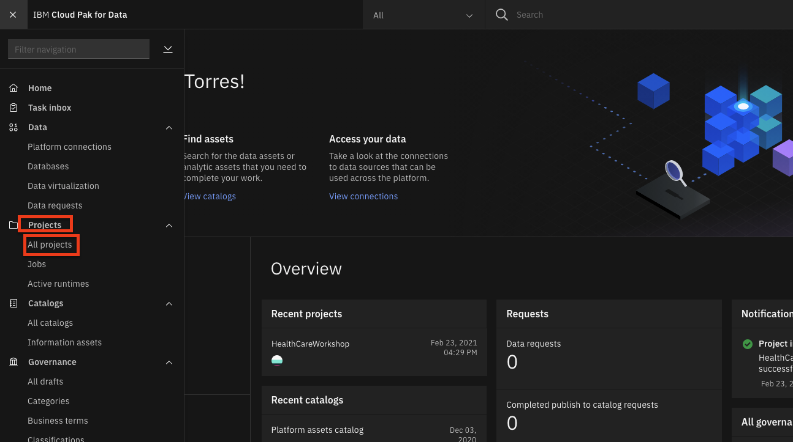
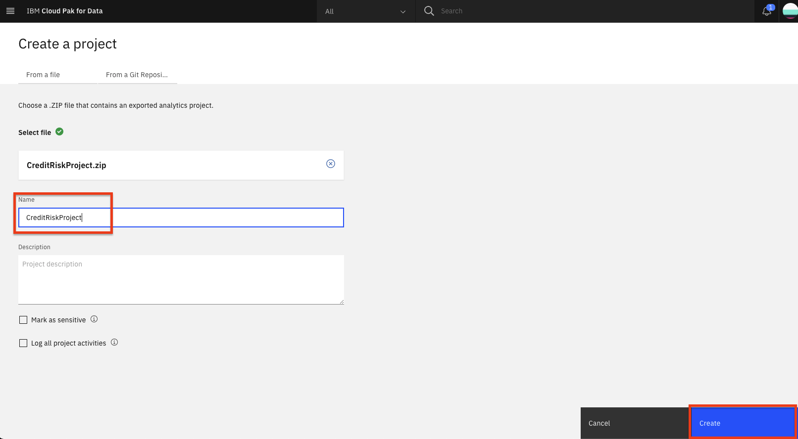

---
also_found_in:
- /learningpaths/cloud-pak-for-data-learning-path/
authors: ''
completed_date: '2019-11-25'
components:
- cloud-pak-for-data
- ibm-db2-warehouse
- netezza-performance-server
display_in_listing: true
draft: false
excerpt: IBM Cloud Pak for Dataのデータ仮想化を利用して、複数のデータソースにまたがるクエリを迅速かつ容易に行うことができます。
ignore_prod: false
last_updated: '2021-07-14'
meta_description: IBM Cloud Pak for Dataのデータ仮想化を利用して、複数のデータソースにまたがるクエリを迅速かつ容易に行うことができます。
meta_keywords: IBM Cloud Pak for Data, Data Virtualization, Db2 warehouse, databases
meta_title: IBM Cloud Pak for Dataでのデータ仮想化
primary_tag: analytics
subtitle: IBM Cloud Pak for Dataのデータ仮想化を利用して、複数のデータソースを横断してクエリを実行する
tags:
- data-management
- data-science
- databases
title: IBM Cloud Pak for Dataでのデータ仮想化
---

何十年もの間、企業はサイロ化を解消するために、さまざまな業務システムからデータマート、データウェアハウス、データレイクなどの中央データストアにデータをコピーして分析しようとしてきました。しかし、これには多くのコストがかかり、エラーも発生しがちです。ほとんどの企業は、構造や種類が異なる平均33個の独自のデータソースを管理するのに苦労しており、見つけにくく、アクセスしにくいデータサイロに閉じ込められていることが多いのです。

*データ仮想化*を使えば、データをコピーしたり複製したりすることなく、多くのシステムでデータを照会できるので、コスト削減につながります。また、最新のデータをソースから照会できるため、分析が簡素化され、より最新で正確な分析が可能になります。

このチュートリアルでは、IBM Cloud Pak for Data 上のデータ仮想化を使用して、複数のデータ・ソースにまたがるクエリーを作成する方法を学びます。この例では、Netezza Performance Server または Db2 Warehouse を使用しますが、IBM Data Virtualization 用の組み込みコネクターを持つ多くのデータベース、または JDBC コネクターを持つ任意のデータベースから選択できます。

## 学習目標

このチュートリアルでは、以下の方法を学びます。

* IBM Cloud Pak for Data にデータセットを追加します。
* データ仮想化のためのデータ・ソースを追加する。
* データを仮想化して結合ビューを作成する。
* 仮想化されたデータをプロジェクトに割り当てる。
* ユーザーにロールを追加し、管理タスクを実行する。

## 前提条件

* [IBM Cloud Pak for Data](https://www.ibm.com/analytics/cloud-pak-for-data)
* [IBM Cloud Account](https://www.ibm.com/jp-ja/cloud)
* 1つまたは複数のデータソース

## 見積もり時間

このチュートリアルは、約30～45分で完了します。

## Step 1.データの取得

3つのデータファイルをダウンロードします。

1. [申請者_財務データ.csv](static/applicant_financial_data.csv)
1. [申請者_loan_data.csv](static/applicant_loan_data.csv)
1. [applicant_personal_data.csv](static/applicant_personal_data.csv)

## Step 2.データセットについて

ここでは、信用リスク/融資のシナリオを使用します。このシナリオでは、貸し手は、リスクモデリングへの異なるアプローチを使用して、より大きく多様な対象者への貸し出しを拡大するという圧力の増加に対応します。これは、伝統的な信用データソースを超えて、代替的な信用データソース（携帯電話プランの支払い履歴、学歴など）に移行することを意味しており、バイアスやその他の予期せぬ相関関係のリスクをもたらす可能性があります。

今回のワークショップで検討している信用リスクモデルは、各ローン申請者に関する20の属性を含むトレーニングデータセットを使用しています。シナリオとモデルは、<a href="https://archive.ics.uci.edu/ml/datasets/Statlog+(German+Credit+Data)">UCI German Credit dataset</a>に基づいた合成データを使用しています。

#### [Applicant Financial Data](static/applicant_financial_data.csv)

このファイルの属性は以下の通りです。

* CUSTOMERID (16進数、主キーとして使用)
* チェックステータス
* クレディセゾン
* 貯蓄残高
* 分割払いプラン
* 既存のクレジットカウント

#### **[Applicant Loan Data](static/applicant_loan_data.csv)**。

このファイルの属性は以下の通りです。

* CUSTOMERID
* LOANDURATION
* LOANPURPOSE
* LOANAMOUNT
* 分割払いのパーセンテージ
* OTHERSONLOAN
* リスク(Risk)

#### **[申請者個人データ](static/applicant_personal_data.csv)**。

このファイルの属性は以下の通りです。

* CUSTOMERID
* Employmentduration
* SEX
* currentesidenceduration
* OWNSPROPERTY
* 年齢
* 住まい
* 職務
* 扶養家族
* 電話
* 外国人労働者
* FIRSTNAME (ファーストネーム)
* LASTNAME (ラストネーム)
* ♪Eメール
* Streetaddress
* CITY
* STATE
* POSTALCODE

## Step 3.プロジェクトをセットアップし、IBM Cloud Pak for Data上でデータ仮想化をプロビジョニングします。

### IBM Cloud Pak for Data にログインします。

ブラウザを起動して、IBM Cloud Pak for Data のデプロイメントに移動します。

  

### 新しい IBM Cloud Pak for Data プロジェクトを作成します。

IBM Cloud Pak for Data では、特定の目標を達成するために使用するリソース (問題に対するソリューションを構築するためのリソース) を収集/整理するために、プロジェクトという概念を使用しています。プロジェクトのリソースには、データ、共同研究者、ノートブックやモデルなどの分析資産などがあります。

* (☰)ナビゲーションメニューの「プロジェクト」セクションで、「**すべてのプロジェクト**」をクリックします。

  

* 右上の **新規プロジェクト** ボタンをクリックします。

  

* **Analytics project**のラジオボタンを選択し、**Next**ボタンをクリックします。

  

* **Create an empty project** を選択します。

  

* プロジェクトの名前とオプションの説明を入力し、**Create**をクリックします。

  

### IBM Cloud Pak for Data でのデータ仮想化のプロビジョニング

* 左上（☰）のハンバーガーメニューから、**サービス>インスタンス**オプションをクリックします。

* インスタンスの一覧から「データ仮想化」サービスを探し、アクションメニュー（縦3つのドット）をクリックして、**インスタンスのプロビジョニング**を選択します。

* Configure service > Startページで、automatic semaphore configurationのチェックボックスを有効にし、 **Next**ボタンをクリックします。

  

* Configure service > Nodes ページでは、デフォルトのシングルノードとリソースの割り当てのまま、 **Next** ボタンをクリックします。

  > **Note:** 64GB以上のRAMを持つDVインスタンスを構成しようとすると、以前は構成エラーが発生していました。

  

* Configure service > Storage ページで、永続的ストレージとキャッシュストレージの両方のストレージクラスとして *ibmc-file-gold-gid* を選択する必要があります。その後、**Next**ボタンをクリックします。

  

* Configure service > Summary ページで、**Configure** ボタンをクリックします。

  

* 設定作業には時間がかかる場合があります。

## Step 4.1つまたは複数のデータベースの設定

IBM Cloud Pak for Data は、JDBC コネクターを持つあらゆるデータベースと連携できます。このチュートリアルでは、IBM Db2 Warehouse on IBM Cloud、IBM Db2 local on IBM Cloud Pak for Data、および Netezza Performance Server を使用してデモを行います。これらのうちの1つまたは2つ、3つすべて、または他のデータベースの組み合わせを使用することができます。

### Netezza Performance Serverのセットアップ

#### Netezza を使ってテストする場合は、以下の手順で行ってください。

IBM Netezza Performance Serverへの接続を行う前に、必要なテーブルを作成し、`nzload` cliを使って`csvデータ`をIBM Netezza Performance Serverサーバーにロードする必要がある。`nzload` cliをインストールするには、[instruction](https://www.ibm.com/support/knowledgecenter/en/SS5FPD_1.0.0/com.ibm.ips.doc/postgresql/admin/t_sysadm_installing_linux_unix_clients.html)に従う。

IBM Netezza Performance Serverのコンソールにログインし、[Applicant Loan Data](static/applicant_loan_data.csv)、[Applicant Financial Data](static/applicant_financial_data.csv)、[Applicant Personal Data](static/applicant_personal_data.csv)の3つのテーブルを作成する。

なお、これらのテーブルは、`nzload`を使ってデータをロードする前に存在している必要があります。その後、`nzload`のCLIコマンドを使ってCSVデータをNetezza Performance Serverデータベースにロードすることができます。

もし、`nzload`というCLIがサポートされていない場合（Mac OSXなど）は、提供されたCSVデータに対してインサートステートメントを作成し、Netezzaコンソールから実行する必要がある。これは`nzload`コマンドより少し時間がかかるかもしれません。

### IBMクラウドでDb2ウェアハウスをセットアップする

#### DB2 Warehouse on IBM Cloudでテストする場合は、以下の手順で行ってください。

[Db2 Warehouse on IBM Cloud](https://cloud.ibm.com/catalog/services/db2-warehouse?cm_sp=ibmdev-_-developer-tutorials-_-cloudreg)を使用することで、クラスター上のリソースを最適に節約することができます。クラスター上でローカルのDb2を使用する場合は、このセクションをスキップし、代わりに[set up the local Db2-warehouse on IBM Cloud Pak for Data](#step-5 set-up-the-local-db2-warehouse-on-ibm-cloud-pak-for-data)を使用します。

**注意**。続行する前に、IBM Cloud上でDb2ウェアハウスをプロビジョニングしていることを確認してください。

* サービスのプロビジョニングが完了したら、「Service Credentials」にアクセスし、「**New credential +**」をクリックします。「View credentials」を開き、後で使用するためにクレデンシャル（これは接続の詳細です）をコピーします。

  

#### クラウド上のDb2 Warehouseにデータをロードする

* ここでManageに移動し、**Open Console**をクリックします。

  

* 左上（☰）のハンバーガーメニューから、**Data**をクリックし、**Load data**タブをクリックします。

  

* ページのFile Selectionセクションにある**browse files**リンクをクリックし、このリポジトリをダウンロードした場所に移動し、次に`data/split/`に移動して`applicant_financial_data.csv`を選択し、**Next**ボタンをクリックします。

* **+ New Schema** をクリックして、名前を `CP4DCREDIT` にします。

* 新しいスキーマを選択した状態で、 **+ 新しいテーブル** をクリックします。「**新しいテーブル名」に「APPLICANTFINANCIALDATA」と入力し、「Create > Next**」をクリックします。デフォルトを受け入れて、**Next**をクリックし、**Begin Load**をクリックします。

* テーブル名を `APPLICANTPERSONALDATA` にして、`applicant_personal_data.csv` ファイルのデータロード手順を繰り返します。

* `applicant_loan_data.csv` ファイルに対するデータロードのステップを繰り返し、テーブル `LOANS` に名前を付けます。

#### SSL証明書の取得

* IBM Cloud Db2 Warehouse インスタンスを使用するには、IBM Cloud Pak for Data の SSL 証明書が必要です。

* Db2 Warehouseコンソールで、左上（☰）のハンバーガー・メニューから「**Adminsitration**」をクリックし、次に「**Connections**」タブをクリックします。「SSL証明書のダウンロード」ボタンをクリックします。

   

* [openssl](https://www.openssl.org/)を使って、SSL証明書を`.crt`から`.pem`ファイルに変換する必要があります。以下のコマンドを実行してください。