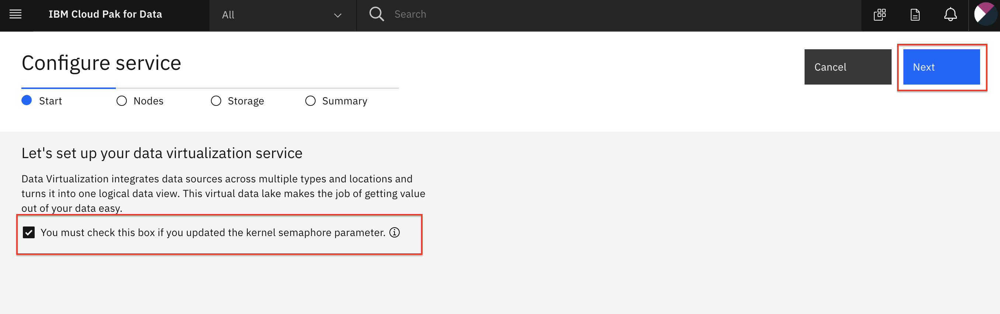
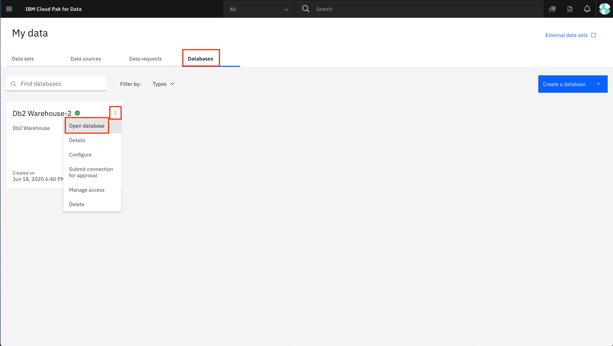
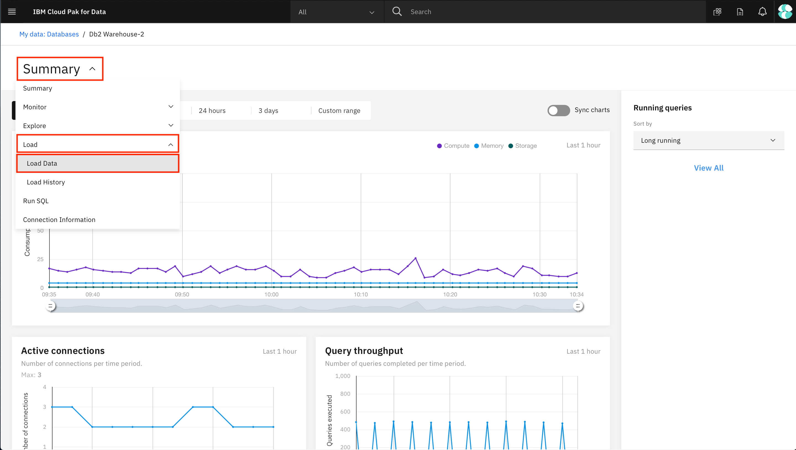
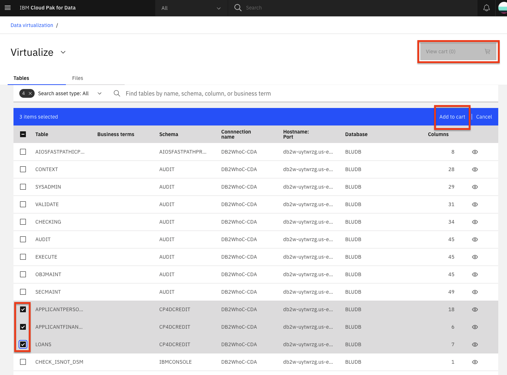
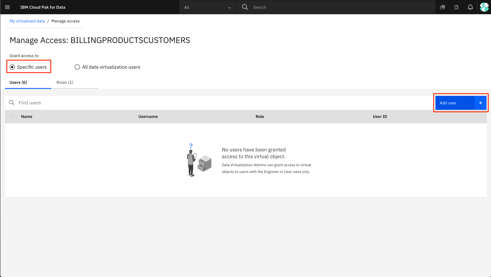
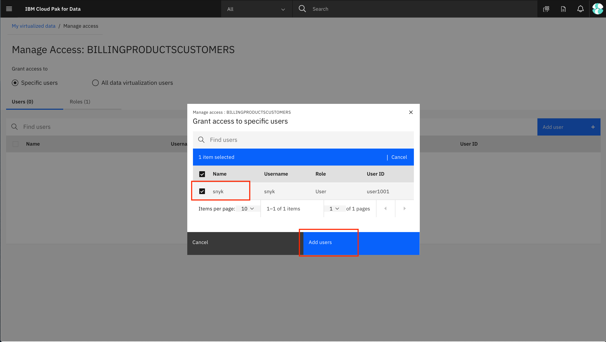
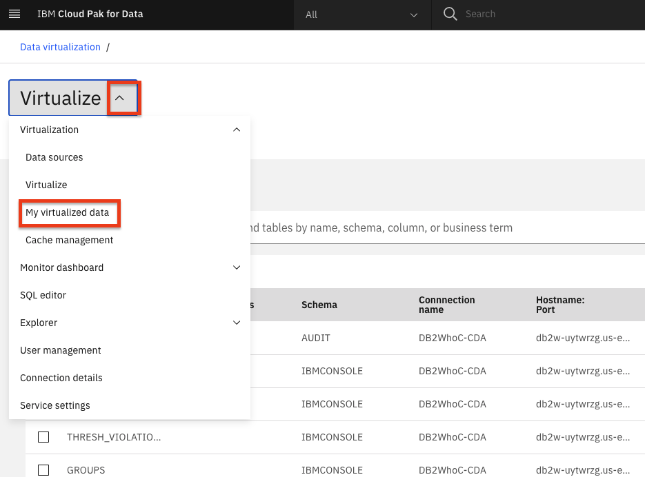

---
also_found_in:
- /learningpaths/cloud-pak-for-data-learning-path/
authors: ''
completed_date: '2019-11-25'
components:
- cloud-pak-for-data
- ibm-db2-warehouse
- netezza-performance-server
display_in_listing: true
draft: false
excerpt: Use Data virtualization on IBM Cloud Pak for Data to make queries across
  multiple data sources quickly and easily.
ignore_prod: false
last_updated: '2021-07-14'
meta_description: Use Data virtualization on IBM Cloud Pak for Data to make queries
  across multiple data sources quickly and easily.
meta_keywords: IBM Cloud Pak for Data, Data Virtualization, Db2 warehouse, databases
meta_title: Data virtualization on IBM Cloud Pak for Data
primary_tag: analytics
subtitle: Use data virtualization on IBM Cloud Pak for Data to make queries across
  multiple data sources
tags:
- data-management
- data-science
- databases
title: Data virtualization on IBM Cloud Pak for Data
---

For decades, companies have tried to break down silos by copying data from different operational systems into central data stores for analysis, such as data marts, data warehouses, and data lakes. This is often costly and prone to error. Most struggle to manage an average of 33 unique data sources, which are diverse in structure and type, and are often trapped in data silos that are hard to find and access.

With *data virtualization,* you can query data across many systems without having to copy and replicate data, which helps reduce costs. It also can simplify your analytics and make them more up to date and accurate because you’re querying the latest data at its source.

In this tutorial, we're going to learn how to use data virtualization on IBM Cloud Pak for Data to make queries across multiple data sources. In this example, we'll use Netezza Performance Server or Db2 Warehouse, but you can choose from many that have built-in connectors for IBM Data Virtualization, or any database with a JDBC connector.

## Learning objectives

In this tutorial, you will learn how to:

* Add datasets to IBM Cloud Pak for Data.
* Add a data source for data virtualization.
* Virtualize the data and create a joined view.
* Assign virtualized data to a project.
* Add roles to users and perform admin tasks.

## Prerequisites

* [IBM Cloud Pak for Data](https://www.ibm.com/analytics/cloud-pak-for-data)
* [IBM Cloud Account](https://www.ibm.com/cloud)
* One or more data sources

## Estimated time

This tutorial will take approximately 30-45 minutes to complete.

## Step 1. Get the data

Download the three data files:

1. [applicant_financial_data.csv](static/applicant_financial_data.csv)
1. [applicant_loan_data.csv](static/applicant_loan_data.csv)
1. [applicant_personal_data.csv](static/applicant_personal_data.csv)

## Step 2. About the dataset

We will be using a credit risk/lending scenario. In this scenario, lenders respond to an increased pressure to expand lending to larger and more diverse audiences by using different approaches to risk modeling. This means going beyond traditional credit data sources to alternative credit sources (i.e. mobile phone plan payment histories, education, etc.), which may introduce risk of bias or other unexpected correlations.

The credit risk model we are exploring in this workshop uses a training data set that contains 20 attributes about each loan applicant. The scenario and model use synthetic data based on the <a href="https://archive.ics.uci.edu/ml/datasets/Statlog+(German+Credit+Data)">UCI German Credit dataset</a>.

#### [Applicant Financial Data](static/applicant_financial_data.csv)

This file has the following attributes:

* CUSTOMERID (hex number, used as Primary Key)
* CHECKINGSTATUS
* CREDITHISTORY
* EXISTINGSAVINGS
* INSTALLMENTPLANS
* EXISTINGCREDITSCOUNT

#### **[Applicant Loan Data](static/applicant_loan_data.csv)**

This file has the following attributes:

* CUSTOMERID
* LOANDURATION
* LOANPURPOSE
* LOANAMOUNT
* INSTALLMENTPERCENT
* OTHERSONLOAN
* RISK

#### **[Applicant Personal Data](static/applicant_personal_data.csv)**

This file has the following attributes:

* CUSTOMERID
* EMPLOYMENTDURATION
* SEX
* CURRENTRESIDENCEDURATION
* OWNSPROPERTY
* AGE
* HOUSING
* JOB
* DEPENDENTS
* TELEPHONE
* FOREIGNWORKER
* FIRSTNAME
* LASTNAME
* EMAIL
* STREETADDRESS
* CITY
* STATE
* POSTALCODE

## Step 3. Set up the project and provision data virtualization on IBM Cloud Pak for Data

### Log in to IBM Cloud Pak for Data

Launch a browser and navigate to your IBM Cloud Pak for Data deployment.

  

### Create a new IBM Cloud Pak for Data project

In IBM Cloud Pak for Data, we use the concept of a project to collect/organize the resources used to achieve a particular goal (resources to build a solution to a problem). Your project resources can include data, collaborators, and analytic assets like notebooks and models, etc.

* Go the (☰) navigation menu and under the Projects section, click on **All Projects**.

  

* Click on the **New project** button on the top right.

  

* Select the **Analytics project** radio button and click the **Next** button.

  

* Select **Create an empty project**.

  

* Provide a name and optional description for the project and click **Create**.

  

### Provision data virtualization on IBM Cloud Pak for Data

* From the upper-left (☰) hamburger menu, click **Services > Instances** option.

* From the list of instances, locate the Data Virtualization service, click the action menu (three vertical dots) and select **Provision instance**.

* In the Configure service > Start page, enable the checkbox for automatic semaphore configuration and click the **Next** button.

  

* In the Configure service > Nodes page, leave the default single node and resource allocation and click the **Next** button.

  > **Note:** Attempting to configure a DV instance with greater than 64GB RAM has previously resulted in configuration errors.

  

* In the Configure service > Storage page, you must choose *ibmc-file-gold-gid* as the storage class for both persistent and cache storage. Then click the **Next** button.

  

* In the Configure service > Summary page, click the **Configure** button.

  

* The configuration process may take a while to complete.

## Step 4. Set up one or more databases

IBM Cloud Pak for Data can work with any database with a JDBC connector. For this tutorial, we demonstrate using IBM Db2 Warehouse on IBM Cloud, IBM Db2 local on IBM Cloud Pak for Data, and Netezza Performance Server. You can use any one or two of these, all three, or any combination of other databases.

### Set up Netezza Performance Server

#### Use these instructions if you want to test with Netezza

Before you create connection to IBM Netezza Performance Server, you should create required tables and load the `csv data` into IBM Netezza Performance Server server using `nzload` cli. To install `nzload` cli, follow the [instructions](https://www.ibm.com/support/knowledgecenter/en/SS5FPD_1.0.0/com.ibm.ips.doc/postgresql/admin/t_sysadm_installing_linux_unix_clients.html).

Log in to your IBM Netezza Performance Server console and create three tables for [Applicant Loan Data](static/applicant_loan_data.csv), [Applicant Financial Data](static/applicant_financial_data.csv), and [Applicant Personal Data](static/applicant_personal_data.csv).

Note that the tables should exist before you load the data using `nzload`. Then, you can use the `nzload` CLI command to load the CSV data to your Netezza Performance Server database.

```
bash

nzload -u <user> -pw <password> -host <host> -db <database> -t <table name> -delim ',' -df <csv file name>
```

If the `nzload` CLI is not supported -- for example in Mac OSX -- you will have to create insert statments for the CSV data provided and run it from the Netezza console. This might take little longer than the `nzload` command.

### Set up the Db2 Warehouse on IBM Cloud

#### Use these instructions if you want to test with DB2 Warehouse on IBM Cloud

It is suggested to use [Db2 Warehouse on IBM Cloud](https://cloud.ibm.com/catalog/services/db2-warehouse?cm_sp=ibmdev-_-developer-tutorials-_-cloudreg) to best conserve resources on the cluster. If you want to use the local Db2 on the cluster, skip this section and [set up the local Db2 Warehouse on IBM Cloud Pak for Data](#step-5-set-up-the-local-db2-warehouse-on-ibm-cloud-pak-for-data) instead.

**NOTE**: Ensure that you have provisioned Db2 warehouse on IBM Cloud before proceeding.

* Once the service is provisioned, Go to Service Credentials and click **New credential +**. Open `View credentials` and copy the credentials (this is your connection details) for use later.

  

#### Load data for Db2 Warehouse on Cloud

* Now go to Manage and click **Open Console**.

  

* From the upper-left (☰) hamburger menu, click **Data** and then click on the **Load data** tab.

  

* Click on the **browse files** link in the File Selection section of the page and navigate to where you downloaded this repository, then to `data/split/` and choose `applicant_financial_data.csv`, then click the **Next** button.

* Click **+ New Schema** and name it `CP4DCREDIT`.

* With the new schema selected, click **+ New table**. Under New Table Name, type `APPLICANTFINANCIALDATA` and click **Create > Next**. Accept the defaults and click **Next**, then click **Begin Load**.

* Repeat the data load steps for the `applicant_personal_data.csv` file, naming the table `APPLICANTPERSONALDATA`.

* Repeat the data load steps for the `applicant_loan_data.csv` file, naming the table `LOANS`.

#### Get SSL certificate

* You will need an SSL certificate for IBM Cloud Pak for Data to use the IBM Cloud Db2 Warehouse instance.

* In the Db2 Warehouse console, from the upper-left (☰) hamburger menu, click **Adminsitration**, then then click the **Connections** tab. Click the **Download SSL Certificate** button.

   

* You'll need to convert the SSL certificate from `.crt` to a `.pem` file using [openssl](https://www.openssl.org/). Run the following command.

  ```bash
  openssl x509 -in DigiCertGlobalRootCA.crt -out DigiCertGlobalRootCA.pem -outform PEM -inform DER
  ```

* Save this file for later use.

Now that the Db2 Warehouse has been set up on IBM Cloud, you may now skip to [add a new data source connection](#step-6-add-a-new-data-source-connection).

### Set up the local Db2 Warehouse on IBM Cloud Pak for Data
 
#### Use these instructions if you want to test with Db2 Warehouse on IBM Cloud Pak for Data

These instructions are for loading the data into the local IBM Cloud Pak for Data version of Db2 Warehouse. If you've used the IBM Cloud instance of Db2 Warehouse, you can skip to the [next section](#step-6-add-a-new-data-source-connection). It is suggested to use [Db2 Warehouse on IBM Cloud](https://cloud.ibm.com/catalog/services/db2-warehouse?cm_sp=ibmdev-_-developer-tutorials-_-cloudreg) to conserve resources on the IBM Cloud Pak for Data cluster as described in [set up the Db2 warehouse on IBM Cloud](#step-4-set-up-the-db2-warehouse-on-ibm-cloud). If you wish to use the local Db2 on the cluster, continue with this section.

Note that IBM Cloud Pak for Data can work with any database with a JDBC connector, so Db2 warehouse is only one of many choices.

* We are assuming the cluster has already been set up such that you have already installed the Db2 assembly, have created the database deployment, have installed the Data Management Console (DMC) assembly, and have provisioned a DMC service instance.

* Log into the IBM Cloud Pak for Data instance as an administrator. From the upper-left (☰) hamburger menu, click **Data > Databases**.

* Click on the three vertical buttons on the database instance tile and click on the **Open database** menu item.

* Click on the databases drop-down menu on the top left of the page and click on the **Connection Information** option.

  

* Take note of the connection information because it will be used later.

**IMPORTANT**: At least one OpenShift node should have the tag for db2wh (such as `icp4data=database-db2wh`); otherwise, you will not be able to provision the local Db2 warehouse. The tag can be set using the following command:

> `oc label node <NODE> icp4data=database-db2wh`

#### Get connection details for local Db2 warehouse

To get the connection info for your local Db2 Warehouse, go to the hamburger (☰) menu and click on the **My Instances** option.

  

Now go to the Provisioned instances tab and click on the row for your local Db2 Warehouse. This will open the details of the Db2 warehouse instance.


Either keep this window open in a separate tab or copy the required connection information: Host, Port, Database name, Username, and Password. You can get the port from the JDBC Connection URL; for example, for the URL jdbc:db2://10.221.243.172:31956/BLUDB, the port is the number after the colon in the URL: 31956.


#### Load data for local Db2 warehouse on IBM Cloud Pak for Data

* Click the hamburger (☰) menu in the upper-left corner and choose **Collect > My data**.

    

* Go to the Databases tab, click on the three vertical lines on the **Db2 Warehouse** tile and click **Open database**.

    

* Under Summary, choose **Load > Load Data**.

    

* Click on the **browse files** link in the File Selection section of the page and navigate to where you downloaded this repository, then to `data/split/` and choose `applicant_financial_data.csv`, then click the **Next** button.

* Click **+ New Schema** and name it `CP4DCREDIT`.

* With the new schema selected, click **+ New table**. Under New Table Name, type `APPLICANTFINANCIALDATA`, click **Create > Next**. Accept the defaults and click **Next**, then **Begin Load**.

* Repeat the data load steps for the `applicant_personal_data.csv` file, naming the table `APPLICANTPERSONALDATA`.

* Repeat the data load steps for the `applicant_loan_data.csv` file, naming the table `LOANS`.

## Step 6. Add a new data source connection

IBM Cloud Pak for Data can work with any database such as IBM Db2 Warehouse on cloud, IBM Db2 local and Netezza Performance Server, MongoDB. You can use them to set up connection and add as datasource in the following steps.

  > **Note:** If your data source is in a remote data center (not in the same data center as the IBM Cloud Pak for Data instance), you can improve the performance of your data source connections using remote connectors. Follow the instructions in the [Improve performance for your data virtualization data sources with remote connectors](https://developer.ibm.com/tutorials/improve-performance-for-your-database-connections-with-remote-connectors/) tutorial to set up a remote connector for your data source.

### Get the connection information

If you are using any database such as Db2 warehouse on IBM Cloud, Netezza Performance Server, ensure that you have obtained the JDBC connection details and SSL certificate using the instructions provided as part of [Step 4](#-get-connection-details-for-db2-warehouse-on-ibm-cloud) above.

If you are using the local Db2 warehouse on IBM Cloud Pak for Data, ensure that you have obtained the JDBC connection details using the instructions provided as part of [Step 5](#-get-connection-details-for-local-db2-warehouse) above.

### Add the new data source

* To add a new data source, go the (☰) navigation menu and under the Data section, click on **Platform connections**.

  

* At the overview, click the **New connection** button.

  

* Start by giving your new connection a name, and select the connection type. (Select **Db2 Warehouse on Cloud** as your connection type for IBM Db2 database or **PureData System For Analytics** for Netezza Performcance server.)

* On the following screen, provide your new connection a name. Also enter the Host, Port, Database, Username, and Password values for the connection (Note that these are the values you saved when you provisioned the instance).

* For Db2 Warehouse on Cloud, ensure the check box for `Use SSL` is selected, then copy and paste the contents of the SSL certificate for Db2 Warehouse (probably called DigiCertGlobalRootCA.pem).

  > **Note:** You can open the pem file in a text editor to copy the credentials content.

* Once you have entered all the connection information, you must first click the **Test Connection** button and after that succeeds, click on the **Save** button.

  

* The new connection will be listed in the overview.

> **Note:** To complete this section, you will need the Admin or Data Engineer role on the IBM Cloud Pak for Data platform.

## Virtualizing data

For this section, we'll use the data virtualization tool to import the data from any database like IBM Db2 Warehouse, Netezza Performance Server, or MongoDB, which is exposed as a connection in IBM Cloud Pak for Data. We will use data virtualization to access these tables and then create joined views against those virtualized tables.

### Create virtualized tables

* To launch the data virtualization tool, go the (☰) navigation menu and under the **Data** section, click on **Data virtualization**.

  

* From the Data virtualization sub-menu at the top left of the page, click on the menu drop-down list and choose **Virtualize**.

  

* Several tables names will be displayed across any of the data sources that are included in the data virtualization server. You will notice that on the top of the panel, we can filter the tables being displayed by selecting the database type.

* To simplify the search for tables you will use, click on the `Schemas` column header to sort the tables by Schema. Then find the tables we will be using for this workshop: `APPLICANTFINANCIALDATA`, `APPLICANTPERSONALDATA` and `LOANS`, which are under the `CP4DCREDIT` schema. Select the checkboxes next to these three tables, and then click on **Add to cart > View Cart**.

> **Note:** You may need to page through the available tables by clicking on the right arrow at the bottom of the tables view, or changing the number of `Items per page` to a larger value at the bottom left of the tables view.

  

* The next panel prompts you to select where to assign the virtualized tables. Select the **My virtualized data** radio button and click the **Virtualize** button to add the virtualized tables to your data (we left the default values, so the tables will be virtualized under your own user schema with the same table names as the original tables).

  

* A pop-up dialog panel will indicate that the virtual tables have been created. Let's see the new virtualized tables by clicking the **View my virtualized data** button.

  

> **Note:** You may receive a notification at the top of the page that the virtual assets were published to the catalog. Feel free to dismiss the notification by clicking on the `X`.

### Create joined virtual views

Now we're going to join the tables we previously virtualized, so we have a final merged set of data. It will be easier to do it here, rather than in a notebook where we'd have to write code to handle three different data sets.

* From the My virtualized data page, click on two of the virtualized tables (`APPLICANTPERSONALDATA` and `APPLICANTFINANCIALDATA`), then click the **Join** button.

  

* To join the tables, we need to pick a key that is common to both data sets. Here we choose to map `CustomerID` from the first table to `CustomerID` on the second table. Do this by clicking on one and dragging it to another. We will leave the default of having all the column names selected. When the line is drawn, click on the **Next** button.

  

* In the next panel, although we could change the names of our columns, we will accept the existing names for our columns. Click the **Next** button to continue.

  

* In the next panel, we'll give our joined data view a unique name (to be consistent with SQL standards, pick an all-uppercase name), choose something like: `XXXAPPLICANTFINANCIALPERSONALDATA` (where `XXX` is your initials in all uppercase). Also select the **My virtualized data** radio button and then click the **Create view** button to add the virtualized aggregate view to your data.

  

* A pop-up dialog panel will indicate that the join view creation has succeeded. Click on **View my virutalized data** button.


* Repeat the same steps as above, but this time choose to join the new joined view you just created (`XXXAPPLICANTFINANCIALPERSONALDATA`) and the last virtualized table (`LOANS`), to create a new joined view that has all three tables. Click the **Join** button.

  

* Again, join the two tables by selecting/mapping the `CustomerID` from the first table to `CustomerID` on the second table. Do this by clicking on one and dragging it to another. We will leave the default of having all the column names selected. When the line is drawn, click on the **Next** button.

  

* In the next panel, although we could change the names of our columns, we will accept the existing names for our columns. Click the **Next** button to continue.

* In the next panel we'll give our joined data view a unique name (to be consistent with SQL standards, pick an all uppercase name), choose someething like: `XXXAPPLICANTFINANCIALPERSONALLOANSDATA` (where `XXX` is your initials in all uppercase). Also select the **My virtualized data** radio button and then click the **Create view** button to add the virtualized aggregate view to your data.

* A pop-up dialog panel will indicate that the join view creation has succeeded! Click on **View my virtualized data** button.

* From the My virtualized data page, you should now see all three virtualized tables and two joined tables. Do not go to the next section until you have all the tables.

  

### Grant access to the virtualized data

For other users to have access to the data you just virtualized, you need to grant it. Follow these steps to make your virtualized data visible to them:

* Go to **Data Virtualization** from the hamburger (☰) menu. Click on **Menu > My virtualized data**.

* Click on the virtualized data you've created, then click the three vertical dots to the right, and choose **Manage access**.

  

* Click the **Specific users** radio button, then **Add user +**.

  

* Select the users you wish to grant access to and click **Add users**.

  

Repeat the above steps for the remaining tables and views.

### Assign the Engineer role to the users

IBM Cloud Pak for Data users that need to use data virtualization functions must be assigned specific roles based on their job descriptions. These roles are Admin, Engineer, User, and Steward.

Let's assign the Engineer role to some users:

* From the hamburger (☰) menu, choose the **Data Virtualization** option, then click **My virtualized data > User management**.

  

* Click on **Add users +** and update the role of your users to Engineer.

  

## Step 7. Users assign virtualized data

Now let's look at how a user who has access to virtualized data can assign the data to their project -- how to add the virtualized data as asset to a project.

* From the data virtualization sub-menu at the top left of the page, click on the menu drop-down list and choose **My virtualized data**. Here you should see the data you have virtualized or that you have been given access to (or that the administrator has assigned to you).

  

* Select the checkbox next to the data sets you want to use in your project and click the **Assign** button to start importing it to your project.

> **Note:** The name of the data assets to select may vary based on names chosen during data virtualization. The default names to select are LOANS, APPLICANTFINANCIALDATA, APPLICANTPERSONALDATA, APPLICANTFINANCIALPERSONALDATA AND APPLICANTFINANCIALPERSONALLOANDATA.

  

* In the 'Assign virtual objects' screen, choose your analytics project from the drop-down list. Then click the **Assign** button to add the data to your project.

  

* In the `Publish virtual assets to catalog` pop-up panel, select the **Publish** button to publish these assets to the catalog.

  

* In the pop-up panel, you will receive a confirmation that the objects have been assigned to your project. Click the **Go to project** button.

  

* In the project page, clicking on the **Assets** tab will show the virtualized tables and joined tables that are now in your project (along with other assets that are in the project).

 **Do not go on until you see the data assets in your project.**

## Conclusion

In this tutorial, we showed how to make a connection to databases that contain our data, how to virtualize them, and how to use the virtualized data.

Remember that you can add data from different databases and servers if you need to. Moreover, you can virtualize this data from different sources together as well. The goal is to take care of bringing the data to the platform early on so all the data scientists can use it without reinventing the wheel while you keep full control of who has access to what data.