このチュートリアルでは、IBM Watson&reg; Studio の AutoAI 機能を使用して機械学習モデルを構築し、評価する方法を示します。モデリング・フェーズでは、様々なモデリング・テクニックを選択して適用し、そのパラメータをキャリブレーションして最適な予測を実現します。一般的に、適用可能な手法は複数あり、手法によってはデータの形式に関する特定の要件があります。そのため、データの準備段階に戻る必要があることが多い。しかし、モデルの評価段階では、データ分析の観点から質の高いモデルを構築することが目標となります。モデルの最終的な展開に進む前に、モデルを徹底的に評価し、モデルを作成するために実行されたステップを見直し、モデルがビジネス目標を適切に達成していることを確認することが重要です。

Watson Studioの<a href="https://dataplatform.cloud.ibm.com/docs/content/wsj/analyze-data/autoai-overview.html?audience=wdp&context=wdp" target="_blank" rel="noopener noreferrer">AutoAI</a>グラフィカルツールを使用すると、コードを1行も書くことなく、モデルを素早く構築し、その精度を評価することができます。AutoAIは、学習データのアップロード、機械学習手法とアルゴリズムの選択、モデルのトレーニングと評価など、機械学習モデルの構築を段階的にガイドします。

このラーニングパスの他のチュートリアルと同様に、<a href="https://www.kaggle.com/sandipdatta/customer-churn-analysis/notebook#Churn-Analysis" target="_blank" rel="noopener noreferrer">Kaggle</a>で利用可能な顧客の解約データセットを使用しています。

## 前提条件

このラーニングパスのチュートリアルを完了するには、<a href="https://cloud.ibm.com/registration?cm_sp=ibmdev-_-developer-tutorials-_-cloudreg" target="_blank" rel="noopener noreferrer">IBM Cloud アカウント</a>が必要です。このアカウントがあれば、<a href="https://cloud.ibm.com?cm_sp=ibmdev-_-developer-tutorials-_cloudreg" target="_blank" rel="noopener noreferrer">IBM Cloud</a>、<a href="https://www.ibm.com/jp-ja/cloud/watson-studio" target="_blank" rel="noopener noreferrer">IBM Watson Studio</a>、<a href="https://www.ibm.com/jp-ja/cloud/machine-learning" target="_blank" rel="noopener noreferrer">IBM Watson Machine Learning Service</a>へのアクセスが可能になります。

## 見積もり時間

このチュートリアルを完了するには、約 60 分かかります。

## 手順

ラーニングパスのために環境をセットアップする手順は、[Data visualization, preparation, and transformation using IBM Watson Studio](/tutorials/watson-studio-data-visualization-preparation-transformation/)チュートリアルで説明されています。これらのステップは、以下の方法を示しています。

1. IBM Cloud Object Storage サービスを作成します。
1. Watson Studio プロジェクトを作成します。
1. IBM Cloud サービスをプロビジョニングします。
1. データセットをアップロードします。

学習パスを続行する前に、これらのステップを完了する必要があります。環境のセットアップが完了している場合は、次のステップである Watson Studio での新しいモデルの作成に進みます。

### Watson Studio で新しいモデルを作成する

**注意**してください。「IBM Watson Studio」のバナーが、場合によっては「IBM Cloud Pak for Data」という名称に変わっていることに気づくかもしれません。使用されるバナーは、お客様が IBM Cloud アカウントで作成したサービスの数と種類に依存します。この変更は、サービスの機能やナビゲーションには影響しません。

1. Watson Studio プロジェクトの「**Assets**」タブを選択します。

1. Asset タブで、**Add to Project** コマンドをクリックします。

    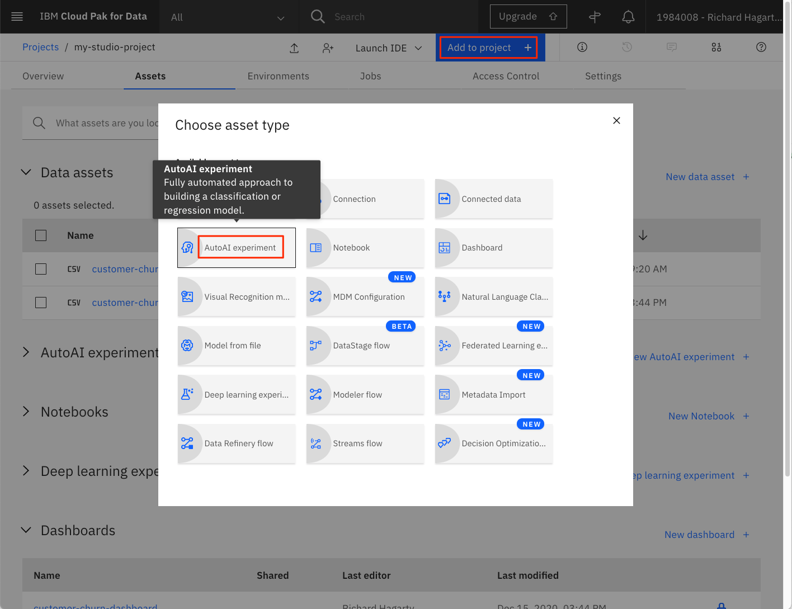をクリックします。

1. 1. **AutoAI Experiment** アセットタイプを選択します。

1. **Create an AutoAI experiment**ウィンドウが表示されます。

    * 「customer-churn-manual」のような **Name** を入力します。

    * **Machine Learning Service** には、以前プロジェクト用に作成した Watson Machine Learning サービスを選択します。

        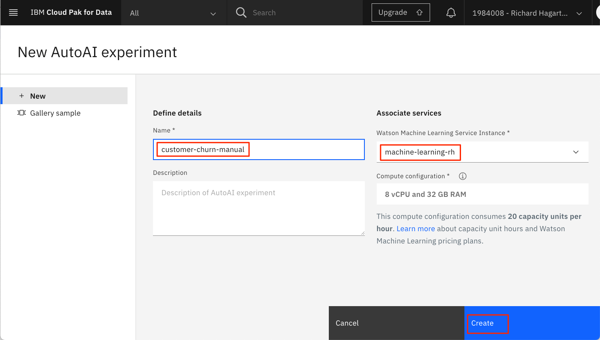

    * **Create** をクリックします。

1. 「データソースの追加」ウィンドウが表示されます。

    * **プロジェクトから選択** をクリックします。

    * プロジェクトに以前追加したKaggleデータアセットを選択します。

        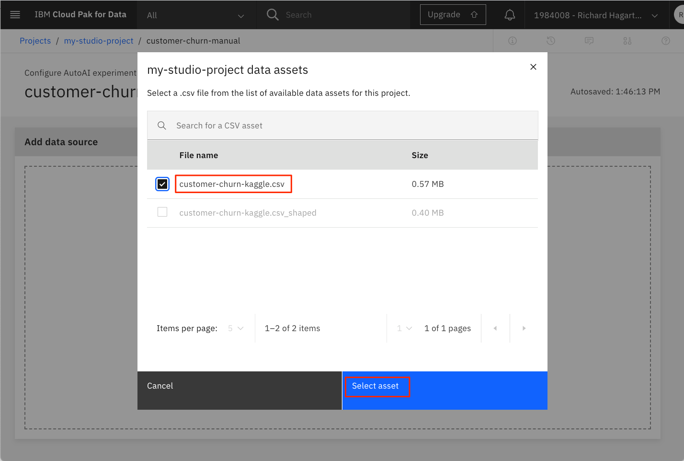

    * **Select Asset** をクリックします。

## Run and train the model

**Configure AutoAI experiment**ウィンドウから。

1. **What do you want to predict?**のボックスで、**churn**を選択します。

    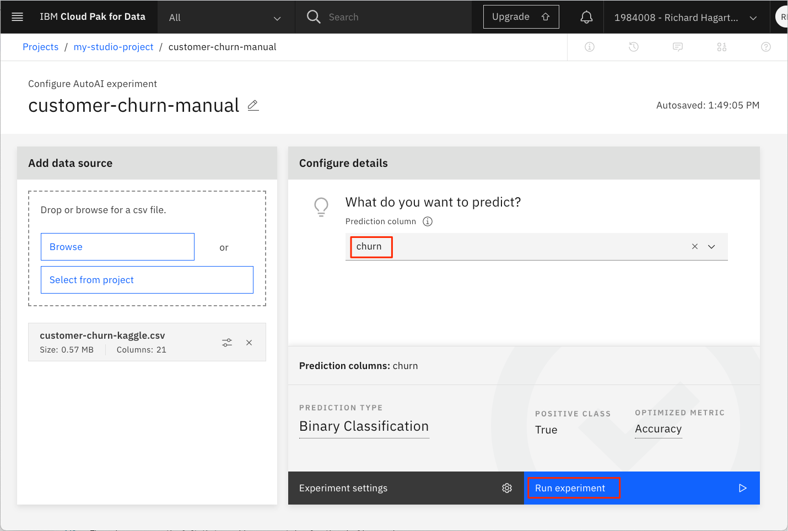

1. デフォルトの予測タイプである**Binary Classification**と、最適化された指標である**Accuracy**を維持します。

1. 「実験の実行」をクリックします。

実験を実行すると、ページの上部にステップのパイプラインが表示されます。実験が終了すると、パネルの下部に完成したモデルのリストが精度の高い順に表示されます。実験の完了には30分以上かかることがありますので、しばらくお待ちください。

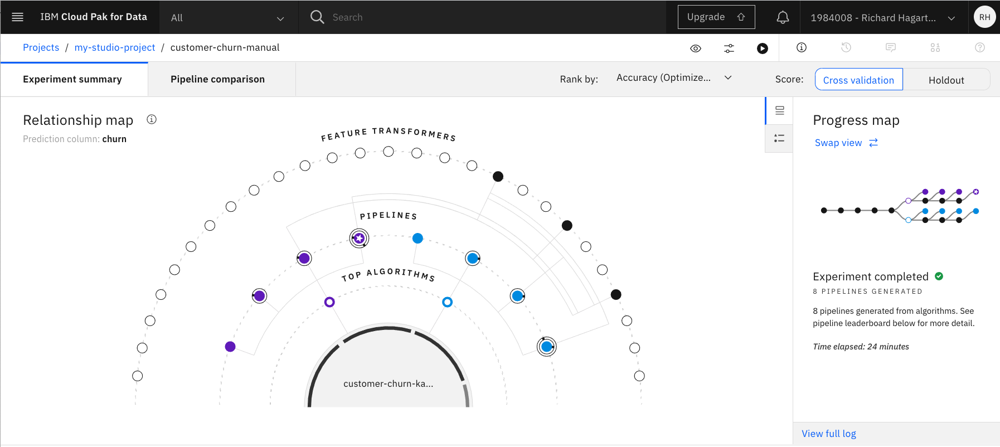

AutoAIプロセスでは、以下の順序で、異なるモデルを使用し、ハイパーパルメータ最適化(HPO)とフィーチャリング(FE)の値を変化させながら、パイプラインの候補リストを作成します。

今回のデータでは、パイプライン4（Light Gradient Boosting Machine Classifier）が、「Accuracy」指標に基づいて最も高いランクになりました。「ハイパーパラメータ最適化」と「フィーチャーエンジニアリング」の両方の拡張機能を使用しています。

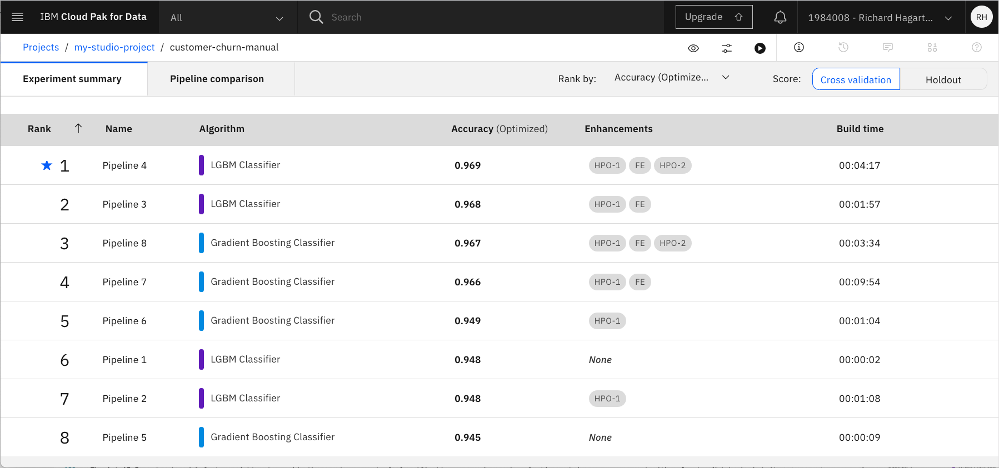

AutoAI 実験が完了すると、Watson Studio プロジェクトに保存されます。それは、**Assets**タブの**AutoAI experiments**から見ることができます。

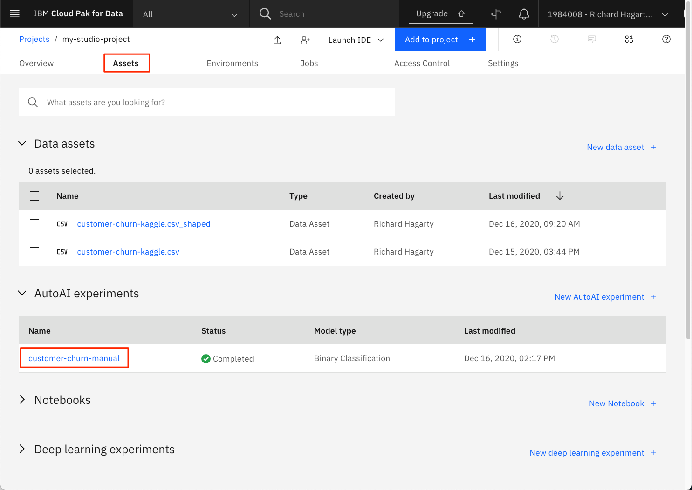

### モデルの性能を評価する

AutoAI Experimentのページでは、各パイプラインのパフォーマンスの詳細を知るためのオプションがいくつか用意されています。

**パイプラインの比較**タブコマンドは、各パイプラインに表示されるメトリクスのリストを拡張します。

ここでは、**Accuracy**でランキングした場合、**Pipeline 4 (P4)**が最高位であることがわかります。

パイプライン名をクリックすると、そのパイプラインのModel Evaluationウィンドウが表示されます。

左側にはメニューがあり、以下のようなパイプラインの詳細なメトリクスを提供しています。

* Confusion Matrix table

  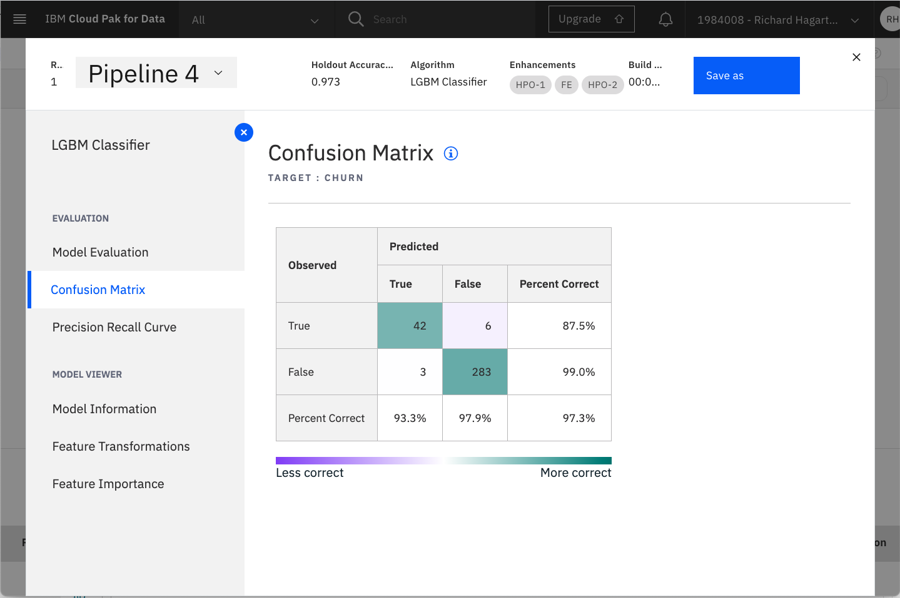

* 特徴量重要度グラフ

  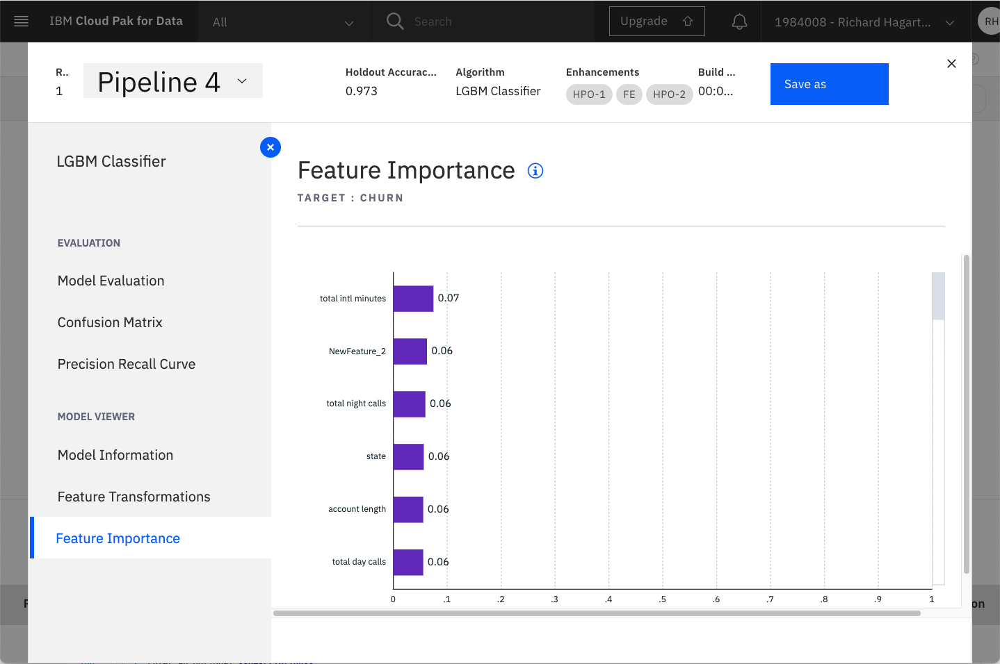

AutoAI Experimentモデル機能は、Jupyter Notebookで得られるのと全く同じ分類アプローチや評価指標を提供するわけではありませんが、プログラミングを必要とせず、格段に早く結果を得ることができます。

Watson Studio のこのモデルビルダーコンポーネントは、時間のかかるプログラミング作業を行わずに、テストされ、予測性能に関して評価できる初期の機械学習モデルを作成するのに役立ちます。また、このサービスで提供される予測メトリクスは、データセットが使用しようとする目的に有用かどうかを最初に把握するのに役立ちます。

### デプロイメントスペースの作成

IBM Watson Studio では、**デプロイメント・スペース** という概念を使用して、関連するデプロイ可能なアセットのセットのデプロイを構成および管理します。これらの資産は、データファイルや機械学習モデルなどです。

今回の例では、AutoAI 実験モデルを保存するためにデプロイメント・スペースを使用します。

デプロイメント・スペースを作成するには、（☰）メイン・ナビゲーション・メニューで、**デプロイメント・スペース**を展開し、**すべてのスペースを表示**を選択します。

  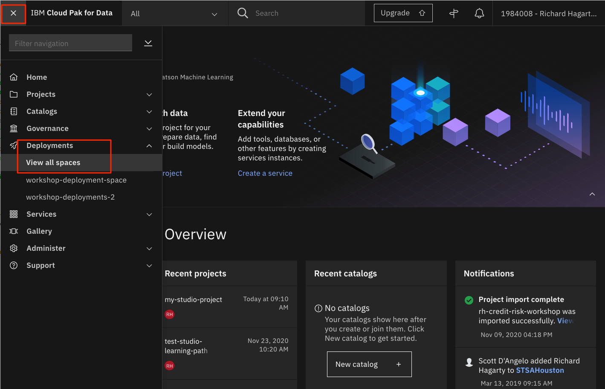

「**新しいデプロイメント スペース +**」ボタンをクリックします。

  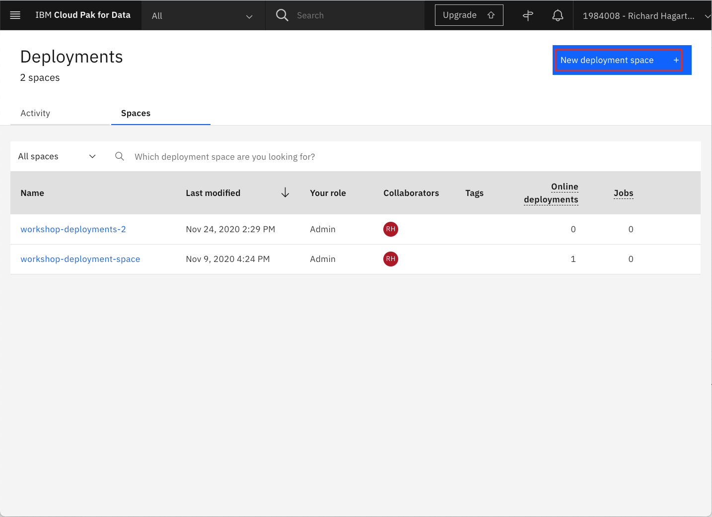

デプロイメント スペースに一意の名前とオプションの説明を付けます。以前の手順で作成した**Cloud Object Storage**と**Machine Learning**サービスインスタンスを提供します。そして、**Create**ボタンをクリックします。

  

デプロイメント スペースが作成されたら、**View new space**ボタンをクリックします。

  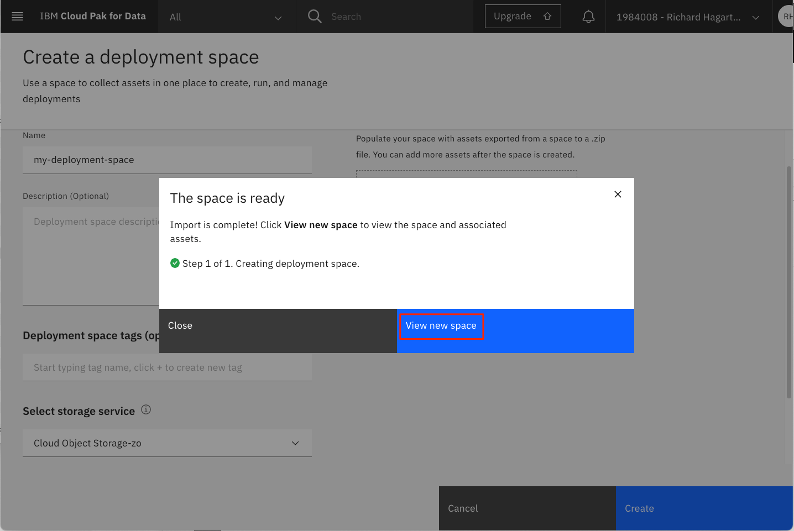

これは新しいデプロイメント スペースの **資産** パネルです。

  

### Watson Machine Learning サービスを使用した AutoAI 実験モデルのデプロイとテスト

データサイエンスに関するIBMのプロセスによると、満足のいくモデルが開発され、ビジネススポンサーの承認を得た後、本番環境または同等のテスト環境にデプロイされます。通常は、パフォーマンスが十分に評価されるまで、限定的にデプロイされます。

Watson Studio の Machine Learning サービスを使用すると、モデルを Web サービス、バッチプログラム、リアルタイムストリーミング予測の 3 種類の方法でデプロイできます。このチュートリアルでは、ウェブサービスとしてデプロイしてから、インタラクティブにテストします。

まず、モデルを保存する必要があります。

最高評価のパイプラインの詳細ページに戻る

  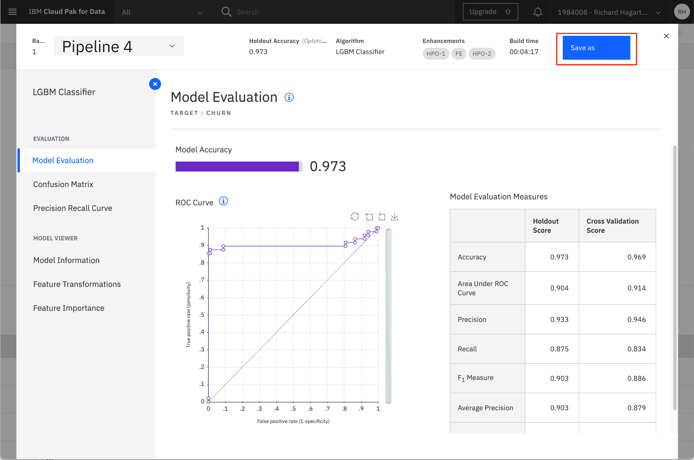

「名前を付けて保存」をクリックします。

  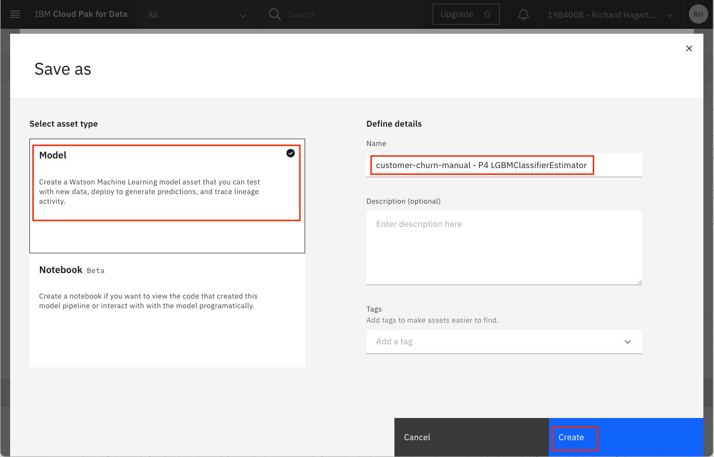

**Select asset type** of modelを選択し、デフォルトの名前のまま、**Create**をクリックします。

このモデルは、プロジェクトの**Assets**タブのModelsセクションに表示されます。

  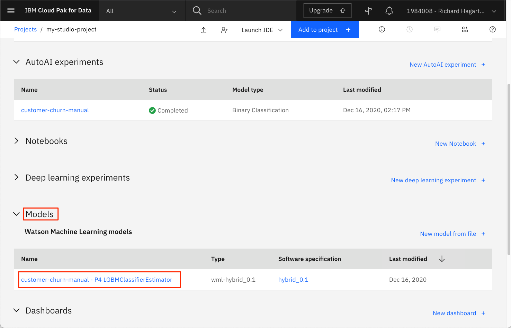

モデルをデプロイするには、モデル名をクリックして開きます。

  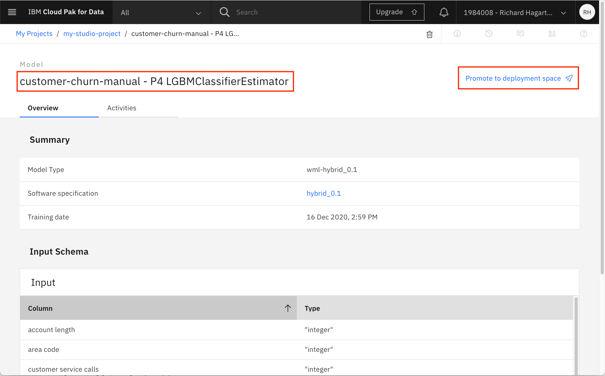

**Promote to deployment space**をクリックします。

  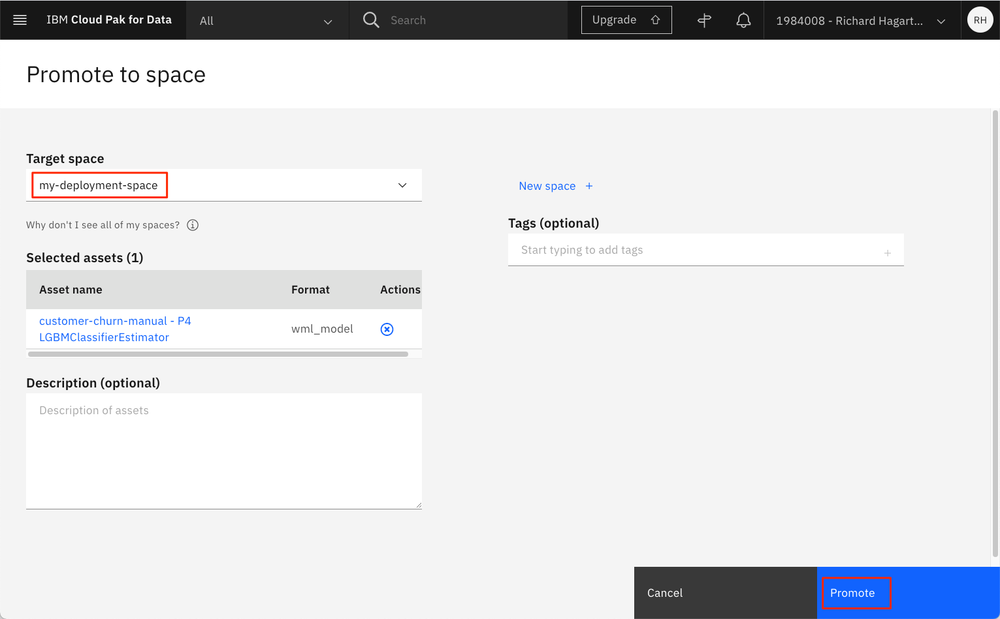

**ターゲットスペース**で、前の手順で作成したデプロイメントスペースを選択し、**Promote**をクリックします。

これで、デプロイメント・スペースのページにモデルが表示されます。

  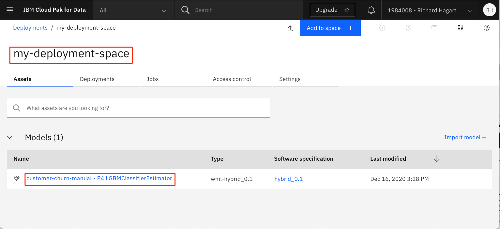

モデル名の上にマウスオーバーすると、アクションアイコンが表示されます。**デプロイメント**アイコンをクリックします。

  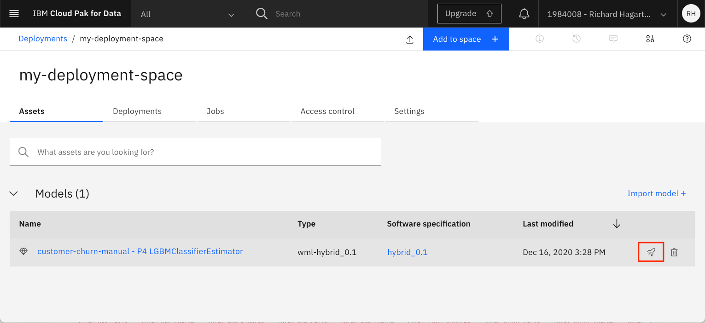をクリックします。

**配置を作成する**ページで

  1. 配置の **名前** を入力します（例：「customer-churn-manual-web-deployment」）。

  1. デフォルトのオンライン **配置タイプ** の設定を維持します。

  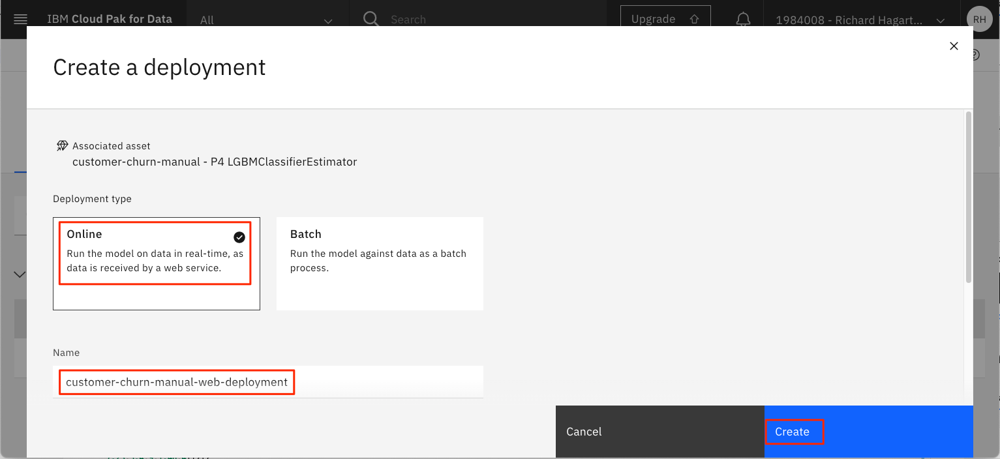

1. [作成]をクリックして、配置を保存します。

配置スペースパネルの **Deployments** タブをクリックし、Watson Studio が **STATUS** フィールドを「Deployed」に設定するまで待ちます。

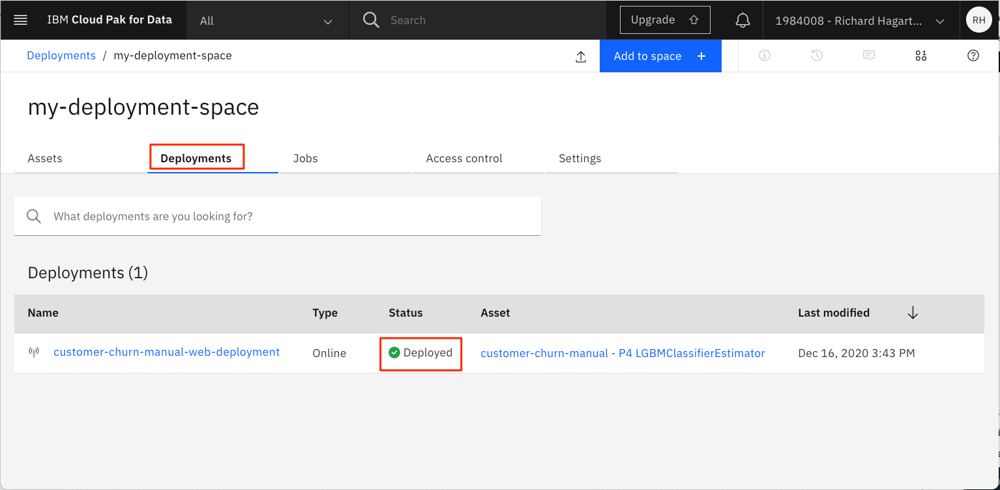

モデルがデプロイされ、予測に使用できるようになりました。しかし、本番環境で使用する前に、実際のデータを使用してテストする価値があるかもしれません。このテストは、Watson Machine Learning サービスの API を使用して対話的またはプログラム的に行うことができます。API の使用については、このラーニングパスの別のチュートリアルで説明しますが、ここでは引き続き対話形式でテストを行います。

予測をインタラクティブにテストするには、個別のフィールドに値を 1 つずつ入力する方法（各特徴に 1 つずつ）と、JSON オブジェクトを使用してすべての特徴の値を指定する方法があります。2つ目の方法は、テストが複数回行われる場合（通常はこのケースが多い）や、大量の特徴量が必要な場合に最も便利だからです。

簡単に説明するために、以下のサンプルのJSONオブジェクトをカット＆ペーストして、次のステップで使用することができます。