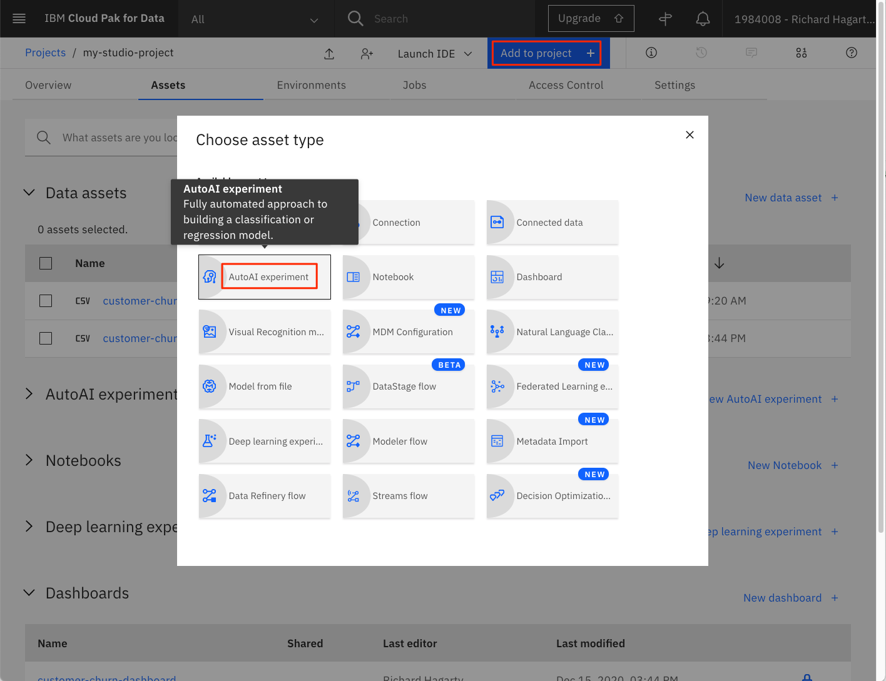
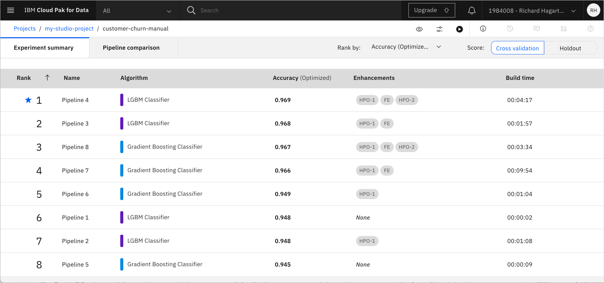
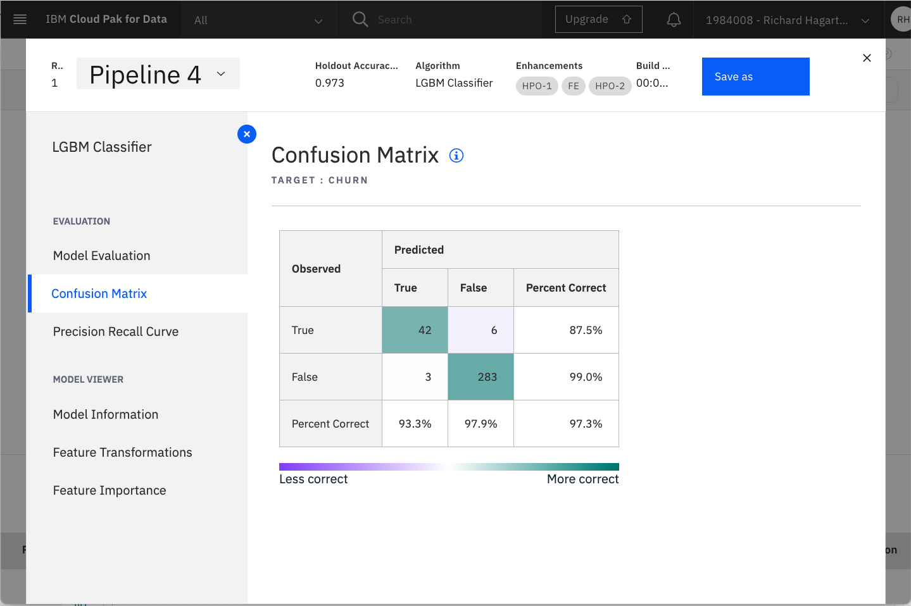
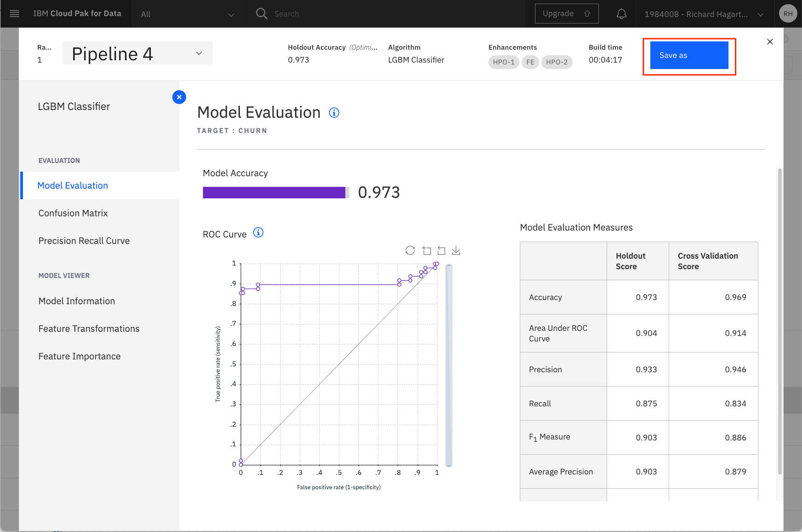
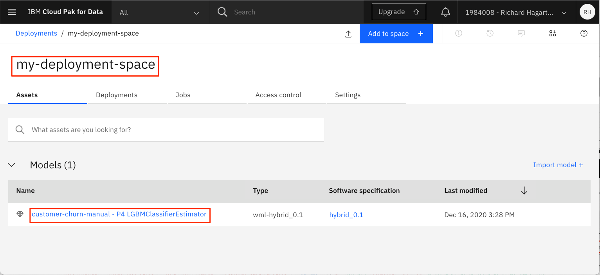
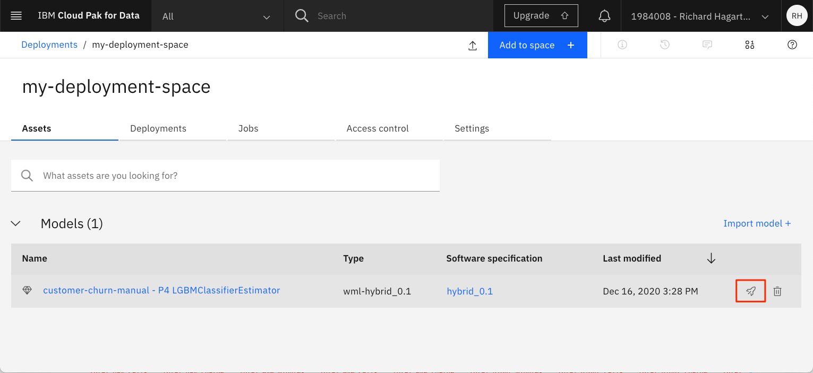
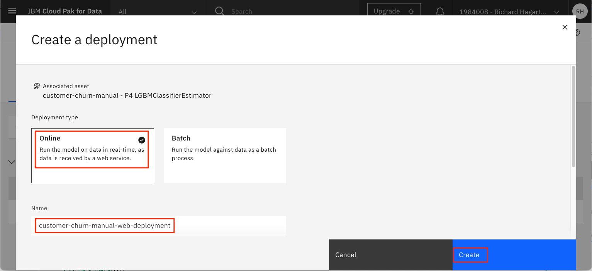
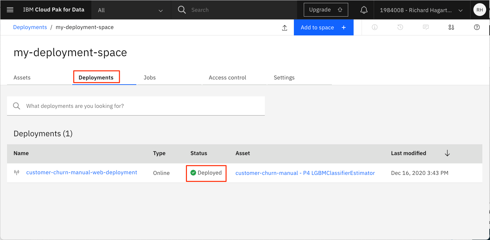

This tutorial demonstrates how to build and evaluate machine learning models by using the AutoAI feature in IBM Watson&reg; Studio. In the modeling phase, various modeling techniques are selected and applied, and their parameters are calibrated to achieve an optimal prediction. Typically, there are several techniques that can be applied, and some techniques have specific requirements regarding the form of data. Therefore, going back to the data preparation phase is often necessary. However, in the model evaluation phase, the goal is to build a model that has high quality from a data analysis perspective. Before proceeding to the final deployment of the model, it's important to thoroughly evaluate it and review the steps that are executed to create it to be certain the model properly achieves the business objectives.

Using the <a href="https://dataplatform.cloud.ibm.com/docs/content/wsj/analyze-data/autoai-overview.html?audience=wdp&context=wdp" target="_blank" rel="noopener noreferrer">AutoAI</a> graphical tool in Watson Studio lets you quickly build a model and evaluate its accuracy, all without writing a single line of code. AutoAI guides you, step by step, through building a machine learning model by uploading training data, choosing a machine learning technique and algorithms, and training and evaluating the model.

As with all the other tutorials in this learning path, we are using a customer churn data set that is available on <a href="https://www.kaggle.com/sandipdatta/customer-churn-analysis/notebook#Churn-Analysis" target="_blank" rel="noopener noreferrer">Kaggle</a>.

## Prerequisites

To complete the tutorials in this learning path, you need an <a href="https://cloud.ibm.com/registration?cm_sp=ibmdev-_-developer-tutorials-_-cloudreg" target="_blank" rel="noopener noreferrer">IBM Cloud account</a>, which gives you access to <a href="https://cloud.ibm.com?cm_sp=ibmdev-_-developer-tutorials-_-cloudreg" target="_blank" rel="noopener noreferrer">IBM Cloud</a>, <a href="https://www.ibm.com/cloud/watson-studio" target="_blank" rel="noopener noreferrer">IBM Watson Studio</a>, and the <a href="https://www.ibm.com/cloud/machine-learning" target="_blank" rel="noopener noreferrer">IBM Watson Machine Learning Service</a>.

## Estimated time

It should take you approximately 60 minutes to complete this tutorial.

## Steps

The steps to set up your environment for the learning path are explained in the [Data visualization, preparation, and transformation using IBM Watson Studio](/tutorials/watson-studio-data-visualization-preparation-transformation/) tutorial. These steps show how to:

1. Create an IBM Cloud Object Storage service.
1. Create a Watson Studio project.
1. Provision IBM Cloud services.
1. Upload the data set.

You must complete these steps before continuing with the learning path. If you have finished setting up your environment, continue with the next step, creating a new model in Watson Studio.

### Create a new model in Watson Studio

**NOTE**: You may notice that the "IBM Watson Studio" banner will in some cases be replaced with the name "IBM Cloud Pak for Data". The banner used is dependent on the number and types of services you have created on your IBM Cloud account. The change will have no effect on how the service functions or is navigated.

1. Select the **Assets** tab for your Watson Studio project.

1. In the Asset tab, click the **Add to Project** command.

    

1. Select the **AutoAI Experiment** asset type.

1. In the **Create an AutoAI experiment** window:

    * Enter an **Name**, such as 'customer-churn-manual'.

    * For the **Machine Learning Service**, select the Watson Machine Learning service that you previously created for the project.

        

    * Click **Create**.

1. In the **Add data source** window:

    * Click **Select from project**.

    * Select the Kaggle data asset previously added to the project.

        

    * Click **Select Asset**.

## Run and train the model

From the **Configure AutoAI experiment** window:

1. In the **What do you want to predict?** box, select **churn**.

    

1. Keep the default prediction type of **Binary Classification**, and the optimized metric of *Accuracy**.

1. Click **Run experiment**.

As the experiment is run, you see a pipeline of steps at the top of the page. After it finishes, a list of completed models is listed at the bottom of the panel, in order of accuracy. Be patient as the experiment can take 30 minutes or more to complete.


The AutoAI process uses the following sequence to build a list of candidate pipelines, using different models and varying hyperparmeter optimization (HPO) and feature engineering (FE) values.

For our data, Pipeline 4 (Light Gradient Boosting Machine Classifier) was ranked the highest, based on our "Accuracy" metric. It used both the "Hyperparameter Optimization" and "Feature Engineering" enhancements.



After the AutoAI experiment completes, it is saved in the Watson Studio project. You can view it from the **Assets** tab under **AutoAI experiments**.


### Evaluate the model performance

On the AutoAI Experiment page, there are a number of options available to get more details on how each pipeline performed.

The **Pipeline comparison** tab command expands the list of metrics shown for each pipeline.


Here we see that **Pipeline 4 (P4)** was ranked highest when ranked by **Accuracy**.

Clicking the pipeline name opens the Model Evaluation window for the pipeline.


There is a menu on the left that provides more metrics for the pipeline, such as:

* Confusion Matrix table

  

* Feature Importance graph

  

The AutoAI Experiment model feature might not provide the exact same set of classification approaches and evaluation metrics as you can get with a Jupyter Notebook, but it arrives at the result significantly faster, and with no programming required.

This model builder component of Watson Studio is useful in creating an initial machine learning model that is tested and can be evaluated with respect to prediction performance, without time consuming programming efforts. The prediction metrics that are delivered by the service are also helpful in initially getting an idea whether the data set is useful for the purpose that you intend to use it for.

### Create a deployment space

IBM Watson Studio uses the concept of **Deployment Spaces** to configure and manage the deployment of a set of related deployable assets. These assets can be data files, machine learning models, etc.

In our example, we will be using a deployment space to save our AutoAI experiment model.

To create one, go the (☰) main navigation menu, expand **Deployment spaces** and then select **View all spaces**.

  

Click the **New deployment space +** button.

  

Give your deployment space a unique name and optional description. Provide the **Cloud Object Storage** and **Machine Learning** service instances that you have created in earlier steps. Then click the **Create** button.

  

Once the deployment space is created, click the **View new space** button.

  

This is the new deployment space **Assets** panel:

  

### Deploy and test the AutoAI experiment model using Watson Machine Learning service

According to the IBM process for data science, after a satisfactory model is developed and is approved by the business sponsors, it's deployed into the production environment or a comparable test environment. Usually, it's deployed in a limited way until its performance has been fully evaluated.

Using the Machine Learning service of Watson Studio, you can deploy your model in three different ways: as a web service, as a batch program, or as a real-time streaming prediction. In this tutorial, we deploy it as a web service and then test it interactively.

First, you must save the model.

Return to the highest rated pipelines details page.

  

Click **Save as**.

  

Select **Select asset type** of model, keep the default name, and click **Create**.

The model should now appear in your project Models section of the **Assets** tab for the project.

  

To deploy the model, click the model name to open it.

  

Click **Promote to deployment space**.

  

For **Target space**, select the deployment space created in the previous step, then click **Promote**.

The model should now be listed on the deployments space page.

  

Mouse-over the model name to see the action icons. Click on the **deployment** icon.

  

On the **Create Deployment** page:

  1. Enter a **Name** for the deployment (for example, 'customer-churn-manual-web-deployment').

  1. Keep the default Online **Deployment type** setting.

  

1. Click **Create** to save the deployment.

Click on the **Deployments** tab of the deployment space panel and wait until Watson Studio sets the **STATUS** field to "Deployed".



The model is now deployed and can be used for prediction. However, before using it in a production environment it might be worthwhile to test it using real data. You can do this interactively or programmatically using the API for the Watson Machine Learning service. We discuss using the API in another tutorial of this learning path, but for now we continue testing it interactively.

There are two ways to interactively test the prediction: by entering the values one by one in distinct fields (one for each feature) or to specify all of the feature values using a JSON object. We use the second option because it's the most convenient one when tests are performed more than once (which is usually the case), and when a large set of feature values is needed.

To make it easier for you, you can cut and paste the following sample JSON object to use in the following steps.

```json
{"input_data":[{"fields": ["state", "account length", "area code", "phone number", "international plan", "voice mail plan", "number vmail messages", "total day minutes", "total day calls", "total day charge", "total eve minutes", "total eve calls", "total eve charge", "total night minutes", "total night calls", "total night charge", "total intl minutes", "total intl calls", "total intl charge", "customer service calls"], "values": [["NY",161,415,"351-7269","no","no",0,332.9,67,56.59,317.8,97,27.01,160.6,128,7.23,5.4,9,1.46,4]]}]}
```

Notice that the JSON object defines the names of the fields first, followed by a sequence of observations to be predicted, each in the form of a sequence.

Be aware that some of the features, such as state and phone number, are expected to be in the form of strings (which should be no surprise), whereas the true numerical features can be provided as integers or floats as appropriate for the given feature.

To test the model at run time:

1. Select the deployment that you just created by clicking the deployment name (for example, 'customer-churn-manual-web-deployment').

    

1. This opens a new page showing you an overview of the properties of the deployment (for example, name, creation date, and status).

1. Select the **Test** tab.

1. Select the file icon, which allows you to enter the values using JSON.

1. Paste the sample JSON object into the **Enter input data** field.

1. Click **Predict** to view the results.

    

The result of the prediction is given in terms of the probability that the customer will churn (True) or not (False). You can try it with other values, for example, by substituting the values with values taken from the 'customer-churn-kaggle.csv' file. Another test would be to change the phone number to something like "XYZ" and then run the prediction again. The result of the prediction should be the same, which indicates that the feature is not a factor in the prediction.

## Conclusion

This tutorial covered the basics of using the AutoAI Experiment feature in Watson Studio, which includes:

* Creating a project
* Provisioning and assigning services to the project
* Adding assets like data sets to the project
* Running AutoAI to generate estimators based on the data set and feature engineering
* Creating and deploying a model
* Creating a deployment space
* Training, evaluating, and testing the model

Using AutoAI provides a quick and easy way to model predicting customer churn and is an alternative to the fully programmed style of using a Jupyter Notebook, as described in the [Running Jupyter Notebooks in IBM Watson Studio](/tutorials/watson-studio-using-jupyter-notebook/) tutorial. Want to find out more about AutoAI? Then, take a look at [Simplify your AI lifecycle with AutoAI](/learningpaths/explore-autoai/).

Another approach is provided in the next tutorial in this learning path, [Creating SPSS Modeler flows in IBM Watson Studio](/tutorials/watson-studio-spss-modeler-flow/).