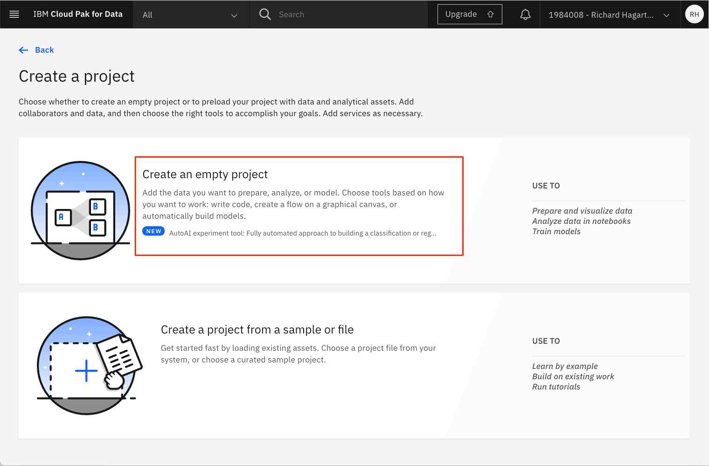
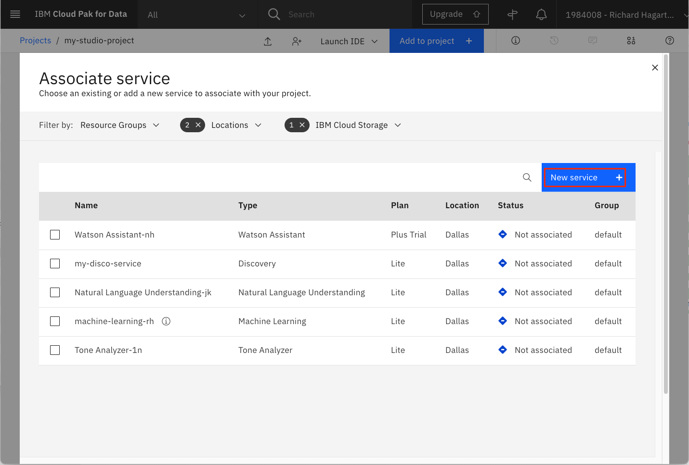
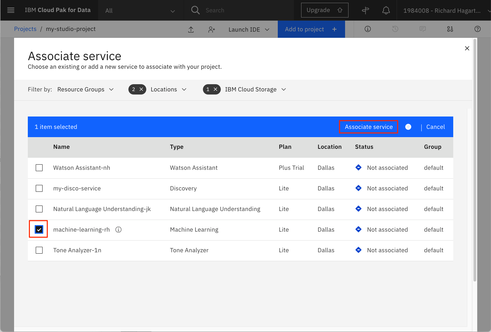
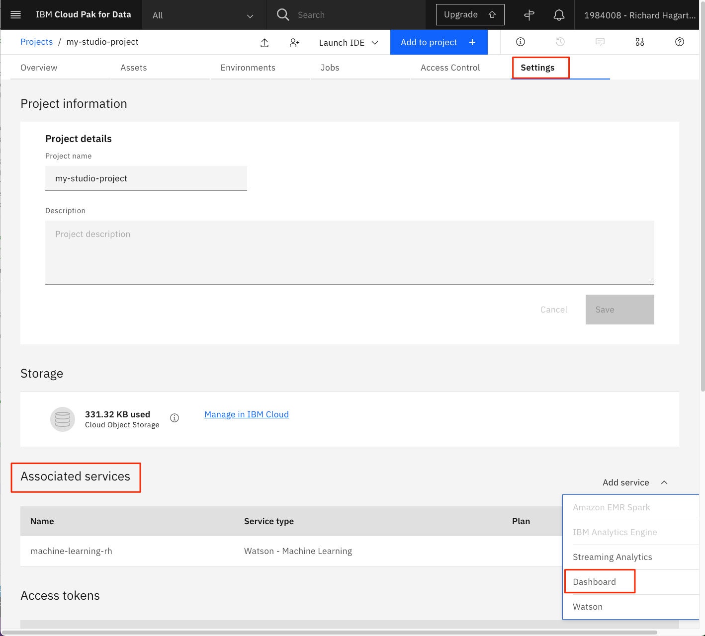
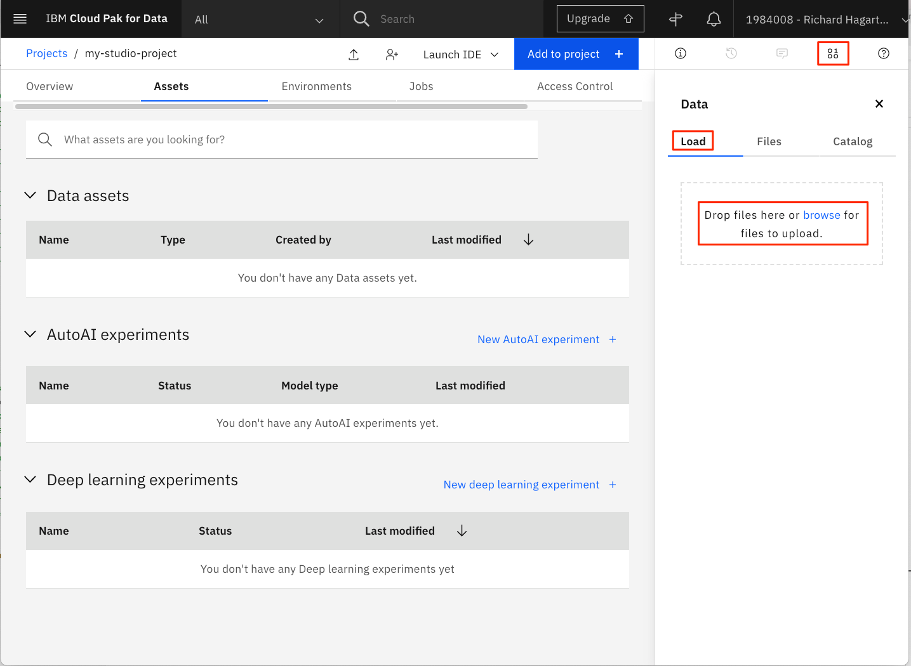
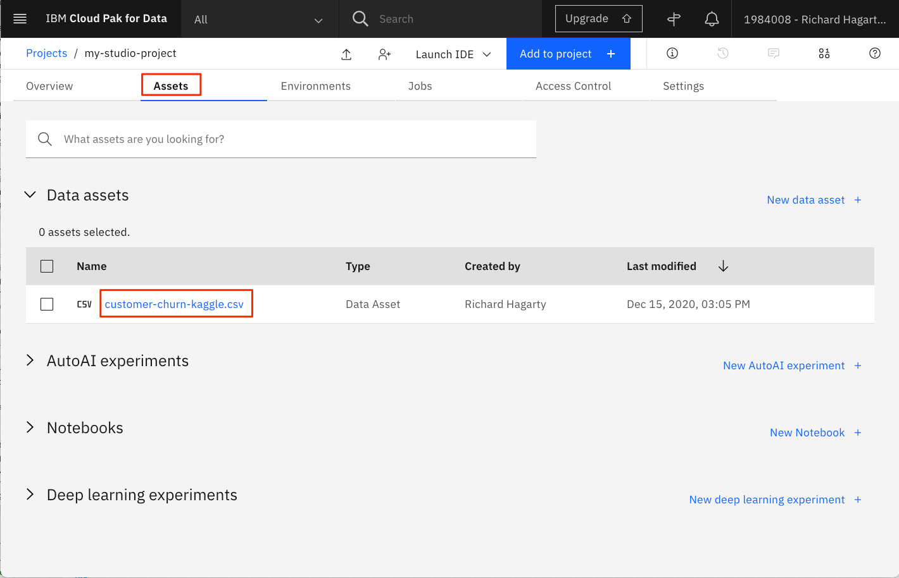
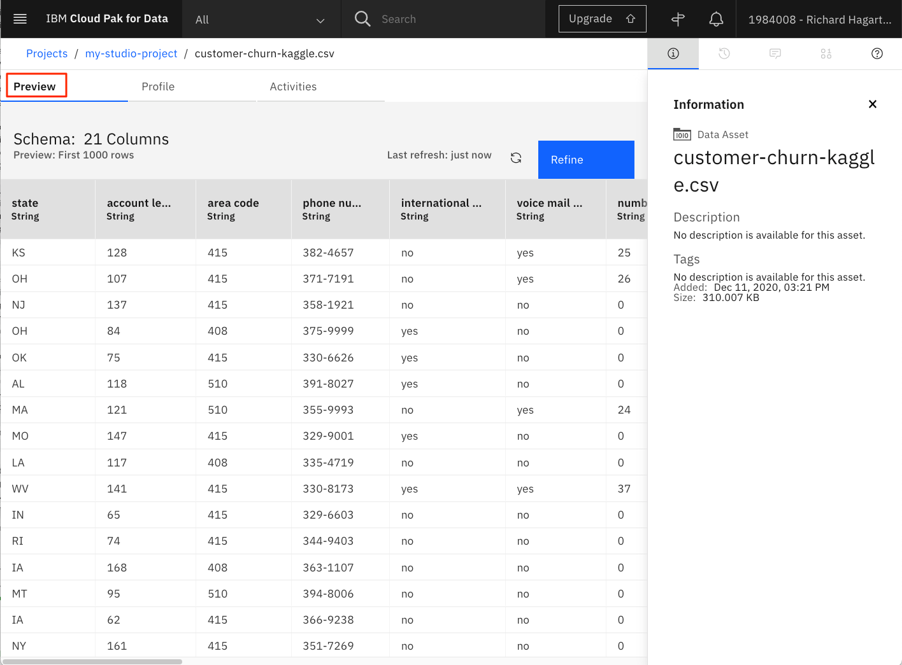
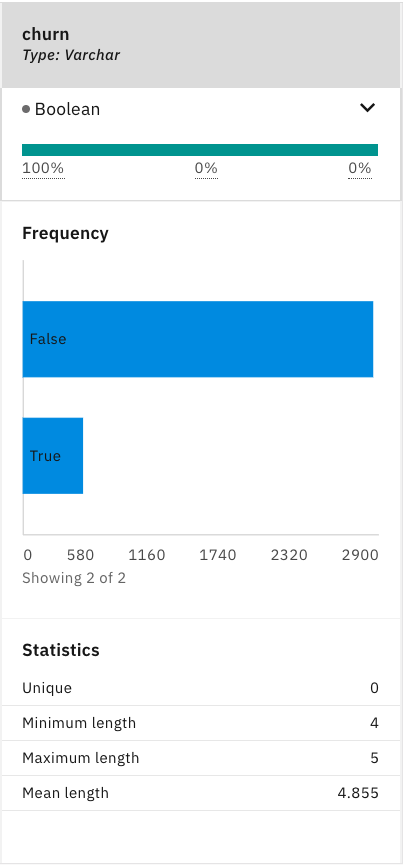
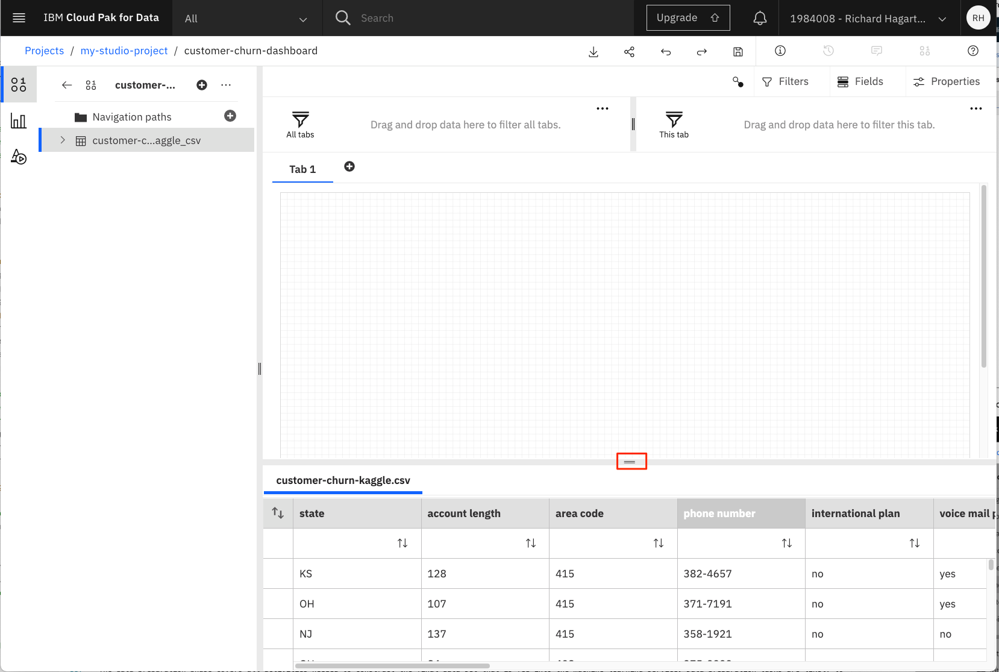
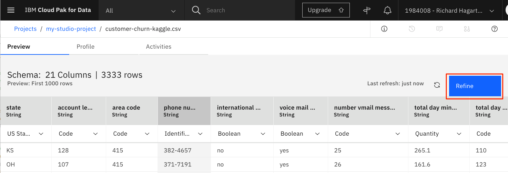

## Introduction

このチュートリアルの目的は、IBM&reg; Watson&trade; Studio の機能を紹介することにあります。

## 前提条件

このラーニングパスのチュートリアルを完了するには、<a href="https://cloud.ibm.com/registration?cm_sp=ibmdev-_-developer-tutorials-_-cloudreg" target="_blank" rel="noopener noreferrer">IBM Cloud アカウント</a>が必要です。このアカウントでは、<a href="https://cloud.ibm.com?cm_sp=ibmdev-_-developer-tutorials-_cloudreg" target="_blank" rel="noopener noreferrer">IBM Cloud</a>、<a href="https://www.ibm.com/jp-ja/cloud/watson-studio" target="_blank" rel="noopener noreferrer">IBM Watson Studio</a>、<a href="https://www.ibm.com/jp-ja/cloud/machine-learning" target="_blank" rel="noopener noreferrer">IBM Watson Machine Learning Service</a>へのアクセスが可能になります。

## 見積もり時間

このチュートリアルを完了するには、約 30 分かかります。

## 手順

### 環境を整える

このラーニングパスのすべてのチュートリアルを完了するには、以下の手順が必要です。

#### IBM Cloud Object Storage サービスの作成

Watson Studio でプロジェクトを作成するには、Object Storage サービスが必要です。ストレージサービスがまだプロビジョニングされていない場合は、以下の手順を実行します。

1. IBM Cloud アカウントから、<a href="https://cloud.ibm.com/catalog?cm_sp=ibmdev-_-developer-tutorials-_-cloudreg" target="_blank" rel="noopener noreferrer">IBM Cloud Catalog</a>で「オブジェクトストレージ」を検索します。そして、「**オブジェクト・ストレージ**」タイルをクリックします。

    

1. 名前を入力し、サービスの**標準**バージョンを選択します。

    を選択します。

1. **Resource Group**には、デフォルト値を使用することができますが、IBM Cloudで作成した専用グループを使用するのがより良い選択です。IBM Cloud で新しいリソース・グループを作成するためのコマンドは、**Manage > Account** メニュー・オプションを使用し、左側のツールバーで **Account resources > Resource groups** に移動して見つけることができます。ページの右上に**Create**ボタンがあります。

1. **Create**をクリックします。

#### Watson Studio を起動します。

<a href="https://dataplatform.cloud.ibm.com/?cm_sp=ibmdev-_-developer-tutorials-_-cloudreg" target="_blank" rel="noopener noreferrer">Watson Studio</a>を起動し、適切なリージョンを選択してから、IBM Cloud アカウントに関連付けられたユーザー名を入力します。

  

**注意**してください。「IBM Watson Studio」のバナーが、場合によっては「IBM Cloud Pak for Data」という名前に置き換えられることに気づくかもしれません。使用されるバナーは、お客様が IBM Cloud アカウントで作成したサービスの数と種類によって異なります。この変更は、サービスの機能やナビゲーションには影響しません。

#### Watson Studio プロジェクトの作成

Watson Studio では、特定の目標を達成するために使用するリソース（問題に対するソリューションを構築するためのリソース）を収集して整理するために、プロジェクトの概念を使用します。プロジェクトのリソースには、データ、共同作業者、ノートブックやモデルなどの分析資産などがあります。

新しいプロジェクトを作成するには、次のいずれかの方法があります。

* Watson Studio ホームページから **Create a project** をクリックします。

  

* または、左側のナビゲーションメニュー(☰)で **Projects** -> **View all projects** をクリックし、**New project +** をクリックします。

  

プロジェクトの作成パネルでは、空のプロジェクトを作成するか、プロジェクトのアセットを含んだファイルをインポートすることができます。

  

新しいプロジェクトを作成する際には、固有のプロジェクト名と、オブジェクトストレージインスタンスを指定する必要があります。**Storage**には、前のステップで作成したIBM Cloud Object Storageサービスを選択する必要があります。これがプロビジョニングした唯一のストレージ・サービスであれば、自動的に割り当てられます。

  

**Create**をクリックして、プロジェクトの作成を終了します。

#### IBM Cloudサービスの提供

> 注: このセクションでは、プロジェクト用に新しいサービスを作成することについて説明します。これらのサービスのいずれかを以前にプロビジョニングしている場合は、新しいサービスを作成する代わりにそれらを使用することができます。

##### Watson Machine Learning サービス

**Machine Learning**サービスをプロビジョニングし、現在の**プロジェクト**に関連付けるには、以下の手順を実行します。

1. プロジェクトの **Settings** タブを選択します。

1. 「Associated Services（関連サービス）」の項目までスクロールダウンします。

    をクリックします。

1. **Add Service** （サービスの追加）をクリックします。

1. ドロップダウンメニューから「**Watson**」を選択します。

1. 次のページで、お客様の IBM アカウントでプロビジョニングした Watson サービスのリストが表示されます。

    

1. Watson Machine Learning サービスをプロビジョニングしていない場合、または新しいサービスを作成したい場合は、**New service +** ボタンをクリックして作成できます。

1. すると、IBM Cloud アカウントからプロビジョニングできる、利用可能なすべての Watson サービスのリストが表示されます。検索バーを使用して選択肢を絞り込み、**Machine Learning** サービスを見つけることができます。

    

1. **Machine Learning**タイルをクリックして、機械学習サービスをプロビジョニングします。

    

1. 「Machine Learning」の作成パネルから、適切な「Region」を選択し、「Lite」プランを選択します。

    **注**。IBM Watson Studio インスタンスがプロビジョニングされているのと同じリージョンを選択することを確認してください。

    

1. デフォルトの Service Name を使用するか、固有の名前を入力して、Create をクリックします。これにより、新しいサービスが関連付け可能なサービスのリストに追加されます。

    

1. サービスをプロジェクトに関連付けるには、**Watson Machine Learning** サービスインスタンスの横にあるチェックボックスをクリックして、**Associate service** をクリックします。

    注: 複数の Machine Learning サービスがある場合は、IBM Watson Studio サービスと同じ地域にあるものを選択するようにしてください。

1. 完了すると、プロジェクト概要パネルの「Associated Services」セクションに機械学習サービスが表示されます。

    

##### IBM Cognos Dashboard Embedded サービス

**IBM Cognos Dashboard Embedded**サービスをプロビジョニングして、現在の**プロジェクト**に関連付ける。

1. プロジェクトの **Settings** タブを選択します。

1. Associated Services "セクションにスクロールします。

1. 「サービスの追加」をクリックします。

1. ドロップダウンメニューから「**Dashboard**」を選択します。

    

1. 次のページで、**New Service**を選択して、新しいサービスを作成します。これにより、**IBM Cognos Dashboard Embedded**サービスタイルが表示されます。

    

1. タイルをクリックして、ダッシュボードサービスをプロビジョニングします。

1. 地域を選択し、**Liteプラン**を使用します。固有の名前を入力し、**Create**ボタンをクリックしてサービスを作成します。

1. **Associate service**パネルから、新しいダッシュボードサービスを選択し、**Associate service**をクリックします。

1. 1. **設定**タブの**Associated services**セクションに両サービスが表示されます。

    

#### データセットのアップロード

以下のリンクを使用して、Kaggleから**Customer Churn**データをあなたのローカルシステムにダウンロードします。

* [customer-churn-kaggle.csv](static/customer-churn-kaggle.csv)

次に、このファイルを Watson Studio にアップロードします。

1. Watson Studio のプロジェクトパネルから「**Assets**」を選択します。

1. まだ開いていない場合は、パネルの右上にある**1000**データのアイコンをクリックして、**Files**サブパネルを開きます。次に、**Load** をクリックします。

    

1. ファイルをドロップエリアにドラッグして、データを Watson Studio にアップロードします。

1. ファイルのアップロードが完了するまで待ちます。

### 背景

環境設定のステップが完了したら、このチュートリアルのメイントピックであるデータについて説明します。このチュートリアルでは、データを可視化し、最適化された高品質の予測モデルを構築するために、データを準備、変換する方法を学びます。

これらの作業を行うための古典的なデータサイエンスのアプローチは、Jupyter Notebookで動作するPythonプログラミング言語を使用することです。この方法は、ラーニングパス・チュートリアル[Build models using Jupyter Notebooks in IBM Watson Studio](/tutorials/watson-studio-using-jupyter-notebook/)で後ほど取り上げますが、このチュートリアルでは、Watson Studio が提供する機能とツールを使って、プログラミングを必要とせずに同じ目標を達成する代替方法に焦点を当てます。

### Watson Studio での基本的なビジュアライゼーション

データを収集した後の次のステップは、データ理解の段階と呼ばれます。これは、データに慣れ親しみ、データ品質の問題を特定し、データに対する最初の洞察を発見するための活動で構成されています。

Watson Studio では、コードを 1 行も使わずに、簡単なユーザーインタラクションでこれを実現できます。Watson Studio でデータセットを表示するには、データアセットを見つけて、データセットの名前をクリックして開きます。

Watson Studio では、**Preview** タブにデータのプレビューが表示されます。

また、**Profile** タブでは、値の分布を示すプロファイリング情報が表示されます。数値特徴の場合は、その特徴の最大値、最小値、平均値、標準偏差も表示されます。

初回にプロファイルを生成するには

1. **Profile**タブを選択します。

1. 「プロファイルの作成」コマンドを実行します。

1. しばらく待ってから、ページを更新してください。

数値列は `varchar` 型であると認識されていますが、プロファイラはこれらを数値列であると認識し、暗黙のうちに変換し、平均値と標準偏差を計算していることに注目してください。

churnパラメータは、churnとno-churnのオブザベーションのバランスの取れた分布を提供していないことに注意してください。これは、モデルの構築と評価の段階で、クロスバリデーション戦略を採用すべきであることを意味しています。

### Cognos Dashboardサービスを使ったその他のビジュアライゼーション

関連するビジュアライゼーションを持つダッシュボードを作成することで、データセットをさらに詳しく見ることができます。これには基本的に、空のダッシュボードの作成、ビジュアライゼーションに使用するデータソースの追加、ダッシュボードへの適切なビジュアライゼーションの追加という3つのステップが必要です。

ダッシュボードを作成するには

1. **Add to project +**をクリックし、次に**Dashboard**を選択して新しいダッシュボードを作成します。

    

1. **新しいダッシュボード**ページで以下の手順を行います。

    1. ダッシュボードの **名前** を入力します（例：「customer-churn-dashboard」）。

    1. ダッシュボードの **説明** を入力します（オプション）。

    1. **Cognos Dashboard Embedded Service**には、以前に作成したダッシュボード・サービスを選択します。

        

    1. **Create**をクリックします。

1. 次のページで、デフォルトのタブ付きレイアウトとテンプレートを選択します。

    

1. **OK**をクリックすると、タブが1つある空のフリーフォーム・ダッシュボードが作成されます。

データ接続を追加するには

1. ページの左上にある**Add a source**ボタン（+アイコン）をクリックします。

    

1. **選択**をクリックして、顧客の解約データソースを選択します。

    を選択します。

1. ダッシュボードに戻り、新しくインポートしたデータソースを選択します。

1. タブパネルの下部にあるアイコンをクリックして、データソースをプレビューします。

    

1. 1. **>**をクリックして顧客の解約データソースを展開し、列を表示します。

    

列のプロパティを表示および変更できることに注意してください。カラム名の右にある3つのドットをクリックして、ポップアップメニューから**プロパティ**を選択します。これにより、上図のようなウィンドウが表示され、「用途」（Identifier、Attribute、Measure）と「集計機能」（Count、Count Distinct、Maximum、Minimum）のデフォルト設定を変更することができます。今のところは、デフォルトの設定で問題ありません。

解約者と無解約者の分布を円グラフで表示する視覚化を行うには

1. 左側のツールバーで「**可視化**」アイコンを選択します。

1. 「パイ」のチャートを選択します。

1. データセットの列などを使って、円グラフのプロパティを指定するフォームが作成されます。

    

1. 左側のツールバーにある **ソース** アイコンを選択します（[可視化]アイコンの上にあります）。

1. 円グラフの「セグメント」プロパティに「解約」列をドラッグします。

1. 「churn」列を円グラフの「Size」列にドラッグします。

    

1. 上図のように、フォームの右上にある [Collapse] 矢印をクリックします。これにより、ダッシュボード上の円グラフが拡大/折りたたみされます。

1. **Fields**タブをクリックして、選択したビジュアライゼーションフィールドの値を表示／非表示にします。

1. 「タイトルの編集」ボタンをクリックして、円グラフにタイトルを追加します。

    

1. タブのタイトルを入力します（例：「Customer Churn」）。

以下の手順で、さらに2つのビジュアライゼーションを作成します。

* X軸に「状態」（可視化フィールド **Bars**）、Y軸に「Churn」（可視化フィールド **Length** および **Color**）を表示した **積み上げ式の列** チャート

* **国際計画** の分布を示す **パイ** チャート（可視化フィールド **Segments** と **Size**）。

この結果、次の画像のようなダッシュボードが表示されます。各ビジュアライゼーションの上部にある **Move widget** コマンドを使って、ダッシュボード上のビジュアライゼーションを移動できることに注意してください。

ダッシュボードはもともと動的なもので、フィルターを使用したデータの探索をサポートします。「**International Plan**」を示すビジュアライゼーションでは、「**yes**」という値に関連するスライスをクリックします。これにより、現在のダッシュボード上の他の（接続された）すべてのビジュアライゼーションに適用されるフィルターが作成されます。

左側のビジュアライゼーションでは、解約のスライスが大幅に増加していることに注目してください。これは、国際プランを利用しているお客様が、国際プランを利用していないお客様よりも解約する可能性が高いことを示しています。フィルターを削除するには、右上のビジュアライゼーションのフィルターアイコンをクリックし、ポップアップしたフィルター削除ボタンを選択します（アイコンは円の中の十字）。スライスを再度クリックしても同じ効果が得られます。

**注**。ダッシュボードを保存するには、上部メニューバーの**ディスク**アイコンをクリックします。

### Refineによるデータの準備と変換

データの準備段階では、機械学習サービスに投入する最終的なデータセットを構築するために必要なすべての活動が対象となります。データの準備作業は複数回行われることが多く、決まった順序ではありません。タスクには、テーブル、レコード、属性の選択や、モデリングツール用のデータの変換とクレンジングが含まれます。これには、カテゴライズされた特徴を数値に変換したり、特徴を正規化したり、予測に関係のない列（例えば、顧客の電話番号など）を削除したりすることが含まれる。

**IBM Watson AutoAI** および **Watson Machine Learning** サービスを使用して半自動または完全自動でモデルを作成したい場合は、AutoAI サービスがこれらの操作をバックグラウンドで処理するため、（現在のデータセットの）データ準備中のアクティビティはもう必要ありません。この学習パスの[Automate model building in IBM Watson Studio](/tutorials/watson-studio-auto-ai/)チュートリアルでは、この方法を示しています。

あるいは、Watson Studio には **Data Refine** というサービスがあり、プログラミングをせずにデータのクリーンアップや変換を行うことができます。このサービスを実行するには

1. プロジェクト概要ページのトップバーにある **Add to project** をクリックします。

1. 「アセットタイプの選択」画面で、「Data Refinery flow」を選択し、新規にフローを作成します。

1. 次のページで、「Customer Churn」データセットを選択し、「**Add**」をクリックします。

    

1. これでデータソースが開き、変換して表示できるようになります。

なお、データセットの**プレビュー**パネルから**Refine**をクリックしても、Data Refineサービスを開始することができます。

Data Refineサービスが読み込まれ、以下の表が表示されます。

左上のタブに注目してください。これは、（前のセクションのように）プロファイリングのためにデータを表形式で表示したり、データのカスタムビジュアライゼーションを作成するためのものです。

データを変換するには

1. 「電話番号」列の3つのドットを選択し、プルダウンメニューの**Remove**コマンドを実行します。これで列が削除される。

    

1. **total day minutes** feature columnを選択します。これは実際には文字列タイプですが、数値にする必要があります。

1. 左上の**Operation**ボタンをクリックすると、利用可能な変換がいくつか表示されます。

    

列を別の型（例えば、floatやinteger）に変換することもできます。しかし、機械学習サービスが舞台裏で自動的に行ってくれるので、今回はこれを行いません。しかし、原理的には、「total day minutes」列を整数列にして、小数が0になるように丸めることができます。あるいは、浮動小数点型に変換することもできます。とりあえず、先ほど定義したフローを続けて実行し、その結果を見てみましょう。

1. **ステップ**をクリックすると、絞り込み処理で実行されるステップが表示されます。

1. ツールバーの**Run Data Refinery flow**ボタンをクリックします。そのアイコンは矢印です。

1. **Save and create a job**のオプションを選択します。

    

1. 次のページでは、フローに名前を付け、オプションで説明を付けることができます。なお、出力ファイルの名前はアセット名と同じですが、接尾辞として「_shaped」が追加されます。

1. **Next**をクリックして、最終ページにたどり着くまでデフォルト値を受け入れます。次へ "をクリックして、最後のページまでデフォルト値を受け入れます。

1. 「**Create and run**」をクリックします。

実行結果のウィンドウには、実行状況が表示されます。

プロジェクトに戻り、出力ファイルとフローがプロジェクトのアセットの一部になっていることを確認します。新しいファイルには「_shaped」というサフィックスが追加されていることを覚えておいてください。

新しく作成したフローアセットをクリックすると、「電話番号」のカラムが削除されていることがわかります。

データリファイナリーフローは、プログラミングを必要とせずにデータを素早く変換することができます。決してJupyter Notebooksやnumpyやpandasの強力な機能の代わりになるものではありませんが、簡単なクリーンアップ処理には重宝します。より複雑な変換や計算を行う場合は、Jupyter NotebooksやSPSS Modelerフロー（このラーニングパスに含まれる他のチュートリアルで説明します）など、他のオプションを使用するように戻してください。

## 結論

このチュートリアルでは、データの視覚化、準備、変換のために Watson Studio で利用できるツールの一部を取り上げました。

データ資産のプレビューとプロファイリング、より多くの視覚化を行うための Cognos Dashboard の構築、データ変換を行うための Data Refine Flow ツールの使用などのトピックが含まれています。

このラーニング・パスの残りのチュートリアルでは、これらのタスクを達成するための別の方法と、データを使用して予測モデルを構築して展開するという次のステップについて説明します。次のチュートリアルでは、機械学習モデルの作成、評価、デプロイメント、テストをノンプログラミングで行うIBM Studio AutoAI実験ツールを紹介します。