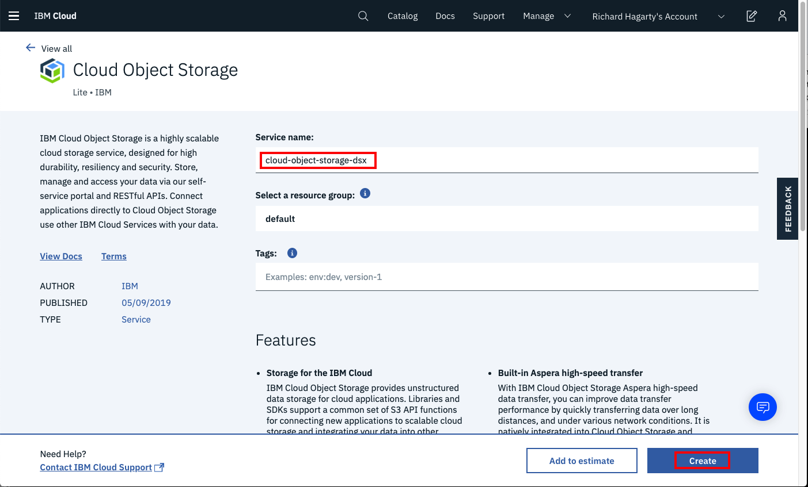
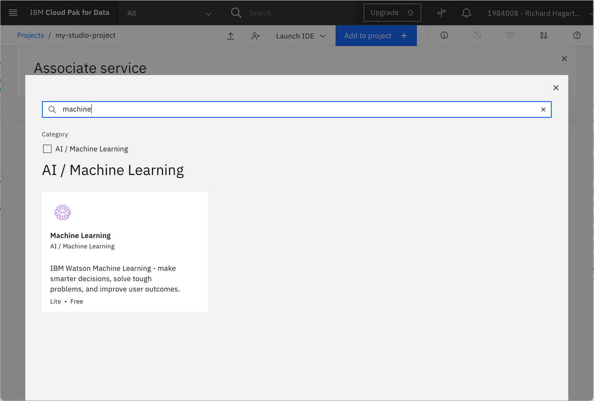
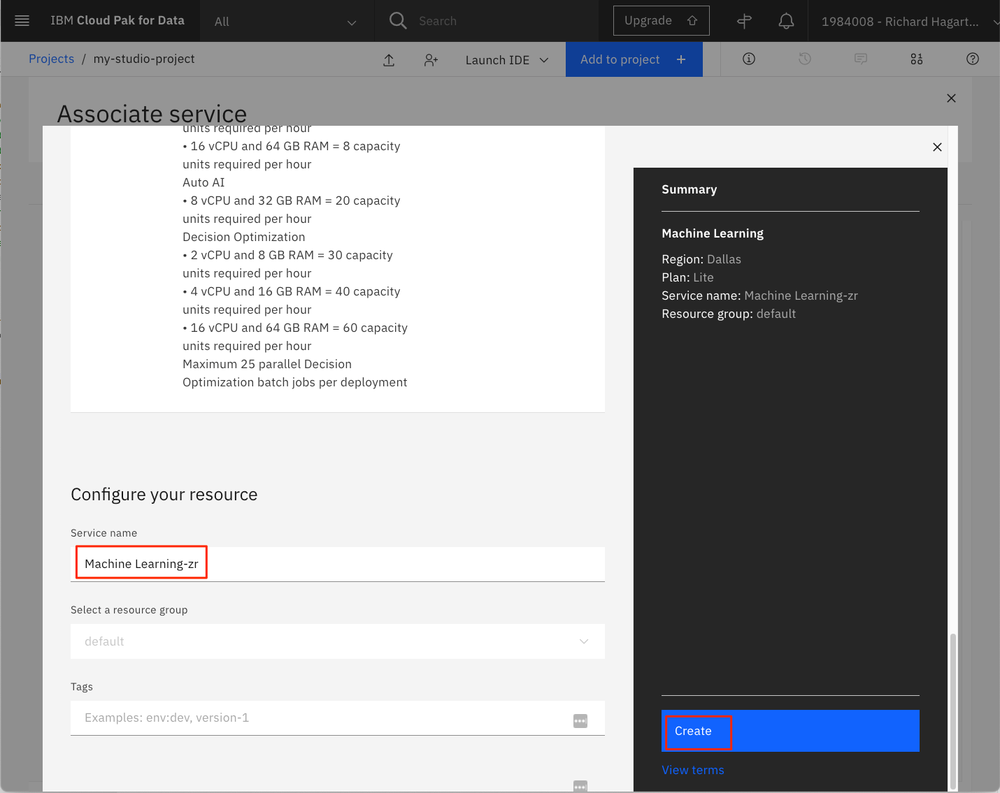
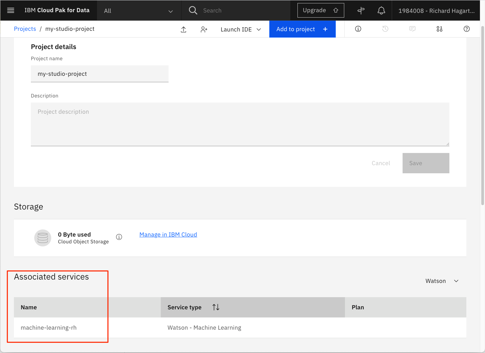
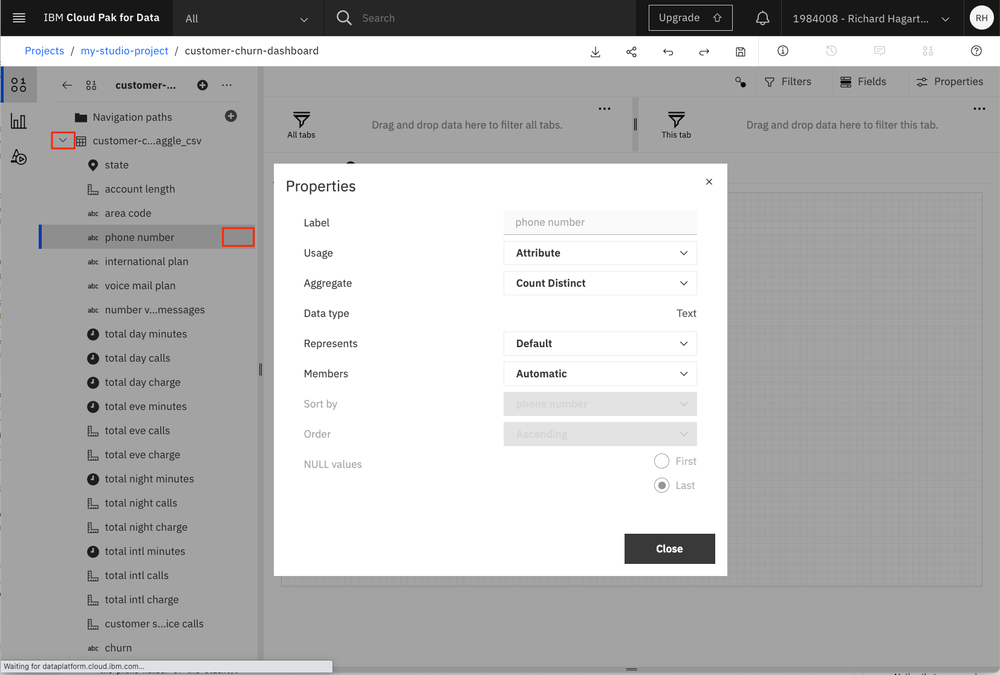

## Introduction

The purpose of this tutorial is to demonstrate features within IBM&reg; Watson&trade; Studio that help you visualize and gain insights into your data, then cleanse and transform your data to build high-quality predictive models.

## Prerequisites

To complete the tutorials in this learning path, you will need an <a href="https://cloud.ibm.com/registration?cm_sp=ibmdev-_-developer-tutorials-_-cloudreg" target="_blank" rel="noopener noreferrer">IBM Cloud account</a>, which gives you access to <a href="https://cloud.ibm.com?cm_sp=ibmdev-_-developer-tutorials-_-cloudreg" target="_blank" rel="noopener noreferrer">IBM Cloud</a>, <a href="https://www.ibm.com/cloud/watson-studio" target="_blank" rel="noopener noreferrer">IBM Watson Studio</a>, and the <a href="https://www.ibm.com/cloud/machine-learning" target="_blank" rel="noopener noreferrer">IBM Watson Machine Learning Service</a>.

## Estimated time

It should take you approximately 30 minutes to complete this tutorial.

## Steps

### Set up your environment

The following steps are required to complete all of the tutorials in this learning path.

#### Create IBM Cloud Object Storage service

An Object Storage service is required to create projects in Watson Studio. If you do not already have a storage service provisioned, complete the following steps:

1. From your IBM Cloud account, search for "object storage" in the <a href="https://cloud.ibm.com/catalog?cm_sp=ibmdev-_-developer-tutorials-_-cloudreg" target="_blank" rel="noopener noreferrer">IBM Cloud Catalog</a>. Then, click the **Object Storage** tile.

    

1. Enter a name and select the **Standard** version of the service.

    

1. For the **Resource Group**, you can use the default value, but a better choice is to use a dedicated group that you have created in IBM Cloud. You can find the command for creating new resource groups in IBM Cloud using the **Manage > Account** menu option, and then navigating to **Account resources > Resource groups** in the toolbar to the left. The **Create** button is in the upper right corner of the page.

1. Click **Create**.

#### Launch Watson Studio

Launch <a href="https://dataplatform.cloud.ibm.com/?cm_sp=ibmdev-_-developer-tutorials-_-cloudreg" target="_blank" rel="noopener noreferrer">Watson Studio</a>, select an appropriate region, and then enter the username name associated with your IBM Cloud account.

  

**NOTE**: You may notice that the "IBM Watson Studio" banner will in some cases be replaced with the name "IBM Cloud Pak for Data". The banner used is dependent on the number and types of services you have created on your IBM Cloud account. The change will have no effect on how the service functions or is navigated.

#### Create Watson Studio project

In Watson Studio, we use the concept of a project to collect and organize the resources used to achieve a particular goal (resources to build a solution to a problem). Your project resources can include data, collaborators, and analytic assets like notebooks and models, etc.

To create a new project, you can either:

* Click **Create a project** from the Watson Studio home page

  

* Or, click on **Projects** -> **View all projects** in the left-side navigation menu (☰), then click **New project +**

  

On the create project panel, you can either create an empty project, or import a file that contains project assets.

  

When creating a new project, you will need to provide a unique project name, and an object storage instance. For **Storage**, you should select the IBM Cloud Object Storage service you created in the previous step. If it is the only storage service that you have provisioned, it is assigned automatically.

  

Click **Create** to finish creating the project.

#### Provision IBM Cloud services

> NOTE: This section discusses creating new services for your project. If you have previously provisioned any of these services, you can choose to use them instead of creating new ones.

##### Watson Machine Learning service

To provision the **Machine Learning** service and associate it with the current **project**:

1. Select the **Settings** tab for the project.

1. Scroll down to the **Associated services** section.

    

1. Click **Add Service**.

1. Select **Watson** from the drop-down menu.

1. On the next page, you will be presented with a list of Watson services that you have provisioned on your IBM account.

    

1. If you do not have a Watson Machine Learning service provisioned, or you would like to create a new one, you can do so by clicking the **New service +** button.

1. You will then be presented with a list of all available Watson services that can be provisioned from your IBM Cloud account. You can use the search bar to filter the choices to locate the **Machine Learning** service.

    

1. Click the **Machine Learning** tile to provision your machine learning service.

    

1. From the Machine Learning creation panel, choose the appropriate Region and select the Lite plan.

    **Note**: Make sure you select the same region where your IBM Watson Studio instance is provisioned.

    

1. Use the default Service Name or enter a unique name, then click Create. This will add the new service to your list of available services to associate.

    

1. To associate the service with the project, click the checkbox next to the **Watson Machine Learning** service instance, then click **Associate service**.

    Note: If you have multiple Machine Learning services, make sure you select the one that is in the same region as is your IBM Watson Studio service.

1. Once complete, the machine learning service will be listed in the Associated Services section of the project Overview panel.

    

##### IBM Cognos Dashboard Embedded service

To provision the **IBM Cognos Dashboard Embedded** service and associate it with the current **project**:

1. Select the **Settings** tab for the project.

1. Scroll to the **Associated services** section.

1. Click **Add service**.

1. Select **Dashboard** from the drop-down menu.

    

1. On the next page, select **New Service** to create a new service. This should bring up the **IBM Cognos Dashboard Embedded** service tile.

    

1. Click the tile to provision your dashboard service.

1. Select a region and use the **Lite plan**. Enter a unique name and click the **Create** button to create the service.

1. From the **Associate service** panel, select the new dashboard service, then click **Associate service**.

1. You should now have both services listed in the **Associated services** section of the **Settings** tab.

    

#### Upload data set

Use the following link to download the **Customer Churn** data from Kaggle to your local system.

* [customer-churn-kaggle.csv](static/customer-churn-kaggle.csv)

Next, we will upload the file to Watson Studio.

1. From your Watson Studio project panel, select **Assets**.

1. If not already open, click the **1000** data icon at the upper right of the panel to open the **Files** sub-panel. Then, click **Load**.

    

1. Drag the file to the drop area to upload the data into Watson Studio.

1. Wait until the file has been uploaded.

### Background

After completing the steps to setting up your environment, you can now focus on the main topic of this tutorial, which is all about data. You'll learn how to visualize it, then prepare and transform it so that it can be used to build optimized high-quality predictive models.

A classical data science approach to perform these activities is to use the Python programming language running in a Jupyter Notebook. While we cover this method later in the learning path tutorial [Build models using Jupyter Notebooks in IBM Watson Studio](/tutorials/watson-studio-using-jupyter-notebook/), this tutorial focuses on alternative ways to achieve the same goal, using features and tools provided by Watson Studio, with no programming required.

### Basic visualization in Watson Studio

After data is collected, the next step is referred to as the data understanding phase. This consists of activities that enable you to become familiar with the data, identify data quality problems, and discover first insights into the data.

You can achieve this in Watson Studio by simple user interactions, without a single line of code. To view the data set in Watson Studio, locate the data asset and then click the name of the data set to open it.

Watson Studio shows you a preview of the data in the **Preview** tab.

Alternatively, the **Profile** tab gives you profiling information that shows the distribution of the values. For numerical features, it also shows the maximum, minimum, mean, and standard deviation for the feature.

To generate the profile the first time:

1. Select the **Profile** tab.

1. Invoke the **Create Profile** command.

1. Wait a short while and then refresh the page.

Notice that although the numerical columns are identified to be of type `varchar`, the profiler is smart enough to recognize these to be numerical columns, convert them implicitly, and compute the mean and the standard deviation.

Notice that the churn parameter does not provide a balanced distribution of churn and no-churn observations. This might mean that you should adopt cross-validation strategies during the model building and evaluation phase.

### More visualizations using the Cognos Dashboard service

You can look further into the data set by creating a dashboard with associated visualizations. This basically requires three steps: creating an empty dashboard, adding a data source to be used for visualizations, and adding appropriate visualizations to the dashboard.

To create the dashboard:

1. Click **Add to project +** and then select **Dashboard** to create a new dashboard.

    

1. Follow these steps in the **New Dashboard** page:

    1. Enter a **Name** for the dashboard (for example, 'customer-churn-dashboard'.)

    1. Provide a **Description** for the dashboard (optional).

    1. For **Cognos Dashboard Embedded Service**, select the dashboard service that you created previously.

        

    1. Click **Create**.

1. On the next page, select the default tabbed layout and template.

    

1. Click **OK** to create an empty freeform dashboard with a single Tab.

To add a data connection:

1. Click the **Add a source** button (the + icon) in the upper-left part of the page:

    

1. Click **Select** to select the customer churn data source.

    

1. Back in the dashboard, select the newly imported data source.

1. Preview the data source by clicking the icon located at the bottom of the tab panel.

    

1. Expand the customer churn data source by clicking **>** to show the columns.

    

Notice that you can view and change the properties of the columns. Simply click the 3 dots to the right of the column name, then select **Properties** in the pop-up menu. This displays a window as shown above, and allows you to alter the default setting for Usage (Identifier, Attribute, and Measure) and Aggregate Function (Count, Count Distinct, Maximum, and Minimum). For now, you should be fine with the default settings.

To create a visualization that shows the distribution of churns and no-churns as a pie chart:

1. Select the **Visualizations** icon in the toolbar to the left.

1. Select a **Pie** chart.

1. This creates a form for specifying the properties of the pie chart using, for example, columns of the data set.

    

1. Select the **Sources** icon in the toolbar to the left (located above the Visualizations icon).

1. Drag the churn column onto the Segments property of the pie chart.

1. Drag the churn column onto the Size column of the pie chart.

    

1. Click the Collapse arrow in the upper right of the form, as shown above. This expands/collapses the pie chart on the dashboard.

1. Click the **Fields** tab to show/hide the selected visualization field values.

1. Click the **Edit the title** button to add a title to our pie chart.

    

1. Provide a title for the tab (for example, 'Customer Churn').

Follow these steps and create two more visualizations:

* A **Stacked column** chart showing State (visualization field **Bars**) and Churn (visualization fields **Length** and **Color**) on the X and Y axis, respectively

* A **Pie** chart showing the distribution of the **International Plan** (visualization fields **Segments** and **Size**)

This should result in a dashboard similar to the following image. Notice that you can move visualizations on the dashboard using the **Move widget** command located on the top of each visualization.

The dashboards are dynamic by nature and support exploration of the data using filters. In the visualization that shows **International Plan**, click the slice associated with the value **yes**. This creates a filter that will apply to all other (connected) visualizations on the current dashboard.

Notice that the slice for churn in the visualization to the left has increased significantly. This tells you that clients on an international plan are more likely to churn than clients that are not on an international plan. To remove the filter, click the filter icon for the visualization in the upper-right corner, then select the delete filter button that pops up (the icon is a cross in a circle). Clicking the slice again achieves the same effect.

**NOTE**: Click the **Disk** icon in the top menu bar to save your dashboard.

### Data preparation and transformation using Refine

The data preparation phase covers all activities needed to construct the final data set that is fed into the machine learning service. Data preparation tasks are likely to be performed multiple times and not in any prescribed order. Tasks include table, record, and attribute selection as well as transformation and cleansing of data for the modeling tools. This can involve turning categorical features into numerical ones, normalizing the features, and removing columns not relevant for prediction (for example, the phone number of the client).

If you would just like to create a model semi-automatically or fully automated using the **IBM Watson AutoAI** and **Watson Machine Learning** service, no more activity is needed during data preparation (for the current data set) because the AutoAI service takes care of these operations in the background. We show how this is done in the [Automate model building in IBM Watson Studio](/tutorials/watson-studio-auto-ai/) tutorial of this learning path.

Alternatively, Watson Studio offers a service called **Data Refine** that lets you clean up and transform data without any programming. To run the service:

1. Click **Add to project** in the top bar of the project overview page.

1. In the **Choose asset type** window, select **Data Refinery flow** to create a new flow.

1. On the next page, select the Customer Churn data set and click **Add**.

    

1. This opens the data source for you so that you can transform and view it.

Note that you can also initiate the Data Refine service by clicking on **Refine** from the **Preview** panel of the data set.

The Data Refine service is then loaded and displays the following table.

Notice the tabs to the top left, which let you view the data in a tabular form for profiling (as in the previous section) and for creating custom visualizations of the data.

To transform the data:

1. Select the 3 dots in the "phone number" column and invoke the **Remove** command in the pull-down menu. This deletes the column.

    

1. Select the **total day minutes** feature column. This is a really a String type but should be numeric.

1. Click the **Operation** button in the upper-left corner, which shows you some available transformations.

    

You could convert the column to another type (say float or integer). However, we will not do this for now because the Machine Learning service does it for us automatically behind the scenes. But in principle, you could decide to turn the "total day minutes" column into an integer column and round it to show zero decimals. Alternatively, you could convert it into a floating type. For now, let's just continue executing the flow just defined and view the result.

1. Click on **Steps** to view the steps that will be performed during the refine process.

1. Click the **Run Data Refinery flow** button in the toolbar. Its icon is an arrow.

1. Select the option to **Save and create a job**.

    

1. On the next page, you can name the flow and give it an optional description. Note that the output file will be named the same as the asset name, but with an added "_shaped" suffix.

1. Click **Next** and accept the default values until reaching the final page. Notice that there is also a tab where you can schedule the flow so that it is executed automatically.

1. Click **Create and run**.

The resulting window shows the run status.

Go back to your project and check that the output file and the flow are now part of your project assets. Remember, the new file has the added "_shaped" suffix.

If you click on the newly created flow asset, you see that the "phone number" column has been removed.

Data Refinery Flows allow you to perform quick transformations of data without the need for programming. It is by no means a replacement for Jupyter Notebooks and the powerful capabilities of numpy and pandas, but for a quick clean-up process it comes in handy. For more complex transformations and computations, you should revert to using other options such as Jupyter Notebooks or SPSS Modeler flows (which will be covered in other tutorials included in this learning path).

## Conclusion

This tutorial covered some of the tools available in Watson Studio for visualizing, preparing, and transforming you data.

Topics included previewing and profiling your data assets, building a Cognos Dashboard to build more visualizations, and using the Data Refine Flow tool to perform data transformations

The remaining tutorials in this learning path discuss alternative ways to accomplish these tasks as well as taking the next step, using the data to build and deploy predictive models. The next tutorial demonstrates the IBM Studio AutoAI experiment tool, which is a non-programmatic approach to creating, evaluating, deploying, and testing machine learning models.