## Introduction

このチュートリアルでは、IBM&reg; Watson&trade; Studio の SPSS Modeler フロー機能を使用して、機械学習モデルをグラフィカルに構築および評価する方法を説明します。<a href="https://dataplatform.cloud.ibm.com/docs/content/wsd/spss-modeler.html?cm_sp=ibmdev-_-developer-tutorials-_-cloudreg" target="_blank" rel="noopener noreferrer">Watson Studio の IBM Watson SPSS Modeler</a>フローは、コードを必要とせずに、データの取り込みから変換、モデルの構築、評価までを行う機械学習パイプラインを迅速に構築するためのインタラクティブな環境を提供します。このチュートリアルでは、SPSS Modeler コンポーネントを紹介し、モデルの構築、テスト、評価、デプロイにどのように使用できるかを説明します。

このラーニングパスの他のチュートリアルと同様に、<a href="https://www.kaggle.com/sandipdatta/customer-churn-analysis/notebook#Churn-Analysis" target="_blank" rel="noopener noreferrer">Kaggle</a>で提供されている顧客解約データセットを使用しています。

## 前提条件

このラーニングパスのチュートリアルを完了するには、<a href="https://cloud.ibm.com/registration?cm_sp=ibmdev-_-developer-tutorials-_-cloudreg" target="_blank" rel="noopener noreferrer">IBM Cloud アカウント</a>が必要です。このアカウントがあれば、<a href="https://cloud.ibm.com?cm_sp=ibmdev-_-developer-tutorials-_cloudreg" target="_blank" rel="noopener noreferrer">IBM Cloud</a>、<a href="https://www.ibm.com/jp-ja/cloud/watson-studio" target="_blank" rel="noopener noreferrer">IBM Watson Studio</a>、<a href="https://www.ibm.com/jp-ja/cloud/machine-learning" target="_blank" rel="noopener noreferrer">IBM Watson Machine Learning Service</a>へのアクセスが可能になります。

## 見積もり時間

このチュートリアルを完了するには、約 60 分かかります。

## 手順

> SPSS Modeler フロー機能は、IBM Watson Studio Desktop でも利用できます。IBM Cloud 上の Watson Studio について以下で述べている SPSS Modeler フローを作成する手順は、Watson Studio Desktop にも適用されます。Watson Studio Desktop にスキップするには、[Watson Studio Desktop を使用した SPSS Modeler フロー](#spss-modeler-flow-using-watson-studio-desktop)を参照してください。

ラーニングパスのために環境をセットアップする手順は、[Data visualization, preparation, and transformation using IBM Watson Studio](/tutorials/watson-studio-data-visualization-preparation-transformation/)チュートリアルで説明されています。これらのステップは、以下の方法を示しています。

1. IBM Cloud Object Storage サービスを作成します。
1. IBM Watson Studio プロジェクトを作成します。
1. IBM Cloud サービスをプロビジョニングします。
1. データセットをアップロードします。

学習パスを続行する前に、これらのステップを完了する必要があります。環境のセットアップが完了している場合は、次のステップであるモデル・フローの作成に進みます。

### Watson Studio でモデルフローを作成する

**注意**してください。「IBM Watson Studio」のバナーが、場合によっては「IBM Cloud Pak for Data」という名前に変わっていることに気づくかもしれません。使用されるバナーは、お客様が IBM Cloud アカウントで作成したサービスの数と種類によって異なります。この変更は、サービスの機能やナビゲーションには影響しません。

初期の機械学習フローを作成するには

1. **Assets**ページで、**Add to project**をクリックします。

1. **Choose asset type**ページで、**Modeler Flow**を選択します。

    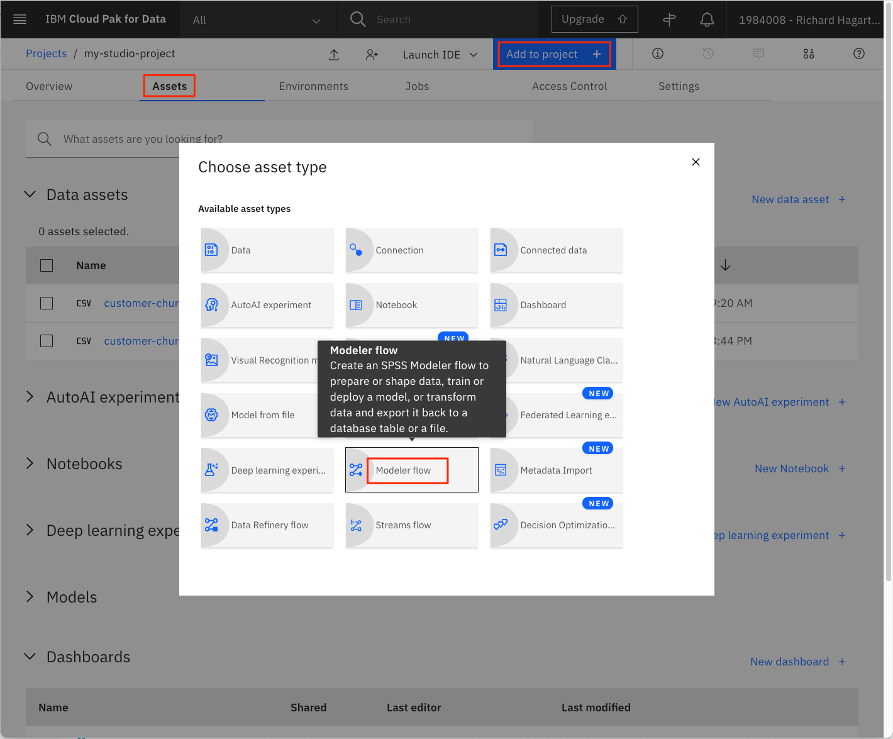

1. **Modeler**ページで、「From File」タブを選択します。

1. 次のリンクを使用して、**Customer Churn Modeler Flow**ファイルをローカルシステムにダウンロードします。

    * [customer-churn-flow.str](static/customer-churn-flow.str)

1. ダウンロードしたモデラーフローファイルをアップロードエリアにドラッグします。また、フローの名前を設定します。

    

1. 機械学習フローの名前を変更し、説明を入力します（オプション）。

1. 「**Create**」をクリックします。これにより、機械学習フローの作成に使用できるフローエディタが開きます。

これで初期のフローがインポートされましたので、このチュートリアルの残りの部分で検討します。

**Modeling**ドロップダウンメニューの下に、サポートされている様々なモデリング手法が表示されます。最初のものはAuto Classifierで、いくつかの手法を試した後、最適なものの結果を表示します。

メインフローは、いくつかのステップで構成されるパイプラインを定義します。

* データセットをインポートするための「データアセット」ノード
* 分類の対象となる属性の選択など、特徴量のメタデータを定義する「Type」ノード
* モデリングのためにデータを準備する「Auto Data Prep」ノード
* データをトレーニングセットとテストセットに分割するための「Partition」ノード
* モデルの作成と評価を行う「churn」と呼ばれる自動分類器ノード

入力と出力を表示するために、メインパイプラインに追加のノードが関連付けられています。これらは以下の通りです。

* 入力データをプレビューするための「Input Table」というテーブル出力ノード
* 入力データセットの品質（min、max、standard、deviation）を監査するための「21 fields」（デフォルト名）というデータ監査ノード。
* 生成されたモデルを評価するための「Evaluation」ノード
* テスト予測の結果をプレビューするための「Result Table」というテーブル出力ノード

その他の入出力タイプは、「**Outputs**」ドロップダウンメニューを選択して表示できます。

### データアセットの割り当てとフローの実行

フローを実行するには、まず、プロジェクトで利用可能な適切なテストデータ群とフローを接続する必要があります。

1. フローの左側にある Data Asset ノード（入力ノード）の 3 つの点を選択します。

1. メニューから「**Open**」コマンドを選択します。これにより、ページの右側部分にノードの属性が表示されます。

    

1. 「データアセットの変更」をクリックして、入力ファイルを変更します。

1. 次のページで、カスタマーチャーンを含む.CSVファイルを選択して、**OK**をクリックします。

    >**NOTE**をクリックします。注意：Kaggleデータセットは、前提条件のステップの一部としてプロジェクトのアセットにアップロードされているはずです。必要に応じて、ファイルをダウンロードするためのリンクは[こちら](static/customer-churn-kaggle.csv)です。

1. 「保存」をクリックします。

1. ツールバーの**Run**（矢印の頭）をクリックして、フローを実行します。

    

フローを実行すると、いくつかの出力や結果が作成され、詳細を確認することができます。

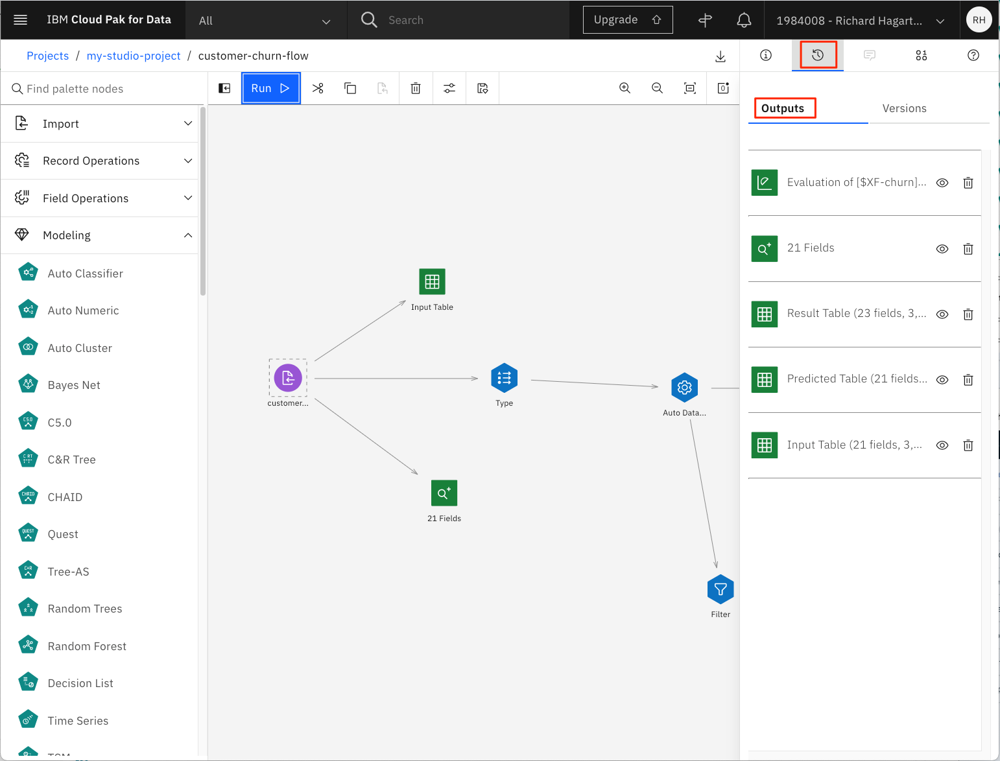

### データの理解

フローを実行した後は、データを詳しく見てみましょう。

1. フロー図の上部にある「**Input Table**」ノードを選択します。

1. 右上の3つの点を選択し、ポップアップメニューから「**プレビュー**」コマンドを起動します。

    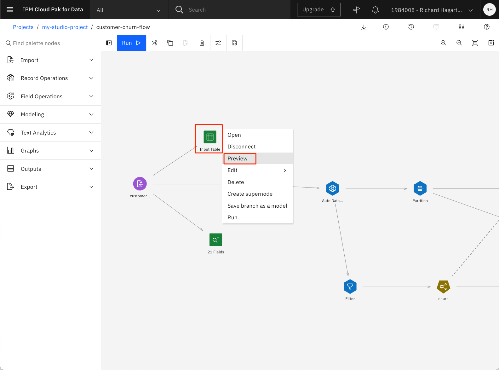

これで再びフローの一部が実行されることに注意してください。

次に、データの各列の最小値、最大値、平均値、標準偏差などを詳しく見てみましょう。

1. ツールバーの右上にある「View outputs and versions」コマンドを選択します。

1. 1. **Outputs** タブを選択します。

    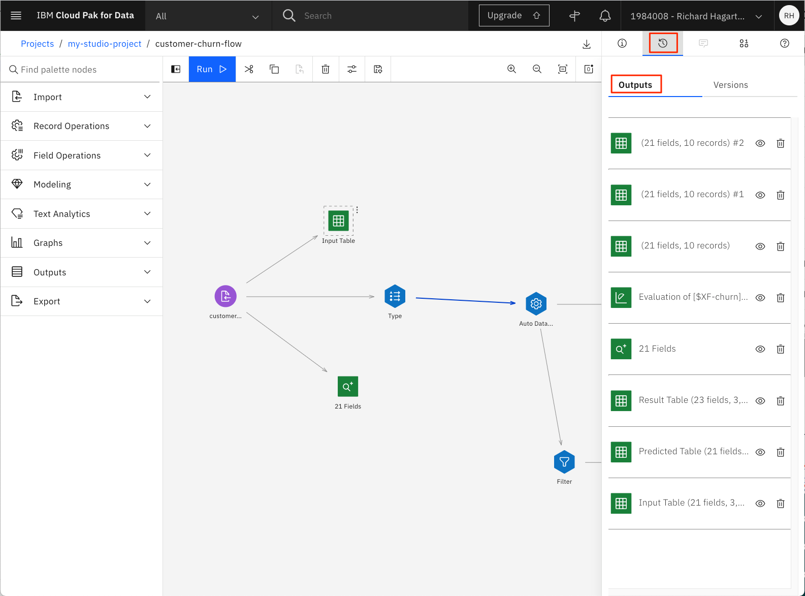

1. 出力リストから、「21 Fields」という名前の「data audit」ノードを探し、「目」のアイコンをクリックして開きます。

    

これにより、次の画像のような概要が表示されます。

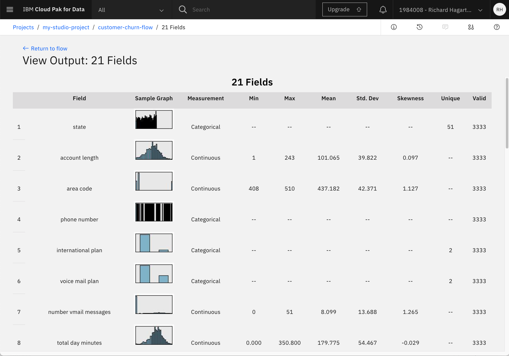

各フィーチャーの概要では、分布がグラフィカルに表示され、そのフィーチャーがカテゴリー的なものか連続的なものかが示されます。数値特徴の場合は、計算されたmin、max、mean、standard deviation、skewnessも表示されます。Validという列から、3333個の有効な値があることがわかります。これは、リストアップされた特徴に対して値が欠落していないことを意味しており、値が欠落している列をフィルタリングしたり変換したりするために、この面での前処理をさらに気にする必要はありません。

### データの準備

パイプラインの次のノードであるTypeノードを使用することで、インポートによるフィーチャーの初期評価を変更することができます。これを実現するには

1. **ツールバーの「customer-churn-flow」**を選択して、フローエディタに戻ります。

1. 1. **Type**ノードを選択します。

1. ポップアップメニューから「**Open**」コマンドを選択します。

これにより、機能（フィールドなど）、その種類（連続またはフラグなど）、役割などを示す表が表示されます。

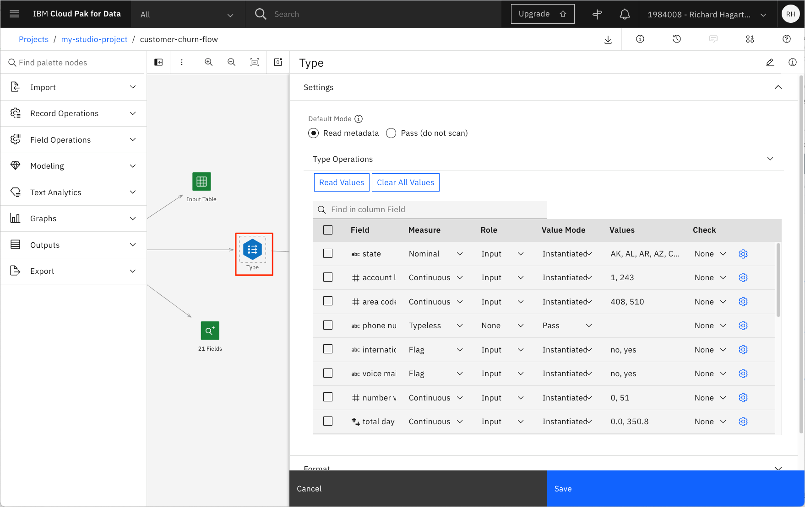

Measureはこのノードを使って必要に応じて変更することができ、機能の役割を指定することも可能である。この例では、Churnフィーチャー（TrueとFalseの値を持つFlag）の役割がTargetに変更されています。Checkカラムを使用すると、フィールドの値についてより詳しく知ることができるかもしれません。

**Cancel**をクリックして、Typeノードのプロパティエディタを閉じます。

パイプラインの次のノードは「Auto Data Prep」ノードです。このノードは、カテゴライズされたフィールドを数値に変換するなど、データを自動的に変換します。その結果を表示するには

1. フローエディターで**Auto Data Prep**ノードを選択します。

1. ポップアップメニューから「**Open**」を選択します。

このノードでは、変換の目的（スピード重視か精度重視か）を定義するなど、さまざまな設定を行うことができます。

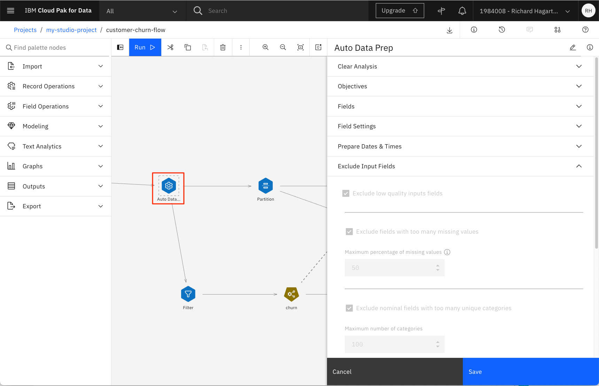

前述の画像では、欠損値が多すぎるフィールド（閾値は50）を除外するように、またユニークなカテゴリーが多すぎるフィールドを除外するように、変換が設定されています。後者は電話番号に当てはまると仮定して、気にしないでください。

パイプラインの次のノードはPartitionノードで、データセットをトレーニングセットとテストセットに分割します。現在のPartitionノードでは、80対20の分割を行っています。

### モデルのトレーニング

SPSS Modelerのフローの次のノードは、"churn "という名前のAuto Classifierノードです。このノードは、生成されたモデルをどのようにランク付けして破棄するか（閾値精度を使用）など、様々なビルドオプションに基づいてモデルをトレーニングします。

ノードを開き、ドロップダウンメニューから**BUILD OPTIONS**を選択すると、プロパティの**Number of models to use**がデフォルトの3に設定されているのがわかります。これはデフォルトの値ですが、もっと大きな値に変更してから **Save** をクリックして変更を保存してください。

> **NOTE:** ビルドの設定を変更した場合は、フローを再実行することを忘れないでください。

### モデルの評価

生成されたモデルの詳細を知るには

1. 「churn」モデルのアイコンを選択します。

1. ドロップダウンメニューから「**モデルの表示**」を選択します。

    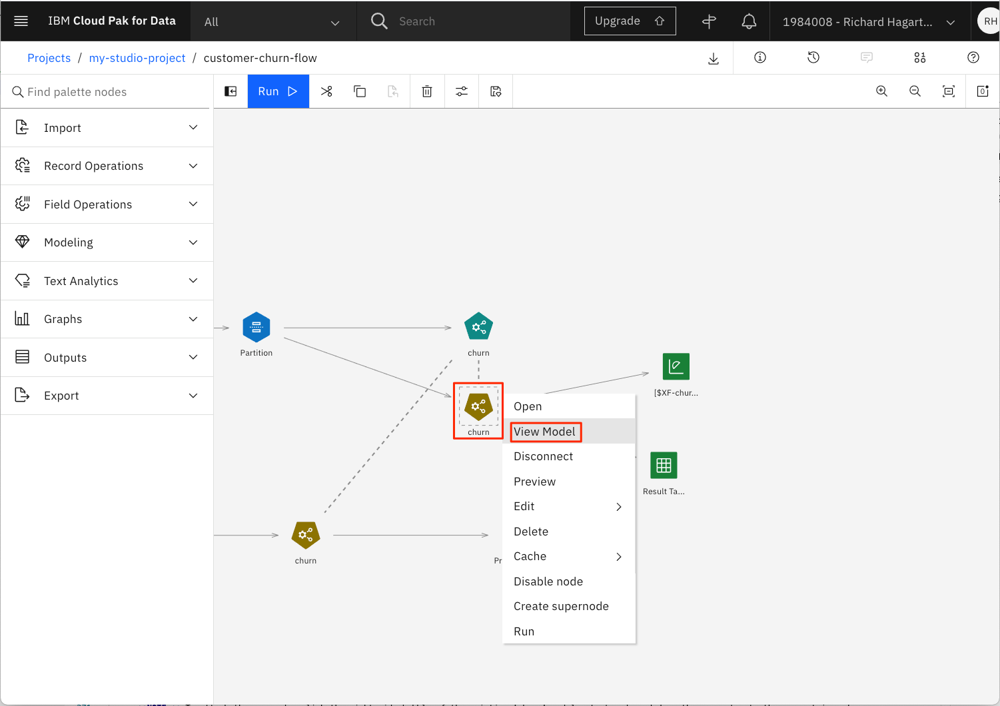

この概要セクションでは、分類器モデルのリストとその精度が表示されます。この例では、**使用するモデルの数**を8に設定しています。

この概要セクションをナビゲートすると、各推定量に関連するオプションやビューの数が異なることに気づくでしょう。場合によっては、より詳細な情報を得るためのハイパーリンクが用意されています。

例えば、表中の名前をクリックして、パフォーマンスの低い「C&RT」ツリーモデルを見てみましょう。

次のページでは、左の**Tree Diagram**リンクを選択すると、そのエスティメイトの樹形図が表示されます。

ツリー内のノードやブランチにカーソルを置くと、特定のポイントで行われた決定に関する詳細情報を得ることができます。

モデルの概要ページに戻り、「**MPL Neural Network**」リンクを選択すると、その推定量の詳細が表示されます。木モデルとは異なるオプションがあることに注意してください。

「**特徴の重要性**」タブをクリックします。

これは、モデルを推定する際の各予測変数の相対的な性能をグラフ化したものです。

「**Confusion Matrix**」タブをクリックします。

この表は、予測されたものと観察されたものを比較します。正しい予測の数は、主対角線上のセルに表示されます。

データセット全体の混同行列を取得したい場合は、キャンバスに **Matrix Output** ノードを追加することができます。

1. フローに戻ります。

1. 「Outputs」メニューから「**Matrix**」ノードを選択し、キャンバス上にドラッグします。

    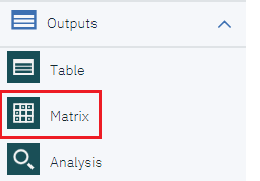

1. 指定されたモデル出力ノードにマトリックスノードを取り付けます。

    

    > **NOTE:** 新しいノードをアタッチするには、既存の「churn」モデル出力ノードの右端の矢印をクリックし、コネクタを新しいマトリックスノードにドラッグします。

1. ****Matrixノードを開きます。

1. 行にターゲット属性「churn」を、列にバイナリ予測「$XF-churn」を入れる。

    

1. Cellの内容で、**Cross-tabulations**を選択します。

1. 「外観」をクリックし、「数値」、「行の割合」、「列の割合」、「行と列の合計を含める」を選択する。

    

1. 「**Save**」をクリックします。Matrixノードの名前が、割り当てられた行と列の名前に変更されます。

1. ノードのアクションメニューをクリックし、**Run**を選択して、**Matrix**ノードを実行します。

1. 右上の「View Output and Versions」を選択する。

    

1. Matrixノードの出力（名前は'churn x $XF-churn'）を「目」のアイコンをクリックして開きます。

    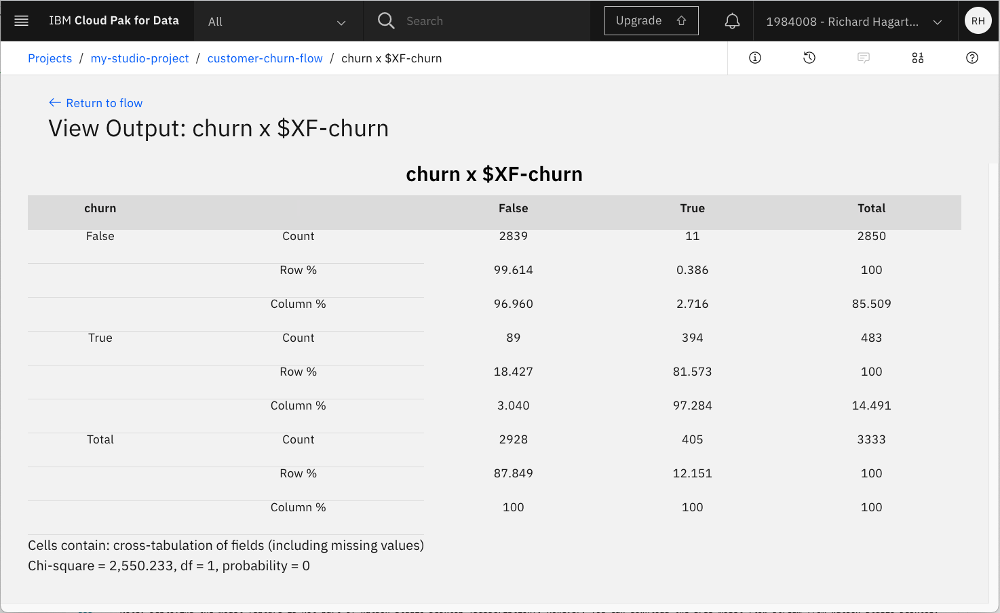

    主対角線上のセルのパーセンテージには、行のパーセンテージとしてリコール値（一般的に使用されている割合の100倍の指標）、列のパーセンテージとして精度値が含まれています。F1の統計値と、両方のカテゴリーにおける精度とリコールの加重バージョンは、手動で計算する必要があります。表示されている結果は、3つのアルゴリズムをすべて適用した総合的な結果です。ランダムフォレストの結果だけを見たい場合は、「自動分類器」ノードに戻ります。それを開き、ランダムツリー以外のすべてのモデルのチェックを外します。

    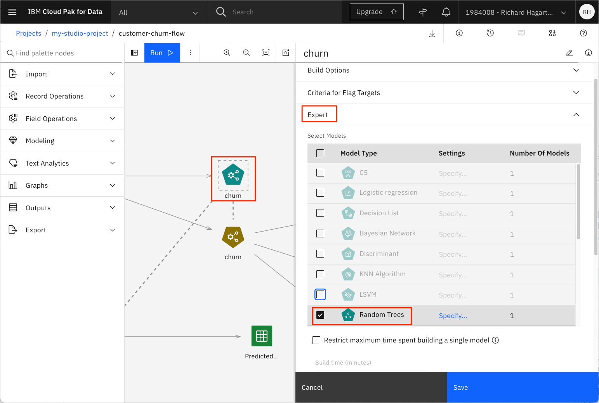

1. 変更を保存してから、フローを再実行します。

混同行列だけを取得したい場合は、行列出力ノードを開き、外観セクションの**Percentage of Row**と**Percentage of Column**の選択を解除します。その後、上記のステップ9～11を繰り返します。

混同行列をよりグラフィカルに表示するには、**Graph**ビジュアライゼーションを使用します。そのためには

1. **Charts**オブジェクトを選択してキャンバスにドラッグし、モデル出力ノードにアタッチする。

    

1. ノードを開いて、**Launch Chart Builder**をクリックします。

    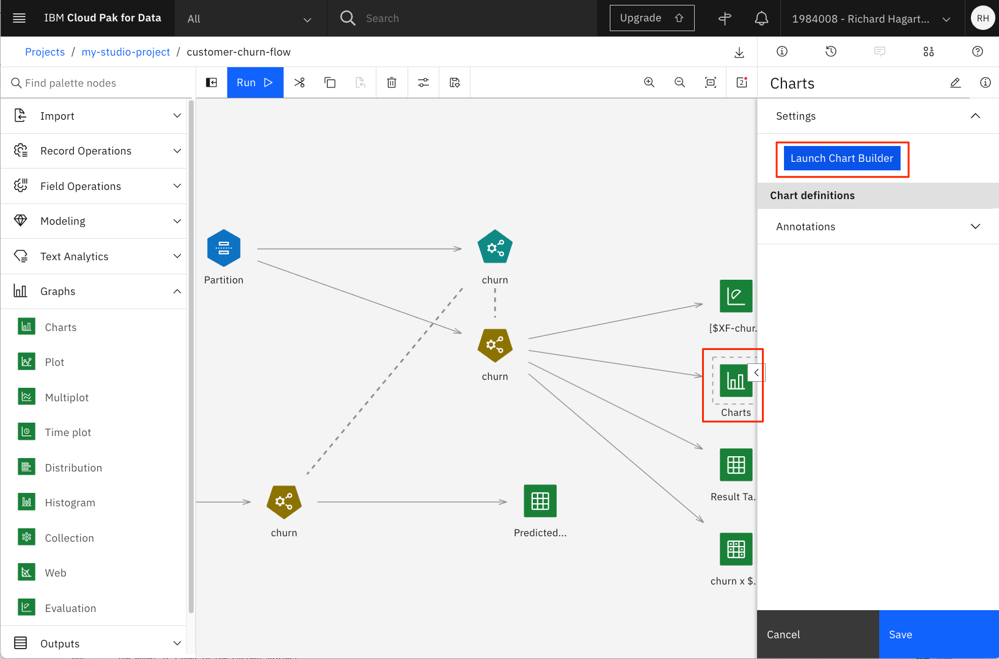

1. **More options**（二重矢印のアイコン）をクリックして、利用可能なすべてのチャートタイプを表示します。2. **Treemap** チャートを選択します。

    

1. **Columns**の値を**churn**と**$XF-churn**に設定し、**Leaf count**を2に設定し、**Details**パネルの**Count**を選択します。

    

現在のパイプラインでは、Partitionノードを使用してテストデータとトレーニングデータの単純な分割を行っていることに注目してください。また、クロスバリデーションや層別クロスバリデーションを使用して、モデルのパフォーマンスを若干向上させることも可能ですが、パイプラインが複雑になるという代償を伴います。

評価結果を見るには、さらに2つの方法があります。

1. Customer Churn Flowのフローエディターに戻ります。

1. 上部ツールバーの**View outputs and version**を選択する。

1. 1. **Evaluation of [$XF-churn] : Gains**という名前のアウトプットについて、「目」のアイコンをクリックして開きます。

    

モデルの生成された出力が表示されます。

### デプロイメント空間の作成

IBM Watson Studio は、**デプロイメント・スペース**という概念を使用して、関連するデプロイメント可能なアセットのセットのデプロイメントを構成および管理します。これらのアセットは、データファイルや機械学習モデルなどです。

この例では、SPSS モデルを保存するためにデプロイメント・スペースを使用します。

まだデプロイメント・スペースを作成していない場合は、以下の手順で作成してください。

1. メインのナビゲーションメニューを開き、**デプロイメントスペース**を展開し、**すべてのスペースを表示**を選択します。

    

1. 「**新しいデプロイメント・スペース +**」をクリックします。

    をクリックします。

1. デプロイメント スペースに一意の名前とオプションの説明を付けます。以前の手順で作成した**Cloud Object Storage**と**Machine Learning**のサービスインスタンスを用意します。そして、**Create**ボタンをクリックします。

  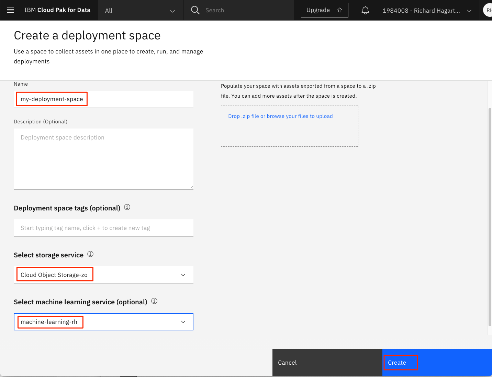

1. デプロイメント スペースが作成されたら、「新しいスペースを表示」ボタンをクリックします。

  をクリックします。

次の画像は、新しいデプロイメント スペースの **資産** パネルを示しています。

  

### モデルの保存とデプロイ

> 注：モデルのデプロイ機能は、Watson Studio Desktop (Subscription)には含まれていません。ただし、Watson Studio Desktop から SPSS モデルのフローストリームをダウンロードして、それを Watson Studio on IBM Cloud にインポートすることができます。それを再度実行して、以下の手順でデプロイできるモデルを作成することができます。

モデルを作成、トレーニング、評価したら、保存してデプロイすることができます。

SPSS モデルを保存するには、次のようにします。

1. モデルフローのフローエディターに戻ります。

1. 1. **Predicted Output**ノードを選択し、右上隅の3つのドットを選択してポップアップメニューを開きます。

1. 1. ポップアップメニューから「**Save branch as model**」を選択します。

    

    新しいウィンドウが開きます。

    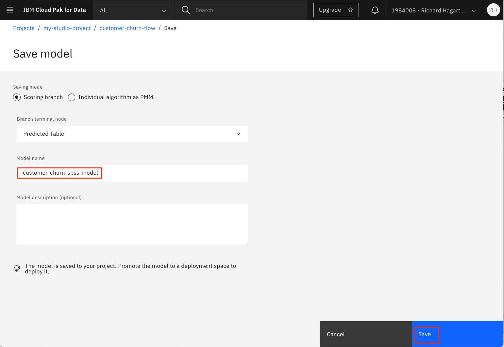

1. モデル名を入力します (例: 'customer-churn-spss-model')。

1. 「**Save**」をクリックします。

    モデルが現在のプロジェクトに保存されます。

このモデルは、プロジェクトのAssetsタブのModelsセクションに表示されます。

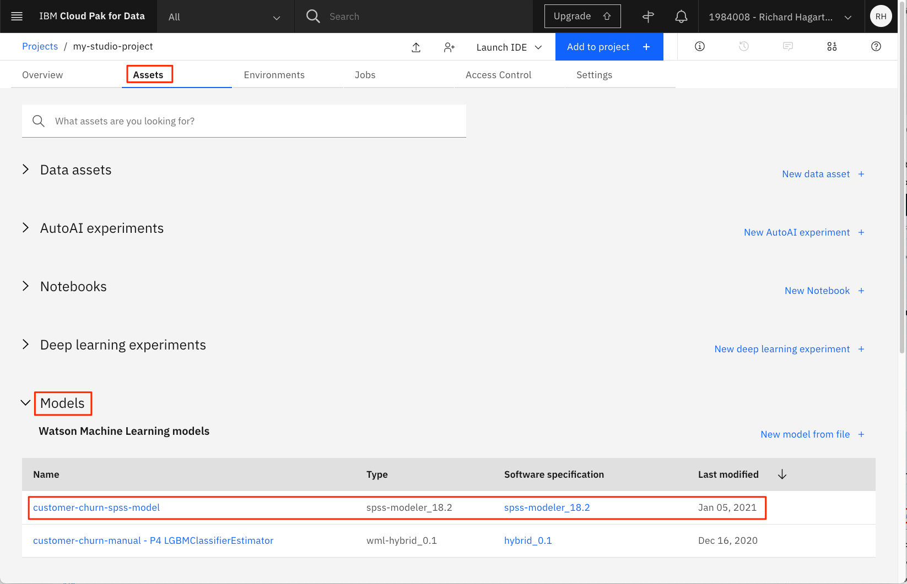

SPSSモデルをデプロイするには、次のようにします。

1. プロジェクトの**モデル**リストで保存したモデルをクリックして、モデルの詳細ページを開きます。

    

1. **Promote to deployment space**をクリックします。

    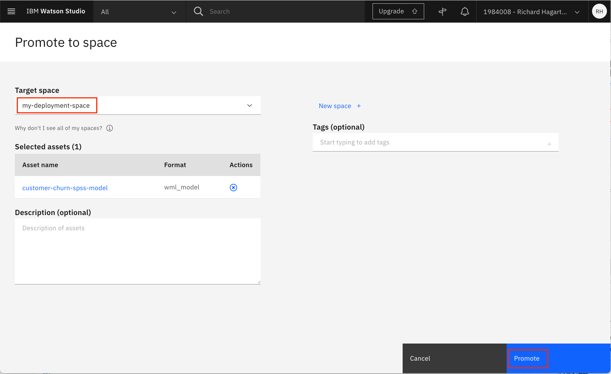をクリックします。

1. **ターゲットスペース**で、前のステップで作成したデプロイメントスペースを選択し、**Promote**をクリックします。

1. これで、デプロイメント・スペースのページにモデルが表示されます。

    

1. モデル名の上にカーソルを置くと、アクションアイコンが表示されます。デプロイメント "アイコンをクリックします。

    

1. [オンライン** 配置タイプ] をクリックし、固有の名前 (例: 'customer-churn-spss-manual-web-deployment') を入力して、[作成**] をクリックします。

1. 配置スペースパネルの **Deployments** タブを選択し、Watson Studio が **STATUS** フィールドを「Deployed」に設定するまで待ちます。

    

### モデルのテスト

これでモデルがデプロイされ、予測に使用できるようになりました。しかし、本番環境で使用する前に、実際のデータを使ってテストしてみるとよいでしょう。このテストは、IBM Machine Learning Service の API を使って、対話的またはプログラム的に行うことができます。今のところ、対話的にテストします。

UIには、予測をテストするための2つのオプションが用意されています。個別のフィールドに値を1つずつ入力する方法(各特徴に1つずつ)と、JSONオブジェクトを使用して特徴の値を指定する方法です。2つ目の方法は、テストを複数回行う場合(通常はこの方法で行います)や、大量の特徴量が必要な場合に便利な方法です。定義済みのテストデータセットを取得するには

より簡単にするために、以下のサンプルJSONオブジェクトをカット＆ペーストして、次のステップで使用することができます。