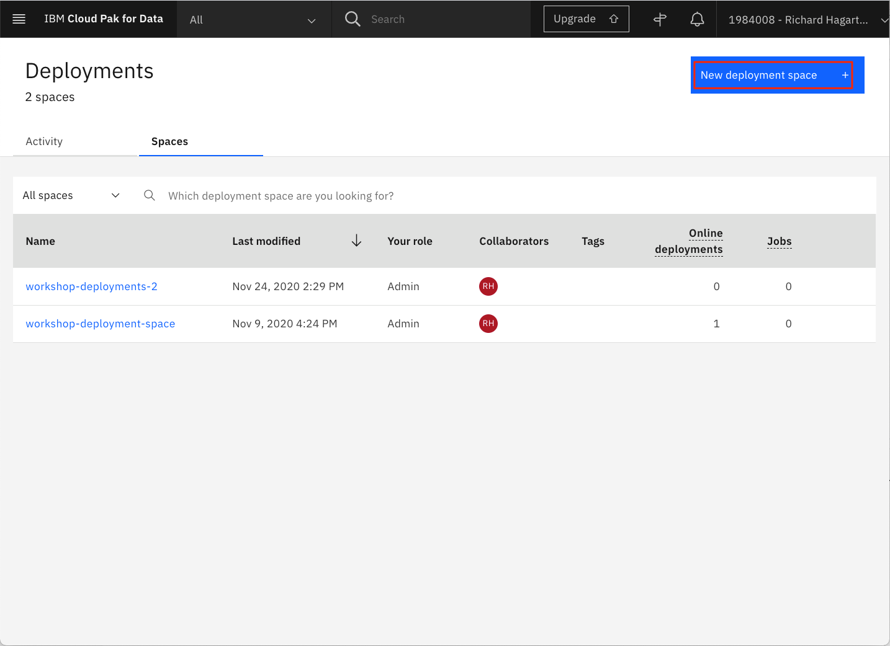
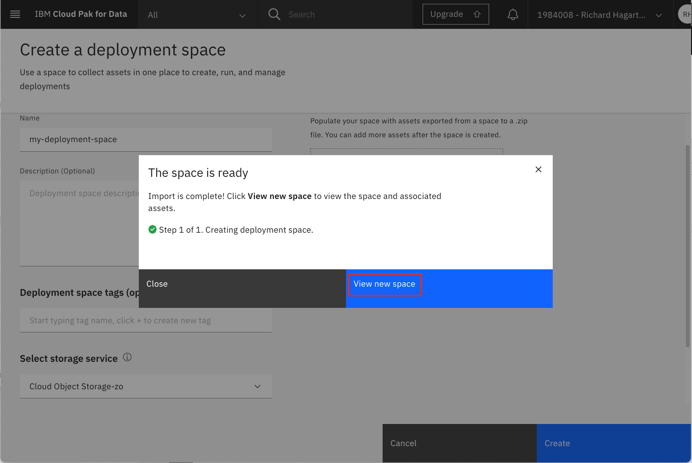
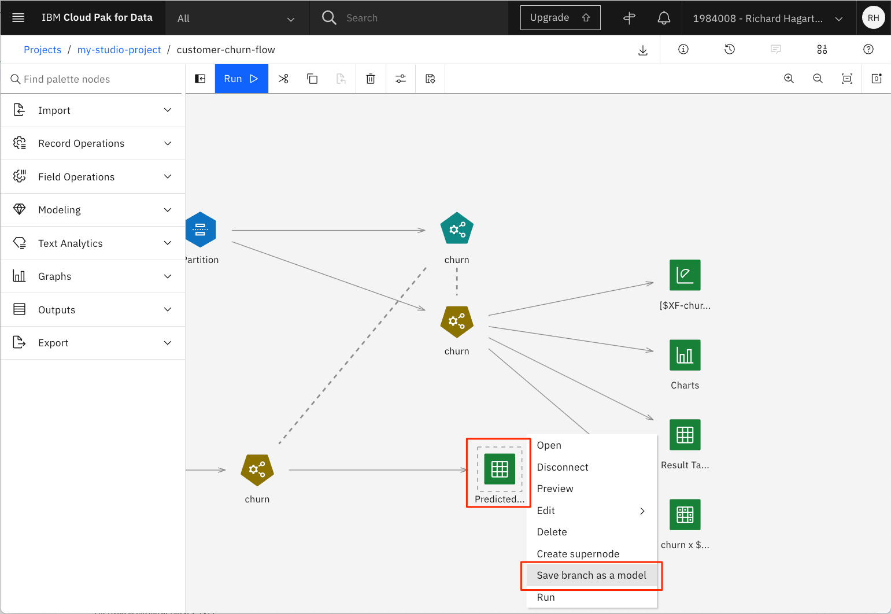
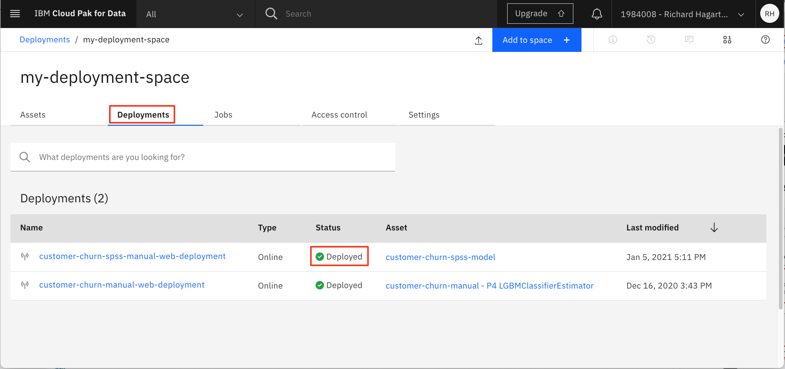

## Introduction

This tutorial explains how to graphically build and evaluate machine learning models by using the SPSS Modeler flow feature in IBM&reg; Watson&trade; Studio. <a href="https://dataplatform.cloud.ibm.com/docs/content/wsd/spss-modeler.html?cm_sp=ibmdev-_-developer-tutorials-_-cloudreg" target="_blank" rel="noopener noreferrer">IBM Watson SPSS Modeler</a> flows in Watson Studio provide an interactive environment for quickly building machine learning pipelines that flow data from ingestion to transformation to model building and evaluation, without needing any code. This tutorial introduces the SPSS Modeler components and explains how you can use them to build, test, evaluate, and deploy models.

As with all the other tutorials in this learning path, we are using a customer churn data set that is available on <a href="https://www.kaggle.com/sandipdatta/customer-churn-analysis/notebook#Churn-Analysis" target="_blank" rel="noopener noreferrer">Kaggle</a>.

## Prerequisites

To complete the tutorials in this learning path, you need an <a href="https://cloud.ibm.com/registration?cm_sp=ibmdev-_-developer-tutorials-_-cloudreg" target="_blank" rel="noopener noreferrer">IBM Cloud account</a>, which gives you access to <a href="https://cloud.ibm.com?cm_sp=ibmdev-_-developer-tutorials-_-cloudreg" target="_blank" rel="noopener noreferrer">IBM Cloud</a>, <a href="https://www.ibm.com/cloud/watson-studio" target="_blank" rel="noopener noreferrer">IBM Watson Studio</a>, and the <a href="https://www.ibm.com/cloud/machine-learning" target="_blank" rel="noopener noreferrer">IBM Watson Machine Learning Service</a>.


## Estimated time

It should take you approximately 60 minutes to complete this tutorial.

## Steps

> The SPSS Modeler flow feature is also available on IBM Watson Studio Desktop. The same steps to create an SPSS Modeler flow mentioned below for Watson Studio on IBM Cloud also apply to Watson Studio Desktop. To skip to Watson Studio Desktop, see [SPSS Modeler flow using Watson Studio Desktop](#spss-modeler-flow-using-watson-studio-desktop).

The steps to set up your environment for the learning path are explained in the [Data visualization, preparation, and transformation using IBM Watson Studio](/tutorials/watson-studio-data-visualization-preparation-transformation/) tutorial. These steps show how to:

1. Create an IBM Cloud Object Storage service.
1. Create an IBM Watson Studio project.
1. Provision IBM Cloud services.
1. Upload the data set.

You must complete these steps before continuing with the learning path. If you have finished setting up your environment, continue with the next step, creating a model flow.

### Create model flow in Watson Studio

**NOTE**: You might notice that the "IBM Watson Studio" banner will in some cases be replaced with the name "IBM Cloud Pak for Data." The banner used is dependent on the number and types of services that you have created on your IBM Cloud account. The change has no effect on how the service functions or is navigated.

To create an initial machine learning flow:

1. From the **Assets** page, click **Add to project**.

1. In the **Choose asset type** page, select **Modeler Flow**.

    

1. On the **Modeler** page, select the 'From File' tab.

1. Use the following link to download the **Customer Churn Modeler Flow** file to your local system.

    * [customer-churn-flow.str](static/customer-churn-flow.str)

1. Drag the downloaded modeler flow file to the upload area. This also sets the name for the flow.

    

1. Change the name and provide a description for the machine learning flow (optional).

1. Click **Create**. This opens the Flow Editor that can be used to create a machine learning flow.

You have now imported an initial flow that we'll explore in the rest of this tutorial.


Under the **Modeling** drop-down menu, you can see the various supported modeling techniques. The first one is Auto Classifier, which tries several techniques and then presents the results of the best one.

The main flow itself defines a pipeline consisting of several steps:

* A Data Asset node for importing the data set
* A Type node for defining metadata for the features, including a selection of the target attributes for the classification
* An Auto Data Prep node for preparing the data for modeling
* A Partition node for partitioning the data into a training set and a testing set
* An Auto Classifier node called 'churn' for creating and evaluating the model

Additional nodes have been associated with the main pipeline for viewing the input and output. These are:

* A Table output node called 'Input Table' for previewing the input data
* A Data Audit node called '21 fields' (default name) for auditing the quality of the input data set (min, max, standard, and deviation)
* An Evaluation node for evaluating the generated model
* A Table output node called 'Result Table' for previewing the results of the test prediction

Other input and output types can be viewed by selecting the **Outputs** drop-down menu.

### Assign data asset and run the flow

To run the flow, you must first connect the flow with the appropriate set of test data available in your project.

1. Select the three dots of the Data Asset node to the left of the flow (the input node).

1. Select the **Open** command from the menu. This shows the attributes of the node in the right part of the page.

    

1. Click **Change data asset** to change the input file.

1. On the next page, select your .CSV file that contains the customer churn, and click **OK**.

    >**NOTE**: The Kaggle data set should have been uploaded to your Project assets as a part of the prerequisites step. If needed, a link to download the file is [here](static/customer-churn-kaggle.csv).

1. Click **Save**.

1. Click **Run** (the arrow head) in the toolbar to run the flow.

    

Running the flow creates a number of outputs or results that can be inspected in more detail.


### Understanding the data

Now that you have run the flow, take a closer look at the data.

1. Select the **Input Table** node at the top of the flow diagram.

1. Select the three dots in the upper-right corner and invoke the **Preview** command from the pop-up menu.

    

Note that this runs part of the flow again.


Now, let's take a closer look at each of the data columns, such as the values for their minimum, maximum, mean, and standard deviation:

1. Select the **View outputs and versions** command from the upper-right portion of the toolbar.

1. Select the **Outputs** tab.

    

1. From the output list, locate the "data audit" node named "21 Fields," then click on the "eye" icon to open it.

    

This gives you an overview like the one in the following image.


For each feature, the overview shows the distribution in graphical form and whether the feature is categorical or continuous. For numerical features, the computed min, max, mean, standard deviation, and skewness are shown as well. From the column named Valid, you can see that there are 3333 valid values, which means that no values are missing for the listed features and you do not need to bother further with this aspect of preprocessing to filter or transform the columns with lacking values.

### Data preparation

You can change the initial assessment of the features made by the import by using the Type node, which happens to be the next node in the pipeline. To achieve this:

1. Go back to the Flow Editor by selecting **'customer-churn-flow'** in the toolbar.

1. Select the **Type** node.

1. Select the **Open** command from the pop-up menu.

This provides a table that shows the features (such as fields), their kind (for example, continuous or flag), and role, along with others.


The Measure can be changed if needed using this node and it is also possible to specify the role of a feature. In this case, the role of the churn feature (which is a Flag with True and False values) has been changed to Target. The Check column might give you more insight into the values of the field.

Click **Cancel** to close the property editor for the Type node.

The next node in the pipeline is the Auto Data Prep node. This node automatically transforms the data, such as converting categorical fields into numerical ones. To view its results:

1. Select the **Auto Data Prep** node in the flow editor.

1. Select **Open** from the pop-up menu.

This node offers a multitude of settings, for example, for defining the objective of the transformation (optimize for speed or for accuracy).


The previous image shows that the transformation has been configured to exclude fields with too many missing values (threshold is 50) and to exclude fields with too many unique categories. Assume that the latter applies to the phone numbers and don't worry about them.

The next node in the pipeline is the Partition node, which splits the data set into a training set and a testing set. For the current Partition node, an 80-20 split has been used.


### Training the model

The next node in the SPSS Modeler flow is the Auto Classifier node named "churn." This node trains the model based on various build options, such as how to rank and discard generated models (using threshold accuracy).


If you **Open** the node and select the **BUILD OPTIONS** option from the drop-down menu, you see the property **Number of models to use** is set to 3, which is the default value. Feel free to change it to a higher number, and then click **Save** to save the changes.

> **NOTE:** Remember to rerun the flow if you change any build settings.

### Evaluating the model

To get more details about the generated model:

1. Select the "churn" model icon.

1. Select **View Model** from the drop-down menu.

    

This overview section gives you a list of classifier models and their accuracy. In this example, I set the **Number of models to use** to 8.


As you navigate through this overview section, you'll notice that the number of options and views that are associated with each estimator varies. In some cases, a hyperlink is provided to dig down into more details.

For example, take a look at the poor performing 'C&RT' Tree Model by clicking the name in the table.

On the next page, select the **Tree Diagram** link to the left to get the tree diagram for the estimator.

You can now hover over either one of the nodes or one of the branches in the tree to get more detailed information about a decision made at a given point.


Return to the model overview page, and select the **MPL Neural Network** link to get the details for that estimator. Note that has different options than the tree model.

Click the **Feature Importance** tab.


This graphs the relative performance of each predictor in estimating the model.

Click the **Confusion Matrix** tab.


The table compares what is predicted versus what it observed. The numbers of correct predictions are shown in the cells along the main diagonal.

If you would like to get the confusion matrix for the complete data set, you can add a **Matrix Output** node to the canvas.

1. Go back to the flow.

1. Select the **Matrix** node from the Outputs menu, and drag it onto the canvas.

    

1. Attach the matrix node to the specified model output node.

    

    > **NOTE:** To attach the new node, click the right-side arrow of the existing 'churn' model output node and drag the connector to the new matrix node.

1. **Open** the Matrix node.

1. Put the target attribute 'churn' in the Rows and the binary prediction '$XF-churn' in the Columns.

    

1. For Cell contents, select **Cross-tabulations**.

1. Click **Appearance** and select **Counts**, **Percentage of Row**, **Percentage of Column**, and **Include row and column totals**.

    

1. Click **Save**. Note that the name of the Matrix node will now change to match the assigned row and column names.

1. Run the **Matrix** node by clicking on the nodes action menu and selecting **Run**.

1. Select **View Output and Versions** in the upper-right corner.

    

1. Open the output for the Matrix node (named 'churn x $XF-churn') by clicking on the "eye" icon.

    

    The main diagonal cell percentages contain the recall values as the row percentages (100 times the proportions metric that's generally used) and the precision values as the column percentages. The F1 statistics and weighted versions of precision and recall over both categories would need to be manually calculated. The results shown are the combined results applying all three algorithms. If you want to see the results just for the Random Forest, go back to the Auto Classifier node. Open it and uncheck the boxes for all models other than Random Trees.

    

1. Save the change, then rerun the flow.

If you want to just get the confusion matrix, open the Matrix Output node and unselect **Percentage of Row** and **Percentage of Column** in the appearance section. Then, repeat steps 9-11 above.


A more graphical way of showing the confusion matrix can be achieved by using **Graph** visualizations. For that purpose:

1. Select and drag the **Charts** object to the canvas, then attach it to the the model output node.

    

1. Open the node, and click on **Launch Chart Builder**.

    

1. Click **more options** (the double arrow icon) to view all available chart types. Select the **Treemap** chart.

    

1. Set the **Columns** values to **churn** and **$XF-churn**, set **Leaf count** to 2, and select **Count** in the **Details** panel.

    

Notice that the current pipeline performs a simple split of test and training data using the Partition node. It's also possible to use cross-validation and stratified cross-validation to achieve slightly better model performance, but at the cost of complicating the pipeline.

There are two more ways of viewing the results of the evaluation.

1. Go back to the flow editor for the Customer Churn Flow.

1. Select **View outputs and version** from the top toolbar.

1. For the output named **Evaluation of [$XF-churn] : Gains**, click the "eye" icon to open it.

    

The generated outputs for the model appear.


### Create a deployment space

IBM Watson Studio uses the concept of **Deployment Spaces** to configure and manage the deployment of a set of related deployable assets. These assets can be data files, machine learning models, and so on.

In this example, we use a deployment space to save the SPSS model.

If you have not already created a deployment space, use the following instructions to create one.

1. Go the (☰) main navigation menu, expand **Deployment spaces**, then select **View all spaces**.

    

1. Click **New deployment space +**.

    

1. Give your deployment space a unique name and optional description. Provide the **Cloud Object Storage** and **Machine Learning** service instances that you have created in earlier steps. Then, click the **Create** button.

  

1. Click the **View new space** button after the deployment space is created.

  

The following image shows the new deployment space **Assets** panel.

  

### Saving and deploying the model

> Note: Deploying the model feature is not part of Watson Studio Desktop (Subscription). However, you can download the SPSS model flow stream from Watson Studio Desktop, then import that to Watson Studio on IBM Cloud. You can run it again and create the model that you can deploy using the following steps.

After you create, train, and evaluate a model, you can save and deploy it.

To save the SPSS model:

1. Go back to the flow editor for the model flow.

1. Select the **Predicted Output** node and open its pop-up menu by selecting the 3 dots in the upper-right corner.

1. Select **Save branch as model** from the pop-up menu.

    

    A new window opens.

    

1. Type a model name (for example, 'customer-churn-spss-model').

1. Click **Save**.

    The model is saved to the current project.

The model should now appear in the Models section of the Assets tab for the project.


To deploy the SPSS model:

1. Click the saved model in the project **Models** list to open the model details page.

    

1. Click **Promote to deployment space**.

    

1. For **Target space**, select the deployment space created in the previous step, then click **Promote**.

1. The model should now be listed in the deployments space page.

    

1.  Hover over the model name to see the action icons. Click the **deployment** icon.

    

1. Click **Online** deployment type, enter a unique name (for example, 'customer-churn-spss-manual-web-deployment'), then click **Create**.

1. Select the **Deployments** tab of the deployment space panel and wait until Watson Studio sets the **STATUS** field to "Deployed".

    

### Testing the model

Now, the model is deployed and can be used for prediction. However, before using it in a production environment it might be worthwhile to test it using real data. You can do this interactively or programmatically using the API for the IBM Machine Learning Service. For now, we test it interactively.

The UI provides two options for testing the prediction: by entering the values one by one in distinct fields (one for each feature) or by specifying the feature values using a JSON object. We use the second option because it is the most convenient one when tests are performed more than once (which is usually the case), and when a large set of feature values is needed. To get a predefined test data set:

To make it easier for you, you can cut and paste the following sample JSON object to use in the following steps.

```json
{"input_data":[{"fields": ["state", "account length", "area code", "phone number", "international plan", "voice mail plan", "number vmail messages", "total day minutes", "total day calls", "total day charge", "total eve minutes", "total eve calls", "total eve charge", "total night minutes", "total night calls", "total night charge", "total intl minutes", "total intl calls", "total intl charge", "customer service calls", "churn"], "values": [["NY",161,415,"351-7269","no","no",0,332.9,67,56.59,317.8,97,27.01,160.6,128,7.23,5.4,9,1.46,4,"false"]]}]}
```

Notice that the JSON object defines the names of the fields first, followed by a sequence of observations to be predicted, each in the form of a sequence:

Note that some of the features, such as state and phone number, are expected to be in the form of strings (which should be no surprise), whereas the true numerical features can be provided as integers or floats as appropriate for the given feature.

To test the model at run time:

1. Select the deployment that you just created by clicking the deployment name (for example, 'customer-churn-spss-model-web-service').

1. This opens a new page that shows an overview of the properties of the deployment (for example, name, creation date, or status).

1. Select the **Test** tab.

1. Select the file icon, which then lets you enter the values using JSON.

1. Paste the JSON object into the **Enter input data** field.

1. Click **Predict** to view the results.


The prediction result is given in terms of the probability that the customer will churn (True) or not (False). You can try it with other values, for example, by substituting the values with values taken from the customer-churn-kaggle.csv file. Another test is to change the phone number to something like "XYZ" and then run the prediction again. The prediction result should be the same, which indicates that the feature is not a factor in the prediction.

If interested in seeing other examples for using the SPSS Modeler to predict customer churn, look at the tutorial <a href="https://medium.com/ibm-watson/predict-customer-churn-by-building-and-deploying-models-using-watson-studio-flows-7626b9fb5ada" target="_blank" rel="noopener noreferrer">Predict Customer Churn by Building and Deploying Models Using Watson Studio Flows</a>.

### SPSS Modeler flow using Watson Studio Desktop

The SPSS Modeler flow feature is also available in Watson Studio Desktop. Watson Studio Desktop brings the power of best-in-class data science and AI tools from IBM to Windows and MacOS, empowering business leaders and data scientists alike. For more information, see <a href="https://www.ibm.com/products/watson-studio-desktop" target="_blank" rel="noopener noreferrer">IBM Watson Studio Desktop</a>.

#### Steps

1. Download and install <a href="https://www.ibm.com/account/reg/us-en/signup?formid=urx-19947" target="_blank" rel="noopener noreferrer">Watson Studio Desktop</a>. You get a free 30-day trial of Watson Studio Desktop, which also includes a trial for SPSS Modeler.
1. Log in using your IBM Cloud credentials. If you don't have an IBM Cloud account, you can <a href="https://cloud.ibm.com?cm_sp=ibmdev-_-developer-tutorials-_-cloudreg" target="_blank" rel="noopener noreferrer">sign up for one</a>.
1. Create a project.
1. To create a model, use the same steps described previously for Watson Studio. See [Create model flow](#create-model-flow).

## Conclusion

This tutorial covered the basics of using the SPSS Modeler flow feature in Watson Studio, which included:

* Creating a project
* Provisioning and assigning services to the project
* Adding assets to the project, such as data sets
* Creating a Modeler flow
* Using the Modeler flow editor to run and examine the model
* Training and evaluating the model
* Deploying the model as a web service
* Scoring the machine learning model with test data

Using the SPSS Modeler flow feature of Watson Studio provides a non-programming approach to creating a model to predict customer churn. It provides an alternative to the fully programmed style of using a Jupyter Notebook, as described in the next learning path tutorial, "Running Jupyter Notebooks in IBM Watson Studio."