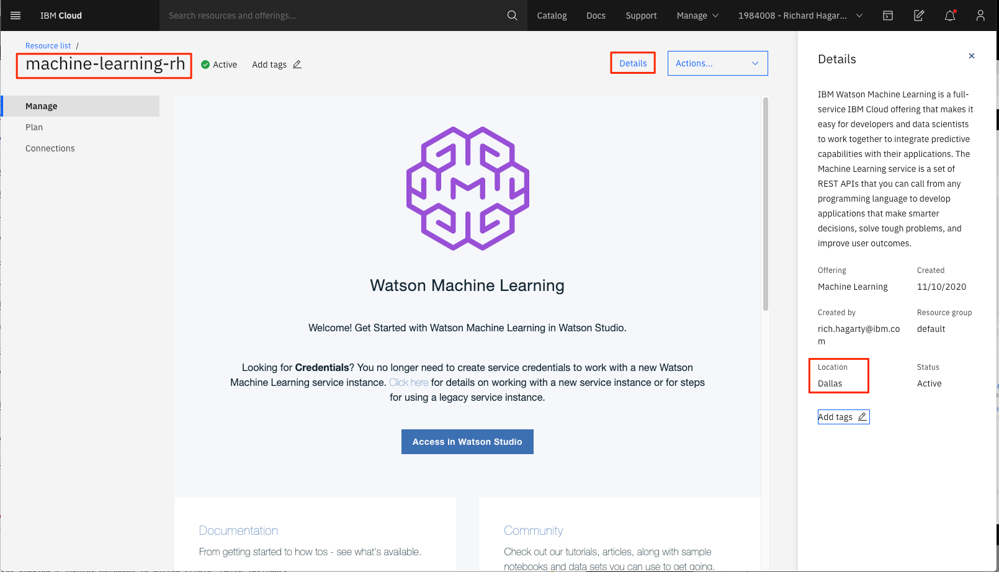
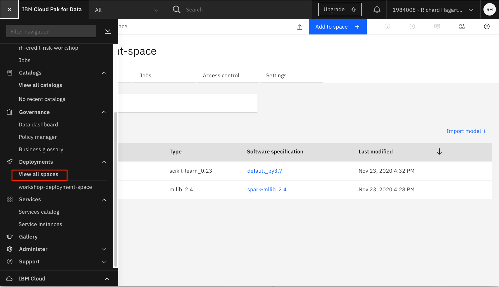
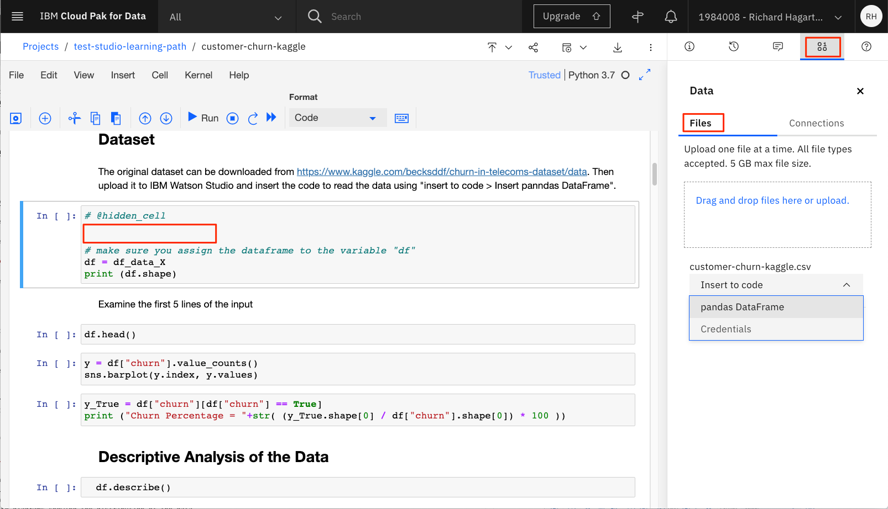

---
also_found_in:
- learningpaths/get-started-watson-studio/
authors: ''
completed_date: '2019-09-03'
draft: false
excerpt: Model Builderを使った半自動のアプローチ、SPSS Modeler Flowsを使った図式的なアプローチ、Jupyter notebookを使った完全なプログラムスタイルまで、IBM
  Watson Studioを使って顧客の解約を予測します。
last_updated: '2021-06-01'
meta_description: Model Builderを使った半自動のアプローチ、SPSS Modeler Flowsを使った図式的なアプローチ、Jupyter
  notebookを使った完全なプログラムスタイルまで、IBM Watson Studioを使って顧客の解約を予測します。
meta_keywords: artificial intelligence, data science, machine learning, deep learning,
  architectural decisions
meta_title: IBM Watson StudioのJupyter Notebooksを使ってモデルを構築します。
primary_tag: artificial-intelligence
subtitle: カスタマーチャーンの予測
tags:
- data-science
- machine-learning
- deep-learning
title: IBM Watson StudioのJupyter Notebooksを使ってモデルを構築します。
---

## Introduction

このチュートリアルでは、IBM&reg; Watson&trade; Studio 内から Jupyter Notebooks をセットアップして実行する方法を説明します。まず、<a href="https://www.kaggle.com/" target="_blank" rel="noopener noreferrer">Kaggle</a>で提供されている顧客の解約に関するデータセットを使用します。このデータセットには、対応する<a href="https://www.kaggle.com/sandipdatta/customer-churn-analysis/" target="_blank" rel="noopener noreferrer">Customer Churn Analysis Jupyter Notebook</a>（元々は<a href="https://www.kaggle.com/sandipdatta" target="_blank" rel="noopener noreferrer">Sandip Datta</a>が開発したもので、以下のような本質的なステップを経て、機械学習モデルを開発する際の典型的な手順を示しています。

1. データセットをインポートする。

1. データの可視化や基本的な統計パラメータ（平均値や標準偏差など）を確認し、データを分析します。

1. 機械モデル構築のためにデータを準備する（カテゴライズされた特徴を数値特徴に変換したり、データを正規化したりするなど）。

1. データを学習データとテストデータに分割し、モデルの学習とモデルの検証に使用する。

1. 様々な機械学習アルゴリズムを用いてモデルを学習し、二値分類を行う。

1. 混同行列を使って、様々なモデルの精度と正確さを評価する。

1. 与えられたデータセットに最も適合するモデルを選択し、予測の結果にどの特徴が低くかつ大きな影響を与えるかを分析する。

1. Watson Machine Learning を使用してモデルを保存・展開し、ノートブックの外からもアクセスできるようにします。
ノートブックの外からアクセスできるようにします。

ノートブックは 40 個の Python セルで定義されており、使用する主なライブラリに精通している必要があります。機械学習用の Python <a href="https://scikit-learn.org/stable/" target="_blank" rel="noopener noreferrer">scikit-learn</a>、科学計算用の Python <a href="http://www.numpy.org/" target="_blank" rel="noopener noreferrer">numpy</a>、Python <a href="https://pandas.pydata.org/" target="_blank" rel="noopener noreferrer">pandas</a>でデータ構造の管理と分析を行い、データの可視化のために<a href="https://matplotlib.org/" target="_blank" rel="noopener noreferrer">matplotlib</a>と<a href="https://seaborn.pydata.org/" target="_blank" rel="noopener noreferrer">seaborn</a>を使用しています。

## 前提条件

このラーニングパスのチュートリアルを完了するには、<a href="https://cloud.ibm.com/registration?cm_sp=ibmdev-_-developer-tutorials-_-cloudreg" target="_blank" rel="noopener noreferrer">IBM Cloud アカウント</a>が必要です。このアカウントでは、<a href="https://cloud.ibm.com?cm_sp=ibmdev-_-developer-tutorials-_cloudreg" target="_blank" rel="noopener noreferrer">IBM Cloud</a>、<a href="https://www.ibm.com/jp-ja/cloud/watson-studio" target="_blank" rel="noopener noreferrer">IBM Watson Studio</a>、<a href="https://www.ibm.com/jp-ja/cloud/machine-learning" target="_blank" rel="noopener noreferrer">IBM Watson Machine Learning Service</a>へのアクセスが可能になります。

## 見積もり時間

このチュートリアルを完了するには、約 30 分かかります。

## 手順

ラーニングパスのために環境をセットアップする手順は、[Data visualization, preparation, and transformation using IBM Watson Studio](/tutorials/watson-studio-data-visualization-preparation-transformation/)チュートリアルで説明されています。これらのステップは、以下の方法を示しています。

1. IBM Cloud Object Storage サービスを作成します。
1. IBM Watson Studio プロジェクトを作成します。
1. IBM Cloud サービスをプロビジョニングします。
1. データセットをアップロードします。

学習パスを続行する前に、これらのステップを完了する必要があります。環境のセットアップが完了している場合は、次のステップであるノートブックの作成に進みます。

> **NOTE**:ノートブックを実行するには、Watson Machine Learning サービスが必要です。

以下の Jupyter ノートブックを実行するには、まず、Watson Machine Learning サービスにアクセスするための API キーを作成し、モデルをデプロイするためのデプロイメントスペースを作成する必要があります。

### API キーの作成

1. Watson Machine Learning サービスにアクセスするために、IBM Cloud コンソールから API キーを作成します。メイン・ダッシュボードから「**Manage**」メニュー・オプションをクリックし、「**Access (IAM)**」を選択します。

    

1. **Create an IBM Cloud API key**をクリックします。キーの名前を入力して、**Create**をクリックします。

    

1. APIキーは、ノートブックを実行する際に必要となるため、コピーしてください。

>**important**:生成されたAPIキーは一時的なもので、数分後には消えてしまいますので、ノートブックにインポートする必要があるときのために、値をコピーして保存しておくことが重要です。

また、Watson Machine Learning サービスの場所を決定する必要があります。これを決定する 1 つの方法は、IBM Cloud ダッシュボードのリソースリストからサービスをクリックすることです。「**Manage**」から「**Details**」をクリックします。

このケースでは、サービスはダラスにあり、これは US-South リージョンに相当します。

>**NOTE**:現在のリージョンは、au-syd、in-che、jp-osa、jp-tok、kr-seo、eu-de、eu-gb、ca-tor、us-south、us-east、br-saoです。

### デプロイメントスペースの作成

モデルをノートブックにデプロイする際には、デプロイメントスペースが必要です。デプロイメントスペースを作成するには、Watson Studio メニューの **Deployments** メニューから **View all spaces** を選択します。

>**NOTE**。以下のスクリーンショットには、"IBM Watson Studio" ではなく "IBM Cloud Pak for Data" というバナーが表示されていることに気づくかもしれません。このバナーは、IBM Cloud アカウントで作成したサービスの数に依存しています。ある閾値に達すると、バナーは「IBM Cloud Pak for Data」に切り替わります。

1. [**New Deployment Space +**] をクリックして、デプロイメント スペースを作成します。

    をクリックします。

1. ストレージと機械学習サービスがスペースに割り当てられていることを確認します。

1. スペースが作成されたら、**Manage**タブをクリックして**Space GUID**を表示します。この値は、ノートブックにインポートする必要があります。

    

### ノートブックの作成

顧客の解約を予測するためのJupyterノートブックを作成し、プロジェクトにアップロードしたデータセットを使用するように変更します。

1. **Asset**タブで、**Add to Project**をクリックします。

    

1. アセットタイプとして **Notebook** を選択します。

1. 「New Notebook」のページで、ノートブックを以下のように設定します。

    1. 「**From URL**」タブを選択します。

        

    2.ノートブックの名前を入力します（例：「customer-churn-kaggle」）。

    3.3. **Python 3.7** ランタイムシステムを選択します。

    4.ノートブックのURLを以下のように入力します。

「**    5.Create**」をクリックします。これにより、IBM Watson Studio 内でノートブックの読み込みと実行が開始されます。

### ノートブックの実行

ノートブックのページが表示されます。

ノートブックが開かれていない場合は、プロジェクトのアセットページでノートブックの横に表示されている［編集］アイコンをクリックすると、ノートブックを起動できます。

> **NOTE**:ノートブックの実行手順に問題がある場合は、出力付きの完成したノートブックを以下の URL で参照できます。<a href="https://github.com/IBM/watson-studio-learning-path-assets/blob/master/examples/customer-churn-kaggle-with-output.ipynb" target="_blank" rel="noopener noreferrer">https://github.com/IBM/watson-studio-learning-path-assets/blob/master/examples/customer-churn-kaggle-with-output.ipynb</a>。

ノートブックのページから、以下の変更を行います。

1. 3つ目のセルまでスクロールして、セルの中央にある空の行を選択します。まだ開いていない場合は、ページ上部にある「**1001**データ」アイコンをクリックして「ファイル」サブパネルを開きます。

    

1. ページの右側の部分で、**Customer Churn**データセットを選択します。**Insert to code**をクリックし、**pandas DataFrame**を選択します。これにより、データセットをpandas DataFrameに読み込むためのコードがデータセルに追加されます。

    

1. 生成されたデータフレームの変数名を、ノートブックの残りの部分で使用される **df** に割り当てます。ノートブックに表示すると、データフレームは以下のように表示されます。

    

1. **File > Save**を選択し、ノートブックを保存します。

ノートブックのセルを1つずつ実行して、その効果とノートブックの定義を確認します。

#### ノートブック実行の背景

ノートブックが実行されると、ノートブック内の各コードセルが上から下に向かって順に実行されます。

各コードセルは選択可能で、その前には左マージンにタグが表示されます。タグの形式は`In [x]:`です。ノートブックの状態によっては、`x`が

* 空白：そのセルが一度も実行されていないことを示します。
* このコードステップが実行された相対的な順序を表す数字。
* セルが実行されていることを示す `*` です。

ノートブックのコードセルを実行するには、いくつかの方法があります。

* セルを 1 つずつ実行する。セルを選択して、ツールバーの **Play** を押してください。
* バッチモードで連続して実行する。**Cell** メニューでは、いくつかのオプションが用意されています。例えば、ノートブック内のすべてのセルを実行する`Run All`や、現在選択されているセルの下の最初のセルから実行を開始し、それに続くすべてのセルを継続して実行する`Run All Below`などがあります。
* スケジュールされた時間に。**ノートブックページの右上にある「Schedule**」ボタンを押してください。ここでは、ノートブックを将来のある時点で1回だけ実行する、または指定した間隔で繰り返し実行するようにスケジュールすることができます。

### データの理解と可視化

データ理解のフェーズでは、最初のデータセットを収集します。このフェーズでは、データに慣れ親しみ、データ品質の問題を特定し、データに関する最初の洞察を発見するための活動が行われます。Jupyter Notebookでは、これらの活動はpandasとpandasの具現化された`matplotlib`関数を使って行われます。pandasの`describe`関数は特徴量の記述統計を生成し、`plot`関数はデータの分布を示す図を生成するのに使用されます。

### データの準備

データの準備段階では、機械学習サービスに投入する最終的なデータセットを構築するために必要なすべての活動が対象となります。データの準備作業は複数回行われることが多く、決まった順序ではありません。タスクには、テーブル、レコード、属性の選択や、モデリングツール用のデータの変換とクレンジングが含まれます。Jupyter Notebookでは、カテゴライズされた特徴を数値に変換したり、特徴を正規化したり、予測に関係のない列（顧客の電話番号など）を削除したりします。次の画像は、操作のサブセットを示しています。

### モデリングと評価

モデリングの段階では、最適な予測を実現するために、様々なモデリング手法を選択・適用し、そのパラメータを調整します。一般的に、適用可能な技術は複数あり、技術によってはデータの形式に特定の要件があります。そのため、データの準備段階に戻る必要があることも多い。しかし、モデルの評価段階では、データ分析の観点から質の高いモデルを構築することが目標となります。モデルの最終的な展開に進む前に、モデルを徹底的に評価し、モデルを作成するために実行されたステップを見直し、モデルがビジネス目標を適切に達成していることを確認することが重要です。

Jupyter Notebookでは、データセットをトレーニング用とテスト用に分割し（層別クロスバリデーションを使用）、`GradientBoostingClassifier`、サポートベクターマシン、ランダムフォレスト、K-Nearest Neighborsなどの明確な分類アルゴリズムを使用して複数のモデルをトレーニングしました。

このステップに続いて、各アルゴリズムの混同行列を印刷して、モデルの精度と正確さをより詳細に確認します。

### Watson Machine Learning にモデルをデプロイする

ノートブックの最後のセクションでは、モデルを保存して Watson Machine Learning サービスにデプロイします。

前のステップでは、Watson Machine Learning サービスに接続するために使用する API キーを作成しました。Watson Machine Learning サービスの使用を承認するために、API キーと場所をコピーします。

モデルをデプロイするには、使用するデプロイメントスペースを定義する必要があります。先に作成した **デプロイメントスペース ID** をコピーします。

モデルが保存され、Watson Machine Learning にデプロイされると、さまざまな方法でモデルにアクセスできるようになります。

Jupyter ノートブックでは、モデルのスコアリングエンドポイントにデータを渡してテストすることができます。

Watson Studio コンソールに戻ると、**Deployment Space** の **Assets** タブで、**Models** セクションに新しいモデルが表示されていることがわかります。

**Deployments**タブをクリックすると、モデルが正常にデプロイされたことがわかります。

デプロイをクリックすると、詳細が表示されます。**API reference**タブをクリックすると、scoringエンドポイントが表示されます。**Code Snippets**セクションでは、プログラムでscoringエンドポイントにアクセスする方法の例を見ることができます。

**Test**タブでは、モデルをスコアリングするためのスコアリングペイロードJSONオブジェクトを渡すことができます（ノートブックで行ったことと同様です）。データを入力した後、**Predict**を押してモデルをスコアリングします。

ここでは、入力データ本体に入力された値を示します。