---
also_found_in:
- learningpaths/get-started-watson-studio/
authors: ''
completed_date: '2019-09-03'
draft: false
excerpt: Predict customer churn using IBM Watson Studio ranging from a semi-automated
  approach using the Model Builder, a diagrammatic approach using SPSS Modeler Flows
  to a fully programmed style using Jupyter notebooks.
last_updated: '2021-06-01'
meta_description: Predict customer churn using IBM Watson Studio ranging from a semi-automated
  approach using the Model Builder, a diagrammatic approach using SPSS Modeler Flows
  to a fully programmed style using Jupyter notebooks.
meta_keywords: artificial intelligence, data science, machine learning, deep learning,
  architectural decisions
meta_title: Build models using Jupyter Notebooks in IBM Watson Studio
primary_tag: artificial-intelligence
subtitle: Predicting customer churn
tags:
- data-science
- machine-learning
- deep-learning
title: Build models using Jupyter Notebooks in IBM Watson Studio
---

## Introduction

This tutorial explains how to set up and run Jupyter Notebooks from within IBM&reg; Watson&trade; Studio. We start with a data set for customer churn that is available on <a href="https://www.kaggle.com/" target="_blank" rel="noopener noreferrer">Kaggle</a>. The data set has a corresponding <a href="https://www.kaggle.com/sandipdatta/customer-churn-analysis/" target="_blank" rel="noopener noreferrer">Customer Churn Analysis Jupyter Notebook</a> (originally developed by <a href="https://www.kaggle.com/sandipdatta" target="_blank" rel="noopener noreferrer">Sandip Datta</a>, which shows the archetypical steps in developing a machine learning model by going through the following essential steps:

1. Import the data set.

1. Analyze the data by creating visualizations and inspecting basic statistic parameters (for example, mean or standard variation).

1. Prepare the data for machine model building (for example, by transforming categorical features into numeric features and by normalizing the data).

1. Split the data into training and test data to be used for model training and model validation.

1. Train the model by using various machine learning algorithms for binary classification.

1. Evaluate the various models for accuracy and precision using a confusion matrix.

1. Select the model that's the best fit for the given data set, and analyze which features have low and significant impact on the outcome of the prediction.

1. Use Watson Machine Learning to save and deploy the model so that it can be accessed
outside of the notebook.

The notebook is defined in terms of 40 Python cells and requires familiarity with the main libraries used: Python <a href="https://scikit-learn.org/stable/" target="_blank" rel="noopener noreferrer">scikit-learn</a> for machine learning, Python <a href="http://www.numpy.org/" target="_blank" rel="noopener noreferrer">numpy</a> for scientific computing, Python <a href="https://pandas.pydata.org/" target="_blank" rel="noopener noreferrer">pandas</a> for managing and analyzing data structures, and <a href="https://matplotlib.org/" target="_blank" rel="noopener noreferrer">matplotlib</a> and <a href="https://seaborn.pydata.org/" target="_blank" rel="noopener noreferrer">seaborn</a> for visualization of the data.

## Prerequisites

To complete the tutorials in this learning path, you need an <a href="https://cloud.ibm.com/registration?cm_sp=ibmdev-_-developer-tutorials-_-cloudreg" target="_blank" rel="noopener noreferrer">IBM Cloud account</a>, which gives you access to <a href="https://cloud.ibm.com?cm_sp=ibmdev-_-developer-tutorials-_-cloudreg" target="_blank" rel="noopener noreferrer">IBM Cloud</a>, <a href="https://www.ibm.com/cloud/watson-studio" target="_blank" rel="noopener noreferrer">IBM Watson Studio</a>, and the <a href="https://www.ibm.com/cloud/machine-learning" target="_blank" rel="noopener noreferrer">IBM Watson Machine Learning Service</a>.

## Estimated time

It should take you approximately 30 minutes to complete this tutorial.

## Steps

The steps to set up your environment for the learning path are explained in the [Data visualization, preparation, and transformation using IBM Watson Studio](/tutorials/watson-studio-data-visualization-preparation-transformation/) tutorial. These steps show how to:

1. Create an IBM Cloud Object Storage service.
1. Create an IBM Watson Studio project.
1. Provision IBM Cloud services.
1. Upload the data set.

You must complete these steps before continuing with the learning path. If you have finished setting up your environment, continue with the next step, creating the notebook.

> **NOTE**: The Watson Machine Learning service is required to run the notebook.

To run the following Jupyter Notebook, you must first create an API key to access your Watson Machine Learning service, and create a deployment space to deploy your model to.

### Create API key

1. To access your Watson Machine Learning service, create an API key from the IBM Cloud console. From the main dashboard, click the **Manage** menu option, and select **Access (IAM)**.

    

1. Click **Create an IBM Cloud API key**. Enter a name for your key, and then click **Create**.

    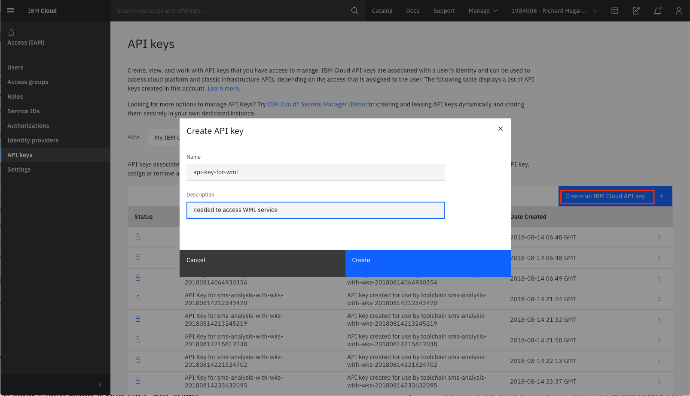

1. Copy the API key because it is required when you run the notebook.

>**IMPORTANT**: The generated API Key is temporary and will disappear after a few minutes, so it is important to copy and save the value for when you need to import it into your notebook.

You also must determine the location of your Watson Machine Learning service. One way to determine this is to click on your service from the resource list in the IBM Cloud dashboard. From the **Manage**, click **Details**.

In this case, the service is located in Dallas, which equates to the us-south region.


>**NOTE**: Current regions include: au-syd, in-che, jp-osa, jp-tok, kr-seo, eu-de, eu-gb, ca-tor, us-south, us-east, and br-sao.

### Create deployment space

A deployment space is required when you deploy your model in the notebook. To create a deployment space, select **View all spaces** from the **Deployments** menu in the Watson Studio menu.

>**NOTE**: You might notice that the following screenshots have the banner "IBM Cloud Pak for Data" instead of "IBM Watson Studio." The banner is dependent on the number of services you have created on your IBM Cloud account. After you reach a certain threshold, the banner switches to "IBM Cloud Pak for Data".


1. Click **New Deployment Space +** to create your deployment space.

    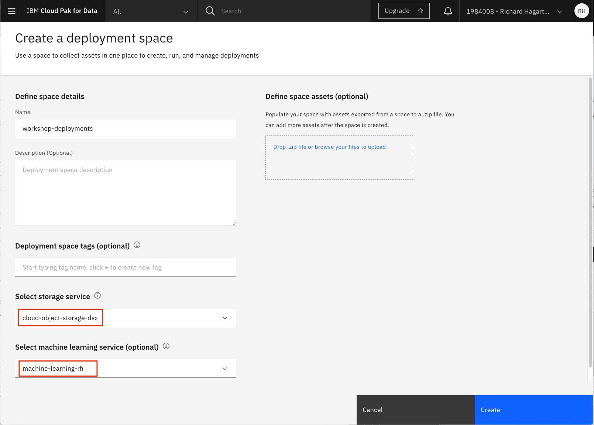

1. Ensure that you assign your storage and machine learning services to your space.

1. After it's created, click the **Manage** tab to view the **Space GUID**. This value must be imported into your notebook.

    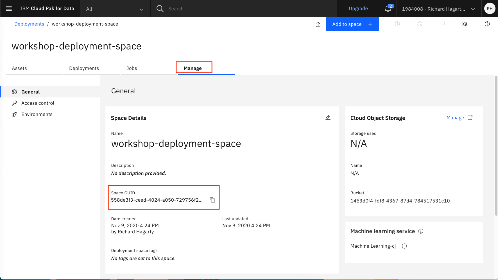

### Create the notebook

Create a Jupyter Notebook for predicting customer churn and change it to use the data set that you have uploaded to the project.

1. In the **Asset** tab, click **Add to Project**.

    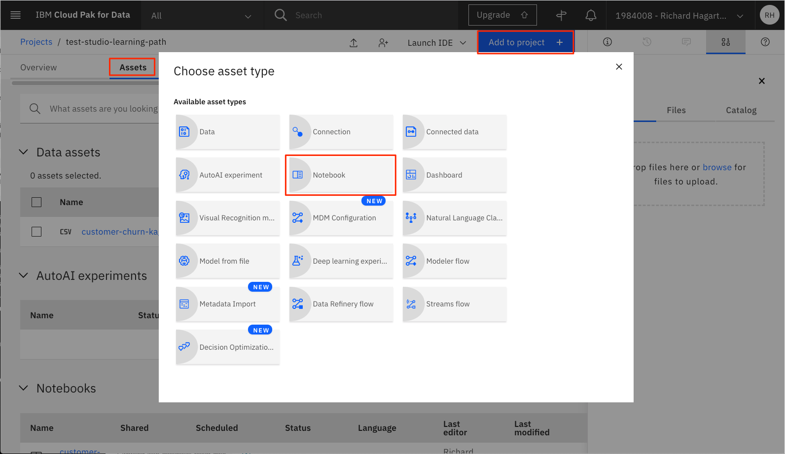

1. Select the **Notebook** asset type.

1. On the New Notebook page, configure the notebook as follows:

    1. Select the **From URL** tab:

        

    2. Enter the name for the notebook (for example, 'customer-churn-kaggle').

    3. Select the **Python 3.7** runtime system

    4. Enter the following URL for the notebook:

        ```
        https://github.com/IBM/watson-studio-learning-path-assets/blob/master/notebooks/customer-churn-kaggle.ipynb
        ```

    5. Click **Create**. This initiates the loading and running of the notebook within IBM Watson Studio.

### Run the notebook

The notebook page should be displayed.

If the notebook is not currently open, you can start it by clicking the Edit icon displayed next to the notebook in the Asset page for the project:

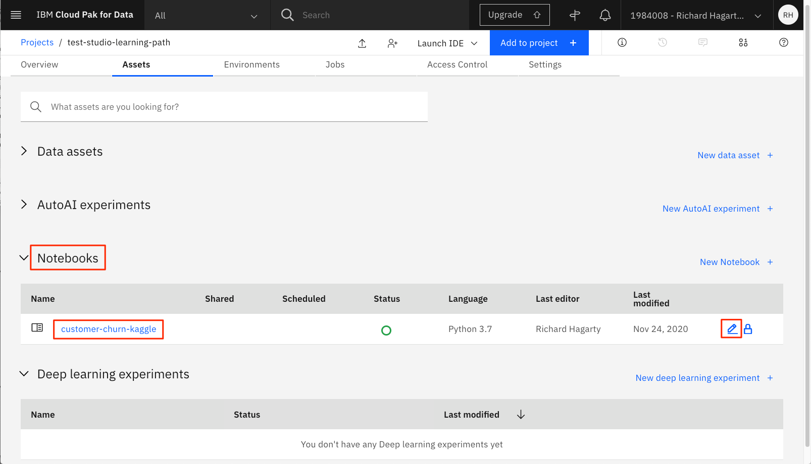

> **NOTE**: If you run into any issues completing the steps to execute the notebook, a completed notebook with output is available for reference at the following URL: <a href="https://github.com/IBM/watson-studio-learning-path-assets/blob/master/examples/customer-churn-kaggle-with-output.ipynb" target="_blank" rel="noopener noreferrer">https://github.com/IBM/watson-studio-learning-path-assets/blob/master/examples/customer-churn-kaggle-with-output.ipynb</a>.

From the notebook page, make the following changes:

1. Scroll down to the third cell, and select the empty line in the middle of the cell. If not already open, click the **1001** data icon at the upper part of the page to open the Files subpanel.

    

1. In the right part of the page, select the **Customer Churn** data set. Click **insert to code**, and select **pandas DataFrame**. This adds code to the data cell for reading the data set into a pandas DataFrame.

    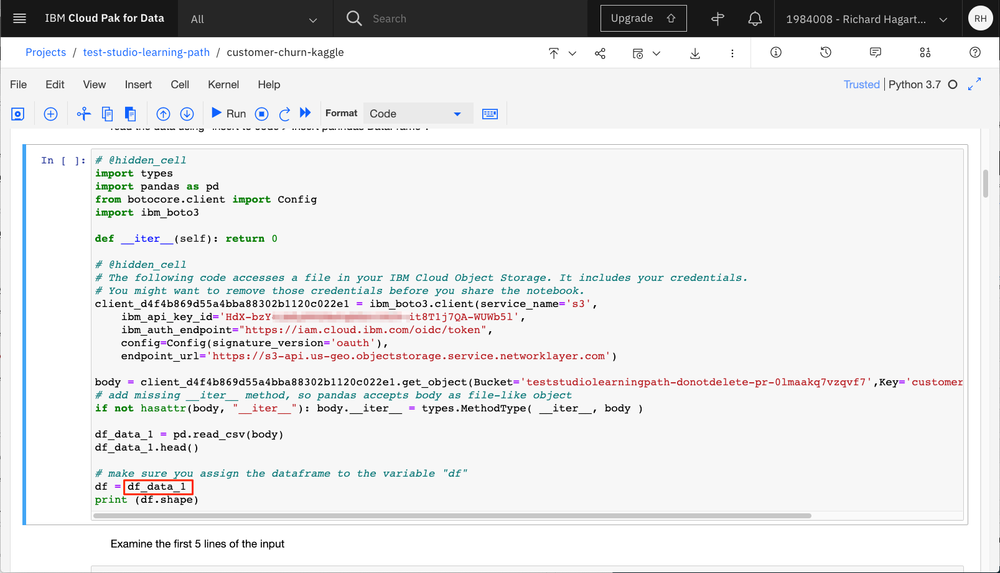

1. Assign the generated data frame variable name to **df**, which is used in the rest of the notebook. When displayed in the notebook, the data frame appears as the following:

    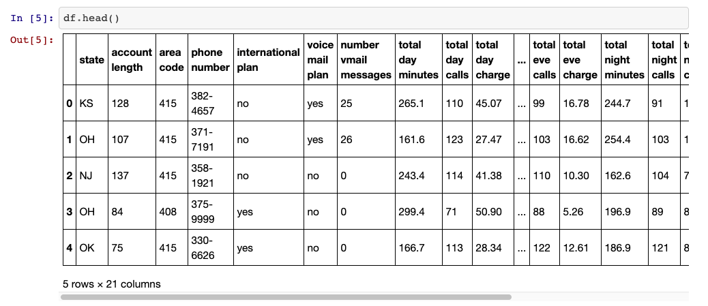

1. Select **File > Save** to save the notebook.

Run the cells of the notebook one by one, and observe the effect and how the notebook is defined.

#### Background on running notebooks

When a notebook is run, each code cell in the notebook is executed, in order, from top to bottom.

Each code cell is selectable and is preceded by a tag in the left margin. The tag format is `In [x]:`. Depending on the state of the notebook, the `x` can be:

* A blank, which indicates that the cell has never been run
* A number, which represents the relative order that this code step was run
* An `*`, which indicates that the cell is running

There are several ways to run the code cells in your notebook:

* One cell at a time. Select the cell, and then press **Play** in the toolbar.
* Batch mode, in sequential order. From the **Cell** menu, there are several options available. For example, you can `Run All` cells in your notebook, or you can `Run All Below`, which starts running from the first cell under the currently selected cell, and then continues running all of the cells that follow.
* At a scheduled time. Press the **Schedule** button that is located in the upper-right section of your notebook page. Here, you can schedule your notebook to be run once at some future time or repeatedly at your specified interval.

### Data understanding and visualization

During the data understanding phase, the initial set of data is collected. The phase then proceeds with activities that enable you to become familiar with the data, identify data quality problems, and discover first insights into the data. In the Jupyter Notebook, these activities are done using pandas and the embodied `matplotlib` functions of pandas. The `describe` function of pandas is used to generate descriptive statistics for the features, and the `plot` function is used to generate diagrams showing the distribution of the data.

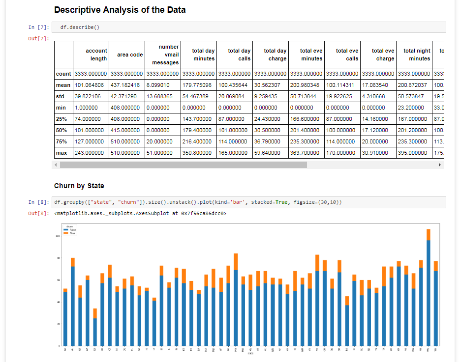

### Data preparation

The data preparation phase covers all activities that are needed to construct the final data set that will be fed into the machine learning service. Data preparation tasks are likely to be performed multiple times and not in any prescribed order. Tasks include table, record, and attribute selection as well as transformation and cleansing of data for the modeling tools. In the Jupyter Notebook, this involves turning categorical features into numerical ones, normalizing the features, and removing columns that are not relevant for prediction (such as the phone number of the client). The following image shows a subset of the operations.

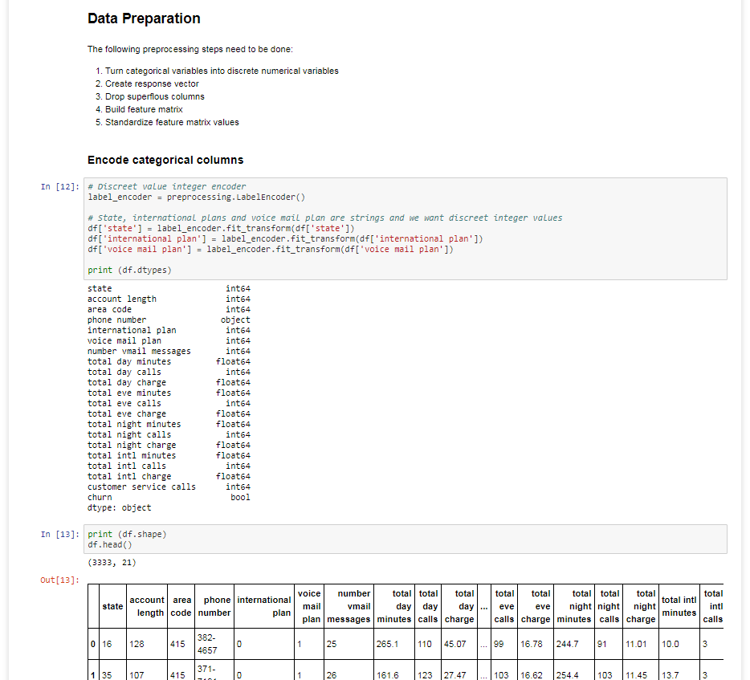

### Modeling and evaluation

In the modeling phase, various modeling techniques are selected and applied and their parameters are calibrated to achieve an optimal prediction. Typically, there are several techniques that can be applied, and some techniques have specific requirements on the form of the data. Therefore, going back to the data preparation phase is often necessary. However, in the model evaluation phase, the goal is to build a model that has high quality from a data analysis perspective. Before proceeding to final deployment of the model, it's important to thoroughly evaluate it and review the steps that are executed to create it to be certain that the model properly achieves the business objectives.

In the Jupyter Notebook, this involved splitting the data set into training and testing data sets (using stratified cross-validation) and then training several models using distinct classification algorithms such as `GradientBoostingClassifier`, support vector machines, random forest, and K-Nearest Neighbors.

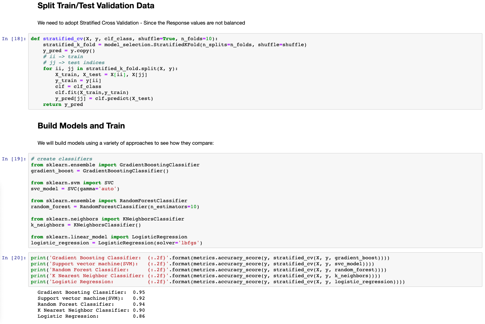

Following this step, we continue with printing the confusion matrix for each algorithm to get a more in-depth view of the accuracy and precision offered by the models.


### Deploying your model to Watson Machine Learning

In the last section of the notebook, we save and deploy the model to the Watson Machine Learning service.

In a previous step, you created an API key that we will use to connect to the Watson Machine Learning service. Copy in your API key and location to authorize use of the Watson Machine Learning service.

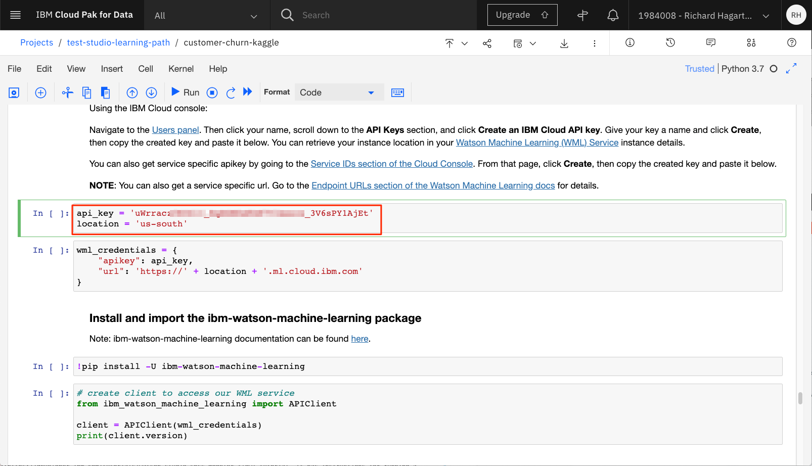

To deploy the model, we must define a deployment space to use. Copy your **Deployment Space ID** that you previously created.


After the model is saved and deployed to Watson Machine Learning, we can access it in a number of ways.

In the Jupyter Notebook, we can pass data to the model scoring endpoint to test it.


If we go back to the Watson Studio console, we can see in the **Assets** tab of the **Deployment Space** that the new model is listed in the **Models** section.


If we click on the **Deployments** tab, we can see that the model has been successfully deployed.

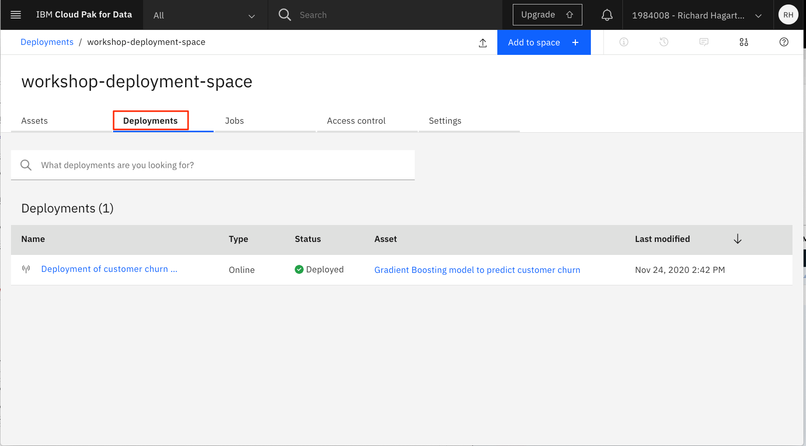

Click on the deployment to get more details. If you click the **API reference** tab, you will see the scoring endpoint. In the **Code Snippets** section, you can see examples of how to access the scoring endpoint programmatically.


On the **Test** tab, we can pass in a scoring payload JSON object to score the model (similar to what we did in the notebook). After supplying the data, press **Predict** to score the model.

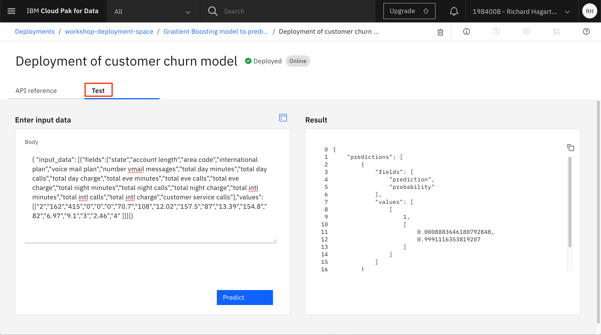

Here are the values entered into the input data body:

```json
{ "input_data": [{"fields":["state","account length","area code","international plan","voice mail plan","number vmail messages","total day minutes","total day calls","total day charge","total eve minutes","total eve calls","total eve charge","total night minutes","total night calls","total night charge","total intl minutes","total intl calls","total intl charge","customer service calls"],"values":[["2","162","415","0","0","0","70.7","108","12.02","157.5","87","13.39","154.8","82","6.97","9.1","3","2.46","4" ]]}]}
```

### **SPSS model notebook**

Now that you have learned how to create and run a Jupyter Notebook in Watson Studio, you can revisit the `Scoring machine learning models using the API` section in the [SPSS Modeler Flow](/tutorials/watson-studio-spss-modeler-flow/) tutorial. It has instructions for running a notebook that accesses and scores your SPSS model that you deployed in Watson Studio.

## Conclusion

This tutorial covered the basics for running a Jupyter Notebook in Watson Studio, which includes:

* Creating a project
* Provisioning and assigning services to the project
* Adding assets such as data sets to the project
* Importing Jupyter Notebooks into the project
* Loading and running the notebook

The purpose of the notebook is to build a machine learning model to predict customer churn using a Jupyter Notebook. Other tutorials in this [learning path](/learningpaths/get-started-watson-studio/) discuss alternative, non-programmatic ways to accomplish the same objective, using tools and features built into Watson Studio.