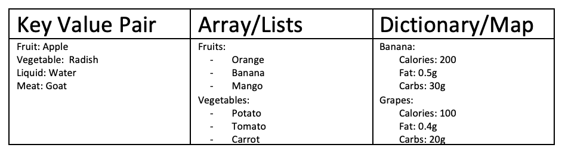

ソフトウェア開発をしばらくやっていると、特にKubernetesやコンテナを使っていると、YAMLファイルに遭遇することがあると思います。YAML &mdash; or, "Yet Another Markup Language" &mdash; は、設定に関するデータを指定するために使用されるテキストフォーマットです。このチュートリアルでは、YAML の構造と、YAML ファイルの書き方の基本を学びます。また、Kubernetesで使用されているYAMLファイルの例を紹介します。

## 目的

このチュートリアルでは、以下のことを学びます。

* YAML ファイルの定義
* 開発者がYAMLを使う理由
* YAML と JSON および XML との関係
* YAMLファイルの基本構造
* KubernetesでYAMLファイルを使用する方法

## 前提条件

このチュートリアルでは、XML や JSON など、データの保存や転送に使用される言語の基本をすでに知っていることを前提としています。

## YAMLファイルの定義

先に進む前に、YAML の定義を理解しておく必要があります。<a href="https://yaml.org/" target="_blank" rel="noopener noreferrer">yaml.org</a>によると、"YAMLは人間に優しい、すべてのプログラミング言語のためのデータシリアライズ規格です。" とあります。

YAMLは特に以下のような一般的なユースケースのために作られました。

* 設定ファイル
* ログファイル
* プロセス間のメッセージング
* 言語を超えたデータ共有
* オブジェクト・パーシスタンス
* 複雑なデータ構造

## なぜYAMLを使うべきなのか

YAML ファイルを使うことにはいくつかの利点があります。

1. 1. 人間が簡単に読むことができます。YAMLファイルは表現力と拡張性に優れています。
1. 実装と使用が容易である。
1. プログラム言語間の移植が容易である。
1. アジャイル言語のネイティブなデータ構造にマッチしている。
1. YAMLファイルは、汎用的なツールをサポートするための一貫したモデルを持っています。
1. ワンパス処理をサポートする。
1. コマンドラインにすべてのパラメータを追加する必要がないので、使い勝手がよい。
1. メンテナンスが可能です。ソースコントロールにYAMLファイルを追加することで、変更点を把握することができます。
1. 1.柔軟性があります。コマンドラインで使用するよりもはるかに複雑な構造をYAMLで作成できます。

## JSONやXMLとの関係

XMLは多くの領域で先駆的な存在です。XMLはもともと、構造化された文書をサポートするために設計されたSGML（Standard Generalized Markup Language）との下位互換性を目的として設計されました。そのため、XMLには多くの設計上の制約があります。

JSONの設計目標は、生成と解析を目的としたシンプルさと普遍性です。人間の読みやすさは低下していますが、そのデータはあらゆる最新のプログラミング環境で簡単に処理することができます。

YAMLの設計目標は人間の読みやすさと、より完全な情報モデルです。YAMLは生成と解析がより複雑であるため、JSONの自然なスーパーセットと見なすことができます。すべての JSON ファイルは有効な YAML ファイルでもあります。

つまり、追加機能が必要になったときに、JSONからYAMLへの移行が簡単にできるということです。YAMLはXMLから学んだ教訓の結果です。

## YAMLファイルの構造

以下は、YAMLファイルの構成要素です。

1. キー・バリュー・ペア &mdash; YAMLファイルの基本的な入力形式はキー・バリュー・ペアです。キーとコロンの後にスペースがあり、次に値があります。
1. 1.配列/リスト &mdash; リストはリストの名前の下にいくつかのアイテムが表示されます。リストの要素は `-` で始まります。リストの数は`n`にもなりますが、配列の各要素のインデントは非常に重要です。
1. Dictionary/Map &mdash; より複雑なタイプのYAMLファイルはDictionaryとMapです。

## YAMLファイルを書くときの一般的なガイドライン

YAMLファイルを書く際には、以下のガイドラインに注意してください。

### インデントとタブの重要性

"バナナ "についての詳細が書かれている次の図を考えてみましょう。属性は3つあります。

1. カロリー＝200
1. 脂質＝0.5g
1. 炭水化物＝30g

仮に余分なインデントやタブが使われていたとすると、下記のようにYAMLオブジェクトの意味が変わってしまいます。そのため、YAMLファイルではインデントやタブに注意する必要があります。

## YAMLの基本の重要な点

その他、YAMLファイルを作成する際に集中しなければならない点は以下の通りです。

* SCALAR &mdash; "YYYY-MM-DD "のフォーマットで`date`を記述し、それを`date`変数に代入することができます。
**** COLLECTIONS &mdash; 例えば、請求先の住所を記載し、配送先の住所が請求先の住所と同じだったとします。その場合、請求先住所の前に`&amp;`とIDをつけて使用します。*発送先にも同じ住所をコピーする必要がある場合には、請求先で使用したのと同じIDと一緒に`*`記号を使用します。これにより、データの冗長性を高めることができます。
* MULTI-LINE COLLECTIONS &mdash; 例えば、複数の行があるアドレスラインがあり、フォーマットを維持する必要があるとします。このような場合には `|` (バーティカルバー) シンボルを使用します。
* LISTS/DICTIONARIES &mdash; リストと辞書については前のセクションで説明しました。
* MULTI-LINE FORMATTING &mdash; 長い文字列の値があり、フォーマットを維持したまま複数行に渡って記述する必要がある場合には、前述のようにシンボル `>` を使用します。

## KubernetesにおけるYAMLの使い方

YAMLファイルの利点と基本的な構成要素を見てきましたが、KubernetesでYAMLがどのように使われているかを理解しましょう。Kubernetesのリソースは宣言的な方法で作成されるため、YAMLファイルが利用されています。ポッド、サービス、デプロイメントなどのKubernetesリソースは、YAMLファイルを利用して作成されます。

以下の例では、YAMLを使ったデプロイメントリソースの作成を説明しています。****この例には、基本的な仕様と高度な仕様が含まれていますので、ご注意ください。

ここでは、様々なフィールドについて簡単に説明します。

* `replicas` &mdash; デプロイ時に作成するポッドの数をKubernetesに伝えます。このフィールドを変更することで、コンテナ化されたアプリケーションを簡単にスケールすることができます。
* `spec.strategy.type` &mdash; デプロイする必要のあるアプリケーションに別のバージョンがあり、デプロイの段階で、障害を助長しないようにアップデートする必要があるとします。<a href="https://kubernetes.io/docs/tutorials/kubernetes-basics/update/update-intro/" target="_blank" rel="noopener noreferrer">ローリングアップデート戦略</a>により、Kubernetesはポッドを1つずつアップデートしていくことで、停止を助長することなくサービスをアップデートすることができます。
* `spec.strategy.rollingUpdate.maxUnavailable` &mdash; ローリングアップデート中に利用できなくなるポッドの最大数です。
* `spec.strategy.rollingUpdate.maxSurge` &mdash; 希望するポッドの数を超えてスケジューリングできる最大数です。
* `spec.minReadySeconds` &mdash; オプションのIntegerで、新しいポッドが利用可能とみなされるために、コンテナがクラッシュすることなく準備が完了するまでの最小秒数を記述します。
* `spec.revisionHistoryLimit` &mdash; オプションの整数属性で、Kuberneresが任意の時点で保持する古いReplicaSetsの数を明示的に指示するために使用できます。
* `spec.template.metadata.labels` &mdash; デプロイメント仕様にラベルを追加します。
* `spec.selector` &mdash; オプションのオブジェクトで、Kubernetesのデプロイメントコントローラーに対して、指定されたラベルにマッチするポッドのみをターゲットにするように指示します。したがって、「app」と「deployer」のラベルを持つポッドのみをターゲットにするには、デプロイメントYAMLに次のような修正を加えます。

様々なフィールドの説明から、YAMLファイルが宣言的な方法でKubernetesリソースを管理・制御するのに非常に役立つことがお分かりいただけると思います。

YAMLは設定ファイルのデファクトスタンダードと考えられるようになってきています。

## 次のステップ

[Kubernetes 101](/tutorials/kubernetes-101-lab/)のラボにアクセスして学習を続けることができます。