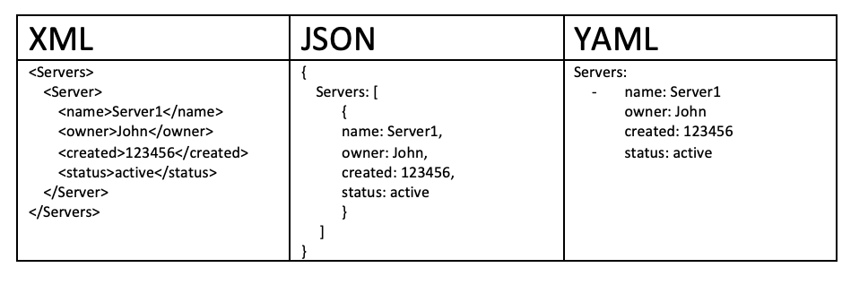
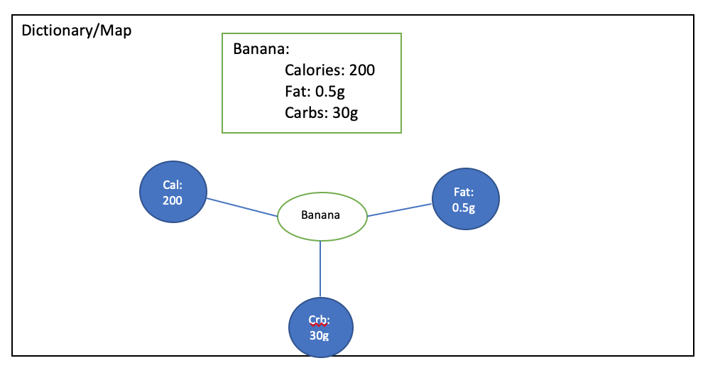
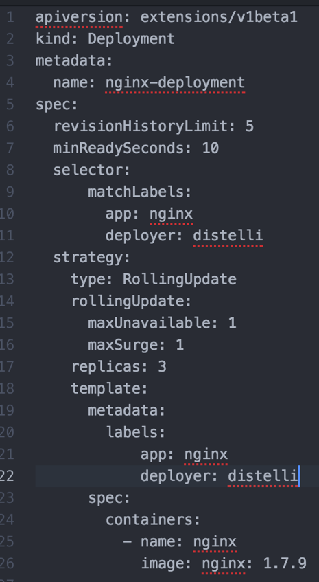

If you've been doing software development for a while, particularly with Kubernetes or containers, you've probably run into a YAML file. YAML &mdash; or, "Yet Another Markup Language" &mdash; is a text format used to specify data related to configuration. In this tutorial, you learn the structure of YAML and the basics of how to write a YAML file. You explore an example YAML file that's used in Kubernetes.

## Objectives

In this tutorial, you learn:

* The definition of a YAML file
* Why developers use YAML
* The relationship between YAML and JSON and XML
* The basic structure of a YAML file
* How to use a YAML file in Kubernetes

## Prerequisites

This tutorial assumes that you already know the basics of languages that are used for storing and transferring data, such as XML and JSON.

## Definition of a YAML file

Before going further, you need to understand the definition of YAML. According to <a href="https://yaml.org/" target="_blank" rel="noopener noreferrer">yaml.org</a>, "YAML is a human-friendly, data serialization standard for all programming languages."

YAML was created specifically for common use cases such as:

* Configuration files
* Log files
* Inter-process messaging
* Cross-language data sharing
* Object persistence
* Complex data structures

## Why you should use YAML

There are a few advantages to using YAML files:

1. They are easily readable by humans. YAML files are expressive and extensible.
1. They are easy to implement and use.
1. They are easily portable between programming languages.
1. They match the native data structures of agile languages.
1. YAML files have a consistent model to support generic tools.
1. They support one-pass processing.
1. They are convenient to use, so you no longer need to add all of your parameters to the command line.
1. You can perform maintenance. YAML files can be added to the source control to track the changes.
1. They are flexible. You can create much complex structures using YAML than you can use on command line

## Relationship to JSON and XML

XML is a pioneer in many domains. XML was originally designed to be backwards compatible with the Standard Generalized Markup Language (SGML), which was designed to support structured documentation. Because of this, there are many design constraints with XML.

JSON's design goal is simplicity and universality, with its goal to generate and parse. It has reduced human readability, but its data can be processed easily by every modern programming environment.

YAML's design goals are human readability and a more complete information model. YAML is more complex to generate and parse, therefore it can be viewed as a natural superset of JSON. Every JSON file is also a valid YAML file.

All this to say, it makes it easy to migrate from JSON to YAML if/when the additional features are required. YAML is the result of lessons learned from XML.

## The structure of a YAML file

The following are the building blocks of a YAML file:

1. Key Value Pair &mdash; The basic type of entry in a YAML file is of a key value pair. After the Key and colon there is a space and then the value.
1. Arrays/Lists &mdash; Lists would have a number of items listed under the name of the list. The elements of the list would start with a `-`. There can be a `n` of lists, however the indentation of various elements of the array matters a lot.
1. Dictionary/Map &mdash; A more complex type of YAML file would be a Dictionary and Map.

## General guidelines when writing YAML files

Keep in mind the following guidelines when you write a YAML file.

### The importance of indentation and tabs

Consider the following diagram, which has details about "Banana." There are 3 attributes:

1. Calories = 200
1. Fat = 0.5g
1. Carbs = 30g

Suppose there is an extra indentation or tabs used &mdash; then the whole meaning of the YAML object changes as you can see below. Hence the need for us to be careful with respect to indentation and tabs when it comes to your YAML files.

## Important aspects of YAML basics

Other aspects that you need to concentrate on when you create YAML files include:

* SCALAR &mdash; You can mention `date` in the format of "YYYY-MM-DD" and assign it to a `date` variable.
* COLLECTIONS &mdash; Suppose you mentioned the billing address and the shipping address is the same as the billing address. Then you make use of `&amp;` followed by an ID in front of the billing address. If you need to copy the same address against the shipping address, then you use the `*` symbol along with the same ID used in the billing address. This helps redundancy of the data.
* MULTI-LINE COLLECTIONS &mdash; Suppose you have an address line, which has multiple lines and need to maintain the format. Then use the `|` (vertical bar) symbol.
* LISTS/DICTIONARIES &mdash; Lists and dictionaries are covered in the previous section.
* MULTI-LINE FORMATTING &mdash; Suppose you have a long character string value and need to mention on multiple lines maintaining the formatting, then you make use of the symbol `>` as previously mentioned.

## YAML usage in Kubernetes

Having seen the advantages and basic building blocks of a YAML file, let's understand how YAML is used in Kubernetes. The Kubernetes resources are created in a declarative way, thus making use of YAML files. Kubernetes resources, such as pods, services, and deployments are created by using the YAML files.

The following example helps explain the creation of the deployment resource by using the YAML. **Note:** This example contains both basic and advanced specifications.

Here's a brief explanation of the various fields:

* `replicas` &mdash; Tells Kubernetes how many pods to create during a deployment. Modifying this field is an easy way to scale a containerized application.
* `spec.strategy.type` &mdash; Suppose there is another version of the application that needs to be deployed, and during the deployment phase, you need to update without facilitating an outage. The <a href="https://kubernetes.io/docs/tutorials/kubernetes-basics/update/update-intro/" target="_blank" rel="noopener noreferrer">Rolling Update strategy</a> allows Kubernetes to update a service without facilitating an outage by proceeding to update pods one at a time.
* `spec.strategy.rollingUpdate.maxUnavailable` &mdash; The maximum number of pods that can be unavailable during the Rolling update.
* `spec.strategy.rollingUpdate.maxSurge` &mdash; The maximum number of pods that can be scheduled above the desired number of pods.
* `spec.minReadySeconds` &mdash; An optional Integer that describes the minimum number of seconds, for which a new pod should be ready without any of its containers crashing for it to be considered available.
* `spec.revisionHistoryLimit` &mdash; An optional integer attribute that you can use to tell Kuberneres explicitly how many old ReplicaSets to retain at any given time.
* `spec.template.metadata.labels` &mdash; Adds labels to a deployment specification.
* `spec.selector` &mdash; An optional object that tells the Kubernetes deployment controller to only target pods that match the specified labels. Thus, to only target pods with the labels of "app" and "deployer", you can make the following modification to our deployment YAML.

You can see from the explanation of the various fields that YAML files can really help you maintain and control Kubernetes resources in a declarative way.

YAML is on its way to being considered a de facto standard for configuration files.

## Next steps

You can continue your learning by visiting the [Kubernetes 101](/tutorials/kubernetes-101-labs/) labs.