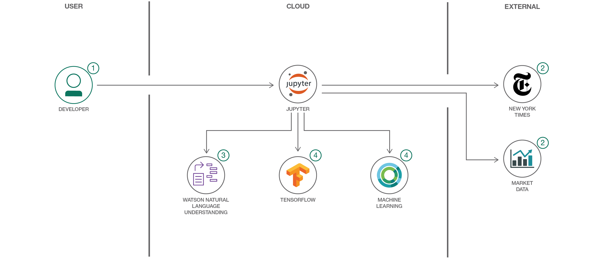

# 機械学習アルゴリズムのトレーニングを高速化する

### IBM PowerAI 上で Google TensorFlow を使用して、機械学習アルゴリズムを迅速にトレーニングする

English version: https://developer.ibm.com/patterns/accelerate-training-of-machine-learning-algorithms

ソースコード: https://github.com/IBM/powerai-market-sentiment

###### 最新の英語版コンテンツは上記URLを参照してください。
last_updated: 2017-05-16

 ## 概要

このコード・パターンでは、Nimbix による PowerAI 仮想化ソフトウェアを使用して迅速に機械学習アルゴリズムをトレーニングする方法を開発者向けに説明します。NVIDIA GPU と CUDA 並列コンピューティング・プラットフォームを使用して教師なし機械学習の繰り返し処理を実行すると、Power 以外のアーキテクチャーよりも処理を高速化できるようになります。

## 説明

このコード・パターンは、機械学習のスピードアップを目指すあらゆる開発者を対象に、IBM の新しい機械学習向けプラットフォーム、PowerAI を利用する方法を説明します。IBM Power8&reg; システム上で時系列データの機械学習を行う例を紹介するために、Jupyter Notebook を使用します。このノートブックでフォーカスするのは、再生可能エネルギー分野における将来の金融市場価格の予測可能性を評価することです。そのために、関連する市場と、*The New York Times* のニュース記事内から検出されたセンチメントを調べます。

このコード・パターンをひととおり完了すると、以下の方法がわかるようになります。

* 各種の外部リソースから構造化データを抽出してフォーマット化する
* 非構造化データを抽出してフォーマット化し、IBM Watson&trade; のコグニティブ・サービスを利用してデータのセンチメントを分析する
* ニューラル・ネットワークを作成してトレーニングする
* Jupyter Notebook 内で結果を表示して共有する

このコード・パターンは、強力な深層学習アプリケーションを効率的に作成して機械学習を加速化させるというニーズを持つ開発者に役立つはずです。また、データ・サイエンスの経験が限られている開発者にも理想的な学習機会になります。

## フロー

1. 開発者が、用意されているノートブックをロードします。このノートブックは PowerAI システム上で稼働します。
2. 実行中のノートブックは *The New York Times* からのデータと市場データを使用します。
3. ノートブックが IBM Watson Natural Language Understanding サービスを利用してテキストを分析します。
4. ノートブックが TensorFlow と機械学習を使用してモデルを発展させ、予測を立てます。
