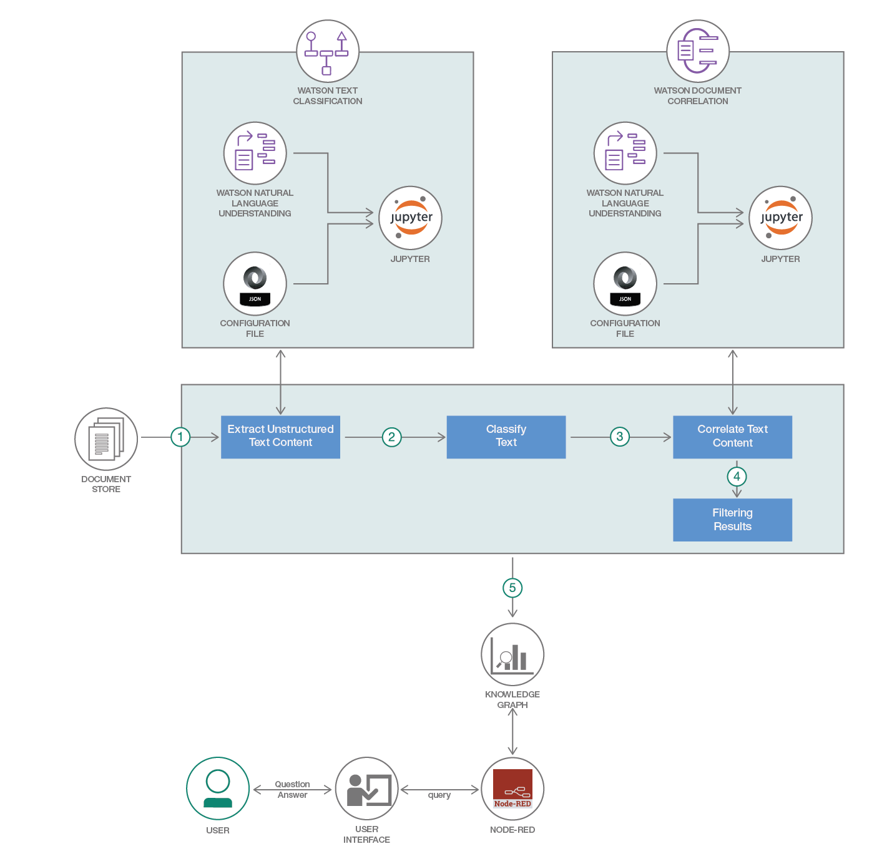

# ナレッジ・ベースでドキュメントをクエリーする
### Watson NLU、Python NLTK、IBM Watson Studio を利用して、ビジネス領域に固有のドキュメントに関する質問をナレッジ・ベースでクエリーし、必要な答えを得る

Engish version: https://developer.ibm.com/patterns/algorithm-that-gives-you-answer-to-any-particular-question-based-on-mining-documents/

ソースコード: https://github.com/IBM/query-knowledge-base-with-domain-specific-documents/
###### 最新の英語版コンテンツは上記URLを参照してください。

authors: Neha Setia, Vishal Chahal, Manjula Hosurmath, Shikha Maheshwari

last_updated: 2018-09-17

[YouTube動画](https://www.youtube.com/watch?v=qMUDB7k8x3I) 

他のパターンと合わせての利用を想定しています。

* [Watson のテキスト分類を拡張する](https://github.com/IBM/japan-technology/blob/main/Code-Patterns/extend-watson-text-classification/)
* [さまざまなソースからのドキュメントを互いに関連付ける](https://github.com/IBM/japan-technology/blob/main/Code-Patterns/watson-document-correlation/)
* [ドキュメントを基にナレッジ・グラフを作成する](https://github.com/IBM/japan-technology/blob/main/Code-Patterns/build-a-domain-specific-knowledge-graph-from-given-set-of-documents)
* ナレッジ・ベースでドキュメントをクエリーする (このパターン)

## 概要

非構造化データの管理は、IT 業界においてまだ解決されていない大きな問題の 1 つとして認識されています。構造化データをビジネス・インテリジェンスと実用的情報に変換するのに非常に役立つことが実証されているツールや手法でも、非構造化データに関してはそれほど役に立ちません。このコード・パターンで、ドキュメント固有の質問についてナレッジ・ベースをクエリーし、必要な答えを得る方法を紹介します。

## 説明

このコード・パターンは、前回のコード・パターン「[ドキュメントからナレッジ・グラフを生成する](https://developer.ibm.com/patterns/build-a-domain-specific-knowledge-graph-from-given-set-of-documents)」の続編です。前回のコード・パターンでは、ファクトを検出するという要件を基に、領域固有のドキュメントを使用してナレッジ・グラフを作成しました。このパターンでは前回作成したナレッジ・ベースを使用して、ドキュメント固有の質問をクエリーし、必要な答えを取得します。Watson Studio、Watson NLU、Node-RED を利用して、ドキュメント関連の質問に対する答えを必要とする人々にソリューションを提供します。

## フロー

1. 非構造化データを、エンティティー、関係、エンティティーからなる 3 タプルに取り込みます。
1. 取得したエンティティーと関係を基に、ナレッジ・グラフが作成されます。
1. ユーザーが UI を使用して質問を入力します。
1. ユーザーからの質問が、UI とノートブックを統合する Node-RED を介してノートブックに送信されます。
1. 質問のクエリーが実行されて、適切な応答が返されます。
1. ユーザーが UI 上に表示された質問に対する答えを確認します。

## 手順

このパターンの詳細な手順については、[README](https://github.com/IBM/query-knowledge-base-with-domain-specific-documents/blob/master/README.md) を参照してください。手順の概要は以下のとおりです。

1. Watson Studio に登録します。
1. IBM Cloud サービス・インスタンスを作成します。
1. Node-RED フローをインポートします。
1. WebSocket URL をメモします。
1. WebSocket URL を更新します。
1. ノートブック内で WebSocket URL を更新します。
1. ユーザー・インターフェースにアクセスします。
1. ノートブックをセットアップします。

###### References
services:
  - cloud-object-storage
  - natural-language-understanding
  - watson-studio
tags:
  - data-science
  - object-storage
  - python

meta_keywords: "Watson Natural Language Understanding, Knowledge base, Python NLTK, Watson Studio"
primary_tag: artificial-intelligence
type: composite

related_content:
  - [Watson のテキスト分類を拡張する](https://github.com/IBM/japan-technology/blob/main/Code-Patterns/extend-watson-text-classification)
  - [さまざまなソースからのドキュメントを互いに関連付ける](https://github.com/IBM/japan-technology/blob/main/Code-Patterns/watson-document-correlation)
  - [ドキュメントを基にナレッジ・グラフを作成する](https://github.com/IBM/japan-technology/blob/main/Code-Patterns/build-a-domain-specific-knowledge-graph-from-given-set-of-document)

---
