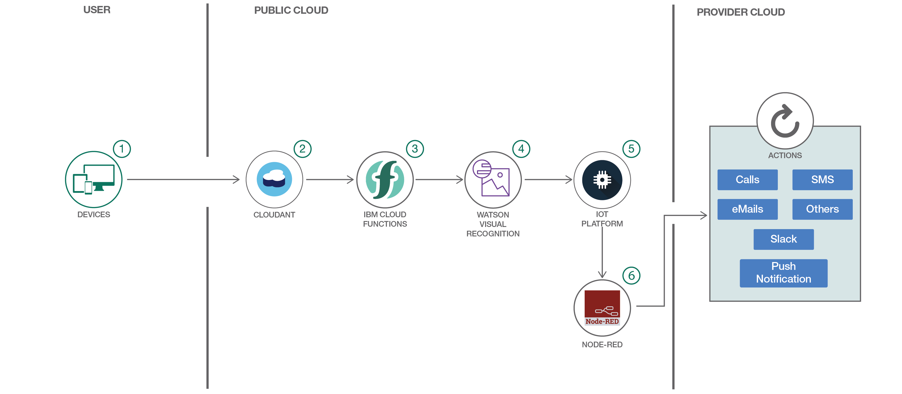

# 画像を分析してステータス・アラートを送信する
### サーバーレスと視覚認識を使用して画像を分析し、アラート通知を送信する IoT アプリを構築する

ソースコード: https://github.com/IBM/image-analysis-iot-alert (参照目的のみでメンテナンスは行われません)
###### ご注意:このパターンは英語版において非公開となりました。参考として日本語訳を残しておきます。

authors: Hovig Ohannessian

last_updated: 2019-05-21
retired_date: 2021-01-08

[YouTube動画](https://www.youtube.com/watch?v=BarTh-A2r1A) 

## 概要

産業およびハイテク業界のメンテナンス会社では、通常、現場の写真を撮って潜在的な危険や緊急事態の有無を確認し、問題が見つかった場合はそれに対処できる適切な担当者に通知します。このコード・パターンでは、対処する必要のある危険が存在するかどうかを知らせるために、画像を IBM Cloudant&reg; データベースにロードして分析し、その結果に基づいてアラートをトリガーするアプリを構築します。

## 説明

事業会社やメンテナンス会社では、現場で何が起こっているのか現状を把握する必要があります。漏電、火災、故障は会社にとって、従業員を危険な状況にさらす結果、あるいはダウンタイム、広報活動の妨げ、金銭的損失という結果を招きかねない、大惨事の兆候かもしれません。

このような会社はこれまで率先して、故障をモニターする対象の現場や機器の画像を送信するためにリモート・デバイス (電話、搭載カメラ、ドローン) を使用してきましたが、そのような画像を自動的に分析し、対処が必要な場所や潜在的に危険な状況に関するアラートを送信することはできないでしょうか？

画像に依存する会社で開発者として働いているとしたら、画像を送信して自動的に分析し、アラートを送信するアプリケーションを構築するのは不可能なことではありません。このコード・パターンでは、まず IBM Cloud Functions を利用して画像を分析し、その結果を Watson&trade; IoT Platform に送信します。Watson IoT Platform で画像にスコアを割り当てた後、そのスコアを評価して、必要に応じてアラートをトリガーし、利用可能な最善の通信チャネル (例えば、e-メール、テキスト、プッシュ通知など) を通じて担当者に報告します。

このアプリケーションをスタンドアロンのアプリケーションとして開発すれば、スマート・デバイス内から操作できるように簡単に更新または変更できます。あるいは別の方法として、ラップトップまたはスマートフォン上のブラウザー上でアプリケーションを実行することも可能です。

このパターンの使用ケースでは、火災の検出を目的に、画像を送信して処理する方法を説明します (この同じアプリを、メンテナンスを促すアラートや他の緊急事態を知らせるアラートの検出に使用することもできます)。Watson Visual Recognition サービスによって火災が識別されると、Node-RED アプリが該当する担当者に通知します。

このプロセスを設計するには、さまざまな方法があります。また、このパターンに変更を加えて実際の使用ケースに応じて拡張し、アラートの受信者を変更したり、アラート通知に使用する指定のチャネルを追加したりすることもできます。

作成するアプリは、以下のフローに基づいています。

* アプリケーションがデバイスから画像を取得するか、ローカルの画像フォルダーから IBM Cloudant NoSQL データベースに画像をアップロードします。
* Cloudant データベースはバイナリー・データを受信すると、IBM Cloud Functions 上でアクションをトリガーします。
* IBM Cloud Functions Composer が Visual Recognition 分析を実行し、分析結果として JSON フォーマットのレスポンスを受け取ります。
* レスポンスは IoT Platform に送信されて、分析された画像の受信デバイスとして登録されます。
* 続いて Node-RED フローが IoT Platform プラットフォーム上のデバイスからイベントを読み取り、画像のフィーチャーに応じてアラートをトリガーします。以下はアラートの一例です。

  ```
  iot-2/type/Device/id/motor1/evt/eventData/fmt/json
  ```

        image: fire
        score: 0.679
        alert: EMERGENCY ALERT!
        time: Tue Oct 24 2017 01:20:49 GMT+0000 (UTC)


## フロー



1. viz-send-image-app フォルダーは、ローカルで実行することも、クラウドにプッシュすることもできます。このフォルダーに含まれているアプリ UI を使用して、画像を Cloudant データベースにアップロードできます。
1. Cloudant サービスを含む Node-RED パッケージを作成します。
1. IBM Cloud Catalog から IBM Functions を作成します。Cloudant、IoT Platform、および Visual Recognition の各資格情報を、credentials.cfg ファイル (viz-openwhisk-functions 内) と credentials.json ファイル (viz-send-image-app 内) に貼り付けます。
1. IBM Cloud Catalog から Watson Visual Recognition サービスを作成します。
1. Watson IoT Platform を作成して Node-RED パッケージにバインドします。
1. json フローを Node-RED エディターに貼り付けます。Node-RED 内の ibmiot ノードに、Watson IoT Platform からの正しい情報が設定されていることを確認します。

## 手順

Ready to put this code pattern to use? Complete details on how to get started running and using this application are in the [README](https://github.com/IBM/image-analysis-iot-alert/blob/master/README.md).

###### References
primary_tag: "serverless"
tags:
 - "node-js"
 - "paas"
 - "cloud"
 - "serverless"

services:
  - "visual-recognition"
  - "internet-of-things-platform"
  - "cloudant"
  - "decision-author-for-nodered"

components:
  - "cloud-foundry"
  - "watson-visual-recognition"
runtimes:
  - "community-buildpacks"


