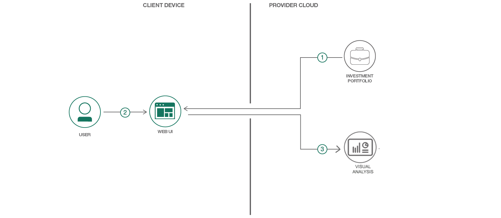

# 責任のある投資を確実にするための視覚化を作成する"

### 資する根拠を裏付けるデータに、投資家がアクセスできるようにする

Engish version: https://developer.ibm.com/patterns/analyze-an-investment-portfolio/

ソースコード: https://github.com/IBM/Analyze-Investment-Portfolio
###### 最新の英語版コンテンツは上記URLを参照してください。

authors: Rob Seidman, Raheel Zubairy, Alexandra Zwicker

last_updated: 2019-05-01

## 概要

個人がお金を投資する場合 (退職後の蓄えを含め)、投資の行方は難解なブラック・ボックスの中へと消えていきがちです。投資信託や IRA、そして同様の投資から大きな金銭的リターンがもたらされたとしても、投資家は自分の投資が経済や社会にどのように役立っているか、予想もつかないことは珍しくありません。自分が所有する債権について、より明確に理解できるとしたら (例えば、社会に対する債権の貢献度、債権が支援している産業や国、主要なベンチマークを基準とした相対パフォーマンスなど)、世界をより良くするという大義を支援するために投資を調整することができます。このコード・パターンでは、投資に関する重要な洞察を提供する視覚化の作成方法を説明することで、皆さんが自分の個人的な価値観を反映してポートフォリオを設計できるよう支援します。

## 説明

このコード・パターンでは、投資ポートフォリオの分析手法と、分析結果を視覚化する方法を紹介します。ここでは、ユーザーのポートフォリオ内で保持されている実際の債権 (仕組み商品と上場投資信託を含む) を収集し、収集したデータを Web インターフェースを介して提示する方法を説明します。Web インターフェースには、資産クラス別、地理別、業種別に編成されたポートフォリオだけでなく、個々の企業自体の情報も表示します。Web インターフェースにはさらに視覚化を組み込み、環境スコア、社会スコア、ガバナンス・スコアにより、潜在的問題がある投資を明らかにし、投資家が自分のポートフォリオがどれだけの社会的責任を担っているのか確認できるようにします。

このパターンを完了すると、以下の方法がわかるようになります。

* [Investment Portfolio](https://cloud.ibm.com/docs/services/InvestmentPortfolio/index.html) サービスとの間でデータをロード、取得する
* 複合投資が含まれる可能性のあるポートフォリオに関連付けられた、すべてのエクスポージャーを計算する
* 分析結果を 3D グラフで表示するユーザー・インターフェースを作成する

## フロー

1. ユーザーが分析対象のポートフォリオをアップロードします。
1. ユーザーが分析対象のポートフォリオを選択します。
1. このコード・パターンでは、ユーザーのポートフォリオをクエリーして、そのポートフォリオ内に含まれる基金に関する情報を調べ、チャートとグラフで視覚的にデータを表示するために必要なすべてのアナリティクスを計算します。

## 手順

このパターンの詳細な手順については、[README](https://github.com/IBM/Analyze-Investment-Portfolio/blob/master/README.md) を参照してください。手順の概要は以下のとおりです。

* IBM Cloud にデプロイします。
* ローカルでアプリケーションを実行します。
* トラブルシューティングします。

###### References
related_links:
  - [Getting started with Investment Portfolio](https://cloud.ibm.com/docs/services/InvestmentPortfolio/index.html#getting_started_investportshort)
  - [IBM Cloud for Financial Services](https://cloud.ibm.com/developer/finance/dashboard)

related_content:
  - https://developer.ibm.com/patterns/fintech-create-a-chatbot-for-real-time-payment
  - https://developer.ibm.com/patterns/retrieve-client-insights-for-wealth-management-companies

primary_tag: "finance"

tags:
  - "analytics"
  - "cloud"