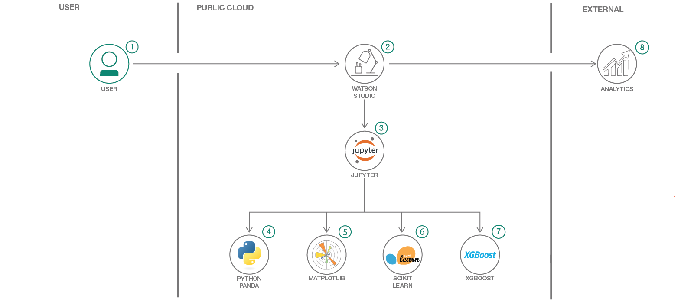

# XGBoost を使用して銀行マーケティング・データを分析し、顧客による購入について洞察を得る
### XGBoost と scikit-learn による機械学習を使用して、銀行の顧客が CD を購入するかどうかを予測する

Engish version: https://developer.ibm.com/patterns/analyze-bank-marketing-data-using-xgboost-gain-insights-client-purchases/

ソースコード: https://github.com/IBM/xgboost-financial-predictions
###### 最新の英語版コンテンツは上記URLを参照してください。

authors: Alok Singh, Rich Hagarty

last_updated: 2018-06-01

## 概要

データ・サイエンスにおいて、クラス不均衡 (あるクラスのデータ (ポジティブ) の合計数が別のクラスのデータ (ネガティブ) より遥かに少ないこと) はよくある問題です。データ・サイエンティストはこの問題を解決して、パフォーマンスに優れた分類子を作成しなければなりません。このコード・パターンでは、IBM Watson™ Studio 内で XGBoost、scikit-learn、Python と極めて不均衡なデータ・セットを使用して、顧客が銀行から譲渡性預金証書 (CD) を購入するかどうかを予測します。

## 説明

データ・サイエンスにおいて、クラス不均衡 (ポジティブ・サンプルの数がネガティブ・サンプルより遥かに少ないこと) はよくある問題です。典型的な機械学習アルゴリズムは、各クラスのインスタンス数がおよそ等しい場合に最も有効に機能します。あるクラスのインスタンス数が他のクラスのインスタンス数を大幅に上回っていると、問題が発生しがちです。XGBoost (Extreme Gradient Boosting Decision Tree) は、機械学習の分類モデルや回帰モデルを作成するのによく使われているツールですが、不均衡データ・セットを正確に分類するモデルを作成するには何らかの調整が必要になります。

このコード・パターンでは、XGBoost を使用して機械学習による分類を行う方法を説明します。通常、XGBoost を使用した機械学習には、ロジスティック回帰や他の手法よりも分類のほうが好ましい選択肢となります。使用するデータ・セットは、極めて不均衡な実際のデータ・セットです。このデータ・セットの場合、銀行にはかなりの数の顧客がいるのに対し、実際に CD を購入する顧客の数はわずかであることから、データ不均衡が生じています。

このコード・パターンを完了した時点で、以下の概念上の手順に取り組んだことになります。

* データ・セットについて記述する
* 予備分析によってデータを理解する
* 事前処理手法により、データを整理して準備する
* Naive XGBoost によって分類を行う
  * 相互検証によってモデルを取得する
  * 精度再現率曲線および ROC 曲線を描画する
* 分類子を調整し、重み付きポジティブ・サンプルを使用して分類のパフォーマンスを向上させる
* 多数派のクラスをオーバーサンプリングして少数派のクラスを理解する
* SMOTE アルゴリズムを使用する

## フロー

1. IBM Watson Studio にログインします。
1. データをデータ・アセットとして Watson Studio にアップロードします。
1. Watson Studio 内でノートブックを起動し、作成したデータ・アセットを入力します。
1. Pandas を使用して、データ・ファイルをデータフレームに読み込み、初期のデータ探索を行います。
1. Matplotlib とその上位にあるパッケージ Seaborn を使用して、各種の視覚化を作成します。
1. scikit-learn を使用して ML パイプラインを作成し、そのパイプラインを使って XGBoost にフィードするデータを準備します。
1. XGBoost を使用して ML モデルを作成し、トレーニングします。
1. ML モデルの予測パフォーマンスを評価します。

## 手順

このパターンの詳細な手順については、[README](https://github.com/IBM/xgboost-financial-predictions#predicting-bank-clients-cerificate-of-deposit-purchase-using-scikit-learn-and-xgboost-for-imbalance-dataset) を参照してください。手順の概要は以下のとおりです。

1. Watson Studio に登録します。
1. 新しい Watson Studio プロジェクトを作成します。
1. IBM Blockchain サービス・インスタンスを作成します。
1. ノートブックを作成します。
1. データをアップロードします。
1. ノートブックを実行します。
1. 結果を保存して共有します。

###### References
related_links:
  - [Handle imbalanced data sets with XGBoost, scikit-learn, and Python in IBM Watson Studio]("https://developer.ibm.com/code/2018/06/20/handle-imbalanced-data-sets-xgboost-scikit-learn-python-ibm-watson-studio") 
    このコード・パターンについて詳しく説明している記事です。

  - [pandas]("https://pandas.pydata.org/")
    pandas は、Python プログラミング言語向けにハイパフォーマンスで使いやすいデータ構造とデータ分析ツールを提供する、オープンソースのライブラリーです。

  - [UCI 機械学習リポジトリー]("https://archive.ics.uci.edu/ml/datasets/Bank+Marketing")
    このコード・パターンで使用している銀行マーケティング・データの詳細を調べてください。

  - [scikit-learn])(https://scikit-learn.org/stable/)
    scikit-learn は、データ・マイニングとデータ分析に使用できる単純かつ効率的なツールを提供します。

  - [XGBoost](https://github.com/dmlc/xgboost)
    XGBoost はスケーラブルで移植可能な分散型勾配ブースティング (GBDT、GBRT、または GBM) ライブラリーです。このライブラリーは、Python、R、Java、Scala、C++ をはじめ、多数の言語をサポートしています。

  - [Matplotlib](https://matplotlib.org/)
    Matplotlib は、出版にも対応できる高品質の図を生成する Python 2D グラフ作成ライブラリーです。

  - [seaborn](https://seaborn.pydata.org)
    seaborn は、Matplotlib ベースの Python 視覚化ライブラリーです。魅力的な統計グラフを描画できる高レベルのイニターフェースを提供します。

primary_tag: "machine-learning"

tags:
 - "machine-learning"
 - "artificial-intelligence"
 - "data-science"
 - "deep-learning"

services:
  - "watson-studio"
components:
  - "jupyter"
