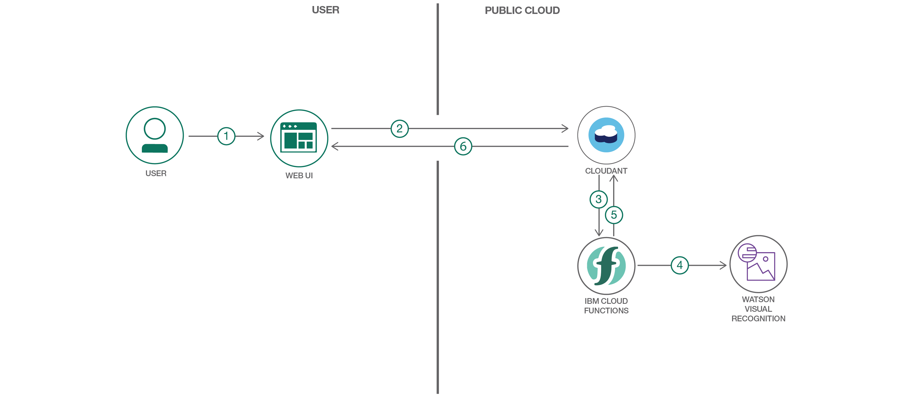

## 概要

産業機器の検査には時間がかかるものです。特に、広範囲にわたって機器が分散する石油・ガス産業、輸送業 (道路および鉄道)、建設業、農業などの産業では、検査に何時間も、あるいは何週間も時間がかかることがあります。

このコード・パターンでは、産業機器の検査を自動化するために、機器の画像を使用して注意を要する機器を特定する方法をデモンストレーションします。こうすれば、担当者に該当する機器を知らせて、通常の機器標準を満たすよう修理できるようになります。特定の欠陥を識別したり、画像が通常の条件を満たしているかどうかを特定したりするには、Watson&trade; Visual Recognition サービスを利用できます。また、IBM Cloud Functions を利用すれば、画像が Cloudant&reg; に追加された時点で画像の分析をトリガーできます。

## 説明

このコード・パターンでは、画像の目視検査に機械学習の分類手法を適用して、産業機器のさまざまな欠陥をチェックします。石油やガスのパイプラインの検査を目的に、Watson Visual Recognition を使用して、画像をトレーニング済み分類子に照らし合わせて分析します。検査で使用する識別子は、Normal (正常)、Burst (裂傷)、Corrosion (腐食)、Damaged Coating (コーティング損傷)、Joint Failure (継手故障)、Leak (漏れ) の 6 つです。欠陥識別子のいずれか、または Normal 識別子と画像がどれだけ一致するかに応じて、画像ごとに一致率が返されます。このデータを使用すれば、早急に対処する必要があるパイプラインとそうでないパイプラインを表示するダッシュボードを作成できます。これらの画像データを保管するためには、Cloudant データベースを使用します。

このコード・パターンでは、画像が Cloudant データベースに追加された時点で、IBM Cloud Functions にマイクロサービスをトリガーさせる方法をデモンストレーションします。このマイクロサービスによって、視覚認識分析を行い、分析したデータで Cloudant データベースを更新します。

このコード・パターンでは、以下の方法を説明します。

* Watson Visual Recognition をトレーニングして画像を分類できるようにする
* 画像データを保管および取得するように Cloudant データベースを構成する
* Visual Recognition 分析をトリガーして分析結果を Cloudant データベース内に保管するように IBM Cloud Functions をセットアップする
* Web アプリを起動して視覚認識分析のダッシュボードを表示し、IBM Cloud サービスにデプロイする

## フロー

1. ユーザーが Web UI を使用して画像をアップロードします。
2. アップロードされた画像データが Cloudant データベースに送信されます。
3. 画像がデータベースに挿入されると、Cloud Functions がマイクロサービスをトリガーします。
4. マイクロサービスがトレーニング済み Watson Visual Recognition サービスを使用して画像を分析します。
5. 分析されたデータが Cloudant データベースに返されます。
6. Web UI 上のダッシュボードに、視覚認識分析結果および注意を要する画像が表示されます。

## 手順

このコード・パターンに取り組む準備はできましたか？アプリケーションを起動して使用する方法について詳しくは、[README](https://github.com/IBM/Predictive-Industrial-Visual-Analysis/blob/master/README.md) ファイルを参照してください。
