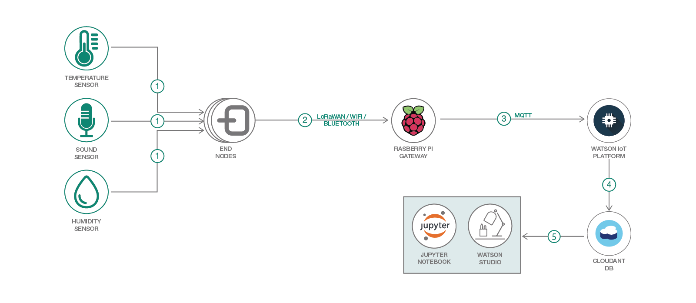

# LoRaWAN ネットワーキングを使用した長距離対応 IoT システムから収集した大規模なデータ・セットを分析する
### Watson Studio と Python データ・サイエンス・パッケージを使用して傾向の特定と予測を行う

Engish version: https://developer.ibm.com/patterns/analyze-large-data-sets-iot-lorawan/

ソースコード: https://github.com/IBM/smart-city-analytics
###### 最新の英語版コンテンツは上記URLを参照してください。

authors: Kalonji Bankole

last_updated: 2018-11-28

## 概要

このコード・パターンでは、EPA で提供している大気質に関する大規模なデータ・セットを分析します。この「スマート・シティー」と見なすことのできる使用ケースにより、Watson Studio と Python データ・サイエンス・パッケージを使用して大規模なデータ・セットを分析する方法を説明します。Jupyter ノートブックに用意された数種類の例で、オープンソースのソフトウェア・パッケージを利用してデータ・セットを分析する方法を学んでください。

## 説明

このパターンには構造化データ・セットが必要です。構造化データ・セットを生成するには、さまざまな方法があります。その 1 つは、このパターンに関連する「[LoRaWAN ネットワークを使用した長距離対応 IoT システムのハードウェア・プラットフォームをセットアップする](https://github.com/IBM/japan-technology/tree/main/Code-Patternsset-up-lorawan-iot-gateway-hardware/)」というタイトルのパターンに従って、長距離対応のネットワークをデプロイし、そのネットワークを介してセンサー・データを収集することです。

ここでは代わりの方法として、EPA によって生成されたデータ・セットを使用します。EPA では米国の各地で汚染物質レベルを測定しています。測定は年間を通して 1 時間ごとに行われるので、このデータ・セットでは時系列分析を利用できます。

このコード・パターンを完了すると、以下の方法がわかるようになります。

* IBM Watson Studio 内で Juypter ノートブックを作成する
* 重要ではないデータを削除してデータ・セットをクリーンアップする
* pandas (Python Data Analysis Library) を使用してデータ・セット内からパターンを検出する
* 全体的なデータの傾向を視覚化する「matplotlib」ライブラリーを使用してグラフを作成する

## フロー

1. エンド・ノード・デバイスが現地のセンサー・データを収集します。
1. 収集されたデータがワイヤレス・プロトコルを介してゲートウェイに送信されます。
1. ゲートウェイから Watson IoT Platform にセンサー・データが転送されます。
1. Watson IoT Platform が受信したデータ・パケットを Cloudant 内に保管します。
1. Watson Studio が保管されたデータを Juypter ノートブックにインポートし、このノートブックを使用してデータを処理します。

## 手順

このパターンに取り組む準備はできましたか？Jupyter ノートブックによって行われる分析をはじめ、詳細な手順については [README](https://github.com/IBM/smart-city-analytics/blob/master/README.md) を参照してください。

###### References
primary_tag: "iot"

related_content:
  - https://developer.ibm.com/patterns/tracking-assets-visualizing-sensor-data-lorawan-iot
  - https://developer.ibm.com/patterns/set-up-lorawan-iot-gateway-hardware
  - https://developer.ibm.com/tutorials/iot-lpwan-lora-nodemcu-dhtsensors/

related_links:
  - [matplotlib](https://matplotlib.org/)
  - [Leaflet](https://leafletjs.com/)

services:
  - "cloudant"
  - "watson-studio"
  - "internet-of-things-platform"

tags:
  - "data-science"
