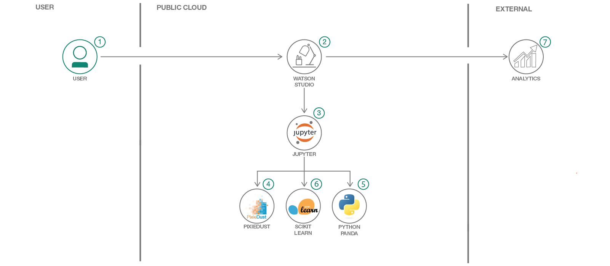

# 一般公開されている医療データセットを分析して洞察を引き出す
### Watson Studio と scikit-learn による機械学習を利用して、米国のオピオイド処方医師について予測する

Engish version: https://developer.ibm.com/patterns/analyze-open-medical-data-sets-to-gain-insights/

ソースコード: https://github.com/IBM/predict-opioid-prescribers/
###### 最新の英語版コンテンツは上記URLを参照してください。

authors: Madison Myers

last_updated: 2019-03-28

## 概要

世界中に健康問題が溢れかえる中、さまざまな健康問題のデータを抽出してそこから意味を引き出そうと目指しているデータ・サイエンティストの目の前にはデータの金鉱があります。そのようなデータの金鉱の 1 つとして、このコード・パターンではオピオイドの過剰摂取による死亡に関する調査データ・セットを探索します。パターンに沿って、データを Watson Studio&trade; ノートブック内で探索する方法、初期の探索結果のいくつかを視覚化する方法、そして scikit-learn を使用してさまざまなモデルをトレーニングする方法と、どのモデルがオピオイドの処方について最も正確に予測したかを評価する方法を学んでください。

## 説明

米国では、オピオイドの過剰摂取が非常に深刻な問題になってきています。データ・サイエンティストが独力でこの問題を解決できるわけではありませんが、データを調べて、この問題の現状と特定の結果を招いている要因を特定することはできます。

このコード・パターンでは、オピオイドの過剰摂取による死亡や処方者のタイプ、処方などの値が含まれた Kaggle データセットに基づき、scikit-learn と Python を (IBM Watson Studio 内で) 使用してオピオイド処方医師について予測する方法を説明します。具体的には、Watson Studio ノートブック内でデータを探索し、Pixie Dust を使用して初期の探索結果をさまざまな形で視覚化します。初期探索プロセスが完了した後は、scikit-learn を使用してさまざまなモデルをトレーニングし、どのモデルが最も正確にオピオイドの処方を予測したかを突き止めます。scikit-learn ライブラリーを使用すれば、いくつもの機械学習分類子に簡単にアクセスできます。しかも、これらの分類子を実装するために作成しなければならないコードは比較的わずかです。

このコード・パターンは、社会的正義の問題や健康問題に関心を持つデータ・サイエンティストやデータ愛好家、あるいは DSX と機械学習の入門者を対象に、データの探索方法、データのクリーニング方法、モデルのトレーニング方法、モデルの評価方法を説明することを目的に作成されています。

このコード・パターンをひと通り完了することで、以下の方法がわかるようになります。

* Watson Studio を使用する
* 複数のデータフレームを探索する
* 探索結果を視覚化する
* Python と pandas を使用してデータをクリーニングする
* ターゲット変数を予測する、さまざまな機械学習モデルを作成する
* モデルのパフォーマンスを評価する

## フロー

1. IBM Watson Studio サービスにログインします。
1. Watson Studio 内でデータをデータ・アセットとしてアップロードします。
1. Watson Studio 内でノートブックを起動し、作成したデータ・アセットを入力します。
1. pandas を使用してデータを探索します。
1. Pixie Dust を使用してデータ視覚化を作成します。
1. scikit-learn を使用して機械学習モデルをトレーニングします。
1. 各モデルの予測パフォーマンスを評価します。

## 手順

Find the detailed steps for this pattern in the [README](https://github.com/IBM/predict-opioid-prescribers/blob/master/README.md). Those steps will show you how to:

1. Sign up for IBM Watson Studio.
1. Create the notebook.
1. Run the notebook.
1. Save and share.
1. Clean the data using Python.
1. Run several models to predict opioid prescribers using scikit-learn.
1. Evaluate the models.

###### References
related_links:
- [Reference Architecture](https://www.ibm.com/cloud/garage/architectures/dataAnalyticsArchitecture)
  Learn how this Journey fits into the Data and Analytics Reference Architecture
- [Watson Studio](https://dataplatform.cloud.ibm.com/docs/content/analyze-data/creating-notebooks.html)
  Solve your toughest data challenges with the best tools and the latest expertise in a social environment built by data scientists.
- [pandas](http://pandas.pydata.org/)
  Provides high-performance, easy-to-use data structures and data analysis tools for the Python programming language.
- [Pixie Dust]("https://ibm-watson-data-lab.github.io/pixiedust/displayapi.html#introduction")
  An open source Python helper library that works as an add-on to Jupyter notebooks to improve the user experience of working with data.
- [Pattern data set](https://www.kaggle.com/apryor6/us-opiate-prescriptions/data)
  A list of drugs classified as opiates.
- [Scikit-learn](https://scikit-learn.org/stable/)
  Simple and efficient tools for data mining and data analysis.
  
primary_tag: "data-science"
tags:
- "analytics"
- "data-science"
services:
- "apache-spark"
- "watson-studio"