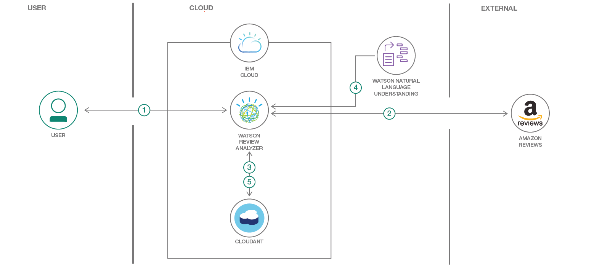

# 商品のレビューを分析してショッピング・ガイドを生成する

### 商品のレビューを Watson Natural Language Understanding によって評価し、その結果に基づいてコグニティブによる決定を下す Node.js アプリを作成する

English version: https://developer.ibm.com/patterns/analyze-product-reviews-and-generate-a-shopping-guide
  
ソースコード: https://github.com/IBM/watson-second-opinion

###### 最新の英語版コンテンツは上記URLを参照してください。
last_updated: 2018-06-16

 
## 概要

商品を購入する際に無数のレビューを調べたことがあれば、それにかなりの時間がかかることは経験済みでしょう。結局のところ知りたいのは、商品の選択肢のうち、高く評価している人の数が最も多い商品はどれかということです。買い物カゴの内容を最終的に決定するには、IBM Watson&trade; を利用できます。このパターンで作成する Watson Second Opinion というアプリは、候補となっている商品へのリンクを入力するようにユーザーに求め、それらの商品のレビューを検出してデータベース内に保管します。保管したレビューを Watson Natural Language Understanding を使用して分析し、レビューから引き出した洞察をユーザーに知らせます。

## 説明

商品のレビューを調べる目的は、購入を考えている候補のうち、高く評価している人の数が最も多い商品を知ることに尽きます。このパターンでは、購入する商品を決定するのに役立つアプリの作成に取り組みます。ここで作成するアプリは、Amazon でのレビューを取り、それらのレビューを Watson Natural Language Understanding サービスに取り込みます。取り込まれたレビューは Coudant&reg; データベース内に保管されます。Watson NLU ではレビューのセンチメントを推測して要約します。このサンプル・アプリケーションが、ユーザーに代わってレビューを読み、全体的なレビューの洞察を提供します。このパターンは、複数のドキュメントを Watson NLU を使用して処理する方法を調べている開発者に役立つはずです。

このコード・パターンを完了すると、以下の方法がわかるようになります。

* Watson の Node SDK を使用して Watson NLU とやり取りする
* Watson NLU の結果を中心としたユーザー・インターフェースを作成する
* アプリを IBM Cloud 内にデプロイする
* Cloudant をデプロイして IBM Cloud アプリケーションに接続する

## フロー

1. ユーザーがアプリを IBM Cloud 内にデプロイします。ユーザーがアプリの UI を操作します。
1. ユーザーが商品の URL を入力します。これにより、アプリが商品レビューの取得を開始します。
1. 取得したレビューを後で使用できるよう、アプリが Cloudant 内にレビューを保管します。
1. アプリがWatson NLU にレビューをアップロードします。
1. Watson NLU がレビューの処理を完了すると、アプリがその結果 (一般的なセンチメントと上位エンティティー) を Cloudant 内に保管します。ユーザーが UI 内で結果を確認します。
