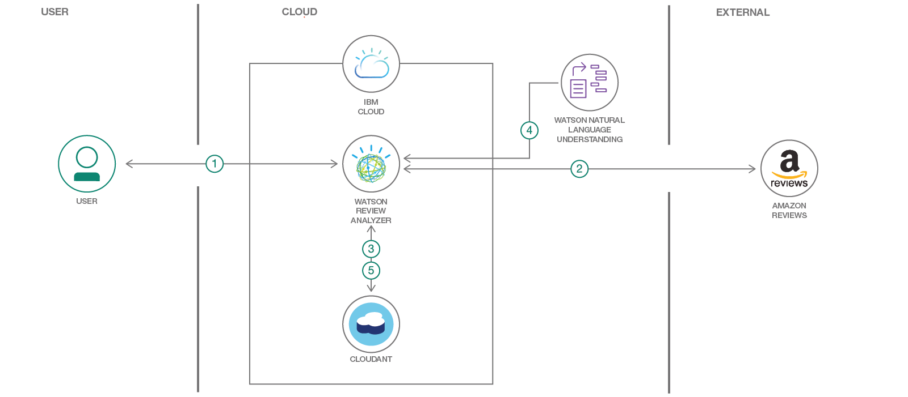

# 商品のレビューを分析してショッピング・ガイドを生成する
### 商品のレビューを Watson Natural Language Understanding によって評価し、その結果に基づいてコグニティブによる決定を下す Node.js アプリを作成する

Engish version: https://developer.ibm.com/patterns/analyze-product-reviews-and-generate-a-shopping-guide/

ソースコード: https://github.com/IBM/watson-second-opinion
###### 最新の英語版コンテンツは上記URLを参照してください。

authors: Horea Porutiu, Anthony Amanse

last_updated: 2018-06-16

[YouTube動画](https://www.youtube.com/watch?v=Z59k97oVg6U) 

## 概要

商品を購入する際に無数のレビューを調べたことがあれば、それにかなりの時間がかかることは経験済みでしょう。結局のところ知りたいのは、商品の選択肢のうち、高く評価している人の数が最も多い商品はどれかということです。買い物カゴの内容を最終的に決定するには、IBM Watson&trade; を利用できます。このパターンで作成する Watson Second Opinion というアプリは、候補となっている商品へのリンクを入力するようにユーザーに求め、それらの商品のレビューを検出してデータベース内に保管します。保管したレビューを Watson Natural Language Understanding を使用して分析し、レビューから引き出した洞察をユーザーに知らせます。

## 説明

商品のレビューを調べる目的は、購入を考えている候補のうち、高く評価している人の数が最も多い商品を知ることに尽きます。このパターンでは、購入する商品を決定するのに役立つアプリの作成に取り組みます。ここで作成するアプリは、Amazon でのレビューを取り、それらのレビューを Watson Natural Language Understanding サービスに取り込みます。取り込まれたレビューは Coudant&reg; データベース内に保管されます。Watson NLU ではレビューのセンチメントを推測して要約します。このサンプル・アプリケーションが、ユーザーに代わってレビューを読み、全体的なレビューの洞察を提供します。このパターンは、複数のドキュメントを Watson NLU を使用して処理する方法を調べている開発者に役立つはずです。

このコード・パターンを完了すると、以下の方法がわかるようになります。

* Watson の Node SDK を使用して Watson NLU とやり取りする
* Watson NLU の結果を中心としたユーザー・インターフェースを作成する
* アプリを IBM Cloud 内にデプロイする
* Cloudant をデプロイして IBM Cloud アプリケーションに接続する

## フロー

1. ユーザーがアプリを IBM Cloud 内にデプロイします。ユーザーがアプリの UI を操作します。
1. ユーザーが商品の URL を入力します。これにより、アプリが商品レビューの取得を開始します。
1. 取得したレビューを後で使用できるよう、アプリが Cloudant 内にレビューを保管します。
1. アプリがWatson NLU にレビューをアップロードします。
1. Watson NLU がレビューの処理を完了すると、アプリがその結果 (一般的なセンチメントと上位エンティティー) を Cloudant 内に保管します。ユーザーが UI 内で結果を確認します。

###### References
related_links: 
  - [Watson Node SDK](https://github.com/watson-developer-cloud/node-sdk)
    Check out GitHub for the Node.js library to access IBM Watson services.
  - [Watson Natural Language Understanding Demo](https://natural-language-understanding-demo.mybluemix.net/)
    This set of APIs can analyze text to help you understand its concepts, entities, keywords, sentiment, and more.
  - [404 Tech Support article](https://www.404techsupport.com/2017/05/10/analyze-amazon-reviews/)
    Analyze the trustworthiness of Amazon reviews.
  - [AI-powered solution leverages IBM Watson technology](https://www.cmo.com.au/article/630032/using-ai-enable-more-human-understanding-voice-customer-data/)
    By scanning feedback in real-time, organisations get in-depth insight as it organizes and analyzes the conversations in terms of themes, allowing analysis in size, tone and sentiment of real conversations.
  - [Watson Natural Language Understanding"](https://www.ibm.com/watson/services/natural-language-understanding/)
    Learn more about uncovering insights from structured and unstructured data.
# related_content: 
# social-media-meta:
primary_tag: "artificial-intelligence"
tags:
  - "node-js"
  - "retail"
  - "cloud"
  - "databases"
services:
  - "cloudant"
  - "natural-language-understanding"

