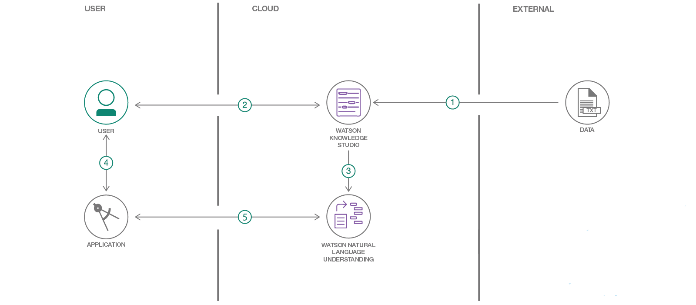

# Watson Knowledge Studio を使用して SMS メッセージを分析する
### Watson Knowledge Studio と Watson Natural Language Understanding を利用して、SMS メッセージの内容を効果的に分類するカスタム・モデルを作成する

Engish version: https://developer.ibm.com/patterns/analyze-sms-messages-with-watson-knowledge-studio/

ソースコード: https://github.com/IBM/sms-analysis-with-wks
###### 最新の英語版コンテンツは上記URLを参照してください。

authors: Rajesh Gudikoti, Ramesh Poomalai, Rich Hagarty

last_updated: 2018-08-06
[YouTube動画](https://www.youtube.com/watch?v=lwW97UQj0RM) 

## 概要

データ (エンティティー) が表す意味は、ドメインによってそれぞれ異なってきます。そのため、現在の自然言語処理の手法では、ドメインや業界の必要に応じてデータを抽出したり解釈したりすることができません。このコード・パターンで、Watson Knowledge Studio (WKS) と Watson Natural Language Understanding (NLU) を利用して、自然言語処理に役立つソリューションを開発する方法を学んでください。

## 説明

このコード・パターンでは、Watson Knowledge Studio と Watson Natural Language Understanding を利用して SMS メッセージを分析し、そのデータからエンティティーを抽出する方法を説明します。具体的には、Watson Knowledge Studio を使用して作成した機械学習モデルを、人間がアノテーションを付けたドキュメントを使ってトレーニングし、トレーニング済みの機械学習モデルを Natural Language Understanding サービスに統合して、ドメイン固有のエンティティーを抽出する方法を説明します。

このコード・パターンで扱う SMS メッセージは、業者が顧客に提供する特価販売に関連するものです。Natural Language Understanding を使用すると、各テキストから一般的な情報を抽出できますが、さらに具体的なデータ、つまり特別価格で提供される商品、提供元の業者、特価提供の有効期間、業者の電話番号と Web サイトなどといった情報を抽出できるようにしなければならない場合もあります。この目的を達成するための方法は、Watson Knowledge Studio にサンプル・メッセージをロードして、各テキストに含まれるエンティティーを認識するようにモデルをトレーニングすることです。こうしてトレーニングされたモデルを使用して、他のメッセージを処理することができます。

このコード・パターンをひと通り完了すると、以下の方法がわかるようになります。

* WKS を使用してコーパスをアップロードする
* WKS にさまざまな型をインポートする
* WKS を使用してモデルを作成する
* WKS モデルを NLU にデプロイする
* WKS モデルを指定して NLU API を呼び出す

## フロー

1. 型システムとコーパス・ファイルを Watson Knowledge Studio にロードします。.
1. トレーニング用データと評価用データによってモデルを生成します。
1. WKS モデルを Watson NLU にデプロイします。
1. 分析する SMS メッセージをアプリに入力します。
1. Watson NLU が SMS メッセージを分析して処理し、WKS モデルに基づいて抽出したドメイン固有のエンティティーを返します。

## Instructions

このパターンの詳細な手順については、[README](https://github.com/IBM/sms-analysis-with-wks/blob/master/README.md) を参照してください。手順の概要は以下のとおりです。

1. sms-analysis-with-wks リポジトリーを複製します。
1. IBM Cloud サービスを作成します。
1. Watson Knowledge Studio ワークスペースを作成します。
1. 型システムをアップロードします。
1. コーパス・ドキュメントをインポートします。
1. アノテーション・セットを作成します。
1. 人間によるアノテーション・タスクを作成します。
1. モデルを作成します。
1. 機械学習モデルを Natural Language Understanding にデプロイします。
1. cURL を使用してモデルをテストします。
1. アプリケーションを実行します。

###### References

related_links:           
  - [Watson Knowledge Studio](https://www.ibm.com/watson/services/knowledge-studio/)
    Teach Watson the language of your domain.

  - [Watson Natural Language Understanding](https://www.ibm.com/watson/services/natural-language-understanding/)
    Learn about natural language processing for advanced text analysis.

  - [Teaching Watson to think like a subject matter expert](https://developer.ibm.com/dwblog/2018/watson-knowledge-studio-nlp-supervised-machine-learning/)
    Does IBM simply flip a switch, feed some research articles into the system, and voila, Watson understands a new industry? It's not that simple.

  - [Teach Watson to understand your data: A technical introduction to Watson Knowledge Studio](https://youtu.be/WwjCzE7xNu8)
    description: "Learn about Watson Knowledge Studio and how you can build and refine a machine learning annotator to a specific domain without writing a single line of code."

  - [Cognitive for intelligence and insights from data](https://www.ibm.com/cloud/garage/architectures/cognitiveArchitecture)
    Unlock new intelligence from vast quantities of structured and unstructured data and  develop deep, predictive insights.

primary_tag: "artificial-intelligence"

tags:
  - "analytics"
  - "artificial-intelligence"
  - "natural-language-processing"
  - "knowledge-discovery"

services:
  - "knowledge-studio"
  - "natural-language-understanding"

