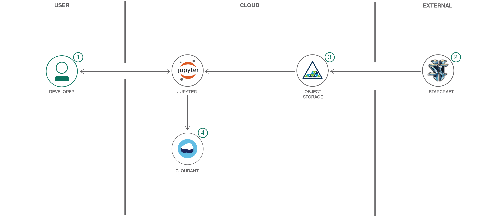

# Jupyter Notebook を使用して Starcraft II リプレイを分析する
### Data Science Experience を利用して Starcraft II リプレイのデータ視覚化を作成する

Engish version: https://developer.ibm.com/patterns/analyze-starcraft-ii-replays-with-jupyter-notebooks/

ソースコード: https://github.com/IBM/starcraft2-replay-analysis/
###### 最新の英語版コンテンツは上記URLを参照してください。

authors: 

last_updated: 2017-05-19

[YouTube動画 - Demo](https://www.youtube.com/watch?v=iKToQpJZIL0) 
[YouTube動画 - Tech Talk](https://www.youtube.com/watch?v=mWtNgd3Lt0I) 

## 概要

私たちが Starcraft II ファンのために作成したこのコードでは、実際にゲームに改善を加えることができます。このコード・パターンは、リプレイ分析によって興味深い洞察を見つけたいと思っている開発者にとっても、ゲームのスキル向上を目指すプロのプレイヤーにとっても、目標達成に役立つはずです。IBM Watson Studio の機能を利用し、Jupyter Notebook を使用してデータ視覚化を作成する方法を学び、Starcraft II のデータを分析できるようになってください。

## 説明

Starcraft II は、世界中で 240,000 人の熱烈なファンがプレイしているリアルタイム・ストラテジー・ビデオ・ゲームです。ゲーマーのストラテジーを競い合う数々のコンテストも開催されています。この開発者コード・パターンでは、Jupyter Notebook を使って StarCraft II のリプレイを分析し、プレイヤーのアクティビティーに基づくデータ視覚化を作成して、勝者と敗者に関する興味深い洞察を引き出します。

このコード・パターンをひと通り完了すると、以下の方法がわかるようになります。

* IBM Watson&trade; Studio 内で Jupyter Notebook を作成して実行する
* Watson Studio Object Storage を利用してリプレイ・データにアクセスする
* sc2reader を使用してリプレイを Python オブジェクトにロードする
* 結果に含まれている基本的なリプレイ情報を調査する
* 対戦の詳細を有用なオブジェクトに解析する
* Bokeh グラフを使用して対戦内容を視覚化する
* 処理したリプレイを Cloudant&reg; 内に保管する

## フロー

1. 用意されているノートブックを IBM Watson Studio プラットフォームにロードします。
2. Starcraft II のリプレイが IBM Cloud Object Storage にロードされます。
3. ノートブックが IBM Cloud Object Storage からリプレイをプルして分析します。
4. ノートブックが Cloudant NoSQL データベースを使用して結果と分析を保管します。

## 手順

このコード・パターンに取り組む準備はできましたか？アプリケーションを起動して使用する方法について詳しくは [README](https://github.com/IBM/starcraft2-replay-analysis/blob/master/README.md) を参照してください。

###### References
related_links:
  - [Data and analytics architecture](https://www.ibm.com/cloud/garage/architectures/dataAnalyticsArchitecture)
    Learn how this Journey fits into the Data and Analytics Reference Architecture.
  - [StarCraft II user manual](https://sc2reader.readthedocs.io/en/latest/)
    See a python library that extracts data from various Starcraft 2 resources to power tools and services for    the SC2 community.
  - [Welcome to Bokeh](http://bokeh.pydata.org/en/latest/)
    Bokeh, a Python interactive visualization library, provides novel graphics with high-performance interactivity over very large or streaming datasets.
  - [StarCraft II Official Game Site](http://us.battle.net/sc2/en/)
    StarCraft II is a military science fiction real-time strategy video game developed and published by Blizzard Entertainment.
  - [StarCraft 2, ShoWTimE vs. Neeb (PvP), IEM Shanghai, Semifinal](https://www.youtube.com/watch?v=yyeDK65Lt1A&feature=youtu.be&t=392)
    Watch a broadcast of the game that was used in the example from this code pattern.
  - [Cognitive for intelligence and insights from data](https://www.ibm.com/cloud/garage/architectures/cognitiveArchitecture)
    Unlock new intelligence from vast quantities of structured and unstructured data and develop deep, predictive insights with this cognitive architecture. 

primary_tag: "analytics"

tags:
  - "data-science"
  - "gaming"
  - "object-storage"

services:
  - "cloud-object-storage"
  - "apache-spark"
  - "cloudant"

components:
  - "no-sql"
  - "watson-studio"

runtimes:
  - "community-buildpacks"
