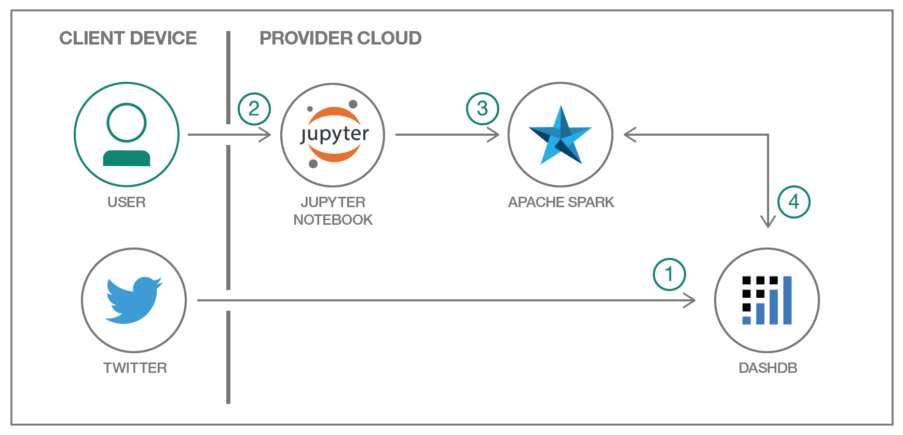

# Jupyter Notebook でツイートを分析する
### Jupyter Notebook でデータを分析して視覚化する

過去の技術のアーカイブとして掲載しています。IBM Developer英語版では掲載を取り下げています。

ソースコード: https://github.com/IBM/dsx-twitter-auto-analysis/ ※ 
###### アーカイブとしてReadonly状態のため、公開されているソースコードに対して、将来のメンテナンスはありません

authors: Mark Sturdevant, Rich Hagarty, David Taieb

last_updated: 2017-04-13

## 概要

データ・サイエンスの経験がない、あるいはデータ・サイエンスを専門とするチームの後ろ盾がない開発者を対象に作成されたこのコード・パターンは、IBM Cloud で、事前にエンリッチされたツイッターの洞察データを Jupyter Notebook 内で活用する方法を習得する早道となります。

## 説明

データ・サイエンスを民主化する継続的な取り組みの一環として、このコード・パターンはデータ・サイエンス・アプリケーションに興味を持つ (ただし、必ずしも専門としているわけではない) アプリケーション開発者のための教材となるよう意図されています。データ・サイエンス・チームの人員を増やしたり、データ・サイエンスの研修に時間を費やしたりする必要がなくなるように、このコード・パターンでは IBM のテクノロジーとオープンソース・テクノロジーを使用して強力なデータ視覚化を迅速に作成する方法を説明します。通常、知識を築き上げるには長い時間がかかるものですが、データから引き出した洞察に基づいて、製品化までの時間を短縮してください。

このコード・パターンで取り上げるシナリオでは、ツイッター・データを保管して、そのデータに感情、性別、場所などの先進的なエンリッチメントを適用する dashDB&reg; ウェアハウスを作成する方法を学びます。IBM Cloud を通じて Insights for Twitter サービスを作成した後、ツイートを dashDB にロードし、dashDB 内に格納されたツイートを、SparkContext と pandas (Python データ分析ライブラリー) を使用して Jupyter Notebook 内で分析します。Jupyter を使用すれば、分析結果を他のユーザーと簡単に共有できます。このコード・パターンでは、Matplotlib と Google GeoChart を使用して分析後のデータを視覚化する方法も説明します。

## フロー

1. 開発者がこのアプリケーションに必要な IBM Cloud サービスとして、dashDB for Analytics と Insights for Twitter を追加します。
1. 開発者が IBM Cloud 内で、Watson™ Studio Spark Service を使用してノートブックを作成します。
1. SparkContext により、開発者は Spark クラスター上でタスクを実行することができます。
1. dashDB では、Twitter からロードされた、指定のツイートを分析します。

## 手順

このコード・パターンに取り組む準備はできましたか？アプリケーションを起動して使用する方法について詳しくは、[README](https://github.com/IBM/dsx-twitter-auto-analysis/blob/master/README.md) を参照してください。

###### References
related_links:
  - [Data and analytics architecture](https://www.ibm.com/cloud/garage/architectures/dataAnalyticsArchitecture)
    Learn how this code pattern fits into the Data and Analytics Reference Architecture
    
  - [Accelerating data science with Jupyter Notebooks and Apache Spark](https://www.ibm.com/blogs/bluemix/2016/03/accelerating-data-science-with-jupyter-notebooks-and-spark/)
    The newly integrated notebooks within the IBM Analytics for Apache Spark service aim to provide analysts and data scientists with an iterative, flexible environment that supports end-to-end analysis."
    
  - [Open data science innovation in the cloud](https://www.ibm.com/blogs/bluemix/2016/06/open-data-science-innovation-in-the-cloud/)
    Read how open data science is proving to be a seedbed for innovation in the cloud-centric world economy.

  - [Overview of the IBM Watson Discovery service](https://www.ibm.com/watson/services/discovery/)
    Extract value from unstructured data by converting, normalizing, enriching it."
    
  - [Cloudant NoSQL Database](https://cloud.ibm.com/catalog/services/cloudant)
    A fully managed data layer designed for modern web and mobile applications that leverages a flexible JSON schema.
    
  - [Slack Python Client](https://pypi.org/project/slackclient/)
    A basic client for Slack.com, which can optionally connect to the Slack Real Time Messaging (RTM) API.
    
  - [Cloudant Python Client](https://pypi.org/project/cloudant/)
    Access the full Cloudant / CouchDB Client Library.
      
tags:
  - "databases"

services:
  - "insights-for-twitter"
  - "apache-spark"
  - "dashdb"
runtimes:
  - "community-buildpacks"
