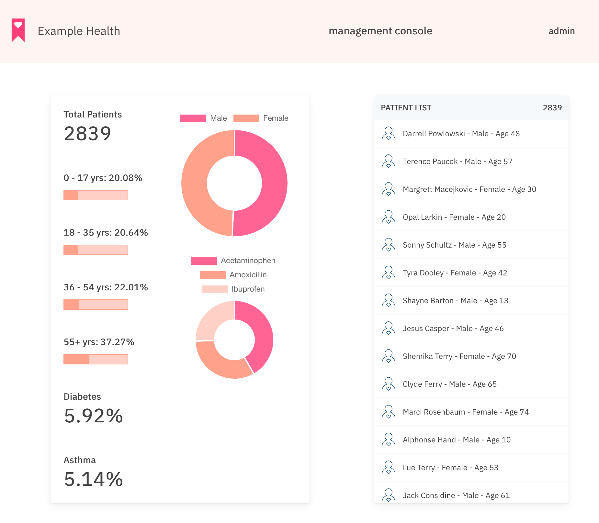
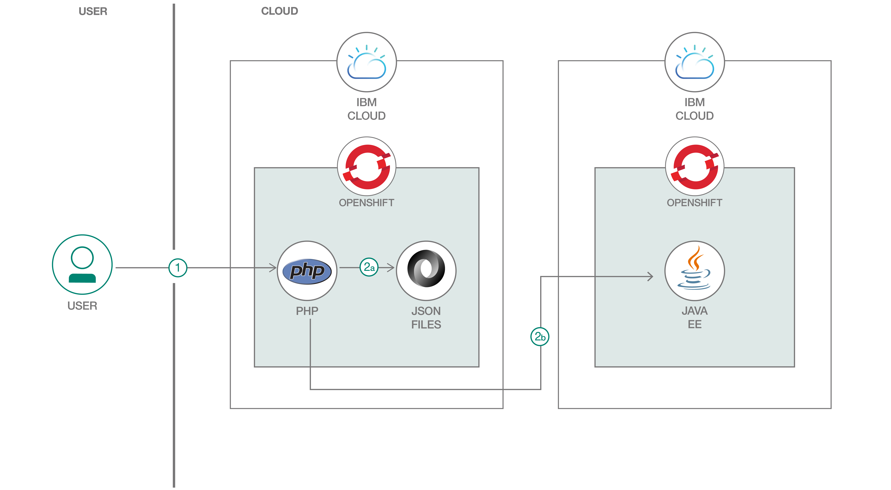

# PHP、Source-to-Image ツールキット、OpenShift によるアプリケーションのモダナイズ
### Kubernetes ベースのマイクロサービスで健康記録管理者用アプリを変換する

Engish version: https://developer.ibm.com/patterns/app-modernization-php-s2i-openshift/

ソースコード: https://github.com/IBM/php-s2i-openshift
###### 最新の英語版コンテンツは上記URLを参照してください。

authors: 

last_updated: 2019-08-21

## 概要

このコード・パターンは、概念上の健康記録システムに使用する PHP Web アプリケーションです。Kubernetes ベースのマイクロサービスで OpenShift の Source-to-Image (S2I) ツールキットを使って従来型のアプリケーションをモダナイズする方法を説明することを目的に設計されています。

このサンプル・コードは、架空の医療会社を例に IBM Cloud&trade; 上で Red Hat OpenShift のエンタープライズ Kubernetes 環境を使用してアプリをモダナイズする方法を説明するコード・パターン・シリーズの一部となっています。このシリーズでは、REST API を使用して MySQL データベースに大量のデータを取り込み、Java EE アプリケーションからそのデータにアクセスする方法を学ぶことができます。さらに、OpenShift の Source-to-Image ツールキットも使用します。そのために、いずれも Java EE アプリケーションから API への RESTful な呼び出しによって MySQL データベース内のデータを表示する、Node.js と PHP の 2 つの Web アプリケーションをデプロイします。

## 説明

「Example Health」は概念上の医療/保険会社です。この会社は長年にわたって蓄積された何十万件もの患者記録を保有しています。これらの健康記録は、ほとんどの保険会社が保有している健康記録と非常によく似たものです。

当初、Example Health はモノリシックなアプリケーション構造で健康記録アプリケーションを作成しました。つまり、フルスタックの Java アプリケーションを WebSphere Application Server 上で実行し、System z 上の DB2 データベースに接続するという構造です。

最近になって、Example Health はこのモノリシックな健康記録アプリケーションをモダナイズして、マイクロサービスに分割することを決めました。これを受けて開発チームが決定したのは、SQL データベースに移行して、[Java EE アプリケーション](https://github.com/IBM/japan-technology/blob/main/Code-Patterns/jee-app-modernization-with-openshift/)と [Node.js アプリケーション](https://github.com/IBM/japan-technology/blob/main/Code-Patterns/app-modernization-s2i-openshift/)に接続することです。前者のアプリケーションは Open Liberty 上で稼働して、ビジネス・ロジックを実行します。後者は患者記録アプリケーションのユーザー・インターフェースとして使用します。さらに、Example Health はこの 2 つのアプリケーションを IBM Cloud 上の Red Hat OpenShift にデプロイすることにしました。

OpenShift に移行した後、Example Health はシステムを拡大して新しいマイクロサービスを追加しました。追加されたマイクロサービスには、健康記録管理者用の [PHP アプリケーション](https://github.com/IBM/php-s2i-openshift) (このコード・パターンで説明するアプリケーション)と [Node.js アナリティクス・アプリケーション](https://developer.ibm.com/patterns/creating-a-health-data-analytics-app-with-legacy-mainframe-code-and-cloud/)が含まれます。

健康記録管理者用アプリでは、Example Health の健康記録管理者がシステムに含まれるすべての患者のリストを表示して、以下の患者データの統計内訳を確認できます。

* 年齢
* 性別
* 最もよく施されている上位 3 つの投薬治療
* 糖尿病有病率
* ぜんそく有病率

管理者がログインすると以下のようなページが表示されます。

## フロー

1. ユーザー (健康記録管理者) が PHP アプリを開きます。
1. 次のいずれかの方法でデータが取り込まれます。

    * a. API URL が指定されていない場合、PHP アプリケーションは JSON ファイル内のローカル・データを取り込みます。
    * b. API URL が指定されている場合、PHP アプリケーションは [example-health-jee-openshift サンプル・アプリ](https://github.com/IBM/japan-technology/blob/main/Code-Patterns/jee-app-modernization-with-openshift/)の REST API 呼び出しによって取得したデータを取り込みます。

## 手順

このコード・パターンを試すには、GitHub リポジトリー内に保管されている [README.md](https://github.com/IBM/php-s2i-openshift/blob/master/README.md) ファイルで説明している詳細な手順を参照してください。

1. 前提条件となっている構成手順に従います。
1. リポジトリー内でフォークを作成します。
1. IBM Cloud 上の OpenShift にアプリケーションをデプロイします。
1. ゲートウェイのタイムアウト設定を更新します。

###### References
primary_tag: "containers"
tags:
- "java"
- "microservices"
- "php"

components:
- "redhat-openshift-ibm-cloud"
- "kubernetes"
- "cloud-ibm"

related_content:
- https://developer.ibm.com/patterns/app-modernization-s2i-openshift/
- https://developer.ibm.com/patterns/jee-app-modernization-with-openshift/
- https://developer.ibm.com/blogs/a-brief-history-of-red-hat-openshift/

related_links:
  - [Red Hat Openshift on IBM Cloud documentation](https://cloud.ibm.com/docs/openshift?topic=openshift-getting-started)
  - [Red Hat Openshift on IBM Cloud product page](http://www.ibm.com/cloud/openshift)

