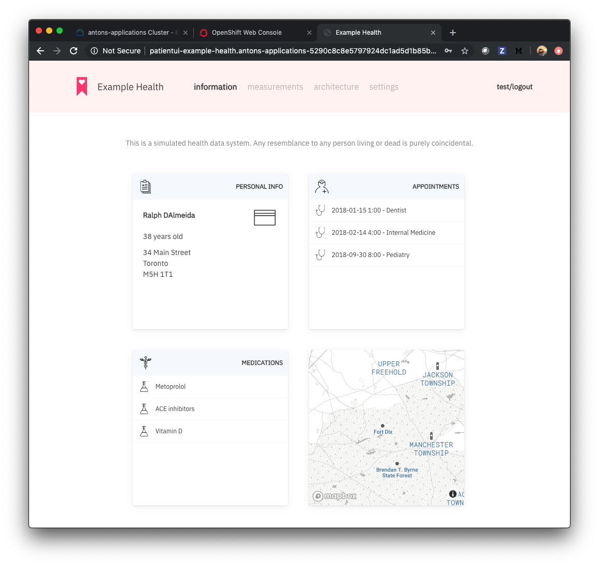
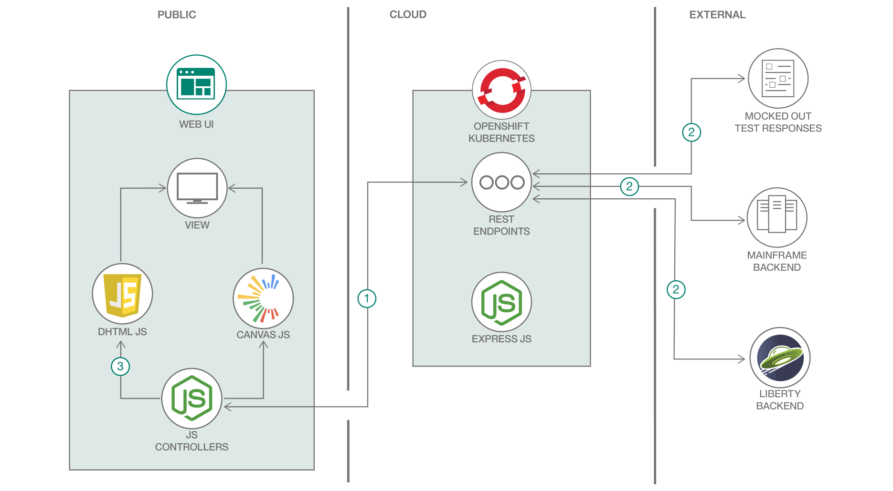

# Node.js、Source-to-Image ツールキット、OpenShift によるアプリケーションのモダナイズ
### Kubernetes ベースのマイクロサービスで従来型の患者記録アプリを変換する

Engish version: https://developer.ibm.com/patterns/app-modernization-s2i-openshift/

ソースコード: https://github.com/IBM/summit-health-patient-records/
###### 最新の英語版コンテンツは上記URLを参照してください。

authors: Anton McConville, Olaph Wagoner

last_updated: 2019-08-01

## 概要

このコード・パターンは、概念上の健康記録システムに使用する Node.js Web アプリケーションです。Kubernetes ベースのマイクロサービスで OpenShift の Source-to-Image (S2I) ツールキットを使って従来型のアプリケーションをモダナイズする方法を説明することを目的に設計されています。さらに、このコード・パターンではオープン・スタンダードの詳細を調べて、カスタム・チャートとレスポンシブ・デザインに対応するフロントエンドのテクノロジーの使用例を紹介します。

このサンプル・コードは、架空の医療会社を例に IBM Cloud&trade; 上で Red Hat OpenShift のエンタープライズ Kubernetes 環境を使用してアプリをモダナイズする方法を説明するコード・パターン・シリーズの一部となっています。このシリーズでは、REST API を使用して MySQL データベースに大量のデータを取り込み、Java EE アプリケーションからそのデータにアクセスする方法を学ぶことができます。さらに、OpenShift の Source-to-Image ツールキットも使用します。そのために、いずれも Java EE アプリケーションから API への RESTful な呼び出しによって MySQL データベース内のデータを表示する、Node.js と PHP の 2 つの Web アプリケーションをデプロイします。

## 説明

「Example Health」は概念上の医療/保険会社です。この会社は長年にわたって蓄積された何十万件もの患者記録を保有しています。これらの健康記録は、ほとんどの保険会社が保有している健康記録と非常によく似たものです。

当初、Example Health はモノリシックなアプリケーション構造で健康記録アプリケーションを作成しました。つまり、フルスタックの Java アプリケーションを WebSphere Application Server 上で実行し、System z 上の DB2 データベースに接続するという構造です。

最近になって、Example Health はこのモノリシックな健康記録アプリケーションをモダナイズして、マイクロサービスに分割することを決めました。これを受けて開発チームが決定したのは、SQL データベースに移行して、[Java EE アプリケーション](https://developer.ibm.com/patterns/jp/jee-app-modernization-with-openshift/)と [Node.js アプリケーション](https://github.com/IBM/summit-health-patient-records/)に接続することです。前者のアプリケーションは Open Liberty 上で稼働して、ビジネス・ロジックを実行します。後者 (このコード・パターンで説明するアプリケーション) は患者記録アプリケーションのユーザー・インターフェースとして使用します。さらに、Example Health はこの 2 つのアプリケーションを IBM Cloud 上の Red Hat OpenShift にデプロイすることにしました。

OpenShift に移行した後、Example Health はシステムを拡大して新しいマイクロサービスを追加しました。追加されたマイクロサービスには、健康記録管理者用の [PHP アプリケーション](https://github.com/IBM/japan-technology/blob/main/Code-Patterns/app-modernization-php-s2i-openshift/)と [Node.js アナリティクス・アプリケーション](https://developer.ibm.com/patterns/creating-a-health-data-analytics-app-with-legacy-mainframe-code-and-cloud/)が含まれます。

このサンプル・プロジェクトは、概念上の健康記録システムで使用する患者記録アプリケーションのユーザー・インターフェースです。このアプリケーションのプログラミングには、オープン・スタンダードの JavaScript と最新の Universal CSS を使用しています。レイアウトには HTML5 Canvas を使用し、単純な Node.js Express Server によってデータを提供します。システムのビジネス・ルールは COBOL または Java のいずれかで作成されています。システム内にコーディングされているビジネス・ルールには、資格付与ルール、処方ルール、補償範囲ルールが含まれます。

クライアントが患者記録アプリにログインすると以下のようなページが表示されます。

このコード・パターンでは、以下のスキルを学ぶことができます。

* アプリを OpenShift の [Source to Image (S2I)](https://github.com/openshift/source-to-image) にデプロイする手順
* 従来型のさまざまなアプリケーション (メインフレーム・ベースのアプリケーションや古典的な Java アプリのサーバー・アプリケーションなど) をモダナイズする、Kubernetes ベースのマイクロサービスの多様性
* カスタム・チャートをレンダリングする目的とレスポンシブ・デザインを適用する目的の両方に対応するオープン・スタンダードのフロントエンド・テクノロジーの詳細

このプロジェクトは、テスト・モードで単独で使用することも、関連するプロジェクトに統合して使用することもできます。

## フロー

1. JavaScript コントローラー (REST エンドポイント) 内で患者データの取得アクションが開始されます。
1. REST エンドポイントが 3 つのリソース (テスト・レスポンス、メインフレーム・バックエンド、Liberty バックエンド) のいずれかからデータを取得します。
1. アプリケーションに患者データが表示されます。

## 手順

このパターンに取り組む準備はできましたか？このコード・パターンの詳細な手順については、GitHub リポジトリー内に置かれている [README.md](https://github.com/IBM/summit-health-patient-records/blob/master/README.md) ファイルを参照してください。手順の概要は以下のとおりです。

1. IBM Cloud 上に Red Hat OpenShift クラスターを作成します。
1. リポジトリー内でフォークを作成します。
1. フォークしたリポジトリーをデプロイします。

###### References

primary_tag: "containers"
tags:
- "microservices"
- "node-js"

components:
- "redhat-openshift-ibm-cloud"
- "kubernetes"
- "cloud-ibm"

related_content:
- https://developer.ibm.com/patterns/app-modernization-php-s2i-openshift/
- https://developer.ibm.com/patterns/jee-app-modernization-with-openshift/
- https://developer.ibm.com/blogs/a-brief-history-of-red-hat-openshift/

related_links:
  - [Red Hat Openshift on IBM Cloud documentation](https://cloud.ibm.com/docs/openshift?topic=openshift-getting-started)
  - [Red Hat Openshift on IBM Cloud product page](http://www.ibm.com/cloud/openshift)