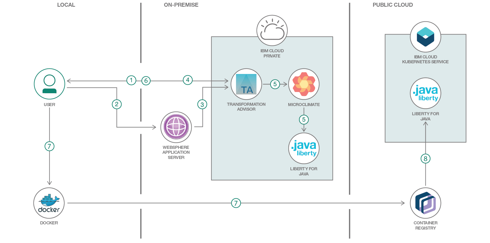

# 従来型のオンプレミス・アプリを変換し、コンテナー化されたアプリとしてパブリックまたはプライベート・クラウドにデプロイする
### Transformation Advisor ツールと Microclimate 開発環境を使用してアプリを現代化する

Engish version: https://developer.ibm.com/patterns/app-modernization-transformation-advisor-cloud-private/

ソースコード: https://github.com/IBM/appmod-resorts
###### 最新の英語版コンテンツは上記URLを参照してください。

authors: Dana Price, Dan Banta, Daniel Xu, Mark Sturdevant

last_updated: 2018-10-16

[YouTube動画](https://www.youtube.com/watch?v=lzFI4e3Ed68) 

## 概要

クラウドに移行すると利益のある既存のオンプレミス WebSphere&reg; Application Server アプリがあるとしたら、このコード・パターンはうってつけです。単純なデモ・アプリを使用して、カスタム・データ・コレクターを実行してアプリを分析し、アプリの変換プロジェクトに役立つ推奨案、見積もりコスト、詳細なレポートを表示する方法を説明します。必要な成果物を生成し、アプリをクラウド上の Liberty コンテナー内にデプロイして実行する方法を理解できるはずです。

## 説明

このコード・パターンでは Transformation Advisor アプリを使用して、従来型のオンプレミス WebSphere Application Server アプリケーションを、パブリック・クラウドまたはプライベート・クラウド環境にデプロイする対象として評価します。Microclimate 開発環境で Transformation Advisor 統合を使用して、IBM Cloud Private 上で稼働する Liberty コンテナー内にアプリをデプロイする方法を学んでください。このパターンではまた、生成された移行用バンドルをダウンロードし、バンドルされた Helm チャートを使用して、コンテナー化されたアプリをパブリック・クラウド、具体的には IBM Cloud 上の Kubernetes Service にデプロイする方法も説明します。

サンプル Web アプリを使用して、オンプレミスからクラウドへのアプリケーションの移行をデモンストレーションします。

このコード・パターンを完了すると、以下の方法がわかるようになります。

* Transformation Advisor を使用してカスタム・データ・コレクターを作成する
* カスタム・データ・コレクターを実行して、従来型の WebSphere Application Server アプリケーションを分析する
* Transformation Advisor によるレポートをレビューし、移行の複雑さ、コスト、推奨案を確認する
* アプリをコンテナー化するための成果物を生成する
* Microclimate を使用して、現代化するアプリを IBM Cloud Private に移行する
* 生成した移行用バンドルを使用して、現代化するアプリを IBM Cloud 上の Kubernetes Service に移行する

## フロー

1. 開発者が Transformation Advisor からカスタム・データ・コレクターをダウンロードします。
2. 開発者が従来型の WebSphere Application Server ホスト上でデータ・コレクターを実行します。
3. データ・コレクターによる分析結果が (自動的に、または手作業で) アップロードされます。
4. 開発者が Transformation Advisor 内で推奨案をレビューし、移行用バンドルを作成します。
5. Transformation Advisor が Microclimate を介し、現代化するアプリをコンテナー化した Liberty アプリとして IBM Private Cloud 上にデプロイします。
6. 開発者が移行用バンドルをダウンロードします。
7. 開発者が Docker を使用してイメージをビルドし、そのイメージを IBM Cloud コンテナー・レジストリーにアップロードします。
8. 開発者が、生成された Helm チャートを使用して、現代化するアプリをコンテナー化された Liberty アプリとして IBM Cloud 上の Kubernetes Service にデプロイします。

## 手順

このコード・パターンに関する詳細な手順は、GitHub リポジトリー内にある [README](https://github.com/IBM/appmod-resorts/blob/master/README.md) に記載されています。

1. Microclimate の前提条件を確認します。
2. Transformation Advisor の操作を開始します。
3. データ・コレクターをダウンロードして実行します。
4. 必要に応じて結果をアップロードします。
5. 推奨案と見積もりコストを確認します。
6. 移行用バンドルを作成します。
7. GitHub または GitLab リポジトリーを作成します。
8. アプリケーションをデプロイします。
9. IBM Cloud 上の Kubernetes Service にアプリケーションをデプロイします。

###### References
related_content:
- https://developer.ibm.com/tutorials/autoscale-application-on-kubernetes-cluster/
- https://developer.ibm.com/tutorials/cassandra-cluster-on-icp/

related_links:
- [Transformation Advisor introductory video](https://www.youtube.com/watch?v=yBZVb0KfPlc)
- [IBM Microclimate demo video](https://microclimate-dev2ops.github.io/videos/Microclimateoverview.mp4)
- [Microclimate learning resources and documentation](https://microclimate-dev2ops.github.io/)
- [Tutorial: Deploying apps into Kubernetes clusters](https://cloud.ibm.com/docs/containers/cs_tutorials_apps.html#cs_apps_tutorial)
- [IBM Cloud Kubernetes Service](https://www.ibm.com/cloud/container-service)

services:
- "liberty-for-java"
- "ibm-containers"
- "kubernetes-cluster"

sub[]"

tags:
- "cloud"
- "hybrid"
- "containers"
- "java"
