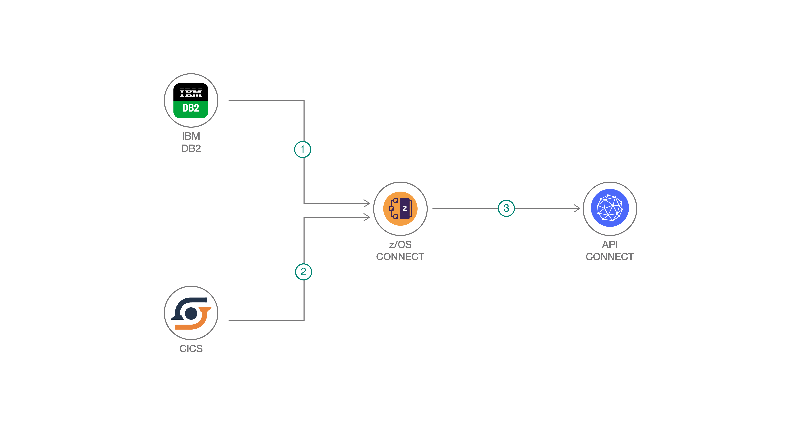

# 大量のデータにアクセスできるポータルを作成する
### データベースとアプリのデータを公開し、そのデータにアクセスするための API を作成する

Engish version: https://developer.ibm.com/patterns/app-modernization-with-zos-connect/

ソースコード: https://github.com/IBM/example-health-apis
###### 最新の英語版コンテンツは上記URLを参照してください。

authors: Ronald Geraghty, Kenishia Callaway

last_updated: 2019-07-29

## 概要

z/OS&reg; Connect を利用して Db2&reg; データベースと CICS&reg; アプリケーションのデータを公開し、IBM API Connect&reg; を利用してそのデータにアクセスするための API を作成する方法を学んでください。

 ## 説明

このコード・パターンは、クラウド・テクノロジーによって z/OS システム上に保管されたデータにアクセスする方法を説明する [Example Health コード・パターン・シリーズ](https://developer.ibm.com/series/systems-example-health-series/)の一環として作成されたものです。Db2 データベースと CICS アプリケーション上に保管された大量のデータにアクセスする手段が必要だったため、z/OS Connect と API Connect を利用して REST API を介してデータを公開することにしました。z/OS Connect を使用すると、他社製品との差別化を図る既存の IBM アセットの力を、RESTful API によって解き放つことができます。また、API Connect を利用すると、API 作成を自動化し、アセット・ディスカバリーを単純化し、開発者のセルフサービス・アクセスを可能にできるとともに、組み込みのセキュリティーとガバナンスを利用できます。このコード・パターンでは、z/OS Connect を利用して Db2 と CICS のデータを REST API として公開した上で、API Connect を利用して、これらの API に簡単にアクセスできる直観的なポータルを作成します。

このコード・パターンの対象読者は、IBM Z&reg;、z/OS、Eclipse ツール (IBM Explorer for z/OS など) に関する中級レベルの知識と経験を持つ開発者です。

このコード・パターンをひと通り完了すると、以下の方法がわかるようになります。

* z/OS Connect を利用して、CICS アプリケーションと Db2 のデータを REST API で公開する
* API Connect を利用して API を管理し、API にアクセスするための開発者向けポータルを作成する

## フロー

1. z/OS Connect が REST API を介して Db2 のデータを公開します。
1. z/OS Connect が REST API を介して CICS プログラム/データを公開します。
1. API Connect が z/OS Connect へのゲートウェイとして、z/OS Connect API を管理し、API へのアクセスを可能にするポータルを確立します。

## 手順

以下の方法について詳しくは、[README](https://github.com/IBM/example-health-apis/blob/master/README.md) を参照してください。

* CICS アプリケーションを作成する
* Db2 データベースとテーブルを作成する
* Db2 データベースに Synthea データを取り込む
* z/OS Connect をインストールする
* z/OS Connect を利用して Db2 データを公開する
* z/OS Connect を利用して CICS アプリケーションを公開する
* API Connect インスタンスを作成する
* z/OS Connect API を API Connect にインポートして管理する

###### References
primary_tag: "systems"

related_content:
  - https://developer.ibm.com/series/systems-example-health-series/
  - https://developer.ibm.com/patterns/transform-load-big-data-csv-files-db2-zos-database/
  - https://developer.ibm.com/patterns/machine-learning-using-synthesized-patient-health-records/

related_links:
  - [More patterns in this Example Health series](https://developer.ibm.com/series/systems-example-health-series/)

services:
  - "api-connect"
  - "db2"

tags:
  - "api"
